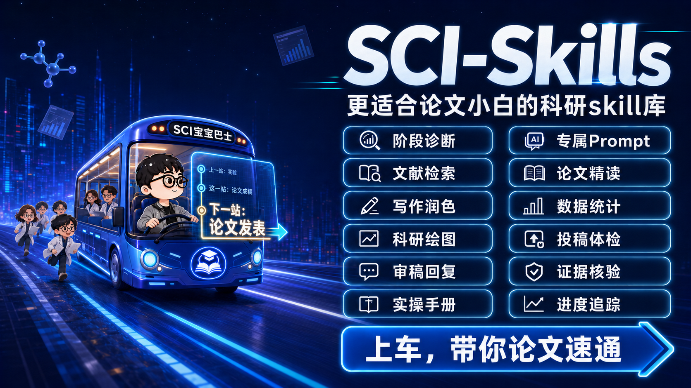

# SCI-Skills



> **更适合论文小白的科研 Skill 库。上车，带你论文速通。**

SCI-Skills 是晚风老师打造的阶段式论文协作助手。你可以叫它 **“宝宝巴士”**，也可以用 **“山海”** 唤醒它。

它不是一次性替你生成一篇看似完整的论文，而是先判断你真正处于科研流程的哪一站，再根据你已有的题目、文献、数据、代码、实验或论文草稿，带你逐步完成任务、检查质量，并进入下一阶段。

你不需要先学会复杂的科研术语，也不需要知道自己该走哪条论文路线。只要如实告诉它：**你现在有什么、想做到什么、卡在哪里**。

## 为什么是 SCI-Skills？

普通论文助手往往直接开始写，SCI-Skills 会先回答三个更重要的问题：

1. **你现在真正处于哪个阶段？** 不是看你手里有没有初稿，而是检查前面的关键任务是否已经完成。
2. **这一阶段是否达到进入下一站的标准？** 每个阶段都有明确产出物、证据要求和验收条件。
3. **下一步应该让 AI 做，还是需要你完成真实操作？** 能由 AI 推进的任务会生成专属 Prompt；需要检索、下载、实验、授权或投稿的任务，会拆成小白可执行的操作步骤。

## 最核心的亮点：每一站都有下一步

### 阶段通过：直接获得下一站 Prompt

当当前阶段通过验收时，SCI-Skills 会生成一段结合你真实项目的专属 Prompt。已知信息会自动填好，只有确实缺失的内容保留为 `【待填写】`。

你只需要：

1. 补充 `【】` 中的信息；
2. 复制完整 Prompt；
3. 直接发回给宝宝巴士；
4. 进入下一阶段。

### 阶段未通过：获得修复 Prompt

如果材料还不够、证据不足或阶段产出不合格，它不会假装你已经进入下一站，而是明确指出缺口，并生成当前阶段的修复 Prompt。

### 没有 Prompt：手把手完成真实操作

有些任务不能只靠一句 Prompt 完成，例如：

- 在数据库中检索并导出文献；
- 下载 CSV、RIS、BibTeX、临床数据或公开数据集；
- 运行真实实验、采集数据或保存代码结果；
- 登录投稿系统、填写作者信息或提交文件；
- 完成人工筛选、伦理判断、版权确认或最终学术决策。

遇到这些阶段，SCI-Skills 不会只说“请自行完成”，而会告诉你：去哪个平台、点哪里、输入什么、选择哪些参数、下载什么格式、文件怎么命名、什么算完成、失败了怎么处理，以及完成后要把哪些材料带回来。

## 核心能力

| 能力 | 能为你做什么 |
| --- | --- |
| 阶段诊断 | 根据现有材料判断真正进度，找到最早未完成的关键环节 |
| 专属 Prompt | 基于当前项目生成下一阶段或当前阶段修复 Prompt |
| 文献检索 | 拆解检索词、设计检索式、筛选文献并整理检索结果 |
| 论文精读 | 提炼研究问题、方法、实验、结论边界与可复用思路 |
| 写作润色 | 完成论文结构设计、段落写作、学术改写与中英文润色 |
| 数据统计 | 规划统计方法、检查报告规范、解释结果并提示误用风险 |
| 科研绘图 | 设计论文图表、梳理证据逻辑并检查图注与投稿规范 |
| 投稿体检 | 检查结构、语言、引用、图表、数据声明和投稿材料 |
| 审稿回复 | 拆解审稿意见，制定修改任务并起草逐点回复 |
| 证据核验 | 区分“已核实”“待核实”和“AI 推断”，避免编造数据与文献 |
| 实操手册 | 把平台检索、文件下载、实验执行和投稿操作拆成具体步骤 |
| 进度追踪 | 持续维护当前站、已完成、待补充、下一步和所需材料 |

此外，SCI-Skills 还支持论文汇报 PPT、Data Availability、投稿文件整理等常见科研任务。

## 它是怎样带你推进的？

SCI-Skills 内置 **35 个科研阶段**、**10 项论文能力模块**和 **5 套外部实操手册**，但这些复杂结构不会直接丢给小白用户。

每次推进只聚焦当前一站：

```text
了解现状 → 判断当前阶段 → 补齐关键信息 → 完成本阶段产出
        → 正式验收 → 生成下一步 Prompt 或实操指南
```

在重要节点，你会看到一张简洁的项目路线卡：

```text
当前站：
已经完成：
还需要：
下一步：
需要你提供：
```

## 快速开始

安装并启用 SCI-Skills 后，发送下面任意一个唤醒词即可：

```text
宝宝巴士
```

或：

```text
山海
```

你也可以不使用唤醒词，直接描述自己的情况，例如：

```text
我只有一个研究方向，还没有确定题目，请带我从选题开始。
```

```text
我已经有题目和一批文献，但不知道下一步应该做什么。
```

```text
我有数据、代码和部分实验结果，请判断我目前在哪个阶段，还缺什么。
```

```text
我已经写完论文初稿，请先做投稿前体检，不要直接帮我改写全文。
```

```text
我收到了审稿意见，请帮我拆解修改任务并起草逐点回复。
```

## 新手入口

如果你不知道该怎么描述，SCI-Skills 会让你直接回复数字：

```text
1. 只有一个方向，想找选题
2. 已有题目，但不知道怎么做
3. 已有文献、数据、代码或实验，想继续推进
4. 已有论文初稿，想修改或投稿
5. 已收到审稿意见，或者想做汇报 PPT
```

它每轮只询问最关键的少量信息，不会一上来丢给你一张复杂的大表。

## 三种任务模式

| 模式 | 适用情况 | 你会得到什么 |
| --- | --- | --- |
| Prompt | AI 能在获得必要信息后完成 | 可直接复制的项目专属 Prompt |
| Manual | 必须由用户完成真实外部操作 | 从准备到验收的逐步实操指南 |
| Hybrid | 用户先操作，AI 再继续处理 | 实操步骤、带回材料清单和回传 Prompt |

## 证据与学术诚信

SCI-Skills 不会把猜测包装成事实，也不会虚构：

- 文献、DOI、引文或页码；
- 数据集、样本量、实验结果或显著性；
- 伦理审批、代码输出或平台操作记录；
- 期刊要求、投稿状态或审稿结论。

当证据状态影响判断时，内容会被标记为：

- **已核实**：得到用户材料或可靠来源的直接支持；
- **待核实**：目前合理，但仍需检查原始材料、数据或规则；
- **AI 推断**：根据上下文推断，不作为已确认事实。

## 适合谁？

- 第一次独立写论文，不知道科研流程如何衔接；
- 有方向但不会把它变成可执行选题；
- 有数据或代码，却不知道实验是否足以支撑论文；
- 已经写了部分内容，但结构混乱、证据不足或进度停滞；
- 需要检索文献、分析数据、制作图表、投稿或回复审稿意见；
- 希望 AI 真正参与科研推进，而不是只生成一段看起来像论文的文字。

## 使用边界

SCI-Skills 是科研协作与流程指导工具，不能代替真实实验、数据采集、作者确认、伦理审批、版权许可、专家判断或正式投稿操作。所有研究结论和提交材料都应由作者最终核验并承担责任。

## 项目结构

```text
SCI-skill/
├── SKILL.md                 # 核心运行规则
├── manifest.yaml            # 阶段、能力与实操路线
├── workflows/               # 35 个阶段模块
├── references/
│   ├── capabilities/        # 10 项论文能力
│   ├── action-playbooks/    # 5 套外部实操手册
│   └── core/                # 新手引导与阶段控制规则
├── templates/               # Prompt、验收和实操卡模板
├── schemas/                 # 项目状态与阶段结构
└── scripts/                 # 路由、Prompt 与场景验证脚本
```

## 品牌与作者

**SCI-Skills** 由晚风老师打造。

你可以叫它 **“宝宝巴士”**，也可以叫它 **“山海”**。

> **上车，带你论文速通。**

