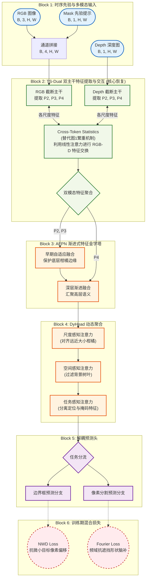

# TS-Dual 架构示意

下图为 TS-Dual 架构的模块化示意（Backbone + Neck + Head）：

```mermaid
graph TD
    %% ================= 样式定义 =================
    classDef input fill:#e3f2fd,stroke:#1565c0,stroke-width:2px;
    classDef backbone fill:#f1f8e9,stroke:#2e7d32,stroke-width:2px;
    classDef neck fill:#fff3e0,stroke:#e65100,stroke-width:2px;
    classDef head fill:#f3e5f5,stroke:#6a1b9a,stroke-width:2px;
    classDef loss fill:#ffebee,stroke:#c62828,stroke-width:2px,stroke-dasharray: 5 5;

    %% ================= Block 1: 多模态与时序输入 =================
    subgraph B1 ["Block 1: 时序先验与多模态输入"]
        I1(["RGB 图像<br/>B, 3, H, W"]):::input
        I2(["Mask 先验提示<br/>B, 1, H, W"]):::input
        I3(["Depth 深度图<br/>B, 1, H, W"]):::input

        Concat["通道拼接<br/>B, 4, H, W"]
        I1 --> Concat
        I2 --> Concat
    end

    %% ================= Block 2: 满血版双主干 (致敬图1) =================
    subgraph B2 ["Block 2: TS-Dual 双主干特征提取与交互 (核心恢复)"]
        RGB_Stem["RGB 截断主干<br/>提取 P2, P3, P4"]:::backbone
        Depth_Stem["Depth 截断主干<br/>提取 P2, P3, P4"]:::backbone

        Cross_TSSA["Cross-Token Statistics<br/>(替代图1繁重机制)<br/>利用线性注意力进行 RGB-D 特征交换"]:::backbone

        RGB_Stem <--> |"各尺度特征"| Cross_TSSA
        Depth_Stem <--> |"各尺度特征"| Cross_TSSA

        Fusion{"双模态特征聚合"}:::backbone
        Cross_TSSA --> Fusion
    end

    Concat --> RGB_Stem
    I3 --> Depth_Stem

    %% ================= Block 3: 完整 AFPN (致敬图2) =================
    subgraph B3 ["Block 3: AFPN 渐进式特征金字塔"]
        AFPN_L1["早期自适应融合<br/>保护底层柑橘边缘"]:::neck
        AFPN_L2["深层渐进融合<br/>汇聚高层语义"]:::neck
    end

    Fusion --> |"P2, P3"| AFPN_L1
    AFPN_L1 --> AFPN_L2
    Fusion --> |"P4"| AFPN_L2

    %% ================= Block 4: 动态颈部 (来自小目标前沿) =================
    subgraph B4 ["Block 4: DyHead 动态聚合"]
        ScaleAttn["尺度感知注意力<br/>(对齐远近大小柑橘)"]:::neck
        SpatialAttn["空间感知注意力<br/>(过滤背景树叶)"]:::neck
        TaskAttn["任务感知注意力<br/>(分离定位与掩码特征)"]:::neck
    end

    AFPN_L2 --> ScaleAttn
    ScaleAttn --> SpatialAttn
    SpatialAttn --> TaskAttn

    %% ================= Block 5: 解耦预测头 =================
    subgraph B5 ["Block 5: 解耦预测头"]
        Split{"任务分流"}:::head
        BboxBranch["边界框预测分支"]:::head
        MaskBranch["像素分割预测分支"]:::head
    end

    TaskAttn --> Split
    Split --> BboxBranch
    Split --> MaskBranch

    %% ================= Block 6: 极致混合损失 (致敬图3) =================
    subgraph B6 ["Block 6: 训练期混合损失"]
        NWD_Loss(("NWD Loss<br/>抗微小目标像素偏移")):::loss
        FFT_Loss(("Fourier Loss<br/>频域抗遮挡形状脑补")):::loss
    end

    BboxBranch -.-> NWD_Loss
    MaskBranch -.-> FFT_Loss
```
