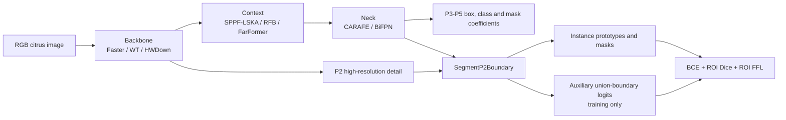

# 2026-08-20 GPT citrus screening models

This folder contains exactly ten new YOLO11n-seg candidates. Every candidate changes the backbone, the neck, and the
mask head. They all use the same optimizer, assignment, box/mask losses, augmentation, image size, and seed from
`2026_8_20_gpt_test.py`, so the ten runs remain directly comparable with one another.

## Shared method



The P2 feature is not added as a detection level. It refines only the mask prototypes and supplies boundary
supervision, which limits memory growth. The new prototype residual starts from zero, so pretrained P3 prototypes are
unchanged at initialization.

## Model-to-result mapping

| ID | YAML | Backbone/context | Neck | Result folder |
|---:|---|---|---|---|
| 01 | `01_yolo11n-seg-lska-carafe-p2b.yaml` | C3k2 + SPPF-LSKA | CARAFE | `01_yolo11n-seg-lska-carafe-p2b` |
| 02 | `02_yolo11n-seg-faster-lska-carafe-p2b.yaml` | Faster + SPPF-LSKA | CARAFE | `02_yolo11n-seg-faster-lska-carafe-p2b` |
| 03 | `03_yolo11n-seg-wt-lska-carafe-p2b.yaml` | WT + SPPF-LSKA | CARAFE | `03_yolo11n-seg-wt-lska-carafe-p2b` |
| 04 | `04_yolo11n-seg-faster-rfb-carafe-p2b.yaml` | Faster + RFB | CARAFE | `04_yolo11n-seg-faster-rfb-carafe-p2b` |
| 05 | `05_yolo11n-seg-faster-farformer-carafe-p2b.yaml` | Faster + FarFormer | CARAFE | `05_yolo11n-seg-faster-farformer-carafe-p2b` |
| 06 | `06_yolo11n-seg-faster-lska-bifpn-p2b.yaml` | Faster + SPPF-LSKA | BiFPN | `06_yolo11n-seg-faster-lska-bifpn-p2b` |
| 07 | `07_yolo11n-seg-wt-lska-bifpn-p2b.yaml` | WT + SPPF-LSKA | BiFPN | `07_yolo11n-seg-wt-lska-bifpn-p2b` |
| 08 | `08_yolo11n-seg-faster-lska-carafe-bifpn-p2b.yaml` | Faster + SPPF-LSKA | CARAFE + BiFPN | `08_yolo11n-seg-faster-lska-carafe-bifpn-p2b` |
| 09 | `09_yolo11n-seg-hwd-faster-lska-carafe-p2b.yaml` | HWDown + Faster + SPPF-LSKA | CARAFE | `09_yolo11n-seg-hwd-faster-lska-carafe-p2b` |
| 10 | `10_yolo11n-seg-hybrid-lska-carafe-bifpn-p2b.yaml` | Faster P3/P4 + WT P5 + SPPF-LSKA | CARAFE + BiFPN | `10_yolo11n-seg-hybrid-lska-carafe-bifpn-p2b` |

## Evidence and official code

- FasterNet/PConv: [CVPR 2023 paper](https://openaccess.thecvf.com/content/CVPR2023/html/Chen_Run_Dont_Walk_Chasing_Higher_FLOPS_for_Faster_Neural_Networks_CVPR_2023_paper.html)
  and [official code](https://github.com/JierunChen/FasterNet).
- WTConv: [ECCV 2024 paper and official code](https://github.com/BGU-CS-VIL/WTConv).
- CARAFE: [ICCV 2019 paper](https://openaccess.thecvf.com/content_ICCV_2019/html/Wang_CARAFE_Content-Aware_ReAssembly_of_Features_ICCV_2019_paper.html)
  and the official OpenMMLab implementation.
- BiFPN: [EfficientDet paper](https://arxiv.org/abs/1911.09070) and
  [official code](https://github.com/google/automl/tree/master/efficientdet).
- P2/high-resolution detail: [QueryDet paper](https://openaccess.thecvf.com/content/CVPR2022/html/Yang_QueryDet_Cascaded_Sparse_Query_for_Accelerating_High-Resolution_Small_Object_Detection_CVPR_2022_paper.html)
  and [official code](https://github.com/ChenhongyiYang/QueryDet-PyTorch).
- Fine mask/boundary refinement: [PointRend](https://openaccess.thecvf.com/content_CVPR_2020/html/Kirillov_PointRend_Image_Segmentation_As_Rendering_CVPR_2020_paper.html),
  [RefineMask](https://github.com/zhanggang001/RefineMask), and
  [BMask R-CNN](https://github.com/hustvl/BMaskR-CNN).
- Tiny-object matching: [NWD](https://github.com/jwwangchn/NWD) and
  [RFLA](https://github.com/Chasel-Tsui/mmdet-rfla).
- Local frequency comparison: [Focal Frequency Loss](https://github.com/EndlessSora/focal-frequency-loss).
- Optimizer/schedule: AdamW, cosine decay, and YOLOX-style late mosaic closure.

## Run

```powershell
cd E:\mastercode\1_SEVER\code\ultralytics-main-new
python 2026_8_20_gpt_test.py
```

Useful checks:

```powershell
python 2026_8_20_gpt_test.py --dry-run
python 2026_8_20_gpt_test.py --smoke --data E:\path\to\data.yaml --project E:\path\to\smoke_results
python 2026_8_20_gpt_test.py --start 4 --end 6
```

These are screening candidates, not ten independent claimed innovations. A formal baseline must be rerun on the same
group-aware split and the exact same training protocol before any improvement claim is made.

## Implementation scope and naming

The YAMLs intentionally reuse this fork's already-tested modules. Their names must not be presented as exact official
reproductions: `C3k2_WT` is a one-level Haar/WTConv-inspired block, `CARAFE` is a lightweight reimplementation, and
`BiFPNConcat` is learnable weighted concatenation rather than EfficientDet's weighted-sum BiFPN. `FarFormer` is the
fork's original hybrid module. The newly implemented component in this batch is `SegmentP2Boundary` plus its boundary,
ROI Dice, and ROI frequency losses. Paper text should use “inspired by/adapted from” for the reused approximations.
