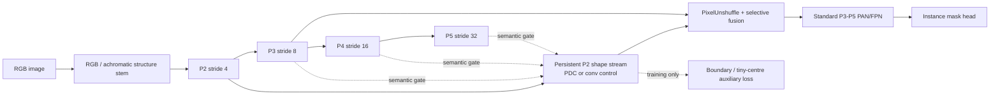

# CitrusD：形状—语义双路保真主干

D 系列不是注意力模块合集。它围绕一个可证伪假设设计：在绿色果实与叶片颜色接近时，YOLO 主干应持续保留 stride-4 的局部形状证据，再让深层语义选择哪些边缘属于果实，而不是把浅层细节直接与低频上下文相加。

## 结构

## 模型与因果比较

下表参数量和 GFLOPs 按实际一类柑橘模型、640×640 输入统计。

| 模型 | 唯一主要变化 | 要回答的问题 | Params | GFLOPs |
|---|---|---|---:|---:|
| D01 | PDC 形状流 + P3/P4/P5 门控 | 双路保真主干整体是否有效 | 2.912M | 12.03 |
| D02 | 把 PDC 换成普通 depthwise conv | 收益是否真的来自像素差分 | 2.912M | 12.12 |
| D03 | 只保留 P3 门控 | P4/P5 全局语义是否有帮助 | 2.894M | 11.44 |
| D04 | D01 + 无色结构 stem | 降低绝对绿色依赖是否有效 | 2.912M | 12.07 |
| D05 | D01 + 训练期边界/微小中心监督 | 显式监督是否优于只改结构 | 2.985M | 12.03 |
| D06 | D04 + D05 | **主精度假设**：结构输入与监督能否协同 | 2.985M | 12.07 |
| D07 | D06 主干 + LiteBQ head | **部署候选**：能否降低参数/计算同时保精度 | 2.750M | 11.16 |
| D08 | D06 主干 + 双原型拓扑 head | 深凹掩膜和相邻果实 split/merge 是否改善 | 2.762M | 11.43 |
| D09 | D06 + clean B06 支持的 RepContext | 唯一有本地正证据的上下文是否还能叠加 | 3.001M | 12.09 |

## 必须遵守的筛选顺序

1. 先用 1–3 epoch 确认数据、损失和梯度正常。
2. 50 epoch 先跑 `controls`，再跑优先模型 D05、D06、D07、D08。
3. 不根据单次 `mAP50` 决定结构。至少同时看 Mask mAP50-95、Recall、AP_small、低 solidity 子集和 neighbor-gap 子集的 split/merge。
4. 只有 50 epoch 胜出的 1–2 个结构进入 300 epoch；最终基线与最佳方法各跑 3 个种子。
5. `losses` 套件必须在结构胜出后运行，否则无法区分架构和损失的贡献。

## 结果判据

- D01 > D02 才支持“PDC 结构证据”主张。
- D01 > D03 才支持 P4/P5 语义门控；否则选择更快的 D03。
- D04 > D01 才保留无色结构 stem。
- D05 > D01、D06 > D04 才保留边界/微小中心辅助监督。
- D07 与 D06 的 Mask mAP50-95 差距不超过 0.5 个百分点且实测延迟更低，才可称为部署候选。
- D08 必须在 `concave + near` 挑战子集上减少 split/merge，不能只凭总 mAP 选中。

任何模型都没有保证提升。旧 G10 的高分来自不同数据/协议，只可作为方向性线索，不能作为 D 系列的目标值或直接对照。

