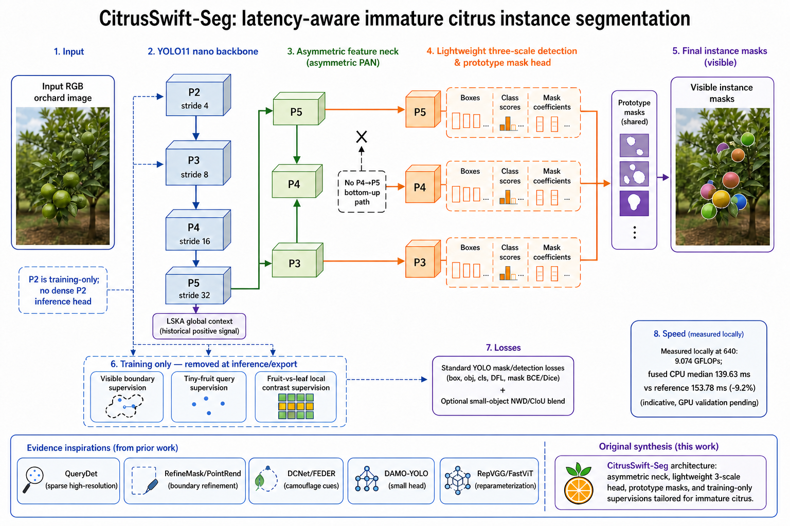

# CitrusSwift-Seg：文献证据、架构重构与自省报告

> 日期：2026-08-24  
> 任务：RGB 未成熟柑橘可见实例分割  
> 数据：已完成清洗的 group-aware 数据集 `orange_yolo_grouped_dedup_20260820`  
> 状态：代码、10 个结构消融、10 个损失消融、批量程序与单元测试已完成；**新数据上的精度尚未训练，不能声称已经提升**。

## 一、最终判断

以前的主要问题不是“文献模块本身都无效”，而是实验路线同时犯了四个错误：

1. 把许多针对不同任务、不同训练生态的模块叠成一个网络，无法判断因果，也破坏了 YOLO11n 的预训练继承；
2. 把“小目标需要高分辨率”简单理解成“全图增加 P2 推理头”，没有计算果园大面积叶片背景带来的无效开销；
3. 只用全局 mAP 评价，未把条带状遮挡形成的深凹可见掩膜、相邻果实 split/merge 和超大尺度跨度分开评价；
4. 用 GFLOPs 代替真实延迟。实测证明，密集 P2/插值/拼接即使 FLOPs 看起来不夸张，也会显著拖慢推理。

这次重构的中心不是“再发明一个注意力模块”，而是一个可证伪的架构假设：

> 在推理阶段保持稀疏、三尺度、低开销的 YOLO 原型掩膜路径；在训练阶段利用 P2/P3 高分辨率特征显式监督微小果实、可见边界和果实—叶片局部差异；把旧实验中唯一稳定的 LSKA 放在 P5；删除收益可疑的 P4→P5 bottom-up 回流，并缩短预测头。

这套网络命名为 **CitrusSwift-Seg**。它同时改变了主干上下文、颈部拓扑、预测头深度和训练目标，但每部分都有独立 YAML，可通过消融判断贡献，不是不可解释的模块堆叠。

## 二、当前任务真正的难点（由数据而不是想象定义）

对已清洗数据的几何和外观审计得到：965 张图、5,890 个实例；53.26% 为 COCO-small，17.39% 的实例最短边小于 16 px，3.26% 小于 8 px；17.61% 的实例 solidity 小于 0.85；30.95% 的实例与邻居间隙不超过 2 px；11.46% 的实例与邻近背景 Lab 色差小于 10；6.89% 边界梯度较弱；6.86% 同时属于凹陷且近邻；单图尺度比中位数 2.69，P90 为 7.75。

因此论文的问题陈述应是：

| 难点 | 可观测现象 | 网络需要做什么 | 不能用什么替代 |
|---|---|---|---|
| 极小果实 | 下采样后只剩几个特征点 | 保留 P2/P3 学习信号，提高中心召回和定位稳定性 | 不能只提高整图分辨率并忽略速度 |
| 绿色伪装 | 果实与叶片颜色/纹理接近 | 学习果实内部与紧邻叶片外环的相对差异 | 不能假定任意频域模块都会有效 |
| 条带状枝叶遮挡 | 可见掩膜产生深凹口或被切成细连接 | 保留真实可见边界与凹部，不做圆形补全 | 不能把任务改成 amodal segmentation |
| 相邻/接触果实 | 一个果实被误拆，两个果实被误并 | 同时评价 split 与 merge，监督实例排他性 | 不能只看总体 Mask IoU |
| 单图尺度跨度大 | 同图同时有远处小果和近处大果 | P3/P4/P5 保持多尺度语义，但避免无效重融合 | 不能只优化 APs 而不检查中/大目标 |

数据清洗已经完成，本轮不再把“继续清洗”当成模型性能的替代答案。正式实验只允许使用 group-aware split，旧泄漏风险数据上的结果只能作为结构线索。

## 三、旧结果告诉了我们什么

历史结果来自旧数据与旧协议，不能与新基线直接比较绝对值；但在相同旧协议内部可用于筛选设计信号。

| 旧实验 | 峰值 Mask mAP50-95 | 后 20 epoch 均值 | 后 20 epoch SD | 客观判断 |
|---|---:|---:|---:|---|
| F14 SPPF-LSKA | 0.67599 | **0.667675** | 0.003217 | 最稳定的单模块正向信号，保留 |
| 大型 hybrid stack | 0.67681 | 0.667518 | 0.003019 | 峰值更高但稳定均值低 0.000157，无法证明堆叠有效 |
| F17 CARAFE | 0.67170 | 0.662327 | 0.001851 | 小信号，未达到稳定领先，不放入完整模型 |
| F16 BiFPN | 0.66821 | 0.659454 | 0.002692 | 对当前任务/实现为负信号，拒绝默认使用 |
| F25 SPD+EMA | 0.64879 | 0.642056 | 0.002367 | 明显负向 |
| F56 frequency suite | 0.63955 | 0.631870 | 0.003283 | “频率相关”不等于有效；全套频域堆叠拒绝 |
| F23 HVI+DFEM | 0.62013 | 0.614630 | 0.001589 | 明显负向 |
| F53 CitrusFormerPlus | 0.60394 | 0.598520 | 0.003478 | 明显负向 |

旧同协议模型的结构间稳定差异只有约 0.00189；因此单次实验小于 0.003 的变化很可能落在训练波动中。另一个关键审计结果是，部分旧 H13–H16 网络只继承 2.4%–7.8% 的预训练状态，所谓“模块效果”与“几乎从头训练”的影响纠缠在一起。本轮完整网络预训练覆盖率为 92.08%，并由测试固定为不得低于 90%。

## 四、检索方法与证据分级

本轮检索日期为 2026-08-24，使用 CVF Open Access、arXiv、Crossref、出版社全文页及论文官方 GitHub；查询族覆盖：small/tiny object、sparse high-resolution、real-time instance segmentation、boundary refinement、camouflaged instance/object segmentation、frequency/edge、feature pyramid、lightweight head、structural reparameterization、knowledge distillation，以及 citrus/immature green fruit/orchard segmentation。Semantic Scholar 接口当时触发 429，OpenAlex 查询未返回有效结果；这些数据库故障没有被掩盖，也没有用二手博客替代核心技术证据。

证据优先级：同任务正式论文 + 官方代码 > 相邻任务正式论文 + 官方代码 > 无代码正式论文 > 仅概念建议。用户提供的《论文创新指南2026》主要是“A+B+C”式创新写作模板，本轮只把它当作审稿风险检查表，不把其中未验证建议当成科学证据。

## 五、文献证据矩阵

### 5.1 小目标与高分辨率计算

| 文献 | 经验证的核心结果 | 对当前任务的迁移 |
|---|---|---|
| [QueryDet, CVPR 2022](https://openaccess.thecvf.com/content/CVPR2022/html/Yang_QueryDet_Cascaded_Sparse_Query_for_Accelerating_High-Resolution_Small_Object_Detection_CVPR_2022_paper.html) | COCO +1.0 AP、+2.0 APs，高分辨率推理约 3×；先低分辨率查询，再稀疏计算高分辨率位置 | 不设全图密集 P2 推理头；先用训练期 tiny-query 建立候选意识，未来再做真正 ROI 稀疏推理 |
| [NWD, 2021](https://arxiv.org/abs/2110.13389) / [官方代码](https://github.com/jwwangchn/NWD) | 用归一化高斯 Wasserstein 距离缓解 tiny box 对像素偏移极敏感的问题 | 只对小目标门控，与 CIoU 混合；默认关闭并单独消融 |
| [Lite-HRNet, CVPR 2021](https://openaccess.thecvf.com/content/CVPR2021/html/Yu_Lite-HRNet_A_Lightweight_High-Resolution_Network_CVPR_2021_paper.html) | 证明持续高分辨率表示可以高效设计，但指出 pointwise conv 成为瓶颈 | 问题诊断成立；当前数据和实测不支持直接搬双流主干 |
| [SegMaR, CVPR 2022](https://openaccess.thecvf.com/content/CVPR2022/html/Jia_Segment_Magnify_and_Reiterate_Detecting_Camouflaged_Objects_the_Hard_Way_CVPR_2022_paper.html) | 对难伪装区域采用 segment–magnify–reiterate 粗到细策略 | 若第一轮 APs/边界仍卡住，优先研究候选 ROI 局部放大，而非整图 P2 |

### 5.2 伪装、边缘和果实—叶片辨别

| 文献 | 经验证的核心结果 | 对当前任务的迁移 |
|---|---|---|
| [SINet, CVPR 2020](https://openaccess.thecvf.com/content_CVPR_2020/html/Fan_Camouflaged_Object_Detection_CVPR_2020_paper.html) | 将伪装检测拆成 search 与 identification | tiny-query 负责“找”，局部 contrast/boundary 负责“辨” |
| [FDCOD, CVPR 2022](https://openaccess.thecvf.com/content/CVPR2022/html/Zhong_Detecting_Camouflaged_Object_in_Frequency_Domain_CVPR_2022_paper.html) | DCT 频域增强和 RGB/频域对齐对 COD 有效 | 说明频率线索可能有效，但其公开仓库当前不可访问；旧 frequency suite 为负，故不直接使用 |
| [FEDER, CVPR 2023](https://openaccess.thecvf.com/content/CVPR2023/html/He_Camouflaged_Object_Detection_With_Feature_Decomposition_and_Edge_Reconstruction_CVPR_2023_paper.html) | 可学习频带分解与边缘重建共同处理前景背景相似和模糊边界 | 采用低成本边缘辅助监督，不搬重型 wavelet decoder |
| [DCNet, CVPR 2023](https://openaccess.thecvf.com/content/CVPR2023/html/Luo_Camouflaged_Instance_Segmentation_via_Explicit_De-Camouflaging_CVPR_2023_paper.html) | Fourier camouflage decoupling + instance prototype/reference points；COD10K AP 比前方法高 4.3，NC4K 比 Mask2Former 高 7.0 | 证实伪装必须兼顾像素与实例；当前用 fruit-inner vs context-ring 监督近似最关键判别关系 |
| [EPFDNet, 2024](https://www.sciencedirect.com/science/article/pii/S0262885624004633) | 在频域显式感知边缘并用上下文差异生成粗边缘 | 支持局部高频残差进入训练辅助分支，不支持全图双分支 |
| [Mask2Camouflage, ACCV 2024](https://openaccess.thecvf.com/content/ACCV2024/papers/Phung_Revealing_Hidden_Context_in_Camouflage_Instance_Segmentation_ACCV_2024_paper.pdf) | 强调全局上下文与前景/背景 refinement | P5 LSKA 提供全局，局部 ring contrast 提供前景/邻域差异 |
| [ESCNet, ICCV 2025](https://openaccess.thecvf.com/content/ICCV2025/html/Ye_ESCNet_Edge-Semantic_Collaborative_Network_for_Camouflaged_Object_Detection_ICCV_2025_paper.html) | 边缘与语义协同而非只靠外观 | 支持 boundary + semantic 的训练期协同，仍需本数据消融验证 |

### 5.3 掩膜边界、深凹口与质量排序

| 文献 | 经验证的核心结果 | 对当前任务的迁移 |
|---|---|---|
| [PointRend, CVPR 2020](https://openaccess.thecvf.com/content_CVPR_2020/html/Kirillov_PointRend_Image_Segmentation_As_Rendering_CVPR_2020_paper.html) | 只在不确定点迭代细化，避免均匀高分辨率计算 | 当前先做无推理成本边界监督；若仍不足，第二阶段实现有限点 refinement |
| [Boundary-preserving Mask R-CNN, ECCV 2020](https://www.ecva.net/papers/eccv_2020/papers_ECCV/html/374_ECCV_2020_paper.php) | mask 与 boundary 互相学习可改善边界 | 使用共享 P2/P3 的可见边界辅助头 |
| [RefineMask, CVPR 2021](https://openaccess.thecvf.com/content/CVPR2021/html/Zhang_RefineMask_Towards_High-Quality_Instance_Segmentation_With_Fine-Grained_Features_CVPR_2021_paper.html) | 对 Mask R-CNN 在 COCO/LVIS/Cityscapes 分别提升 2.6/3.4/3.8 AP | 细粒度信息应集中在边界；不在每个像素上堆多阶段全图计算 |
| [BPR, CVPR 2021](https://openaccess.thecvf.com/content/CVPR2021/html/Tang_Look_Closer_To_Segment_Better_Boundary_Patch_Refinement_for_Instance_CVPR_2021_paper.html) | crop-then-refine 只处理预测边界小块 | 作为精度优先后处理上界，而非第一版实时主网 |
| [SharpContour, CVPR 2022](https://openaccess.thecvf.com/content/CVPR2022/html/Zhu_SharpContour_A_Contour-Based_Boundary_Refinement_Approach_for_Efficient_and_Accurate_CVPR_2022_paper.html) | 轮廓点离散更新，以较小代价改善尖角/边界 | 深凹遮挡边界的后续候选；官方代码未公开，不能声称已复用 |
| [E2EC, CVPR 2022](https://openaccess.thecvf.com/content/CVPR2022/html/Zhang_E2EC_An_End-to-End_Contour-Based_Method_for_High-Quality_High-Speed_Instance_Segmentation_CVPR_2022_paper.html) | 高速端到端轮廓分割；官方仓库报告 COCO 33.8 AP/35.25 FPS（RTX3090） | 若原型掩膜对凹口始终不足，可作为独立轮廓家族比较 |
| [Boundary IoU, CVPR 2021](https://openaccess.thecvf.com/content/CVPR2021/html/Cheng_Boundary_IoU_Improving_Object-Centric_Image_Segmentation_Evaluation_CVPR_2021_paper.html) | Boundary IoU 对边界错误更敏感且不无端重罚小物体 | 最终必须报告 Boundary AP/F1，避免总体 Mask AP 掩盖边界失败 |
| [Mask Scoring R-CNN, CVPR 2019](https://openaccess.thecvf.com/content_CVPR_2019/html/Huang_Mask_Scoring_R-CNN_CVPR_2019_paper.html) | 学习 mask IoU 以校准分类分数与掩膜质量错位 | PR 曲线异常若来自高置信低质量 mask，优先做 mask-quality score，而不是再堆 backbone 模块 |

### 5.4 实时架构与真实延迟

| 文献 | 经验证的核心结果 | 对当前任务的迁移 |
|---|---|---|
| [YOLACT, ICCV 2019](https://openaccess.thecvf.com/content_ICCV_2019/html/Bolya_YOLACT_Real-Time_Instance_Segmentation_ICCV_2019_paper.html) | prototype + coefficient 的并行实例掩膜在 Titan Xp 达 29.8 AP/33.5 FPS | 保留 YOLO11 的原型掩膜路线，优先减预测头而非改成逐 ROI 重头 |
| [SparseInst, CVPR 2022](https://openaccess.thecvf.com/content/CVPR2022/html/Cheng_Sparse_Instance_Activation_for_Real-Time_Instance_Segmentation_CVPR_2022_paper.html) | 稀疏实例激活实现 40 FPS/37.9 AP 的实时路线 | 稀疏性优于全图密集高分辨率，是后续跨家族基线 |
| [FastInst, CVPR 2023](https://openaccess.thecvf.com/content/CVPR2023/html/He_FastInst_A_Simple_Query-Based_Model_for_Real-Time_Instance_Segmentation_CVPR_2023_paper.html) | instance-activation query、dual-path update、训练期 GT mask guidance；40.5 AP/32.5 FPS | 最关键迁移是“训练时重监督、推理时轻结构” |
| [DAMO-YOLO, 2022](https://arxiv.org/abs/2211.15444) | RepGFPN、AlignedOTA、蒸馏，提出 large neck/small head；报告 T4 和 x86 延迟 | 本轮轻量化 box/class/mask-coefficient 头，同时不把颈部无限做大 |
| [YOLOv6, 2022](https://arxiv.org/abs/2209.02976) | EfficientRep/Rep-PAN 和部署友好量化；强调工业真实速度 | 部署阶段用融合、FP16/TensorRT 实测，不以 FLOPs 代替速度 |
| [EfficientDet, CVPR 2020](https://openaccess.thecvf.com/content_CVPR_2020/html/Tan_EfficientDet_Scalable_and_Efficient_Object_Detection_CVPR_2020_paper.html) | BiFPN 与 compound scaling 在其完整体系有效 | 本项目 F16 已显示 BiFPN 为负，说明跨体系模块不能脱离上下文照搬 |
| [FasterNet, CVPR 2023](https://arxiv.org/abs/2303.03667) | 低 FLOPs 不保证低延迟，频繁内存访问尤其关键；PConv 同时减少计算和内存访问 | 所有候选必须测 CPU/GPU/TensorRT 中位和 P90；避免插值/concat 密集结构 |
| [RepVGG, CVPR 2021](https://openaccess.thecvf.com/content/CVPR2021/html/Ding_RepVGG_Making_VGG-Style_ConvNets_Great_Again_CVPR_2021_paper.html) | 训练期多分支可等价融合为推理期单卷积 | `SPPFRepContext` 提供备选，融合前后误差由单元测试验证 |
| [FastViT, ICCV 2023](https://openaccess.thecvf.com/content/ICCV2023/html/Vasu_FastViT_A_Fast_Hybrid_Vision_Transformer_Using_Structural_Reparameterization_ICCV_2023_paper.html) | RepMixer 通过重参数化减少 memory access，在 GPU/移动端测真实延迟 | 支持“训练图与推理图分离”的设计哲学 |
| [RepViT, CVPR 2024](https://openaccess.thecvf.com/content/CVPR2024/html/Wang_RepViT_Revisiting_Mobile_CNN_From_ViT_Perspective_CVPR_2024_paper.html) | 在 iPhone 12 报告 1.0 ms/80%+ ImageNet 的移动端设计 | 后续若部署设备固定，可做整主干迁移；当前先保留 YOLO 预训练覆盖 |

### 5.5 知识蒸馏与无推理成本增益

| 文献 | 经验证的核心结果 | 后续迁移 |
|---|---|---|
| [FGD, CVPR 2022](https://openaccess.thecvf.com/content/CVPR2022/html/Yang_Focal_and_Global_Knowledge_Distillation_for_Detectors_CVPR_2022_paper.html) | 区分前景/背景的 focal distillation 与全局关系蒸馏；多种 COCO detector 提升约 2.9–3.6 AP | 先训练可靠 teacher，再蒸馏 P3/P4 的果实/背景关键区域；不增加学生推理开销 |
| [Localization Distillation, CVPR 2022](https://openaccess.thecvf.com/content/CVPR2022/html/Zheng_Localization_Distillation_for_Dense_Object_Detection_CVPR_2022_paper.html) | 定位分布蒸馏使 GFocal R50 从 40.1 到 42.1 AP，推理速度不变 | 对超小果实优先蒸馏定位/DFL，而非只蒸馏分类 logits |
| [FreeKD, CVPR 2024](https://openaccess.thecvf.com/content/CVPR2024/html/Zhang_FreeKD_Knowledge_Distillation_via_Semantic_Frequency_Prompt_CVPR_2024_paper.html) | 频率提示定位感兴趣像素，密集任务有明显增益 | 只作为后续 teacher-student 研究，不直接再加一个频率模块到学生推理图 |

### 5.6 与柑橘场景的直接对照

| 文献 | 结果与限制 | 对本项目的意义 |
|---|---|---|
| [YOLO11/YOLOv8 immature green fruits, 2024](https://arxiv.org/abs/2410.19869) | YOLO11m-seg 在其数据 Mask mAP50 0.860；YOLOv8n 推理 3.3 ms、YOLO11 最快 4.8 ms | 证明容量和速度存在明确权衡；其数据/硬件与本项目不同，不可把数值当目标保证 |
| [AI-based green citrus framework, 2025](https://doi.org/10.1016/j.atech.2025.100834) | Cascade Mask R-CNN + MViTv2 + slicing 处理远距离密集小果 | 可作为精度上界和切片上界，但很可能不满足实时 nano 目标 |
| [Citrus YOLO11n-LMPS, 2026](https://doi.org/10.1016/j.scienta.2026.114895) | 报告 Mask mAP50 91.6%、mAP50-95 71.1%，针对遮挡、重叠、光照 | 说明 88 mAP50 并非领域上不可能；但跨数据集不可比，不能承诺本项目必达 |
| [RGB orange YOLO11n-Seg, 2026](https://www.mdpi.com/2624-7402/8/5/198) | 明确指出细边界、遮挡区域与相邻果实分离是普通 YOLO11n 的短板 | 与本项目几何审计高度一致，支持边界/拓扑评价而非泛化“遮挡”表述 |

## 六、CitrusSwift-Seg 的具体重构

### 6.1 主干：只在深层增加上下文，不破坏浅层预训练

- 保留 YOLO11n 的 Conv/C3k2 P2–P5 主干，防止小数据集从头学习。
- `S02/S07/S08` 在 SPPF 后使用零初始化残差 LSKA。零初始化使初始函数接近预训练网络，训练再决定是否使用大范围上下文。
- `S01` 提供 `SPPFRepContext`：训练期 7×7/3×3 depthwise 多分支，部署时融合为单 7×7；这是速度友好的备选，不与 LSKA 同时堆叠。
- 不使用 Mamba，不增加新环境依赖。

### 6.2 颈部：非对称 PAN，而不是通用“越多融合越好”

标准 PAN 的 P5→P4→P3 top-down 保留；bottom-up 只保留 P3→P4，删除 P4→P5。理由是本数据多数困难实例依赖高分辨率 P3/P4，P5 回流的额外深层卷积对 tiny/camouflage 的边际价值最可疑。

为保持 YOLO11 预训练键位，YAML 使用 identity 占位，让最终 head 仍位于原索引。这不是伪造层数：identity 没有参数和计算，只为了稳定载入预训练权重。

### 6.3 头部：轻量三尺度推理 + 训练专属 P2 辅助

`SegmentCitrusLite` 保留 P3/P4/P5 预测与 prototype masks，但每个 box 和 mask-coefficient 分支只保留一个空间卷积块，分类分支使用一个 depthwise-separable block。P2 不进入推理检测头。

训练时 `CitrusTrainAux` 从 P2 和 P3 产生三种 logits：

1. visible boundary：监督真实可见边界和深凹遮挡口；
2. tiny query：监督稀疏小目标中心，避免大量叶片背景主导高分辨率学习；
3. local contrast：果实内部为正、紧邻外环为负，针对绿色果实—叶片伪装。

在 `eval()` 和 export 路径中，这三个分支完全跳过；测试确认推理输出不含任何 `citrus_*` 张量。

### 6.4 损失：全部可关闭、全部可消融

- 标准 YOLO box/class/DFL/mask 损失保持默认行为；所有新增权重默认 0。
- boundary/concavity/query/contrast/exclusive 分别对应边界、深凹、微小中心、伪装邻域和相邻实例排他性。
- `nwd_ratio` 对小目标使用 NWD/CIoU 混合，门控阈值围绕 32 px；不对全部目标粗暴替换 IoU。
- 完整候选中的权重只是有文献约束的起点，不是已经验证的最优值；`losses` suite 会逐项证伪。

## 七、10 个结构实验和 10 个损失实验

### 7.1 结构消融

| ID | 主干 | 颈部 | 头部/监督 | 要回答的问题 |
|---|---|---|---|---|
| S00 | 原始 | 原始 PAN | 原始 Segment | 新数据的唯一正式参考 |
| S01 | RepContext | 原始 | 原始 | 可融合大核上下文是否有益 |
| S02 | LSKA | 原始 | 原始 | 旧正信号能否在清洗数据复现 |
| S03 | 原始 | 原始 | training-only aux | 不增加推理成本能否改善困难实例 |
| S04 | 原始 | 原始 | lite head | 速度收益和精度代价 |
| S05 | 原始 | top-down FPN only | 原始 | 最大颈部裁剪的速度/精度边界 |
| S06 | 原始 | asymmetric PAN | 原始 | 删除 P5 回流是否是较温和 Pareto 点 |
| S07 | LSKA | asymmetric PAN | 原始 | 主干上下文与颈部拓扑是否互补 |
| S08 | LSKA | asymmetric PAN | lite + aux + task loss | 完整 CitrusSwift 候选 |
| S09 | 旧 topology | dense P2 路径 | dense boundary/query | 用同协议验证旧密集方案是否值得其速度代价 |

### 7.2 损失消融

L00 standard、L01 boundary、L02 query、L03 contrast、L04 boundary+query、L05 boundary+contrast、L06 aux core、L07 +concavity、L08 +NWD、L09 full。所有实验固定 `03_train_aux_head.yaml`，避免把结构和损失贡献混在一起。

## 八、速度自省：本轮真正改对了什么

统一条件：一类模型、640×640、batch=1、CPU 单线程、10 次 warm-up、30 次测量；结果为本机工程指标，不代表服务器 GPU。

| 模型 | 参数 | GFLOPs | 预训练覆盖 | 融合后中位延迟 | 相对基线 |
|---|---:|---:|---:|---:|---:|
| S00 reference | 2,842,803 | 10.356 | 98.42% | 153.78 ms | 0.0% |
| S01 RepContext | 2,858,931 | 10.369 | 97.83% | 155.90 ms | +1.4% |
| S02 LSKA | 2,916,019 | 10.413 | 95.96% | 156.33 ms | +1.7% |
| S03 train aux | 2,915,526 | 10.356 | 95.97% | 153.24 ms | -0.4%（测量噪声范围） |
| S04 lite head | 2,747,302 | 9.440 | 96.04% | 142.27 ms | **-7.5%** |
| S05 FPN-only | 2,192,499 | 9.534 | 97.95% | 143.55 ms | **-6.7%** |
| S06 asymmetric PAN | 2,316,211 | 9.933 | 98.06% | 149.94 ms | -2.5% |
| S07 LSKA+asym | 2,389,427 | 9.990 | 95.07% | 151.06 ms | -1.8% |
| S08 CitrusSwift full | 2,293,926 | **9.074** | 92.08% | **139.63 ms** | **-9.2%** |
| S09 old dense control | 2,930,707 | 10.783 | 95.47% | 178.21 ms | **+15.9%（更慢）** |

核心结论：训练专属 P2 监督几乎不改变推理图；真正的速度来自缩短 head 和删掉收益可疑的深层 bottom-up 路径。旧 dense P2 control 是最慢候选。结构重参数化在本任务不是自动加速按钮：S01 融合后仍比基线慢 1.4%，所以它只作为消融，不进入默认完整模型。

可复现实测脚本：`20260824_citrus_swift_profile.py`；原始 CSV：`figures/citrus_swift_complexity_latency.csv`。

## 九、我对“未来怎么继续改”的优先级

### 优先级 0：先让新基线说话

新数据上的 YOLO11n baseline 尚未给出正式结果。没有这个锚点，任何“从 78 到 88”的讨论都是目标而不是事实。先完成 S00 与 S08 的 1–3 epoch 冒烟，再跑 50 epoch screening。不要一开始把 20 个实验全部跑 300 epoch。

### 优先级 1：训练期困难区域监督（当前已实现）

如果 S03 明显提高 APs、camouflage subset、Boundary F1 或减少 merge/split，同时推理延迟不变，这是最符合论文故事和工程目标的贡献。若只提高全局 mAP 而挑战子集不变，论文机制解释不成立。

### 优先级 2：轻头 + 非对称颈部的 Pareto 选择（当前已实现）

不要强制选择 S08。若 S04 精度几乎不降且速度最好，可用 S04 作实时版本；若 S06/S07 精度更高且仍比基线快，则选准确率版本。论文应呈现 Pareto front，而不是只给一个模型。

### 优先级 3：掩膜质量打分校准（待第一轮 PR 诊断）

PR 曲线在 recall 末端掉到 precision≈0 本身常见：阈值降到极低时，为找回最后的困难真值会引入大量假阳性；若数据已清洗仍出现异常陡降，应检查高置信低质量 mask、重复实例和 mask/class score 错配。此时 Mask Scoring R-CNN 式 mask-IoU calibration 比继续改 backbone 更有针对性。触发条件：高置信预测的 mask IoU 与分类置信度相关性低，或错误集中在排序而非召回。

### 优先级 4：教师—学生蒸馏（精度提高但不增加学生推理成本）

先用相同 clean split 训练 YOLO11s/m-seg 或更强跨家族教师，再对 CitrusSwift 进行：

- P3/P4 前景/背景 focal feature distillation（FGD）；
- DFL/定位分布蒸馏（LD），重点覆盖 <16 px 实例；
- prototype/mask logits 蒸馏，边界环权重更高。

这比继续往 nano 推理图堆模块更可能同时提升精度和保持速度。蒸馏必须是独立阶段，不能与架构首轮消融混跑。

### 优先级 5：真正的稀疏 ROI/不确定点细化

若 S08 的 APs/Boundary F1 仍低，但 GPU 还有 5%–10% 延迟预算，才实现 QueryDet/PointRend 式稀疏推理：由 P3/P4 query 选 top-K ROI，在 P2 上只采样候选窗口或不确定边界点。必须同时处理重叠窗口去重和导出支持。不要回到全图 dense P2。

### 优先级 6：部署级优化

1. `model.fuse()` 后导出 ONNX/TensorRT FP16，固定 640 和 batch=1；
2. 分别报告网络前向、NMS、mask decode/resize 和端到端延迟，中位数与 P90；
3. 在目标 GPU 实测标准卷积、DWConv 和 concat；不同硬件的最快算子不同；
4. 精度稳定后再做 TensorRT INT8 校准，校准集必须覆盖小果、低对比、凹遮挡和接触果实；
5. 若需剪枝，只做结构化通道剪枝并重新微调，不做产生稀疏权重但硬件无加速的非结构化剪枝。

## 十、严格的实验门槛

### 10.1 首轮

1. dry-run 队列；
2. S00、S03、S04、S06、S08、S09 各 1 epoch smoke；
3. 10 个结构单 seed、50 epoch；
4. 10 个 loss 单 seed、50 epoch，但只在 S03 结构上隔离损失；
5. 只晋级满足以下至少一条且无重大退化者：
   - Mask mAP50-95 相对 reference ≥ +0.003；
   - APs 或 tiny subset 明显提升，且总体 mAP50-95 不降超过 0.003；
   - Boundary F1、concavity subset 或 split/merge 显著改善，且速度仍在预算内。

### 10.2 最终

只训练正式 baseline 与 1–2 个 finalist：300 epoch，seeds 42/43/44，报告 mean±SD。必须锁定数据 split、预训练权重、optimizer、lr、imgsz、batch、AMP、seed 和评估 split。

最终表至少包括 Mask mAP50-95、Mask mAP50、P、R、APs/APm/APl、Boundary F1/AP、concavity/near-neighbor/camouflage/tiny challenge subsets、split/merge errors、Params、GFLOPs、GPU FP16 latency median/P90、端到端 FPS。只有当 3 seeds 的提升超过波动，才称“有效”。

## 十一、关于“从 78 到 88”的诚实回答

10 个 mAP50 点是可追求的工程目标，但目前没有证据可保证。近年的柑橘论文在各自数据上报告 0.86–0.916 Mask mAP50，说明领域上存在达到高 80/低 90 的案例；不同标注规则、难度、split、图像距离和硬件使这些数字不能横向兑换。

我对本轮的合理预期是：

- 速度方面已经有本机证据：完整候选的 GFLOPs -12.4%，融合 CPU latency -9.2%；
- 精度方面只有可检验假设，没有新数据训练结果；
- 单靠架构通常不应预设 +10 点。若最终需要大幅提升，更现实的组合是 clean group split + task-specific auxiliary supervision + stronger teacher distillation + sparse ROI refinement，而不是十个注意力模块叠加。

## 十二、本轮自省

我之前给出的“频率、Mamba、双流高分辨率、反馈超分”覆盖面很广，但覆盖面不等于可信度。它们没有先通过三道门：旧结果是否支持、预训练是否能继承、真实延迟是否可接受。这次最重要的修正，是把设计从“论文模块清单”变成“任务测量 → 文献机制 → 最小实现 → 单因子消融 → 部署实测”的闭环。

仍未完成、也不能假装完成的部分有三项：

1. 新 clean split 上的训练精度；
2. 服务器目标 GPU/TensorRT 端到端延迟；
3. 按 APs、凹遮挡、接触果、低对比构建的正式 challenge-subset 结果。

只有这三项完成后，才能决定 CitrusSwift 是否是论文最终模型。当前代码的价值是把这三个问题变成了一组可直接运行、可复现、可以失败的实验，而不是预先宣布成功。
