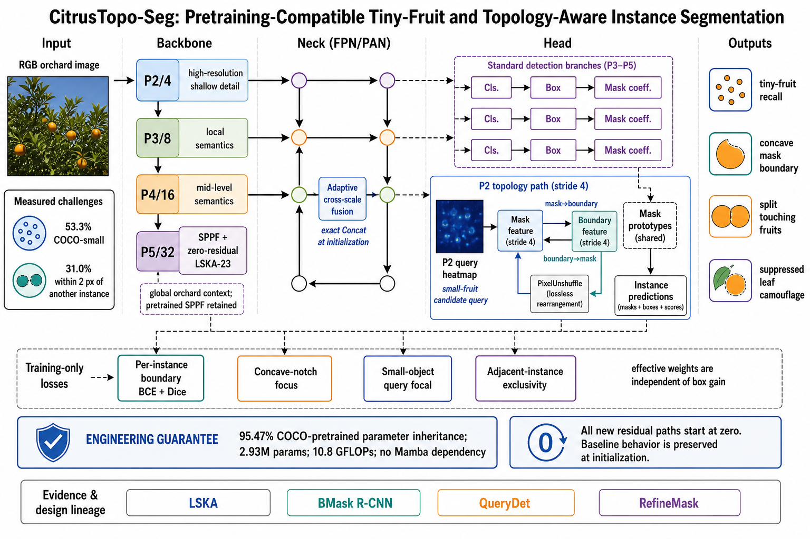

# CitrusTopo-Seg：全目录复核、任务证据与正式网络重设计

> 日期：2026-08-24 ｜ 数据版本：`orange_yolo_grouped_dedup_20260820` ｜ 状态：代码与批量实验已就绪，精度增益待服务器实测

## 🔎 结论先行

这次最重要的结果不是再增加一个模块，而是找出了此前实验比较失真的根因，并据此重做了一条可验证的网络路线。

1. 历史目录中 102 个运行含 85 个可用结果，但没有一个使用新的 grouped-dedup 防泄露划分。旧结果只能用于筛选思路，不能作为论文最终数字。
2. 早期 `0.78635 Mask mAP50` 的 YOLO11 基线使用不同数据文件、AMP=1，而且 YAML 建模后没有实际加载 COCO 权重，接近从头训练。它不能与后期预训练实验直接相减。因此“0.78→0.88”是期望目标，不是已经建立的 10 点提升基准。
3. 之前的 H13–H16 虽然填写了 `pretrained=yolo11n-seg.pt`，实际只有 2.4%–7.8% 参数能够匹配；这几乎等于随机初始化，是当前改进不稳定的首要工程原因。
4. 历史 nano 结果中，F14 SPPF-LSKA 的稳定 Mask mAP50-95 为 0.67073；G10 大型混合网络为 0.67070，稳定指标没有提升，却增加约 37.5% GFLOPs。继续堆模块不具备证据优势。
5. 新数据量化显示，真正的共同瓶颈是“微小目标 + 可见掩膜凹陷 + 相邻粘连 + 局部绿色伪装”，而不是泛化地称为“小目标和遮挡”。因此正式方案围绕高分辨率候选搜索、逐实例边界与相邻排他性展开。

目标 0.88 Mask mAP50 仍可作为实验目标，但任何固定增益都不能在训练前保证。严格目标应写成：在相同 grouped split、初始化和训练协议下，相对正式 YOLO11n-seg 基线提升，并重点提高 AP-small、凹遮挡子集 AP、近邻子集 AP 和 split/merge 指标。

## 📊 全部历史结果告诉了什么

| 项目 | 审计结果 |
|---|---:|
| 含 `args.yaml` 的目录 | 102 |
| 含 `results.csv` 的目录 | 90 |
| 可用于数值分析的运行 | 85 |
| 完整完成 | 79 |
| Mask PR 图 | 83 |
| 最佳权重 | 90 |
| 使用新 grouped-dedup 数据的运行 | 0 |

历史结果中可以保留的信号：

| 思路 | 旧数据表现 | 客观判断 |
|---|---:|---|
| F14 SPPF-LSKA | peak mAP50-95 0.67599；stable 0.67073；mAP50 0.82868 | 最稳定的 nano 结构信号，保留 |
| G10 LSKA+CARAFE+BiFPN+P2B | peak 0.67681；stable 0.67070；mAP50 0.83824 | mAP50 较高，但综合稳定提升仅 +0.00082 peak、stable 反而略低；不能称为显著胜出 |
| CARAFE | peak 0.67170；stable 0.66526 | 有小幅信号，未进入首版正式模型，避免再次堆叠 |
| WT+BiFPN 组合 | 局部比较约 +0.00585 | 可作为后备消融，不与主方法同时加入 |
| HVI+DFEM | 局部比较约 -0.0373 | 明确有害 |
| CitrusFormerPlus | 局部比较约 -0.0521 | 明确有害 |
| Frequency suite | 局部比较约 -0.0283 | 当前实现/放置方式有害 |
| SPD+EMA | 局部比较约 -0.0143 | 有害 |
| DFEM+SPD | 局部比较约 -0.0157 | 有害 |
| TGP+TDAM | 局部比较约 -0.0176 | 有害 |

重复架构的历史随机波动约为 0.00189 mAP50-95。因此单次变化低于约 0.003 时，先归为单次运行噪声，而不是“有效创新”。

PR 曲线在 recall 接近极限时落到 0 是阈值扫描的正常端点：为了追求最后一部分召回，模型会接收大量低置信度假阳性，precision 因而下降。问题应看曲线是否过早下坠、AP 面积、最佳 F1 点，以及错误实例，而不是只看 `(recall=1, precision=0)` 的端点。

## 🍊 新数据集的真实困难度

审计覆盖 965 张图、5,890 个有效多边形实例，使用 640 letterbox 尺度计算，不修改任何图像或标签。

| 困难证据 | 数量 | 比例 |
|---|---:|---:|
| COCO-small，面积 <32² px | 3,137 | 53.26% |
| 最短边 <16 px | 1,024 | 17.39% |
| 最短边 <8 px | 192 | 3.26% |
| 强凹陷，solidity <0.85 | 1,037 | 17.61% |
| 极强凹陷，solidity <0.70 | 180 | 3.06% |
| 与另一实例距离 ≤2 px | 1,823 | 30.95% |
| 与另一实例距离 ≤4 px | 2,082 | 35.35% |
| 局部 Lab 色差 ΔE <10 | 675 | 11.46% |
| 边界梯度弱于局部背景 | 406 | 6.89% |
| 同时微小且低色差 | 128 | 2.17% |
| 同时强凹陷且近邻 | 404 | 6.86% |

每幅图的线性尺度比中位数为 2.69，P90 为 7.75。这意味着网络不能只做普通的 P3 小目标头：一张图中可能同时需要非常浅的细节、深层语义以及相邻实例分界。

这些数据支持四个任务陈述：

- 微小果实在浅层仍有像素，但标准检测只从 P3 开始，召回不足；
- 叶/枝条状遮挡会形成向果实内部凹入的可见边界，普通区域 BCE 对这些少数像素关注不足；
- 近邻果实的分割目标存在拓扑冲突：既不能把一个被遮挡果实裂开，又不能把两个接触果实合并；
- 绿色幼果与叶片的色差小，单纯高频增强会同时放大叶脉纹理，必须由候选位置和全局上下文抑制背景。

## 📚 文献与官方代码如何影响设计

LSKA 将大二维深度卷积拆成水平、垂直一维卷积，官方实现支持 7/11/23/35/41/53 等有效核；论文还报告大核增加时网络更偏向形状而非纹理。[^1] 这与本地 F14 的稳定优势一致，因此只在低分辨率 P5 使用 LSKA-23，提供全局果树上下文而不过度放大 P2 叶脉。

Boundary-preserving Mask R-CNN 的关键并非输出一张边界图，而是 mask→boundary 与 boundary→mask 的双向特征融合，并以边界监督改善掩膜定位。[^2] 旧 H13–H16 的 `proto + detail * (1 + sigmoid(boundary))` 只能放大、不能抑制，而且在无边界监督时不能称为边界感知。新头按双向融合重做。

QueryDet 用低分辨率粗查询定位潜在小目标，再将高分辨率计算集中到候选位置；论文在 COCO 中报告相对其 RetinaNet 设置约 +1 AP、+2 AP-small。[^3] 本项目没有照搬 Detectron2/spconv，而是明确标记为“QueryDet-style adaptation”：在 P2 生成小目标候选热图，用轻量门控抑制整幅高分辨率叶片噪声。

RefineMask 在后期细化阶段把监督集中到预测边界与目标边界的不确定带。[^4] 本项目据此保留逐实例边界监督，并进一步用 GT 形态学 closing 找到狭窄内凹缺口，形成任务专用 concave-notch band。后者是本项目适配，不冒充 RefineMask 原公式。

SFM 官方 ARS 使用显著性密度、加权坐标网格和 `grid_sample` 做自适应重采样，并不是此前代码中的 Haar 高频旁路。[^5] 由于当前标签显示叶脉同样是强高频，且旧 frequency suite 已有负结果，首版正式模型不伪造“官方 SFM 移植”；仓库保留用于后续独立 ARS 对照。

SCSegamba 的官方路径依赖视觉状态空间/Mamba 组件。[^6] 用户明确不安装 Mamba，因此最终网络不使用 `mamba-ssm`，也不把简化循环卷积包装成“官方 SCSegamba”。

NWD 对微小框的像素偏移比 IoU 更平滑。[^7] 但本地 full loss recipe 曾使 N02 与 G10 分别下降约 0.02335 和 0.03648 mAP50-95，所以 NWD 只适合作为单独损失消融，不进入当前 full recipe。

Lite-HRNet 持续保留高分辨率表示并做跨分辨率融合。[^8] 本项目采用其结构原则，但不替换整个 YOLO 主干：P2 只承担候选与边界，P3–P5 检测保持原路径，从而控制计算量并保留预训练。

参考 PDF《论文创新指南2026》已完整阅读 51 页。它关于“先找痛点、必须消融、优先查看开源代码”的建议被采用；“A+B+C 组合后重新命名即可形成创新”的泛化建议没有照搬，因为历史结果已经证明无约束堆叠会增加算力但不增加稳定精度。

## 🧠 CitrusTopo-Seg 架构



| 部分 | 实现 | 针对痛点 | 预训练/稳定性处理 |
|---|---|---|---|
| 主干 | `SPPFLSKAResidual` | 绿色果实需要全局上下文，避免只追叶片纹理 | 继承标准 SPPF；LSKA 残差尺度从 0 开始 |
| 颈部 | `CitrusScaleFusion` | 图内尺度跨度大，需要样本级跨尺度权重 | 最后一层全零初始化，初始严格等于 Concat |
| 头部 | `SegmentCitrusTopo` | P2 微小像素、P3 语义、凹边界与接触分离 | 标准 P3–P5 box/class/mask-coefficient 分支原样保留 |
| 高分辨率搜索 | P2 query heatmap | 只增强疑似小果区域，减少叶片假阳性 | 1% 候选先验；Focal 辅助监督 |
| 边界融合 | P2 stride-4 boundary stream + mask↔boundary | 保留凹边界与相邻分隔线 | boundary→mask 残差从 0 开始 |
| 重排 | `PixelUnshuffle` boundary→mask | 将 2×2 P2 边界样本无丢失送入 P3 | 空间样本转通道，不使用 Mamba/CUDA 扩展 |
| 边界损失 | per-instance BCE + Dice | 避免先 union 后丢失接触分界 | 在标准 `box` gain 之后加入，系数是真实有效权重 |
| 凹陷损失 | concave-notch focused BCE | 条带遮挡形成的向内凹口 | 只由 GT 生成训练带，不改标签 |
| 查询损失 | small-object query focal | COCO-small 超过一半 | 只监督 P2 候选分支 |
| 排他损失 | adjacent-instance exclusivity | 降低一个实例掩膜泄漏到邻果 | 只在近邻 corridor 上惩罚 |

最终 nano 模型构建结果：约 2.93M 参数、10.8 GFLOPs；按 `nc=1` 统计，2,813,786 / 2,947,201 个状态元素能从 COCO YOLO11n-seg 匹配，继承率 95.47%。标准主干/颈部非新增参数保持层号和形状。

## 🧪 十个结构与六个损失实验

十个 YAML 不是十个随意堆叠网络，而是三因素结构消融：P5 上下文、P3 融合、P2 topology head。

| 编号 | 配置 | 作用 |
|---|---|---|
| A00 | reference | 新数据正式参考 |
| A01 | LSKA only | 主干贡献 |
| A02 | scale fusion only | 颈部贡献 |
| A03 | old P2CFS only | 旧 P2 原型支路控制 |
| A04 | topology head only | 新 P2 query + 双向边界头 |
| A05 | LSKA + scale | 主干/颈部交互 |
| A06 | LSKA + topology | 上下文/边界交互 |
| A07 | full core | 主干 + 颈部 + 新头 |
| A08 | scale + topology | 尺度融合/边界交互 |
| A09 | LSKA + scale + old P2CFS | 用旧头替换新头的直接控制 |

固定 A07 后再运行 L00–L05：无辅助损失、boundary、boundary+query、boundary+concavity、boundary+exclusive、full loss。这样可以区分“架构有效”还是“某个损失在起作用”。

推荐实验顺序：

1. 先完成 grouped-dedup 上正式预训练 YOLO11n-seg 基线，确认 AdamW `lr0=0.001`；若当前服务器基线使用旧脚本的 0.01，则只能视为预跑。
2. A00–A09 统一 50 epoch 单 seed 筛选，不直接烧 10×300 epoch。
3. 对最好结构运行 L00–L05，100 epoch 筛损失；任何低于 0.003 mAP50-95 的单次差异先视为噪声。
4. 基线和最终方法各跑 300 epoch ×3 seeds，报告 mean±std。
5. 除 Mask mAP50/50-95 外，必须报告 AP-small、AP-medium、AP-large、solidity<0.85 子集、gap≤2 px 子集、低 ΔE 子集，以及 split/merge 错误。

## 🖥️ 批量运行

服务器上进入代码根目录后：

```bash
pip install -e .
python 20260824_citrus_topo_batch.py \
  --data /your/data/orange_yolo_grouped_dedup_20260820/data.yaml \
  --suite architectures --epochs 50 --batch 16 --device 0
```

损失消融：

```bash
python 20260824_citrus_topo_batch.py \
  --data /your/data/orange_yolo_grouped_dedup_20260820/data.yaml \
  --suite losses --epochs 100 --batch 16 --device 0
```

自动汇总：

```bash
python 20260824_citrus_topo_report.py \
  --project 1_results/L_series/grouped_clean_300ep
```

脚本会自动把数据 YAML 内部的 Windows 路径改写成服务器运行时副本，跳过已经完整跑完的目录，并把 Git 状态、数据路径、损失参数和成功/失败状态写入 `experiment_ledger.jsonl`。环境不需要 Mamba。

## ✅ 已完成的验证

- 10/10 YAML 均成功构建并完成随机张量前向；
- 聚焦测试 `tests/test_citrus_topo.py` 共 13 项全部通过；
- full 模型完成前向与反向；
- boundary、concavity、query、exclusive 全开时合成双实例 batch 可完成损失反向；
- boundary predictor、query predictor 与 zero-residual scale 均收到非零梯度；
- full 模型预训练继承率 95.47%，而旧 H13–H16 仅 2.4%–7.8%；
- 10 个结构的参数量为约 2.84M–2.93M，输出原型尺寸与标准模型一致；
- 批量脚本 `--suite all --dry-run` 成功列出 16 个实验；
- 数据审计 965 张图无读取错误；
- 本机未执行真实 GPU epoch：当前本机 Python 的 NumPy/Matplotlib 版本冲突且 torch 为 CPU 构建，长训练应在服务器进行。

## ⚠️ 论文表述边界

当前可以声称的是“提出并实现了一个证据驱动、预训练兼容、针对微小果实与实例拓扑的候选—判别—细化结构”，不能在服务器结果返回前声称提升到 0.88。若最终增益集中在 AP-small、近邻和凹遮挡子集，即使整体 mAP50 没有提高 10 点，仍可能构成更可信的论文贡献；反之，如果只提高旧泄露划分上的 mAP50，则不应作为正式结论。

[^1]: Kin Wai Lau, Lai-Man Po, Yasar Abbas Ur Rehman, [Large Separable Kernel Attention](https://arxiv.org/abs/2309.01439); [official implementation](https://github.com/StevenLauHKHK/Large-Separable-Kernel-Attention).
[^2]: Tianheng Cheng et al., [Boundary-preserving Mask R-CNN](https://arxiv.org/abs/2007.08921); [official implementation](https://github.com/hustvl/BMaskR-CNN).
[^3]: Chenhongyi Yang et al., [QueryDet: Cascaded Sparse Query for Accelerating High-Resolution Small Object Detection](https://openaccess.thecvf.com/content/CVPR2022/html/Yang_QueryDet_Cascaded_Sparse_Query_for_Accelerating_High-Resolution_Small_Object_Detection_CVPR_2022_paper.html); [official implementation](https://github.com/ChenhongyiYang/QueryDet-PyTorch).
[^4]: Gang Zhang et al., [RefineMask: Towards High-Quality Instance Segmentation With Fine-Grained Features](https://openaccess.thecvf.com/content/CVPR2021/html/Zhang_RefineMask_Towards_High-Quality_Instance_Segmentation_With_Fine-Grained_Features_CVPR_2021_paper.html); [official implementation](https://github.com/zhanggang001/RefineMask).
[^5]: Linwei Chen et al., [Spatial Frequency Modulation for Semantic Segmentation](https://arxiv.org/abs/2507.11893); [official implementation](https://github.com/Linwei-Chen/SFM).
[^6]: [SCSegamba paper](https://arxiv.org/abs/2503.01113); [official implementation](https://github.com/Karl1109/SCSegamba).
[^7]: Jinwang Wang et al., [A Normalized Gaussian Wasserstein Distance for Tiny Object Detection](https://arxiv.org/abs/2110.13389); [official implementation](https://github.com/jwwangchn/NWD).
[^8]: Changqian Yu et al., [Lite-HRNet official implementation](https://github.com/HRNet/Lite-HRNet).
