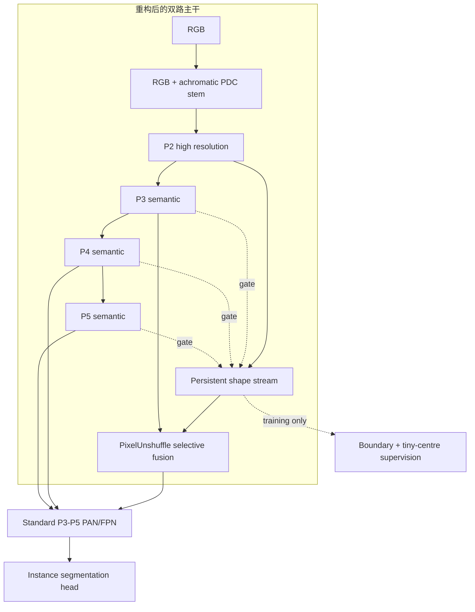

# CitrusD：基于既有失败结果的形状—语义主干重构

## 结论先行

D 系列的核心不是再增加一种注意力，而是把 YOLO11 的单向主干改为两条分工明确的路径：标准低分辨率语义流负责“它是不是果实”，持久 stride-4 形状流负责“可见边界和微小像素在哪里”。深层语义只能门控形状更新，不能直接淹没高分辨率细节；选中的结构证据通过无损空间重排注入 P3，检测和实例掩膜仍使用 P3-P5，避免稠密 P2 head 的巨大开销。

这是一组待验证假设，不是保证涨点。旧 G10 的高分来自不同数据/训练协议，不能作为 D 系列可达到的数值承诺。

## 1. 为什么已有路线没有稳定提升

清洗数据上的代表性结果显示，后续系列大多只在很窄范围内波动：

| 实验 | Mask mAP50-95 | 关键观察 |
|---|---:|---|
| S00 | 0.60740 | S 系列参照 |
| S04 lite head | 0.61501 | 轻量头是相对稳定的正方向 |
| S06 asymmetric PAN | 0.61346 | 颈部单改有小幅收益，但不足以解决主干信息损失 |
| S09 topology head | 0.61616 | 高 precision、低 recall；只改 P2 拓扑头没有根治召回 |
| B00 | 0.61396 | B 系列参照 |
| B06 | **0.61862** | B 系列最佳，但增益仍小；P=0.8515、R=0.7367 |
| B09 quality/recall | 0.61361 | P=0.9277、R=0.6926，质量重权重进一步牺牲召回 |

这些数据支持三个判断：

1. 后处理式注意力、损失或头部变化无法恢复主干下采样时已经丢失的微小目标证据。
2. 强化预测质量/置信度可能提高 precision，但会让难例和微小果实更早掉出候选，B09 已经给出反例。
3. S04/B06 只能作为“可复用的局部经验”，不能继续把所有正模块叠在一起。

因此 D 系列把主要创新前移到主干，标准 head、Lite head 和拓扑 head 只作为独立后续因子。

## 2. 数据证据指向的真实难点

按 640 letterbox 后的 5,890 个实例统计：

| 困难属性 | 数量/比例 | 设计含义 |
|---|---:|---|
| COCO small（面积 < 32²） | 3,137 / 53.26% | 高分辨率证据是主问题，不应只优化大感受野 |
| 最短边 < 16 px | 1,024 / 17.39% | 早期下采样会迅速抹掉形状 |
| solidity < 0.85 | 1,037 / 17.61% | 条带状叶/枝遮挡形成深凹可见掩膜 |
| 邻近实例 gap ≤ 2 px | 1,823 / 30.95% | 需要同时保边界和防止相邻果实合并 |
| Lab ΔE < 10 | 675 / 11.46% | 一部分果实与叶片颜色高度相似 |
| tiny + low contrast | 128 / 2.17% | 颜色和像素不足会共同压低候选置信度 |
| concave + near | 404 / 6.86% | 是最适合报告 split/merge 的挑战子集 |
| 每图线性尺度比 | median 2.69，p90 7.75 | 单图内尺度跨度大，不能用单一深层分辨率覆盖 |

因此论文问题应表述为：在极端尺度跨度下，如何保留微小果实的结构证据，并利用语义区分绿色果实与叶片，同时在条带遮挡和相邻实例之间维持正确拓扑。

## 3. 论文证据到架构的映射



| 证据 | 原论文结论 | D 系列落实 |
|---|---|---|
| Gated-SCNN, ICCV 2019 | 将 shape 独立成浅层流，并由高层语义过滤噪声，可改善小/薄物体和边界 | `CitrusShapeStream`；P3/P4/P5 只生成门控 |
| PiDiNet, ICCV 2021 | PDC 显式提取像素差分，轻量且边缘有效 | 深度可分中心差分更新；D02 用普通卷积作严格对照 |
| PIDNet, CVPR 2023 | 上下文直接融合会淹没细节；边界引导选择性融合更安全 | agreement gate × boundary gate，零初始化残差注入 P3 |
| Lite-HRNet, CVPR 2021 | 轻量网络仍可持续保留高分辨率表示 | 形状流始终 stride 4，但宽度很窄 |
| QueryDet, CVPR 2022 | P2 有利于小目标，但稠密 P2 head 成本可增约 300%；稀疏候选更合理 | 保留 P2 表示但不增加推理期 P2 detection head；tiny-centre 只作训练监督 |

原文与官方代码清单位于 `sources/D_series/`。

## 4. 三个新模块

### 4.1 `CitrusStructureStem`

保留 RGB 卷积分支，同时用固定 luminance 投影形成无色输入，经中心差分卷积提取结构。它不是把整图转灰度：外观和结构在第一个 stride-2 stem 后融合。D04 对 D01、D06 对 D05 分别能检验它是否减少颜色依赖。

### 4.2 `CitrusShapeStream`

从 P2 建立持续高分辨率流。每个阶段先计算高分辨率结构 key 和深层语义 query 的一致性，再只对一致区域执行 PDC 结构更新。P4/P5 不直接上采样后相加，避免低频树冠上下文淹没微小边界。

### 4.3 `CitrusShapeFusion`

使用 `PixelUnshuffle(2)` 将 stride-4 形状张量重排到 stride-8，每个空间样本都进入通道维；随后用语义一致性与边界响应的联合门控注入 P3。残差比例零初始化，模型加载官方预训练权重时初始行为尽量接近原语义路径。

## 5. D01-D09

| 模型 | 主干 | 颈部/头部 | 损失 | 目的 |
|---|---|---|---|---|
| D01 | PDC P2 流，P3-P5 门控 | 标准 PAN + Segment | 标准 | 核心主干 |
| D02 | 普通卷积 P2 流 | 同 D01 | 标准 | PDC 因果对照 |
| D03 | PDC，但只有 P3 门控 | 同 D01 | 标准 | 深层上下文对照 |
| D04 | D01 + achromatic structure stem | 同 D01 | 标准 | 颜色依赖对照 |
| D05 | D01 | SegmentCitrusAux | boundary .15 + query .03 | 显式监督对照 |
| D06 | D04 | SegmentCitrusAux | boundary .15 + query .03 | 主精度候选 |
| D07 | D06 主干 | LiteBQ | 同 D06 | 轻量部署候选 |
| D08 | D06 主干 | DualProto | topology .05 | 深凹/相邻实例候选 |
| D09 | D06 + RepContext | Aux | 同 D06 | B06 正证据上下文 |

损失权重不是凭空加入：较温和的 `.15/.03` 是为了避免复现 B09 高 precision、低 recall；并且 `losses` 套件提供关闭、温和、默认、较强四档独立验证。VFL/quality/NWD/contrast 没有放进 D 核心。

## 6. Plug-play 模块库审计后的决定

`Plug-play-modules-main` 是无 Git 历史、无根许可证的二次汇总代码，不能作为官方实现直接复制。回溯后，FreqFusion 是真正与当前任务相关的候选：它在正式实例分割实验中改善了融合和边界。但其官方纯 PyTorch CARAFE 备用实现显存代价较高，仓库也没有根许可证，而且同时加入会破坏 D 主干消融，因此只记录为 D 核心成功后的单一颈部实验。HCF-Net/PPA 来自红外小目标语义分割，PPA 本身又叠加多种注意力与 dropout，不进入 D。

详细审计见 `sources/D_series/plug_play_module_audit.md`。

## 7. 工程验证

九个 YAML 均通过公共 `YOLO(yaml)` 入口完成模型构建、前向和 GFLOPs 统计；D06 和 D08 完成真实 segmentation loss 反向传播，梯度到达 structure stem、PDC、P3/P4/P5 语义门控、选择性融合及对应辅助 head。

| 模型 | Params（nc=1） | GFLOPs@640 | 显式映射预训练元素覆盖率 |
|---|---:|---:|---:|
| D01 | 2.912M | 12.03 | 96.0% |
| D02 | 2.912M | 12.12 | 96.0% |
| D03 | 2.894M | 11.44 | 96.7% |
| D04 | 2.912M | 12.07 | 96.0% |
| D05 | 2.985M | 12.03 | 93.7% |
| D06 | 2.985M | 12.07 | 93.7% |
| D07 | **2.750M** | **11.16** | 95.9% |
| D08 | 2.762M | 11.43 | 95.4% |
| D09 | 3.001M | 12.09 | 93.1% |

测试命令：

```bash
python -m pytest tests/test_citrus_d.py -q
python profile_citrus_d.py
```

本地结果：13 passed。复杂度只代表理论算量，D07 是否更快必须在目标服务器上实测延迟。

## 8. 实验决策规则

1. 先跑 3 epoch smoke；任何 NaN、无梯度或显存异常先修，不跑 300。
2. 50 epoch `controls`：D01/D02/D03/D04。只有 D01>D02 才保留 PDC；只有 D01>D03 才保留 P4/P5 门控；只有 D04>D01 才保留结构 stem。
3. 50 epoch `core`：重点 D05/D06/D07/D08；D09 为本地经验验证，不默认成为最终结构。
4. 对每个模型除总 Mask AP 外，必须计算 AP_small、solidity<.85、gap≤2、tiny+low-contrast、concave+near 子集，并统计 split/merge。
5. 50 epoch 前两名进入 300 epoch；最终 YOLO11n-seg 基线与最佳 D 各跑 seeds 42/43/44，报告均值±标准差。
6. 只有当 D 主干效应成立，才允许单独测试 FreqFusion；否则继续换主干假设，而不是叠更多模块。

## 主要引用

- Gated-SCNN: https://openaccess.thecvf.com/content_ICCV_2019/html/Takikawa_Gated-SCNN_Gated_Shape_CNNs_for_Semantic_Segmentation_ICCV_2019_paper.html
- PiDiNet: https://openaccess.thecvf.com/content/ICCV2021/html/Su_Pixel_Difference_Networks_for_Efficient_Edge_Detection_ICCV_2021_paper.html
- PIDNet: https://openaccess.thecvf.com/content/CVPR2023/html/Xu_PIDNet_A_Real-Time_Semantic_Segmentation_Network_Inspired_by_PID_Controllers_CVPR_2023_paper.html
- Lite-HRNet: https://openaccess.thecvf.com/content/CVPR2021/papers/Yu_Lite-HRNet_A_Lightweight_High-Resolution_Network_CVPR_2021_paper.pdf
- QueryDet: https://openaccess.thecvf.com/content/CVPR2022/html/Yang_QueryDet_Cascaded_Sparse_Query_for_Accelerating_High-Resolution_Small_Object_Detection_CVPR_2022_paper.html
- FreqFusion: https://doi.org/10.1109/TPAMI.2024.3449959

