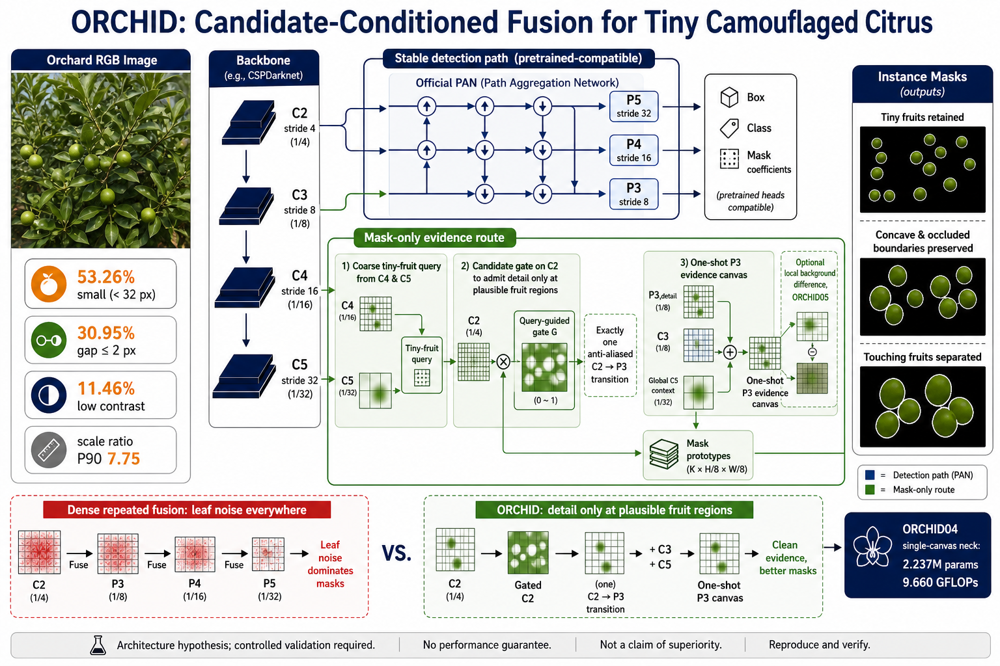

# ORCHID：面向超小、绿色伪装柑橘的候选区域条件化融合

## 结论先行

Light 系列暴露的核心问题不是“某个轻量模块不够强”，而是原有研究路线仍把跨尺度信息在整幅特征图上反复融合，然后让同一份融合结果同时承担检测、分类和掩膜任务。对本数据而言，P2 中绝大部分高频纹理来自叶缘、枝条和光斑，而非果实；把这些信号无条件灌入所有位置，理论上会提高召回候选，也会同步增加假阳性和掩膜噪声。

ORCHID 因此改变信息流，而非再替换一个 C3k2 或注意力模块：

1. 框和分类保留已经验证较稳的官方 PAN 路径。
2. 掩膜原型绕开共享颈部，从原始 C2/C3/C4/C5 建立独立证据路径。
3. 由 C4/C5 语义产生低分辨率候选查询，只有候选区域的 P2 细节可以进入掩膜原型。
4. 另设一个激进对照 ORCHID04，完全移除 PAN，将全部尺度一次性汇聚到 P3 画布，再以小残差生成 P4/P5。

这是一个待实验验证的结构假设，不是对涨点的保证。



## 为什么 Light/G0830 没有解决问题

当前可比结果给出的信号如下。

| 模型 | Mask AP50-95 | Mask AP50 | P | R | Params | GFLOPs | 结论 |
|---|---:|---:|---:|---:|---:|---:|---|
| G0830-G00 官方对照 | 0.67031 | 0.83250 | 0.91066 | 0.75790 | 2.877M | 10.529G | 当前稳定锚点 |
| G0830-G02 双分辨率交换 | 0.67241 | 0.82051 | 0.90839 | 0.74207 | 3.003M | 11.596G | AP5095 +0.21 点，但 AP50/召回下降且训练约慢 2.3 倍 |
| G0830-G03 频率颈部 | 0.65631 | — | — | — | — | — | 明确负收益，拒绝 |
| G0830-G04 深层 RepMixer | 0.66515 | — | — | — | — | — | 比 G03 恢复，但仍低于官方锚点 |
| T04 LSKA+拓扑头 | 0.67367 | 0.82957 | 0.90625 | 0.75643 | 2.965M | 10.957G | 当前 nano 级 AP5095 最好，但含额外损失，结构与损失效应未分离 |
| T05 轻量头 | 0.66526 | 0.82070 | 0.93468 | 0.74337 | 2.788M | 9.619G | 精度高、召回下降；可作速度分支，不适合作为唯一主模型 |

同时，历史高分在统一协议重测后普遍回落：G10 从 0.67681 回落至 T02 的 0.67115，F14 从 0.67599 回落至 T01 的 0.66919。这说明旧结果中的一部分优势来自数据/协议/超参数差异，不能继续用“旧模块有效”作为新堆叠的理由。

本地尚未同步 Light 的完整 `results.csv`，因此本报告不伪造 Light 数字；只将用户已确认的“训练慢且效果差”作为外部观察。ORCHID 的结构决策主要由已落盘的 G0830/T/历史 126 组结果和数据审计驱动。

## 数据证据与设计约束

清洗数据审计包含 965 张图像、5,890 个实例。关键比例是：

| 数据现象 | 比例/统计 | 对融合的约束 |
|---|---:|---|
| COCO-small 实例 | 53.26% | 必须保留浅层细节，但不能对全图永久启用重型 P2 头 |
| 最短边 <16 px | 17.39% | 候选查询必须在下采样前控制高分辨率证据 |
| 最短边 <8 px | 3.26% | 不能承诺全部可检出；需单独报告 APtiny/召回 |
| solidity <0.85 | 17.61% | 掩膜需保留条带遮挡形成的凹口，而非只优化凸边缘 |
| 最近实例间隙 <=2 px | 30.95% | 共享边缘增强可能导致粘连，掩膜证据应与检测证据分流 |
| 邻域 Lab ΔE <10 | 11.46% | 不能主要依赖绿色；需要候选与局部背景的差异证据 |
| 弱边界梯度 | 6.89% | 单纯高通/边缘模块不是充分方案 |
| 单图尺度比 P90 | 7.75 | 每张图需要位置相关的尺度选择，固定融合权重不合理 |

## 系统检索方法

检索日期为 2026-09-01。检索主题包括：`small object sparse high-resolution query`、`masked attention instance segmentation`、`instance activation real-time segmentation`、`camouflaged instance segmentation de-camouflaging`、`task-aware feature fusion`、`single-level instance segmentation`。优先采用 CVF/OpenReview 原论文和作者官方 GitHub；博客只用于发现关键词，不作为方法依据。

### 直接支撑 ORCHID 的论文与开源代码

| 工作 | 顶会/年份 | 可复用原则 | ORCHID 中的对应设计 | 官方代码 |
|---|---|---|---|---|
| [QueryDet](https://openaccess.thecvf.com/content/CVPR2022/html/Yang_QueryDet_Cascaded_Sparse_Query_for_Accelerating_High-Resolution_Small_Object_Detection_CVPR_2022_paper.html) | CVPR 2022 | 低分辨率先定位，高分辨率只在候选处计算；COCO APs +2.0 | C4/C5 生成查询，控制 P2 细节进入原型 | [QueryDet](https://github.com/ChenhongyiYang/QueryDet-PyTorch) |
| [Mask2Former](https://openaccess.thecvf.com/content/CVPR2022/papers/Cheng_Masked-Attention_Mask_Transformer_for_Universal_Image_Segmentation_CVPR_2022_paper.pdf) | CVPR 2022 | 特征交互限制在预测掩膜区域，避免全背景注意 | 候选区域条件化而非全图密集融合 | [Mask2Former](https://github.com/facebookresearch/Mask2Former) |
| [SparseInst](https://openaccess.thecvf.com/content/CVPR2022/html/Cheng_Sparse_Instance_Activation_for_Real-Time_Instance_Segmentation_CVPR_2022_paper.html) | CVPR 2022 | 实例激活图聚合有效像素；单层预测可兼顾速度 | 掩膜证据独立聚合，避免所有任务共用一个颈部 | [SparseInst](https://github.com/hustvl/SparseInst) |
| [FastInst](https://openaccess.thecvf.com/content/CVPR2023/html/He_FastInst_A_Simple_Query-Based_Model_for_Real-Time_Instance_Segmentation_CVPR_2023_paper.html) | CVPR 2023 | 实例激活引导查询、双路径更新和轻量像素解码器 | 语义查询与像素证据分路，保留轻量实现 | [FastInst](https://github.com/junjiehe96/FastInst) |
| [DCNet](https://openaccess.thecvf.com/content/CVPR2023/html/Luo_Camouflaged_Instance_Segmentation_via_Explicit_De-Camouflaging_CVPR_2023_paper.html) | CVPR 2023 Highlight | 像素级伪装解耦与实例级背景抑制；论文报告两个 CIS 基准平均 AP 提升超过 5% | ORCHID05 在候选内做特征与局部背景参考差分 | [DCNet](https://github.com/USTCL/DCNet) |
| [BlendMask](https://openaccess.thecvf.com/content_CVPR_2020/html/Chen_BlendMask_Top-Down_Meets_Bottom-Up_for_Instance_Segmentation_CVPR_2020_paper.html) | CVPR 2020 | 实例级信息与低层细粒度语义分开生成再混合 | PAN 检测特征与原始 P2 掩膜细节晚期融合 | 代码并入 AdelaiDet |
| [TOOD](https://openaccess.thecvf.com/content/ICCV2021/html/Feng_TOOD_Task-Aligned_One-Stage_Object_Detection_ICCV_2021_paper.html) | ICCV 2021 | 不同预测任务需要交互但也需要任务特异性 | 不再强迫框/类/掩膜完全共享融合特征 | [TOOD](https://github.com/fcjian/TOOD) |

已逐文件阅读而非只看 README 的本地代码版本：

| 仓库 | 本地路径 | Commit |
|---|---|---|
| QueryDet | `C:\Users\33836\Desktop\github\QueryDet-PyTorch` | `feebf21` |
| SparseInst | `C:\Users\33836\Desktop\github\SparseInst` | `a899015` |
| DCNet | `C:\Users\33836\Desktop\github\DCNet` | `f3c9098` |
| FastInst | `C:\Users\33836\Desktop\github\FastInst` | `4996a61` |
| RefineMask | `C:\Users\33836\Desktop\github\RefineMask` | `633ed2b` |

没有直接移植这些仓库的 Detectron2/CUDA/Transformer 大模块。移植的是经论文验证的计算原则，并保留 YOLO YAML、损失和预训练入口，以减少工程混杂变量。

## ORCHID 信息流

### 稳妥主线：检测与掩膜分流

```text
RGB -> YOLO11 backbone -> C2/C3/C4/C5 ----------------------------+
                         |                                         |
                         +-> official PAN -> P3/P4/P5 -> box/class/mask coefficients
                         |
                         +-> C4/C5 coarse semantic query
                                  |
                         C2 detail x candidate gate
                                  |
                         one anti-aliased C2->P3 transition
                                  |
                     + raw C3 semantics + global C5 context
                                  |
                         mask-only P3 evidence -> prototype masks
```

关键性质：

- 检测路径和官方权重兼容，不让实验性 P2 噪声直接破坏框/分类。
- 查询不是一个“挂在旁边的辅助头”，而是实际控制 P2 信息能否进入掩膜原型，因此查询损失具有因果作用。
- P2 上只做 1x1 投影和门控，3x3 空间混合移动到 P3；避免 Light 的高分辨率计算拖慢。
- ORCHID05 的局部背景差分只作用于掩膜证据，不会把叶片边缘注入检测分支。

### 激进对照：单画布颈部

ORCHID04 移除完整 PAN。C2/C3/C4/C5 只在 P3 画布汇聚一次，再由 P3 小残差生成 P4/P5。它回答的是一个明确问题：当前数据是否根本不需要反复 top-down/bottom-up 融合。该模型为 2.237M 参数、9.660 GFLOPs，是系列中最轻的结构候选，但风险也最高，因为新颈部无法完整继承 PAN 权重。

## 七个可证伪实验

| 编号 | 只改变什么 | 预期支持信号 | 否定条件 |
|---|---|---|---|
| ORCHID00 | 不改变 | 配对控制 | 仅按需运行 |
| ORCHID01 | 检测/掩膜特征分流 | Mask AP5095 上升、Box/Mask P/R 不恶化 | AP5095 不升或速度损失不值 |
| ORCHID02 | 加入无显式标签的候选门控 | 小目标召回优于 O01 | 查询塌缩、召回下降 |
| ORCHID03 | 给候选门控加 0.10 query loss | APtiny/召回优于 O02 | 只提高训练损失稳定性、不提高验证指标 |
| ORCHID04 | PAN 改为单画布颈部 | 精度接近 G00 且 Params/GFLOPs 明显下降 | AP5095 下降 >0.5 点 |
| ORCHID05 | 候选内局部背景差分 | camouflage 子集 AP、P、误检改善 | 普通/小目标指标下降或只增强叶缘 |
| ORCHID06 | O03 的轻量预测塔 | 保持 O03 大部分精度且更快 | 复制 T05 的高 P/低 R 行为 |

筛选晋级标准不是“看总 mAP 排名”而已：

1. 主方法相对同协议 G00 的 Mask AP50-95 至少提升 0.5 个百分点，且三种子后仍成立。
2. APsmall/APtiny、召回、camouflage 子集 AP 至少两项改善。
3. touching/near-gap 子集的 split/merge 错误不能恶化。
4. Params 不超过 3.1M、GFLOPs 不超过 12.5G；最终用服务器 GPU 实测 latency。
5. PR 曲线末端置零本身是阈值降至极低时假阳性累积的正常终点，不能以“曲线不触零”为目标；应比较同召回率下的精度、F1 最优点、AP 面积和假阳性来源。

## 已完成验证

- 7/7 YAML 经 `YOLO(yaml, task="segment")` 构建和前向通过。
- 7/7 YAML 经 `YOLO(yaml).load(yolo11n-seg.pt)` 权重兼容测试通过。
- ORCHID03 的 query loss 完整反向传播至实际门控。
- ORCHID05 的 contrast loss 完整反向传播至局部参考分支。
- ORCHID04 的单画布查询、P2 路由、P4/P5 分发均有首步梯度。
- 新测试 19 项全通过；Light/G0830 回归测试 38 项全通过。
- 新文件 Ruff 检查通过。仓库旧模块仍有既存 unused-import 债务，本次未扩大范围清理。

## 复杂度实测

| 模型 | Params | GFLOPs @640 | 本机 CPU 单线程前向（仅相对参考） |
|---|---:|---:|---:|
| ORCHID00 | 2.877M | 10.529 | 163.1 ms |
| ORCHID01 | 2.902M | 10.805 | 175.5 ms |
| ORCHID02/03 | 2.902M | 10.805 | 约 176.2 ms |
| ORCHID04 | 2.237M | 9.660 | 159.4 ms |
| ORCHID05 | 2.904M | 10.826 | 182.7 ms |
| ORCHID06 | 2.741M | 9.894 | 164.4 ms |

CPU 时间受算子实现影响，不能代替服务器 GPU latency。最终论文必须统一 batch=1、warm-up、同步 CUDA 后重新测量。

## 决策顺序

先跑 3 epoch 的 ORCHID03 与 ORCHID04 烟雾测试。通过后用 50 epoch 依次跑 ORCHID01--05。只有 50 epoch 同时改善 AP5095、APsmall/APtiny 或 camouflage 指标的模型，才进入 300 epoch。不要再次一次性把全部未经筛选结构跑 300 epoch。
