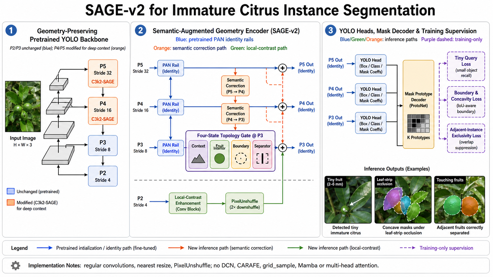

# SAGE-v2：面向未成熟柑橘实例分割的结构重构

_结果驱动的网络设计、文献证据与消融计划 · 2026-09-02_

---

## 摘要

SAGE-v2 不是注意力模块堆叠，也不是把一个卷积块反复换名字。它依据现有同协议实验的负面结果，围绕
四个可量化难点重构网络：超小果实、绿色果实与叶片伪装、条带状遮挡造成的凹形可见掩膜，以及相邻果实
的粘连与分裂冲突。新方案在 P4/P5 主干中加入可继承预训练权重的上下文残差；以相邻尺度、残差式拓扑
金字塔修正 P3/P4/P5；让同一张四状态图同时约束候选区域、可见边界与实例分隔；检测、分类、掩膜系数
和原型分支均接收修正后的特征。为避免重现 Light 与频率颈部的速度问题，热路径仅使用常规卷积、低分辨率
重参数化空间混合、最近邻缩放、PixelUnshuffle 和逐元素运算。SAGE14 是保守的主精度候选，SAGE16 是
删除 PAN 的轻量结构对照。模型是否涨点仍须由固定协议训练验证，本文档不预先承诺精度提升。

**关键词：** 柑橘实例分割，小目标，伪装目标，拓扑监督，渐进融合，轻量网络

---

## 📋 问题定义与结果证据

### 当前任务不是普通小目标检测

现有数据审计表明，在 640 输入下，约 34.9%--40.5% 的实例至少一边小于 32 像素，约 11.3%--12.8%
小于 16 像素；47%--58.5% 的图像包含邻近或接触实例，约 24% 的实例 `solidity < 0.90`。因此需要同时
保护微小几何、利用高层语义抑制叶片误检，并在遮挡下保留一个实例的凹形可见掩膜、在接触处又能分开
两个实例。

### 已完成实验给出的约束

| 证据 | Mask mAP50-95 | Mask AP50 | 结论 |
| --- | ---: | ---: | --- |
| G00 固定协议基线 | 0.67031 | 0.83250 | 当前因果比较锚点 |
| T04 当前最好结果 | 0.67367 | — | 提升仅 0.336 个百分点，且损失设置有混杂 |
| G02 双边主干 | 0.67241 | 下降 | 高分辨率常驻支路收益不足以抵消代价 |
| G03 频率颈部 | 0.65631 | — | 频率/动态融合在本任务上明显负迁移且训练慢 |
| G04 深层 RepMixer | 0.66515 | — | 单独替换深层模块不足以形成有效方法 |

这些结果否定了三个方向：完整 P2 检测头、昂贵的动态重采样、以及无任务监督的注意力堆叠。它们支持的
保守信号只有两个：深层上下文可能有小幅价值；融合必须保留官方预训练路径，并由边界和分隔任务直接监督。

> 📌 **核心判断：** PR 曲线末端在 `recall=1` 处落到零包含评估绘图的哨兵点，不能靠删点修复。真正要优化
> 的是跳崖前的最大有效召回、低置信度叶片假阳性和相邻实例的 split/merge error。

---

## 📚 文献检索与迁移边界

用户提供的 Awesome 仓库主要汇总图像恢复、超分辨率、去噪和低照度增强等低层视觉论文，而不是完整的
CVPR 检测/分割目录。它适合提供“细节选择与重建”的启发，但不能把恢复模块直接当作实例分割贡献。[^1]

| 工作 | 可迁移证据 | SAGE-v2 决策 |
| --- | --- | --- |
| RepViT | 低延迟移动 CNN 采用结构重参数化深度卷积和通道混合[^2] | 仅在低分辨率 P4/P5 使用同类空间/通道残差 |
| PIDNet | PagFM 用局部与上下文相似度选择语义注入[^3] | 迁移为相邻尺度一通道相似度融合 |
| QueryDet | 稀疏候选查询减少高分辨率小目标计算[^4] | 迁移候选热图监督，不引入额外 P2 检测塔 |
| Mask Transfiner | 重点细化错误与不确定边界区域[^5] | 迁移边界监督，不复制 Transformer 解码器 |
| RefineMask | 多阶段细粒度特征改善掩膜边界[^6] | 迁移“边界需浅层细节”的原则 |
| FaPN | 对齐后融合可缓解上下采样特征错位[^7] | 使用常规卷积的相邻尺度校正，拒绝 DCN 依赖 |
| FreqFusion | 自适应低/高通核和重采样改善密集预测融合[^8] | 因 G03 与算子速度证据而拒绝直接移植 |
| BCNet | 双层建模显式区分遮挡关系[^9] | 迁移为可见边界/分隔状态，不做 amodal 分割 |
| Rank & Sort | 联合排序分类置信度与定位质量[^10] | 作为后续独立损失实验，不与首轮结构筛选混用 |
| CAMixerSR | 只对复杂区域分配更强计算[^11] | 保留稀疏处理思想，拒绝窗口重排与动态形变热路径 |

完整仓库提交号、检索范围和拒绝理由记录在
[`sources/SAGE_V2_LITERATURE_AUDIT_20260902.md`](sources/SAGE_V2_LITERATURE_AUDIT_20260902.md)。

---

## 🔬 SAGE-v2 网络架构

### 结构总览

```mermaid
flowchart LR
    accTitle: SAGE V2 Architecture Flow
    accDescr: Citrus images pass through a pretrained-compatible backbone, residual topology pyramid, and shared segmentation head while topology targets directly supervise feature fusion.

    image([📥 RGB citrus image]) --> shallow[🔍 Official P2/P3 geometry]
    shallow --> deep[🧠 SAGE P4/P5 context]
    deep --> pan[🔄 Pretrained PAN identity]
    shallow --> pyramid[⚙️ Topology pyramid]
    deep --> pyramid
    pan --> pyramid
    pyramid --> features[📊 Corrected P3/P4/P5]
    pyramid --> topology[📝 Four-state topology]
    features --> segment[🎯 Shared Segment head]
    topology --> segment
    segment --> output([✅ Boxes and masks])

    classDef input_style fill:#f3f4f6,stroke:#6b7280,stroke-width:2px,color:#1f2937
    classDef process_style fill:#dbeafe,stroke:#2563eb,stroke-width:2px,color:#1e3a5f
    classDef evidence_style fill:#ede9fe,stroke:#7c3aed,stroke-width:2px,color:#3b0764
    classDef output_style fill:#dcfce7,stroke:#16a34a,stroke-width:2px,color:#14532d

    class image input_style
    class shallow,deep,pan,pyramid,features process_style
    class topology evidence_style
    class segment,output output_style
```

_Figure 1: SAGE-v2 publication-style architecture; P2 supplies detail evidence but is not an additional prediction head._

### 主干：只重构需要上下文的深层阶段

`C3k2SAGE` 继承官方 `C3k2`，因此原权重键和张量形状继续可用。新增路径在 P4/P5 执行
`RepVGGDW -> 1x1 channel mixer -> bounded residual`。这样改变了主干的特征提取计算，而不是在主干末端
外挂注意力；同时避免在 P2/P3 上重复深度卷积导致训练变慢。初始残差尺度为 `0.1`，让模型先从官方
解附近开始学习。

### 颈部：从固定 PAN 改为任务监督的残差金字塔

`CitrusSAGEPyramid` 有两种模式。保守模式保留完整官方 PAN 作为恒等基座，并用 P5→P4→P3 的相邻尺度
路径产生小残差；激进模式完全替换 PAN，用于检验传统往返金字塔是否必要。P2 通过
`PixelUnshuffle(2)` 无平均损失地进入 P3，但不会形成一个持续计算的高分辨率分支。

四状态拓扑图分别表示 context、interior、boundary 和 separator。它不是普通空间注意力：同一张图既控制
语义与几何证据的进入，又由像素级任务损失监督，因此每个门控通道都有明确的柑橘任务含义。

### 头部：共享解码器而不是多头堆叠

`SegmentCitrusSAGEV2` 保留 Ultralytics `Segment` 的检测塔、分类塔、掩膜系数和原型形状，方便加载官方
权重。额外输出只复用颈部的四状态拓扑图，派生 `citrus_topology`、`citrus_query` 和
`citrus_boundary`，避免为三个辅助任务各建一套网络。

### 损失：先共享监督，再测试遮挡与粘连

SAGE13/14/16 使用固定权重的共享监督：`topology=0.10`、`boundary=0.10`、`query=0.03`。SAGE15 再加入
`concavity=0.03` 与 `exclusive=0.02`，分别关注深凹可见掩膜和相邻实例分隔。所有权重均写入批量脚本，
不会藏在 YAML 或服务器命令里。结构筛选阶段不同时改 AMP、优化器、图像尺寸、增强和 dropout。

---

## 📊 消融模型与工程审计

| 模型 | 唯一主要变量 | Params | GFLOPs | 预训练覆盖 | 角色 |
| --- | --- | ---: | ---: | ---: | --- |
| SAGE10 | 官方对照 | 2.877M | 10.529 | 100.00% | 配对基线 |
| SAGE11 | 深层主干 | 2.984M | 10.679 | 96.42% | 主干因果消融 |
| SAGE12 | 残差金字塔 | 2.940M | 10.938 | 97.85% | 结构因果消融 |
| SAGE13 | SAGE12 + 共享监督 | 2.940M | 10.938 | 97.85% | 监督因果消融 |
| SAGE14 | 主干 + 残差金字塔 | 3.047M | 11.087 | 94.42% | 主精度候选 |
| SAGE15 | SAGE14 + 完整任务损失 | 3.047M | 11.087 | 94.42% | 遮挡/粘连候选 |
| SAGE16 | 完全替换 PAN | 2.237M | 9.555 | 93.11% | 主轻量候选 |
| SAGE17 | 主干 + 替换 PAN | 2.344M | 9.704 | 88.86% | 激进交互对照 |

本地 256 输入、batch 1 的完整 CPU 前向/反向中位时间比为：SAGE11 `1.092x`、SAGE12 `1.180x`、
SAGE14 `1.216x`、SAGE16 `0.972x`。这只能排除明显的 Python/算子灾难，不能替代服务器 GPU 实测。
全部 8 个 V2 YAML 已通过标准模型构建和前向；SAGE15 已通过真实组合损失反向，梯度到达深层主干、
金字塔输出和拓扑预测器；测试集共 `31 passed`。

---

## 🎯 判定标准与下一步

### 50 轮筛选门槛

只有同时满足以下条件的模型才进入 300 轮：

1. Mask mAP50-95 高于同协议 SAGE10，而不是高于旧数据上的历史结果
2. AP-tiny、最大有效 recall 或 camouflage subset AP 至少有一项稳定改善
3. 叶片假阳性与 split/merge error 不恶化
4. 目标 GPU 完整 step 耗时不超过配对基线 `1.20x`
5. 参数量和 GFLOPs 保持 nano 级别

### 论文所需指标

最终应报告 Mask mAP50-95、Mask AP50、precision、recall、AP-tiny/AP-small/AP-medium/AP-large、Params、
GFLOPs、目标硬件 latency，以及 camouflage、deep-concavity、touching-instance 子集结果。主方法和基线使用
种子 42、43、44 报告均值与标准差，并加入边界 F1、split/merge error 和最大有效 recall。

> ⚠️ **研究边界：** 当前只完成代码可行性、复杂度和梯度验证，没有在服务器完成 SAGE-v2 的 50/300 轮
> 训练。因此“高于基线”仍是假设，不能把设计合理性写成实验结论。

---

## 🔗 参考文献

[^1]: Kobaayyy. "Awesome CVPR Low-Level Vision." _GitHub_. https://github.com/Kobaayyy/Awesome-CVPR2026-CVPR2025-CVPR2024-CVPR2021-CVPR2020-Low-Level-Vision

[^2]: Wang et al. (2024). "RepViT: Revisiting Mobile CNN From ViT Perspective." _CVPR_. https://openaccess.thecvf.com/content/CVPR2024/html/Wang_RepViT_Revisiting_Mobile_CNN_From_ViT_Perspective_CVPR_2024_paper.html

[^3]: Xu et al. (2023). "PIDNet: A Real-Time Semantic Segmentation Network Inspired by PID Controllers." _CVPR_. https://openaccess.thecvf.com/content/CVPR2023/html/Xu_PIDNet_A_Real-Time_Semantic_Segmentation_Network_Inspired_by_PID_Controllers_CVPR_2023_paper.html

[^4]: Yang et al. (2022). "QueryDet: Cascaded Sparse Query for Accelerating High-Resolution Small Object Detection." _CVPR_. https://openaccess.thecvf.com/content/CVPR2022/html/Yang_QueryDet_Cascaded_Sparse_Query_for_Accelerating_High-Resolution_Small_Object_Detection_CVPR_2022_paper.html

[^5]: Ke et al. (2022). "Mask Transfiner for High-Quality Instance Segmentation." _CVPR_. https://openaccess.thecvf.com/content/CVPR2022/html/Ke_Mask_Transfiner_for_High-Quality_Instance_Segmentation_CVPR_2022_paper.html

[^6]: Zhang et al. (2021). "RefineMask: Towards High-Quality Instance Segmentation With Fine-Grained Features." _CVPR_. https://openaccess.thecvf.com/content/CVPR2021/html/Zhang_RefineMask_Towards_High-Quality_Instance_Segmentation_With_Fine-Grained_Features_CVPR_2021_paper.html

[^7]: Huang et al. (2021). "FaPN: Feature-Aligned Pyramid Network for Dense Image Prediction." _ICCV_. https://openaccess.thecvf.com/content/ICCV2021/html/Huang_FaPN_Feature-Aligned_Pyramid_Network_for_Dense_Image_Prediction_ICCV_2021_paper.html

[^8]: Chen et al. (2024). "FreqFusion: Frequency-Aware Feature Fusion for Dense Image Prediction." _arXiv_. https://arxiv.org/abs/2408.12879

[^9]: Ke et al. (2021). "Deep Occlusion-Aware Instance Segmentation With Overlapping BiLayers." _CVPR_. https://openaccess.thecvf.com/content/CVPR2021/html/Ke_Deep_Occlusion-Aware_Instance_Segmentation_With_Overlapping_BiLayers_CVPR_2021_paper.html

[^10]: Oksuz et al. (2021). "Rank & Sort Loss for Object Detection and Instance Segmentation." _ICCV_. https://openaccess.thecvf.com/content/ICCV2021/html/Oksuz_Rank__Sort_Loss_for_Object_Detection_and_Instance_Segmentation_ICCV_2021_paper.html

[^11]: Wang et al. (2024). "CAMixerSR: Only Details Need More Attention." _CVPR_. https://openaccess.thecvf.com/content/CVPR2024/papers/Wang_CAMixerSR_Only_Details_Need_More_Attention_CVPR_2024_paper.pdf

---

_Last updated: 2026-09-02_
