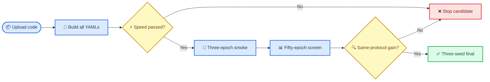

# 如何在服务器筛选 SAGE-v2

_预计首轮 3 个模型 × 3 epochs · 难度：中等 · 最后验证：2026-09-02_

---

## 📋 运行结论

当前不要直接批量训练七个模型 300 轮。先构建全部模型，再对 SAGE14 和 SAGE16 做目标 GPU 速度门禁，
然后只运行 SAGE11、SAGE14、SAGE16 三个 3 轮冒烟模型。冒烟成功后运行五模型 50 轮结构筛选；只有
超过同协议对照且速度合格的模型，才进入 300 轮三种子实验。



---

## 📋 前置条件

| 项目 | 要求 | 检查命令 |
| --- | --- | --- |
| 工作目录 | 当前 fork 根目录 | `pwd` |
| Python | 项目现有环境 | `python --version` |
| PyTorch CUDA | 可识别 GPU | `python -c "import torch; print(torch.cuda.is_available())"` |
| 权重 | `yolo11n-seg.pt` | `ls -lh yolo11n-seg.pt` |
| 数据 | 你指定的新数据 YAML | `ls -lh /你的路径/data.yaml` |

所有命令都在服务器代码根目录执行：

```bash
cd /data/sxq/code/ultralytics-main-new
pip install -e .
```

> 📌 **数据路径规则：** 脚本不替你选择或修改数据集。`--data` 后写你服务器上已确认的新清洗数据
> `data.yaml`；各实验只记录该路径和快照。

---

## 🔧 第一步：构建全部 SAGE-v2

```bash
python -u 20260902_citrus_sage_batch.py \
  --data /data/sxq/datasets/orange_yolo/data.yaml \
  --suite all \
  --dry-run
```

预期看到 SAGE11--17 各一行 `BUILD OK`。这一步不训练，也不占用长时间 GPU。

---

## ⚡ 第二步：检查目标 GPU 速度

确保该卡没有其他训练任务后，分别检查主精度候选和轻量候选：

```bash
python -u benchmark_citrus_sage.py \
  --model SAGE14_joint_core.yaml \
  --device 0 --imgsz 640 --batch 2 --warmup 10 --iterations 30 \
  --max-ratio 1.20

python -u benchmark_citrus_sage.py \
  --model SAGE16_replace_neck.yaml \
  --device 0 --imgsz 640 --batch 2 --warmup 10 --iterations 30 \
  --max-ratio 1.20
```

预期输出包含 `SPEED GATE PASSED`。若失败，不要直接开始 300 轮；先用 `nvidia-smi` 检查进程、利用率、
功耗与温度。不要在同一张卡上并发启动两个训练程序，即使显存没有满，算力、CPU worker 和磁盘读取仍会
互相争抢。

---

## 🧪 第三步：三轮冒烟

```bash
nohup python -u 20260902_citrus_sage_batch.py \
  --data /data/sxq/datasets/orange_yolo/data.yaml \
  --suite smoke \
  --epochs 3 \
  --device 0 \
  --project /data/sxq/results/SAGE/CITRUS_SAGE_V2_SMOKE_3EP \
  > sage_v2_smoke_3ep.log 2>&1 &
```

该队列按 SAGE11、SAGE14、SAGE16 顺序运行。查看日志：

```bash
tail -n 100 -f sage_v2_smoke_3ep.log
```

通过条件：三个模型均能完成训练与验证，没有 NaN、CUDA error、显存泄漏或第二个模型异常变慢。

---

## 📊 第四步：五模型 50 轮筛选

```bash
nohup python -u 20260902_citrus_sage_batch.py \
  --data /data/sxq/datasets/orange_yolo/data.yaml \
  --suite screen \
  --epochs 50 \
  --device 0 \
  --project /data/sxq/results/SAGE/CITRUS_SAGE_V2_SCREEN_50EP \
  > sage_v2_screen_50ep.log 2>&1 &
```

筛选顺序为 SAGE11、SAGE12、SAGE13、SAGE14、SAGE16。它回答四个独立问题：主干是否有效、残差融合
是否有效、拓扑监督是否有效、二者联合是否有效、删除 PAN 是否更轻且不掉点。

查看训练和进程：

```bash
tail -n 120 -f sage_v2_screen_50ep.log
ps -ef | grep 20260902_citrus_sage_batch.py | grep -v grep
nvidia-smi
```

---

## 🎯 第五步：只训练胜出模型 300 轮

假设 50 轮后 SAGE14 胜出，运行三种子正式实验：

```bash
nohup python -u 20260902_citrus_sage_batch.py \
  --data /data/sxq/datasets/orange_yolo/data.yaml \
  --suite final \
  --only SAGE14_joint_core \
  --epochs 300 \
  --seeds 42,43,44 \
  --device 0 \
  --project /data/sxq/results/SAGE/CITRUS_SAGE_V2_FINAL_300EP \
  > sage_v2_final_300ep.log 2>&1 &
```

如果 SAGE15 需要检验完整任务损失，将 `--only` 改为 `SAGE15_full_task_loss`。不要同时改 AMP、batch、
优化器或数据划分。

---

## ✅ 固定协议

脚本从 `protocols/citrus_paper1_formal_v1.yaml` 读取训练配置。关键值为：`imgsz=640`、`batch=16`、
`workers=4`、`AdamW`、`lr0=0.001`、`dropout=0.0`、`amp=false`、`seed=42`。若服务器显存不足，不要只
给某个模型改 batch 后放进同一主表；应把这种运行标记为协议偏离并重新配对基线。

> ⚠️ **AMP 规则：** 正式协议当前固定 `amp=false`。如果要验证 `amp=true`，使用同一数据、基线和全部
> 候选进行单独的配对审计，不与 `amp=false` 结果混表。

---

## 🔧 常见问题

### 日志提示文件不存在

确认当前路径和文件是否存在：

```bash
pwd
ls -lh 20260902_citrus_sage_batch.py benchmark_citrus_sage.py
```

### 训练异常缓慢但显存未满

显存占用不代表 GPU 计算单元空闲。先检查同卡进程、GPU 利用率、功耗和 CPU/磁盘负载：

```bash
nvidia-smi
top
```

若同卡有多个训练，终止自己刚启动的任务：

```bash
ps -ef | grep 20260902_citrus_sage_batch.py | grep -v grep
kill -TERM <PID>
```

### 已有结果目录导致拒绝覆盖

这是预期保护。换一个新的 `--project` 名称；不要删除或覆盖已完成实验。如果只想跳过完整模型，可加入
`--skip-completed`。

---

_Last verified: 2026-09-02 on local Windows CPU; target CUDA timing must be verified on the training server._
