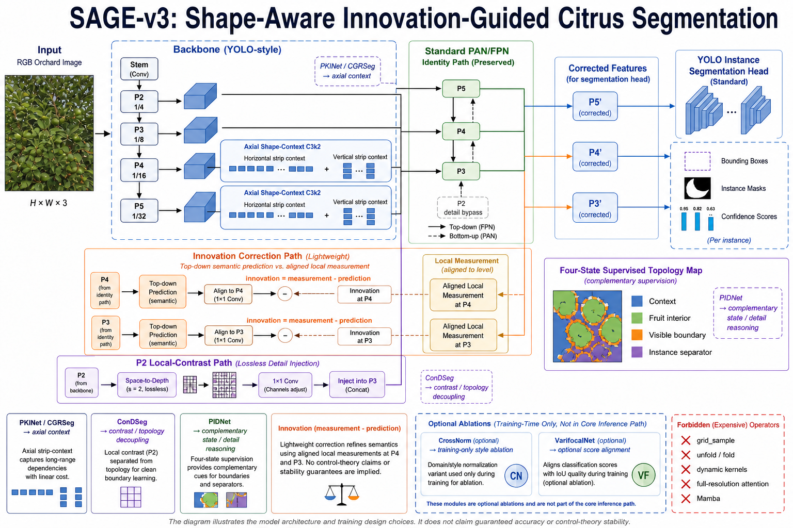
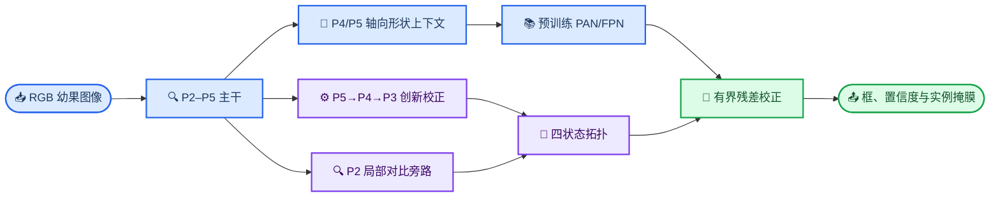

# SAGE-v3：面向绿色幼果伪装与遮挡拓扑的形状—创新分割网络

_设计状态：代码与 YAML 已实现，尚未获得训练精度结论 · 2026-09-02_

---

## 结论先行

SAGE-v3 不是把多个注意力模块叠加到 YOLO11 上，而是围绕三个可测量失败模式重构信息流：P4/P5
主干负责长轴形状与上下文，轻量旁路逐级计算“局部测量与语义预测的差异”，P2 只提供局部对比细节，
最后用同一张四状态拓扑图区分背景、果实内部、可见边界和相邻实例分隔。原始 PAN/FPN 保留为预训练
恒等路径，新结构只做小幅残差纠正。该设计避免了 Light 系列中动态采样、多级深度卷积和碎片化算子导致
的极慢训练。

当前只能声称代码可运行、计算量受控、因果消融完整；不能声称一定涨点。服务器 50 epoch 筛选结果是
判断方法有效性的唯一依据。

## 任务问题与结构对应

| 当前痛点 | 失败机制 | SAGE-v3 对应改变 |
| --- | --- | --- |
| 超小幼果召回低 | P2 细节下采样后消失，浅层又缺语义 | P2 局部对比经 PixelUnshuffle 无损进入 P3，但不新增昂贵 P2 检测头 |
| 绿色幼果与叶片颜色混淆 | 网络过度依赖颜色和局部纹理 | P4/P5 轴向形状上下文；SAGE24 额外验证训练期风格统计交换 |
| 条带状枝叶遮挡 | 可见区域深凹，局部圆形/纹理证据被切断 | 横向与纵向上下文在低分辨率主干恢复跨遮挡关联 |
| 遮挡保持与相邻果分离冲突 | 普通二值边界无法区分凹边与实例间隙 | 四状态拓扑把 visible boundary 与 instance separator 分开监督 |
| PR 曲线高召回端跳崖 | 低质量候选获得过高排序分数 | SAGE25 单独验证 Varifocal 质量对齐，不污染结构消融 |

## 架构

### 1. 轴向形状上下文主干

`C3k2SAGEShape` 继承官方 `C3k2`，所以主路径参数名和形状保持兼容。它只替换 P4/P5 两个低分辨率
阶段。附加路径先降维，再用一个 3×3 depthwise 局部测量和一对 `1×k`、`k×1` 轴向卷积得到形状
上下文门，最后以 `tanh(scale)` 控制的小残差注入。SAGE23 使用 `k=11`，SAGE27 使用较窄的 `k=9`
探索项。

这里借鉴的是 PKINet/CGRSeg 的“轴向上下文有助于空间重建”思想，而不是复制 PKINet 的五核链或
CGRSeg 的完整解码器。这样既针对枝叶条带遮挡，也把额外空间计算限制在 stride 16/32。

### 2. 创新校正融合颈部

对层级 `l∈{P4,P3}`，上一级语义状态给出预测，当前主干特征是局部测量：

\[
\hat S_l=\operatorname{Resize}(W_l S_{l+1}),\qquad
E_l=M_l-\hat S_l,\qquad
D_l=M_l-\operatorname{AvgPool}_{3\times3}(M_l).
\]

`E_l` 表示跨尺度预测尚未解释的内容，`D_l` 表示局部形状/边界变化。新状态为：

\[
S_l=\hat S_l+\tanh(\alpha_l)\,\operatorname{Conv}_{3\times3}
([\hat S_l,E_l,D_l]).
\]

这是一张前馈计算图，不是循环神经网络，也不宣称经典控制系统稳定性。原 PAN 输出 `P_l` 始终存在，
最终只接受有界修正：

\[
P'_l=P_l+\tanh(\beta_l)\,G_l(T)\odot W_oS_l.
\]

因此 SAGE21 可以单独检验融合拓扑，SAGE23 再检验它与新主干的交互。

### 3. 四状态拓扑监督

P3 语义状态与 P2 局部对比共同预测 `T∈R^{4×H/8×W/8}`：

1. 背景/局部上下文；
2. 果实内部；
3. 可见边界，包括枝叶遮挡形成的凹边；
4. 相邻实例分隔区域。

同一张拓扑图同时导出 tiny-query、boundary 和 topology 训练信号，并控制 P2 细节是否进入最终特征。
这比独立叠加三套注意力塔更轻，也能明确回答“门控到底学到了什么”。

### 4. 两个可选训练消融

- **SAGE24 / CrossNorm 思想：** 仅在 P4 训练期间以 0.2 概率交换 batch 内特征均值/方差，并保留
  50% 原统计。`eval()` 时严格恒等，不增加推理计算。它检验降低绝对绿色外观依赖是否有益。
- **SAGE25 / Varifocal：** 使用 `citrus_vfl=1.0`，让分类排名更关注定位质量。它只回答 PR 排序问题，
  不能被写成主干创新。

## 消融矩阵

| 编号 | 主干 | 融合/头部 | 训练变量 | 要回答的问题 |
| --- | --- | --- | --- | --- |
| SAGE10 | 官方 | 官方 | 固定协议 | 同协议对照；不默认重跑 |
| SAGE20 | 形状上下文 P4/P5 | 官方 PAN + Segment | 官方损失 | 仅改变主干是否有效 |
| SAGE21 | 官方 | 创新校正金字塔 | 官方损失 | 仅改变跨尺度融合是否有效 |
| SAGE22 | 官方 | 创新校正 + 四状态头 | topology/boundary/query | 显式监督是否优于潜在门控 |
| SAGE23 | 形状上下文 P4/P5 | 创新校正 + 四状态头 | 共享拓扑 | 主要联合结构是否互补 |
| SAGE24 | SAGE23 + 训练期统计交换 | 同 SAGE23 | 共享拓扑 | 颜色去依赖是否改善伪装子集 |
| SAGE25 | 同 SAGE23 | 同 SAGE23 | 共享拓扑 + VFL | PR 高召回端是否改善 |
| SAGE26 | 同 SAGE23 | 同 SAGE23 | + concavity/exclusive | 深凹遮挡和贴靠实例损失是否有益 |
| SAGE27 | 较窄形状上下文 | 24 通道创新路径 | 共享拓扑 | 低 FLOPs 是否形成实际速度优势 |

## 已完成的工程证据

以下数值使用单类数据集构建，尚不是精度结果：

| 模型 | Params | GFLOPs@640 | 兼容预训练状态占比 | CPU 256 整步比值 |
| --- | ---: | ---: | ---: | ---: |
| SAGE20 | 2.888M | 10.417 | 98.41% | 1.120× |
| SAGE21/22 | 2.941M | 11.040 | 96.68% | 1.174×（SAGE21） |
| SAGE23–26 | 2.986M | 11.102 | 95.20% | 1.205×（SAGE23） |
| SAGE27 | 2.940M | 10.833 | 96.68% | 1.233× |

CPU 比值是 batch 1、256×256、3 次预热和 8 次 forward/backward 中位数，仅用于发现明显碎片化，不能代替
服务器 GPU 实测。SAGE27 再次说明更少 FLOPs 不保证更快，因此它已从默认 `smoke` 和 `screen` 队列移除。

已通过的本地检查：

- 21 个 SAGE YAML 均可通过标准 `YOLO(yaml)` 构建、前向并加载 `yolo11n-seg.pt`；
- SAGE-v3 联合损失可反传至形状主干、P4/P3 创新单元和拓扑预测器；
- 全部 SAGE 均小于 3.2M 参数和 11.5 GFLOPs；
- 新颈部不含 `grid_sample`、`unfold/fold`、自适应池化、全分辨率注意力或 Mamba。

## 训练决策门

不要一次运行所有模型 300 epoch。正确顺序为：

1. 在空闲目标 GPU 上分别 benchmark SAGE20、SAGE21、SAGE23；SAGE23 若超过基线 1.20×，先停止长训。
2. 对 SAGE20、21、23 做 1–3 epoch smoke，确认无 NaN、吞吐异常或显存持续增长。
3. 50 epoch 默认筛选 SAGE20、21、22、23，保持数据、AMP、优化器和增强完全一致。
4. 只有 SAGE23 同时改善 mask mAP50-95、AP-tiny/伪装子集且速度合格，才继续 SAGE24–26。
5. 最终候选和同协议基线使用 42/43/44 三个种子跑 300 epoch，报告均值与标准差。

一个模型若只提高 mAP50、却降低 mAP50-95、AP-tiny 或显著增加 split/merge error，不应被选作论文主方法。

## 证据边界

论文中可以写“受 PIDNet 的互补信息建模、PKINet/CGRSeg 的轴向上下文、ConDSeg 的对比解耦启发”。
不能写“证明闭环稳定”“融合多个顶会模块必然涨点”或“预计提升若干 AP”。SAGE-v3 的贡献需要由严格消融
和挑战子集指标建立，而不是由模块出处建立。

详细来源审计见
[`sources/SAGE_V3_PLUGPLAY_CONTROL_AUDIT_20260902.md`](sources/SAGE_V3_PLUGPLAY_CONTROL_AUDIT_20260902.md)。
