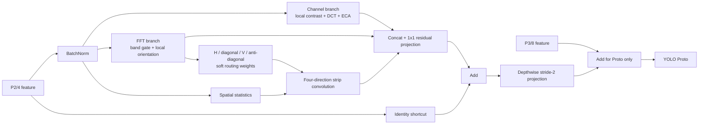

# P2CFSAttention 设计检查与使用说明

## 1. 设计结论

你的白板图表达了一个适合 P2 小目标特征的三路模块：通道注意力、频率建模和空间注意力。但原图还不能直接实现，主要缺少张量尺寸、分支交互、FFT 复数处理、任意方向遮挡建模、残差路径和训练初始化定义。本地代码将其整理为 `P2CFSAttention`，并通过 `SegmentP2CFS` 接入 YOLO11n-Seg。论文中的工作名称建议使用 **P2-LODA（P2 Local Orientation-guided Detail Attention）**。

模块不直接替换 `C2PSA`，也不替换整个 backbone。它只增强 P2/4 特征，再把结果下采样融合到 P3/8 的 Proto 输入。P3/P4/P5 的检测、分类和 mask coefficient 分支保持原结构。这样把创新限制在“高分辨率可见 mask 细节”，不会把 P2 背景纹理噪声送入整个检测头。

核心创新不是 `PartialNet + FAA + 条带卷积` 的并列拼接，而是一个任务闭环：**局部 FFT 从 P2 窗口估计叶片/枝条的方向分布，然后动态路由四方向条带卷积，增强遮挡切入位置形成的凹边界，最后只补充 Proto 的小目标 mask 细节。**



## 2. 对白板原设计的检查

### 2.1 通道切分

原图使用 `Ci x Rc`、`Ci x Rs` 和 `Ci x (1-Rc-Rs)`，这个方向是合理的，但必须约束 `Rc > 0`、`Rs > 0` 且 `Rc + Rs < 1`，并使用整数通道。当前默认值为 `Rc=0.375`、`Rs=0.375`；YOLO11n 的 P2 通道为 64，因此实际切分为 24/16/24，分别对应通道、FFT、空间支路。

### 2.2 原通道支路的问题

原图中的 `Pool -> Mean -> GAP` 会重复做全局平均；`Std -> GMP` 的统计对象也没有定义。代码先保留 PartialNet `PAT_ch/SRM` 的全局 mean+std，再在 3/5/7 三个尺度计算局部残差的 mean absolute deviation 和 RMS，最后加入四个方向性 DCT 描述子。DCT 只用于通道描述，不把完整频谱拼回特征图，避免高分辨率重建成本和尺寸依赖。

最后使用共享的小 MLP 和 3 点 ECA 风格 `Conv1d` 建立通道间关系。通道门控只改变对应分支，不丢弃原始特征。

### 2.3 FFT 支路的实现边界

不能对 FFT 幅度做门控后丢掉相位。小果边界和位置主要依赖相位，当前实现只对实数幅度增益进行调制，并保留原复数相位，再用 `irfft2` 返回空间特征。频谱被划为 low/mid/high 三个径向频带，由当前输入的频带能量动态生成增益。

FAA 原方法从频谱中硬选择主方向，再旋转特征做遥感 OBB 对齐。这个机制不适合直接迁移：幼果近圆形且标签是 visible mask，旋转 P2 会移动遮挡边界；官方 `FAAFusion` 还有硬 `argmax`、固定 256 通道及逐通道/逐窗口循环。P2-LODA 改为 8x8 非重叠局部窗口、四个方向的软概率，不旋转特征，只把方向概率送给空间条带支路。这样保持可微、保持坐标，并允许一幅图中不同叶枝方向共存。

FFT 支路强制使用 float32，因为 PyTorch 1.13/CUDA 对半精度和非 2 的幂尺寸 FFT 支持不稳定。训练时这会增加一些显存；640 输入下 P2 是 160x160，当前版本仍适合 3090。该支路目前不应直接作为 TensorRT/ONNX 部署模块，部署前需要做等价卷积近似或单独验证导出算子支持。

### 2.4 空间支路

柑橘数据中叶片和枝条会从任意方向切入果面，形成细长边界和深凹 visible mask。空间支路从 mean、max、std 三张通道统计图出发，使用横向 `1x7`、纵向 `7x1`、主对角 `7x7` 稀疏线核、反对角 `7x7` 稀疏线核以及局部 `3x3` 深度卷积。四个方向响应由对应位置的局部 Fourier 方向概率加权，而不是固定相加。

这与普通 CBAM 的区别是：CBAM 只生成一个无方向空间 gate；P2-LODA 显式建立“频谱方向证据 -> 条带方向选择 -> 遮挡边界增强”的因果路径。对角卷积只有对角线参数参与计算图，避免把它退化为普通大核卷积。

### 2.5 融合与初始化

原图没有给出分支融合后的输出，也没有残差。当前用 concat + `1x1 Conv + BN` 融合三路，内部残差 BN 以 0.1 小权重初始化。P2 到 P3 的最外层投影 BN 置零，因此整个 `SegmentP2CFS` 初始仍是严格 identity，但最外层投影开始学习后，内部三路可以更早获得梯度，避免双重零初始化造成学习延迟。

## 3. 参考来源与创新边界

### 3.1 PartialNet

`2502.01303v1.pdf` 是 2025 年 arXiv 预印本 [Partial Channel Network: Compute Fewer, Perform Better](https://arxiv.org/abs/2502.01303)。其官方代码 `PartialNet-main/models/partialnet.py` 中：

- `Partial_conv3` 证明只处理部分通道可以降低计算；
- `SRM` 使用 mean+std 和 `Conv2d(channel, channel, (1,2))` 做 `PAT_ch`；
- `partial_spatial_attn_layer_reverse` 将部分通道用于空间 gate。

本模块保留“部分通道承担不同操作”和 mean+std 的思想，但增加多尺度局部对比、DCT 方向描述、FFT 局部方向路由及 Proto-only 接入。PartialNet 是通用分类骨干，P2-LODA 是实例 mask 细节模块，不能在论文中写成“直接采用 PATConv”。

### 3.2 Fourier Angle Alignment

桌面文件 `VI_ A New Color Space for Low-light Image Enhancement.pdf` 实际并不是 HVI 论文，而是 2026 年 arXiv 预印本 [Fourier Angle Alignment for Oriented Object Detection in Remote Sensing](https://arxiv.org/abs/2602.23790)。官方实现位于：

- `Fourier-Angle-Alignment-main/mmrotate/models/necks/faafusion.py`；
- `Fourier-Angle-Alignment-main/mmrotate/models/roi_heads/bbox_heads/faa_head.py`。

P2-LODA只借鉴“频谱包含方向信息”。FAA 用硬方向和空间旋转解决 OBB 跨尺度/分类回归冲突；本模块用局部软方向路由条带卷积，解决 visible instance mask 的叶枝遮挡凹边界，不预测角度、不旋转特征、不做 OBB。

### 3.3 HS-FPN 与教程

教程引用的 [HS-FPN: High Frequency and Spatial Perception FPN for Tiny Object Detection](https://arxiv.org/abs/2412.10116) 提供了“频率特征同时服务通道和空间选择”的依据。P2-LODA没有复制其 HFP/SDP，而是把 DCT 限制为通道描述，并把 FFT 方向信息用于空间卷积路由。

`论文创新指南2026：手把手带你发论文(1).pdf` 只能作为设计启发，不能作为论文方法依据。它主要总结 A+B/CNN+FFT 的组合套路，没有给出该白板模块的实验验证，也不能证明简单堆叠具有创新性。正式论文应引用 PartialNet、FAA、HS-FPN 原文，并通过柑橘挑战子集和消融证明新机制。

### 3.4 相近工作检索与可主张范围

针对“Fourier orientation guided convolution segmentation”“orientation adaptive strip convolution”等组合进行了 arXiv/OpenAlex 检索。没有发现与“局部 Fourier 软方向 -> 四方向条带动态路由 -> P2 Proto-only”完全同构的工作，但相邻机制已经存在：

- [ODC-SA Net](https://arxiv.org/abs/2405.06191) 使用正交矩形方向卷积做息肉分割；
- [Dynamic Snake Convolution](https://arxiv.org/abs/2307.08388) 用受约束可变形卷积跟踪细长弯曲结构；
- [Strip R-CNN](https://arxiv.org/abs/2501.03775) 使用大条带卷积处理高宽比遥感目标；
- [ASC-SW](https://arxiv.org/abs/2507.12744) 使用空洞条带卷积分割细长线状物体。

因此不能把“条带卷积”“方向卷积”“FFT 注意力”单独写成创新。可以尝试主张的是：面向幼果 visible instance mask，将局部频谱方向作为动态路由信号，选择多方向稀疏条带响应，并通过 Proto-only P2 路径服务小果与遮挡凹边界。检索未发现完全同构方法不等于绝对首创，投稿前仍需按目标期刊再做一次正式查新。

## 4. 代码位置

| 文件 | 作用 |
|---|---|
| `ultralytics/nn/modules/p2_cfs_attention.py` | 三路 P2CFSAttention 实现 |
| `ultralytics/nn/modules/head.py` | `SegmentP2CFS`，让 P2 只增强 Proto |
| `ultralytics/nn/modules/__init__.py` | 模块导出 |
| `ultralytics/nn/tasks.py` | YAML 解析注册 |
| `0_orange_yaml/012_yolo11-seg-p2-cfs.yaml` | YOLO11n-Seg 实验结构 |
| `test_p2_cfs_attention.py` | 形状、identity、反向、整网 smoke test |
| `run_p2_cfs_smoke.py` | 本地 Python 一键训练入口 |

## 5. 如何本地运行

先进入本地仓库并运行测试：

```powershell
cd E:\mastercode\ultralytics-main-new
pytest -q test_p2_cfs_attention.py
```

测试通过后，双击或用 Python 运行 `run_p2_cfs_smoke.py`。脚本默认 3 个 epoch，输出到：

```text
E:\mastercode\ultralytics-main-new\1_results\ORANGE_WUXI_SEG\E1_yolo11n_seg_p2_cfs_smoke
```

脚本当前数据路径为 `E:/mastercode/data/orange_yolo/data.yaml`。复制到服务器时只修改脚本顶部的 `MODEL`、`DATASET`、`PROJECT` 或预训练权重路径，不修改服务器数据目录结构。

确认 loss、验证指标和显存正常后，先进行 50 epoch screening。只有小目标和凹边界指标有效时，才修改脚本中的 `EPOCHS=300` 与 `NAME` 进行正式实验。不得覆盖已有实验目录。

### 5.1 公平 baseline 协议

当前源码中的 `SPPF.cv1` 是 `act=False`，但官方 `yolo11n-seg.pt` 模型对象使用 SiLU。因此不能继续用 `.pt` 直接构建 E0、再用 YAML 构建 E1，否则两者还包含 SPPF 激活差异。E0 和 E1 必须分别从下列 YAML 构建，然后加载同一 `yolo11n-seg.pt`：

```text
E0: 0_orange_yaml/001_yolo11-seg.yaml
E1: 0_orange_yaml/012_yolo11-seg-p2-cfs.yaml
```

按该方式加载时，官方权重的 561 个 state items 全部迁移；新增的 48 个 state items只属于 P2-LODA。零初始化前向检查中，E0 与 E1 的全部输出 `max_abs_diff=0.0`，因此训练起点一致。

## 6. 必须记录的实验指标

除了 mask mAP50-95 和 mask mAP50，还要记录 mask AP75、AP-small、Precision、Recall、Params、GFLOPs、实测 latency，以及挑战子集上的 `Concave-BF1`、Merge Error 和 Split Error。模块如果只提高总体 mAP、但不改善小目标或凹边界/邻果合并错误，就不能作为论文主创新。

建议消融顺序为：

1. YOLO11n-Seg 原始 baseline；
2. `PAT_ch` 风格 mean+std 通道门控；
3. 通道门控 + 多尺度局部统计 + DCT；
4. 第 3 项 + low/mid/high 频带调制，但不做方向路由；
5. 第 4 项 + 固定平均四方向条带卷积；
6. 完整 P2-LODA：局部 Fourier 方向动态路由；
7. 完整模块分别接 backbone/P3/Proto，验证 Proto-only 位置选择。

其中第 2-5 项应保持相同数据划分、seed、输入尺寸、optimizer 和 epoch。先做 3 epoch smoke，再做 50 epoch screening，最后只对有效版本跑 300 epoch 和 3 seeds。

## 7. 已完成验证与已知限制

### 7.1 本地代码验证

| 检查 | 结果 |
|---|---|
| CPU 形状、奇数尺寸、有限值 | 通过 |
| E0/E1 模型级初始 identity | 通过，最大差值 0 |
| CPU 前向/反向 | 通过 |
| CUDA AMP + deterministic 反向 | 通过，RTX 3050 Laptop / torch 2.5.0+cu118 |
| 整网训练态 forward/backward | 通过 |
| 检测层 | 仍为 P3/P4/P5，stride 8/16/32 |
| 参数量（当前单类数据） | 2,842,803 -> 2,853,244，增加 10,441 |
| GFLOPs@640（当前单类数据） | 10.36 -> 10.67 |
| 官方预训练权重 | 原模型 561/561 项全部迁移 |
| 真实标签训练链路 | 通过：14 张训练子集、1 epoch、256 输入，loss/反向/验证均完成 |

### 7.2 已知限制

- FFT 会增加训练耗时，不应默认宣称部署友好。
- 模块使用固定径向频带和四个方向中心，尚不能证明这些设置最适合柑橘；需要比较窗口 4/8/16、条带核 5/7/11，并可视化方向概率。
- FAA 与 PartialNet 目前都是 arXiv 预印本，必须准确描述借鉴关系，不能把二者的结果当成本模块有效性的证据。
- P2 只进入 Proto，不参与检测头，因此它主要改善 mask 边界和小实例 mask，不应期待 box AP 同步大幅提升。
- 预训练权重可最大限度复用原 YOLO11n 的 backbone 和 P3-P5 head，但新增的 P2CFS 和 P2 投影没有预训练权重，需要从 identity 初始化开始学习。
- 当前只完成代码正确性验证，没有完成数据集训练，因此只能称为“待验证的方法假设”，不能提前宣称精度提升或论文创新成立。
- 在完成本地 3 epoch smoke 和 50 epoch screening 前，不复制到 `E:\mastercode\1_SEVER`。

### 7.3 本次数据读取副作用

真实数据 smoke 第一次扫描数据时，Ultralytics 检测到 72 张验证集 JPEG 缺少标准结束标记，并按 `ImageOps.exif_transpose(...).save(..., quality=100)` 自动重新编码，同时生成 train/val 的 `labels.cache`。这不是数据增强，标签和数据划分没有改变，但图像文件字节已经变化。正式 E0/E1 都必须使用同一批当前文件；若要恢复原始字节，必须从上游原图重新转换，不能从模型代码回退。
