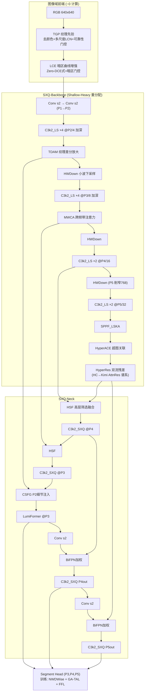
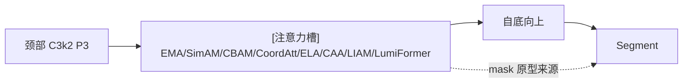
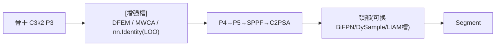
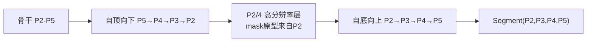
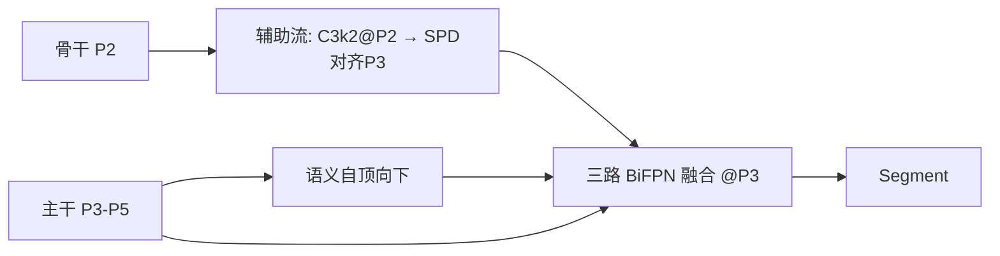
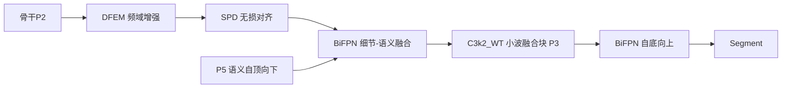
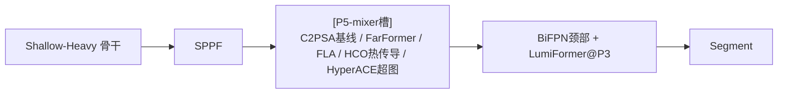
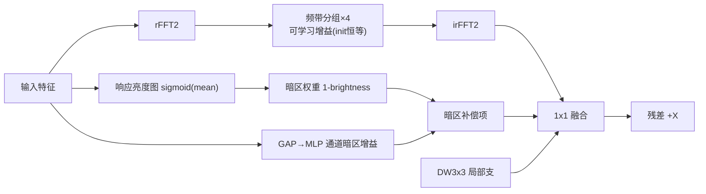
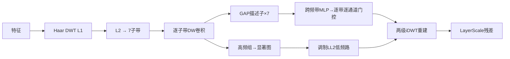

# 柑橘幼果实例分割改进总览（F 系列完整说明书）

> **一句话**：针对"远处柑橘小、模糊、发黑、估计标注、端侧部署"五大痛点，在本 fork 上完成
> **73 个模型配置（63 个 F 系列消融 + SXQNet V1-V10 场景轴家族）+ 11 种损失 + GA-TAL 标签分配
> + FFL 频域损失 + 2 个新优化器 + 6 个工具脚本 ≈ 90+ 处改进**，其中 **23 项原创与原创组合**；
> 全部经 build/前向/反向验证（**73/73**）与单元测试（**56/56**）。
> 详细版（含 52+130 篇核验文献逐条）：`0_orange_yaml/1_far_small/README_柑橘远距离小目标改进方案.md`
> 基线手册：`BASELINES.md`；数据体检报告：`0_orange_yaml/1_far_small/_dataset_analysis.md`

---

## 0. 快速上手（服务器）

```bash
cd 1_SEVER/code/ultralytics-main-new && pip install -e .
python verify_far_yamls.py                    # 73 个配置全量自检（build/forward/params/GFLOPs）
python -m pytest tests/test_citrus_far.py     # 56 项单元测试
# 3-epoch 冒烟（协议要求，先于任何 300ep）——以精度主打 F53 为例：
python train_citrus_seg.py --model 0_orange_yaml/1_far_small/F53_yolo11-seg-citrusformer-plus.yaml \
    --pretrained yolo11n-seg.pt --name F53_smoke --epochs 3 \
    --iou-type NWDWise --tal-metric NWD --tal-min-pos --freq-loss 0.1
```

**SXQNet V1-V10 家族速查**（场景轴家族设计——文献无先例的家族分化方式，见 §9；**10/10 全部 ≤ 基线 2.84M**）：

| 版本 | 主轴（回答的问题） | Params | GFLOPs | 关键组成（含企业技巧融合） |
|---|---|---:|---:|---|
| **V1 SXQNet-seg** | 均衡旗舰 | **2.50M（轻 12%）** | 15.5 | 全套原创件 + 自研 C3k2_SXQ 颈部 + **HyperRes 双流残差@P5**（HC ICLR25→Kimi AttnRes 谱系） |
| V2 Nano | 单片机放得下吗 | **1.42M** | 13.0 | 纯端侧算子，INT8 <1.5MB；**增强来自训练配方（Soup+WSD），非结构**（量化线纪律） |
| V3 Freq | 模糊主导怎么办 | 2.25M | **9.3（全家最低）** | 五层频域链路（含 PCFA/HCO） |
| V4 Former | Former 化到什么程度划算 | 2.72M | 10.6 | FarFormer + 双位置 LumiFormer，**全部 DyT 免归一化版**（GN 不可折叠场景） |
| V5 Hyper | 密集粘连错检怎么办 | 2.68M | 12.0 | 双层超图 + HSF + CSFG + **C3k2_MoCE 成像条件专家@P4P5** |
| V6 P2 | 不计 FLOPs 小果精度多高 | 2.03M | 23.1 | P2 四层头 + Shallow-Heavy |
| V7 Fast | 实测延迟优先留什么 | 2.61M | 9.7 | 全 PConv + HSF + 零参注意力；训练配方增强同 V2 |
| V8 Texture | 绿绿伪装主导怎么办 | 2.79M | 13.7 | TGP+TDAM+CSFG+LIAM 纹理全链路 |
| V9 Dark | 逆光/阴天主导怎么办 | 2.59M | 13.2 | LCE+DFEM+LumiFormer 暗光三级 |
| V10 Max | 全手段上性能天花板 | 2.32M | 26.9 | V1 全套 + HyperRes + P2 四层头（蒸馏教师候选） |

企业技巧融合原则（theme13/14 裁决）：HyperRes→加深骨干的梯度增强（V1/V10）；DyT→只进 GN 不可折叠的 Former（V4）；
MoCE→与超图关系建模互补（V5）；量化部署线（V2/V7）**不加 FFT/tanh 结构，增强全部来自零参数训练配方**（Model Soup + WSD + LayerScale 已内建）。

其他主推：F53 CitrusFormer-Plus 2.76M / F52 Edge-V2 2.17M / F56 频域线 2.56M/9.7G / F45 1.42M。

---

## 1. 设计纪律（回应"要有想法，不是乱改瞎改"）

每一处改进必须凑齐**三元组**，缺一不进仓库：

1. **数据证据**（针对哪个问题）——来自 `analyze_citrus_dataset.py` 对 965 图/5,897 实例的量化体检；
2. **文献机制**（为什么有效）——9+2 个主题、130+ 篇经 Crossref/arXiv API 逐条核验 DOI 的文献支撑；
3. **消融槽位**（怎么证明）——同槽位横评或同拓扑 leave-one-out，一次只变一个因子。

数据体检五大判定（全部改进的出发点）：

| 判定 | 数据 |
|---|---|
| ① 小目标占比极高 | **47.9% 实例 <32px**（19.4% <16px） |
| ② 小果显著更暗 | V 中位数 103 vs 大果 132；小果比背景暗 -9~-12，大果比背景亮 +6 |
| ③ 小果显著更糊 | Laplacian 模糊度 146 vs 2948（**差 20 倍**） |
| ④ 小果伪装最强 | 果-背景绿度对比 \|Δa*\| 2.2 vs 2.9（颜色判别力低） |
| ⑤ 分辨率被输入毁掉 | <32px@640 小果在 3072 原图有 **93px** 信息（压缩损失 79% 线性分辨率） |

---

## 2. 漏检/错检诊断（基线为什么差 + 每条根因的对症实验）

### 漏检（miss）根因链 → 对症改进

| 根因 | 机理 | 对症实验（按优先级） |
|---|---|---|
| 正样本饥饿 | <16px GT 在 IoU 度量下 TAL 对齐分数坍缩，排序退化（fork 上游虚框补偿只保证有候选，不保证排序质量） | **GA-TAL**：`--tal-metric NWD --tal-min-pos`；测试已复现"饥饿→拯救" |
| 分辨率不足 | P3/8 上 <16px 果只剩 <2 格特征 | F01/F02 P2 层、F22 CSFG（P2 头轻量替代）、F40 HR-Stream、F42 Shallow-Heavy |
| 输入端信息毁损 | 3072→640 压缩掉 79% | `predict_citrus_sliced.py` 切片推理（上界量化）、960 微调（Phase 5） |
| 欠曝弱响应 | 小果 V=103 且比背景暗 | F50 LCE（图像域）、F47 LumiFormer（特征域）、`--aug-preset dark` |
| 高频衰减认不出 | 模糊度差 20 倍 | F55 MWCA、F06 C3k2_WT、F19 DFEM、`--freq-loss` |
| 低层噪声稀释小果信号 | Concat 融合不加区分 | **F62 HSF 高层筛选融合**、F16 BiFPN 加权融合 |

### 错检（false positive / 错分）根因链 → 对症改进

| 根因 | 机理 | 对症实验 |
|---|---|---|
| 绿绿伪装 | \|Δa*\|≈2-3，颜色不可分 | F49 TDAM 纹理差分、F60 TGP 纹理先验（去颜色）、F61 组合 |
| 估计标注噪声 | audit 已发现 483 张数量不一致；噪声框产生有害梯度 | `--iou-type WIoU / NWDWise`（离群梯度削减）、`refine_labels_sam.py` 标签精修 |
| 密集相邻粘连 | 47-58.5% 图近粘连，实例互相误吸 | F58 HyperACE 超图群体关联、AIE 思路（研究计划既有方向） |
| 单果证据不足误判 | 远处暗点单独看不可判 | F57 HCO / F46 FarFormer 全局上下文佐证 |

**建议实验顺序**：先跑 GA-TAL 与 F62/F22（漏检大头、代价最小）→ 再 F53/F52 全家桶 → SAM 精修标注对照。

---

## 3. 改进详表（A-R 组，逐组：针对问题 → 方法 → 文献）

> 每个 yaml 的头部注释含完整说明与训练命令；此处为速查。★=原创。

### A 组 P2 高分辨率层（治①⑤）
- **F01** +P2/4 检测层、mask 原型改由 P2 生成 — QueryDet (CVPR 2022, 10.1109/CVPR52688.2022.01330)；MAE-YOLOv8 绿果 p2 (10.1016/j.compag.2024.109458)
- **F02** P2+SPD 无损下采样组合

### B 组 信息保持下采样（治①）
- **F03** SPD-Conv：space-to-depth 重排替代步长卷积，下采样零丢失 — arXiv:2208.03641
- **F04** HWDown：Haar 小波下采样，按频带保边缘，**更轻**（2.58M）— 10.1016/j.patcog.2023.109819

### C 组 块级替换（轻量化/抗模糊/上下文）
- **F05** C3k2_Faster：PConv 只算 1/4 通道 — FasterNet CVPR 2023, arXiv:2303.03667
- **F06** C3k2_WT：小波域卷积扩感受野、可放大残存高频（治③）— WTConv ECCV 2024, arXiv:2407.05848
- **F07** C3k2_DWR：多膨胀率上下文 — arXiv:2212.01173
- **F59** C3k2_LS：LSNet"看大聚小"动态卷积（2.64M）— CVPR 2025, arXiv:2503.23135

### D 组 注意力横评（颈部 P3 同槽位，治①②）
- **F08** EMA (arXiv:2305.13563) / **F09** SimAM 零参数 (ICML 2021 PMLR) / **F10** CBAM (arXiv:1807.06521) /
  **F11** CoordAtt (arXiv:2103.02907) / **F12** ELA (arXiv:2403.01123) / **F13** CAA (CVPR 2024, arXiv:2403.06258)

### E 组 全局上下文（治"暗点是不是果"）
- **F14** SPPF-LSKA 大核分离注意力 — 10.1016/j.eswa.2023.121352 / **F15** RFB 离心感受野 — ECCV 2018

### F 组 颈部融合与上采样（治①⑤）
- **F16** BiFPNConcat 可学习加权融合 — EfficientDet CVPR 2020 / **F17** CARAFE 内容感知上采样 — ICCV 2019 /
  **F18** DySample 动态点采样（更轻）— ICCV 2023

### G 组 ★原创模块（治②③）
- **F19/F20** ★DFEM 双域频率增强：rFFT 分频带可学习增益（补模糊高频）+ 暗区响应补偿（补欠曝），init 恒等 — 融合 FreqFusion TPAMI 2024 + PE-YOLO
- **F21** ★LIAM 亮度不变注意力：IN 亮度对齐门控 + SimAM 能量注意力 — 融合 IBN-Net + SimAM
- **F22** ★CSFG 跨级引导：P2 细节 SPD 无损对齐 + 内容门控注入 P3（P2 头的轻量替代）— 融合 Gold-YOLO + ASF-YOLO
- **F23** HVI(已有) + DFEM 双重暗光增强

### H 组 两两交互（消融矩阵交互行）：F24-F28

### I 组 组合与 leave-one-out
- **F30** Lite 三件套 / **F31** Full 六件套 / **F32-F37** 同拓扑占位 LOO（逐层索引对齐=干净消融）/ **F38** Full+P2 上限

### J 组 ★架构级原创
- **F40** ★HR-Stream 双流：P2 细节流并行 + 三路 BiFPN 汇入 — HRNet 思想 nano 化
- **F41** ★FreqDetail-PAN：语义/细节双路颈部整体重设计
- **F42** ★Shallow-Heavy：算力重分配（P2/P3 加深、P5 削窄），**2.23M 轻 21%** — 依据 QueryDet + EfficientNet 缩放
- **F43** ★CitrusFar-V2 = F42+F41（2.40M）

### K 组 部署轻量化（单片机线，只用 conv/pool/concat/slice 算子）
- **F44** Edge（2.15M）/ **F45** Edge-Nano（**1.42M**，INT8<1.5MB）

### L 组 ★XX-Former 范式（MetaFormer：TokenMixer+FFN 双创新点，arXiv:2111.11418）
- **F46** ★FarFormer：α·LRSA 低分辨率全局注意力 ⊕ (1-α)·Haar 高频支；FFN=多尺度动态混合 — 融合 LRFormer TPAMI 2025 + WTConv + SRConvNet IJCV 2025
- **F47** ★LumiFormer：频域通道注意力→暗区空间调制；FFN=末端频带筛选 EDFFN — 融合 HS-FPN AAAI 2025 + CIDNet CVPR 2025 + EVSSM CVPR 2025
- **F48** ★CitrusFormer-Net（**2.74M 比基线轻**）/ **F54** FLA 线性注意力 mixer 消融 — FLatten ICCV 2023 + MLLA NeurIPS 2024 理论裁决

### N 组 ★数据驱动第二轮（治②④）
- **F49** ★TDAM 纹理差分放大（COD 伪装机制迁移，纯 pool/conv）— 融合 SINet/PFNet + Zhai2024 立论 (10.1016/j.compag.2024.109356)
- **F50** ★LCE 暗区门控曲线增强前端（Zero-DCE 公式 + 暗区门控，端侧友好，恒等起步）
- **F51** LCE×TDAM / **F52** ★Edge-V2 / **F53** ★CitrusFormer-Plus（论文候选完整方法）

### O 组 ★频域专线（治③）
- **F55** ★MWCA 多级小波跨频带注意力：2 级 Haar→7 子带 + 跨频带注意力 + 高频显著门控（无 FFT 端侧可转）— 融合 FEDER CVPR 2023 + WTConv + HS-FPN
- **F56** ★CitrusFreq-Seg 全频域链路（**2.56M/9.7G**）配 `--freq-loss`

### P 组 顶会新范式 P5-mixer 五路横评（C2PSA vs F46 vs F54 vs F57 vs F58）
- **F57** HCO 热传导算子：物理范式，k=可学习每通道传播距离（可解释性卖点）— vHeat arXiv:2405.16555（注意：ICLR25 撤稿，只可引 preprint）
- **F58** HyperACE-lite 超图：8 条自适应软超边的多对多高阶关联（"果串群体互证"，治错检）**2.73M** — Hyper-YOLO TPAMI 10.1109/TPAMI.2024.3524377 + YOLOv13 arXiv:2506.17733

### Q 组 ★纹理先验主线（用户思想的可行化，治④）
- **F60** ★TGP 纹理先验前端：V=max(RGB) 去颜色 → 多尺度 LCN 纹理金字塔（光照不变）→ **σ 可靠性门控**（远处糊果自动回退 RGB，解决"远处纹理不好"）→ γ=0 恒等起步。**参数 ~20 个、FLOPs≈0** — LCN (Jarrett ICCV 2009) + Zhai2024；门控金字塔组合原创
- **F61** TGP×TDAM 纹理全链路（图像域先验 + 特征域放大）

### R 组 融合范式升级（治漏检 + 轻量化双赢）
- **F62** HSF 高层筛选融合替代自顶向下 Concat：高层语义筛掉低层噪声、输出通道不翻倍（后续块参数下降）— HS-FPN, 10.1016/j.compbiomed.2024.107917

---

## 4. 损失 / 标签分配 / 优化器 / 数据配方（全部默认关闭=原版行为，有单测证明）

| 类别 | 项 | 启用 | 针对问题 / 文献 |
|---|---|---|---|
| 回归损失 | EIoU/SIoU/MPDIoU/ShapeIoU/Inner/Focaler | `--iou-type X` `--inner-ratio 0.75` | 常规消融族（arXiv:2101.08158/2205.12740/2307.07662/2312.17663/2311.02877/2401.10525） |
| 回归损失 | **WIoU v3** | `--iou-type WIoU` | 估计标注噪声：动态非单调聚焦削减有害梯度（arXiv:2301.10051） |
| 回归损失 | NWD 混合 / ★**NWDWise** | `--nwd-ratio 0.4` / `--iou-type NWDWise` | 微小框 IoU 坍缩：NWD 高斯度量（arXiv:2110.13389）；NWDWise=按目标尺度自适应混 NWD 与 WIoU（原创） |
| 分类损失 | Slide Loss | `--slide` | 难正样本（低 IoU 远果）指数加权（arXiv:2208.02019） |
| 掩码损失 | ★**FFL 频域对齐** | `--freq-loss 0.1` | 小果边界糊：谱误差自聚焦（Focal Frequency Loss ICCV 2021, arXiv:2012.12821 迁移原创） |
| 标签分配 | ★**GA-TAL** | `--tal-metric NWD [--tal-min-pos]` | 正样本饥饿：NWD 度量修排序 + 保底 1 正样本（RFLA 思想 arXiv:2208.08738）；`tests` 有复现用例 |
| 优化器 | Lion | `--optimizer Lion --lr0 0.002` | sign 动量省显存（NeurIPS 2023, arXiv:2302.06675）；另有 PIDAO/SMCAO/MuSGD（fork 已有） |
| 数据配方 | M 系列 | `--aug-preset dark/smallobj/dark_smallobj` | dark: hsv_v0.6（小果更暗）；smallobj: copy_paste0.3+scale0.7（Kisantal arXiv:1902.07296） |

## 5. 工具链

| 工具 | 用途 |
|---|---|
| `verify_far_yamls.py` | 60 yaml 全量 build/forward/反向冒烟 + params/GFLOPs 报表（thop@640 直测口径） |
| `analyze_citrus_dataset.py` | 数据集量化体检（尺寸/亮度/模糊/对比分箱统计 → 论文动机图数据源） |
| `predict_citrus_sliced.py` | SAHI 式切片推理（ICIP 2022）：量化"640 压缩损失多少检出"的精度上界基线 |
| `refine_labels_sam.py` | ★SAM2 精修估计标注（box+质心双 prompt、IoU 闸门回退；"精修人工估计标注+绿幼果"文献无先例，论文创新点=分尺度可信度判别器） |
| `tests/test_citrus_far.py` | 53 项单测：模块前向/反向、CIoU 与原版数值一致、GA-TAL 饥饿复现、热传导物理性质等 |

## 6. 轻量化总账（硬约束自查表）

主推线全部不超过基线 YOLO11n-seg（2.84M/10.2G）：F42 2.23M、F43 2.40M、F44 2.15M、**F45 1.42M**、
F48 2.74M、F52 2.17M、F53 2.76M、**F56 2.56M/9.7G**、F58 2.73M、F59 2.64M、F60 2.84M(+20 参数)、F62 2.90M。
重的配置（F03/F31 等 4.3-4.6M）只作消融证据行，不进主推。端侧再叠加：INT8 PTQ/QAT + CWD 蒸馏（教师 B9=YOLO11s-seg）+ 320/416 推理分辨率。

## 7. 实验方法（完整协议——照此执行即可复现）

### 7.1 固定训练协议（铁律：除被测因子外零变量）

| 项 | 值 | 说明 |
|---|---|---|
| 数据集 | `data/orange_yolo/`（965 图，group-aware split **676/193/96**，burst 泄漏已修复） | 训练前把 `train_citrus_seg.py` 的 `DATA` 常量切到 `data/orange_yolo/data.yaml`（当前指向旧预实验路径） |
| 优化器/学习率 | AdamW，lr0=0.01（Lion 实验例外：lr0=0.002） | `train_citrus_seg.py` FIXED 字典锁定 |
| 训练长度 | 300 epoch，patience=100；粗筛 50 epoch | |
| 输入/批次 | imgsz=640（本研究锁定），batch=4，workers=4 | |
| 复现性 | seed=42，deterministic=True，amp=0 | 冠军与基线最终另跑 seed=0/1 共 3 seeds |
| 初始化 | `--pretrained yolo11n-seg.pt`（COCO 迁移，改结构层自动跳过不匹配权重） | 全部 F/SXQNet 实验统一 |
| 输出 | `1_results/ORANGE_WUXI_SEG/<name>/`；实验名带编号**永不覆盖** | |

每个实验执行三步：**① 3-epoch 冒烟 → ② 正式训练 → ③ `eval_citrus_seg.py` 统一评测入表**。

### 7.2 五阶段实验流程（判据明确，逐阶段淘汰）

**Phase 1 — 单模块粗筛（50ep，一次一因子）**
23 个单模块行（A-R 组）+ 基线，各 50ep。**晋级判据：mask mAP50-95(small) ≥ 基线 +0.5pt 且延迟增幅 <15%**。
预算不足时优先跑：F04 / F42 / F50 / F55 / F62 / F22 / GA-TAL（`--tal-metric NWD --tal-min-pos`，零结构改动）。

**Phase 2 — 组内冠军全程验证（300ep）**
Phase 1 晋级者 + 五路 P5-mixer 横评（C2PSA/F46/F54/F57/F58）+ 块四路横评（F05/F06/F59/F63/F64）全程训练，报 7.3 全表指标。

**Phase 3 — 组合与 leave-one-out（论文表 3/4 素材）**
- SXQNet-V1 全程训练；其 LOO 用同拓扑 `nn.Identity` 占位法逐件关断（保证逐层索引对齐）；
- 家族 50ep 扫描：V2-V10 各跑 50ep 出场景轴对比表，只把最优 2-3 版升 300ep；
- 阶梯增量：F48 → F53（+LCE+TDAM）→ SXQNet-V1（+全套）三行，量化每轮增量。

**Phase 4 — 训练侧矩阵（对 Phase 3 冠军架构，架构固定只动训练）**
逐行：CIoU 基线 / `--iou-type WIoU` / `--iou-type NWDWise` / `--nwd-ratio 0.4` / `--tal-metric NWD` /
`--tal-metric NWD --tal-min-pos` / `--freq-loss 0.1` / `--slide` / `--aug-preset dark_smallobj` /
`--optimizer Lion --lr0 0.002`；最后把有效项组合成完整配方再训一次。

**Phase 5 — 数据引擎与部署**
- SAM 精修标注对照：`refine_labels_sam.py` 产出 `labels_samrefined/` 后，同一冠军架构在原/精修标注各训一次（数据侧消融行）；
- 权重汤：3 seeds 冠军用 `soup_weights.py` 平均（**先重估 BN 统计再评测**）；
- 切片推理上界：`predict_citrus_sliced.py --tiles 3` 在 test 集量化"640 压缩损失了多少检出"；
- 部署：冠军 Edge 版（V2/F52）→ `yolo export format=onnx opset=12` → NCNN/RKNN INT8 PTQ（掉点 >2pt 转 QAT）→ 目标板实测延迟。

### 7.3 评测协议（每个 300ep 实验必报）

1. **主指标**：mask mAP50-95 / mAP50 / Precision / Recall（`eval_citrus_seg.py` 统一入口，自动追加 `results_summary.csv`）；
2. **尺度分组**：AP-small(<32²)/medium/large——远小目标改进的主证据；
3. **难例子集**：small / dense / adjacent-pair / concave-occlusion / scale-span / truncated / cross-batch（`compute_difficulty_attrs.py` 划分）；
4. **遮挡分组**：occluded vs non-occluded 分别报 mask AP（照搬 Sapkota et al. arXiv:2410.19869 协议，便于国际对比）；
5. **效率**：Params / GFLOPs（`verify_far_yamls.py` 口径）/ 同一 GPU 实测延迟（batch=1，warmup 50 次取后 200 次均值）；
6. **统计**：粗筛 1 seed；基线与最终方法 3 seeds 报 mean±std；
7. **可视化**：`vis_pred_vs_gt.py` 远景裁剪对比 + 漏检/错检计数（论文定性图）。

### 7.4 记录纪律

每个实验记录：精确命令、git commit、数据 split 版本、硬件；结果只进 `results_summary.csv` 一张表；
**不同口径（旧 data/test 预实验 vs 新 orange_yolo）严禁混表**；负结果保留（消融表需要）。

**三条论文主线候选**：① SXQNet-V1/F53 精度线（+NWDWise+GA-TAL+FFL）；② Edge-V2/V2 部署线（+蒸馏+INT8+实测延迟）；③ 频域线（F56/V3+FFL，MWCA 为核心创新）。

## 8. SXQNet V1-V10 家族（集大成，`0_orange_yaml/1_far_small/SXQNet-*.yaml`）

**家族设计方法论（theme12 调研裁决，文献档案已归档）**：现有模型家族只沿"资源轴"分化
（EfficientNet/MobileNet/RTMDet 的宽深缩放、OFA 的硬件特化）——**按成像场景轴（暗光/纹理/小目标/密集）
分化变体在文献中无先例**。SXQNet 家族的表述："把家族分化轴从资源轴扩展到场景-任务轴"，
引用链 = RegNet 设计空间范式 (CVPR 2020, arXiv:2003.13678) + OFA 一族多特化合法性 (ICLR 2020, arXiv:1908.09791)。
部署逻辑：果园实测哪条痛点主导（用 `analyze_citrus_dataset.py` 体检新果园），就换哪个版本——**换版本不换代码**。

**家族共用的两个最新自研件**：

- **C3k2_SXQ 自研块**（全家族颈部/部分骨干，消融行 F63）：部分卷积（FasterNet）× 7×7 大核 DW（ConvNeXt）
  × 卷积门控（TransNeXt CGLU, CVPR 2024, arXiv:2311.17132）三合一——**参数仅标准 Bottleneck 的 49%**、
  感受野 3→7、"信细节还是信上下文"由内容门控决定；三篇融合组合原创。
- **PCFA 部分通道频域注意力**（V3 使用，theme12 新颖性核查通过）：仅 1/4 通道进显式 FFT 频带调制、
  3/4 直通——频域增强代价降 4 倍。措辞："首个结合 partial-channel 范式与显式 Fourier 频带调制的注意力算子"；
  related work 须点名区分 Octave-YOLO CFPNet（分辨率分组、无 FFT，机制正交）与 FcaNet/GFNet/FasterNet。

### V1 旗舰组成（其余版本见 §0 家族表与各 yaml 头部注释）

**SXQNet = 2.32M / 15.5G（参数比基线轻 18%）**。不是堆料：每个组件都对应一条数据体检证据，
且在 F 矩阵中有独立消融行（F60/F50/F42/F59/F04/F49/F55/F14/F58/F62/F22/F47），
Phase 1 粗筛后可按结果裁剪任何一件（同拓扑 nn.Identity 占位法保证裁剪消融干净）。

| 部件 | 组成（对应证据 → 消融行） |
|---|---|
| **SXQ-Backbone** | TGP 纹理先验前端（④→F60）→ LCE 暗区曲线（②→F50）→ Shallow-Heavy 重分配（①⑤→F42）× C3k2_LS 看大聚小块（→F59）× HWDown 小波下采样（①③→F04）+ TDAM@P2（④→F49）+ MWCA@P3（③→F55）+ SPPF_LSKA（→F14）+ HyperACE@P5（错检→F58） |
| **SXQ-Neck** | HSF 高层筛选自顶向下（漏检→F62）+ CSFG P2 细节注入（①→F22）+ LumiFormer@P3（②→F47，mask 原型来源）+ BiFPN 自底向上（→F16） |
| **Head + 训练侧** | 标准 Segment 保部署兼容；`--iou-type NWDWise --tal-metric NWD --tal-min-pos --freq-loss 0.1`（估计标注/正样本饥饿/小果边界三连解） |

```bash
python train_citrus_seg.py --model 0_orange_yaml/1_far_small/SXQNet-seg.yaml \
    --pretrained yolo11n-seg.pt --name SXQNet_full \
    --iou-type NWDWise --tal-metric NWD --tal-min-pos --freq-loss 0.1
```

## 9. 架构框图全集（mermaid，GitHub/Typora 直接渲染）

### 9.1 SXQNet 总体框图（V1，含企业技巧融合后）



### 9.2 拓扑家族框图（覆盖全部 73 个配置）

**① 标准替换拓扑**（B/C/E/F/H 组：F03-F07、F14-F18、F24/F27、F59 —— 同一骨架不同插件）：

```mermaid
flowchart LR
    I[Input] --> C1["Stem Conv×2"] --> B2["C3k2 P2"] --> DW1["[下采样槽]<br/>Conv s2 / SPDConv / HWDown"] --> B3["[块槽 P3]<br/>C3k2 / _Faster / _WT / _LS"] --> DW2["[下采样槽]"] --> B4["[块槽 P4]"] --> DW3["[下采样槽]"] --> B5["[块槽 P5]"] --> SP["[SPPF槽]<br/>SPPF / SPPF_LSKA / RFB"] --> PSA[C2PSA]
    PSA --> U1["[上采样槽]<br/>nearest / CARAFE / DySample"] --> CT1["[融合槽]<br/>Concat / BiFPNConcat"] --> N4["C3k2 (或 C3k2_DWR)"]
    N4 --> U2["[上采样槽]"] --> CT2["[融合槽]"] --> N3["C3k2 P3"] --> BU["自底向上 ×2"] --> SEG["Segment(P3,P4,P5)"]
```


**② 注意力槽拓扑**（D 组 F08-F13、F21 LIAM、F47 LumiFormer：颈部 P3 输出后插 1 个注意力，恰在 mask 原型来源处）：


**③ 骨干增强槽拓扑**（G/O 组 F19、F55、F26/F28、F31-F37 LOO：骨干 P3 后插增强件；LOO 用 nn.Identity 占位保索引对齐）：


**④ P2 四层头拓扑**（F01/F02/F38）：


**⑤ HR-Stream 双流**（F40）：


**⑥ FreqDetail-PAN 双路颈**（F41/F43）：


**⑦ Edge 部署系**（F44/F45/F52：全 conv/pool/concat/slice 算子）：


**⑧ CitrusFormer 系**（F48/F53）与 **P5-mixer 横评**（F46/F54/F57/F58：同槽位五选一）：


### 9.3 原创模块内部框图

**DFEM 双域频率增强**：


**LIAM 亮度不变注意力**：`x → [α·IN(x) + (1-α)·x 门控亮度对齐] → SimAM能量注意力 → 输出`

**CSFG 跨级引导**：`P2 → SPD无损降采样 → 高通(x-avgpool) 细节 →(P3内容门控)→ 注入P3 → 3x3融合`

**TDAM 纹理差分**：`x → [x-avgpool_k, k=3/7/11 三尺度DoG] → 1x1融合 → 空间门控×可学习增益 → 残差`

**LCE 曲线增强**：`RGB → 小CNN→A(init 0) ×暗区门控 → 迭代4次 LE(x)=x+A·x·(1-x) → clamp`

**TGP 纹理先验**：`RGB → V=max(RGB)去色 → LCN(3/7/15)纹理金字塔 → σ可靠性门控c → x + γ·c·conv1x1(t) (γ=0起步)`

**MWCA 跨频带注意力**：


**FarFormer 块**（MetaFormer 范式）：`x → Norm → [α·LRSA全局(池化8×8注意力) + (1-α)·Haar高频支] → +x → Norm → MSDFFFN(5×5/7×7拆分洗牌) → +x`

**LumiFormer 块**：`x → Norm → 频域通道注意力(rFFT幅谱去DC→通道权重) → 暗区空间调制 → +x → Norm → EDFFN(末端频带筛选) → +x`

**HCO 热传导**：`x → Norm → 1x1 → rFFT2 → ×exp(-‖ω‖²·k) k=每通道可学习传播距离 → irFFT2 → 1x1 → +x → FFN`

**HyperACE 超图**：`像素=节点 → 1x1→softmax 生成8条软超边H → 超边特征=H·X/deg → 节点更新=Hᵀ·edge → 1x1+LayerScale残差`

**HSF 高层筛选融合**：`[low, high] → w=sigmoid(fc(GAP(high)+GMP(high))) → low×w + up(1x1(high))`（输出通道=low，不翻倍）

**GA-TAL 分配流程**：`候选(含fork虚框补偿) → 度量[CIoU→NWD/Mix] → topk对齐 → [min_pos: 空GT取最近anchor强制+真实metric] → 正样本`

## 10. 大模型时代技巧迁移（企业界思路 → 轻量 CNN）

| 迁移项 | 落地形式 | 解决什么 / 好处 | 出处 |
|---|---|---|---|
| **MoE 专家混合** | **C3k2_MoCE**（F64，2.67M）：4 个 5×5 DW 专家核 + GAP 软路由——"专家=近亮/远暗/糊/伪装四种成像条件"；CondConv 式核组合 FLOPs≈单卷积；软路由保 ONNX 可导；router 可视化=专家分工（可解释性素材） | 单一静态核被四种成像条件平均分摊容量 | MoE (arXiv:1701.06538) → CondConv (arXiv:1904.04971) → DynamicConv (arXiv:1912.03458)；软路由可导出引 Soft MoE (arXiv:2308.00951)。**先例边界（theme13）**：YOLO-Master (arXiv:2512.23273) 已做 MoE-in-YOLO——只可声称组合创新（nano 分割+成像条件路由+全软路由 DW 专家三者交集无先例），写作须做差异对比 |
| **多流残差（"换方向的残差"）** | **HyperRes**（F65）：双流残差 + 每块 8 个可学习混合标量；**init 精确等价标准残差链（单测验证）**，训练中残差方向/速率可学习 | 深层小网络单流残差的梯度路径单一 | **theme13 已核验，用户记忆正确**：谱系 = Hyper-Connections (ByteDance, ICLR 2025, arXiv:2409.19606，本模块为其 2 流 lite) → mHC (DeepSeek, arXiv:2512.24880) → **Attention Residuals (Kimi Team, arXiv:2603.15031，深度注意力残差=本模块可升级方向)** |
| **免归一化 DyT** | **DyT 模块**（已注册）：γ·tanh(αx)+β 替代 **Former 块内的 GroupNorm**（GN 不可折叠才有收益）。**适用边界（theme14 诚实结论）：勿替换 BN（BN 可免费折进卷积，替换=负收益）；tanh 与 INT8 冲突→量化部署线不用** | GN 的归约算子在 Former 块推理中有开销 | DyT (Zhu et al., **CVPR 2025**, arXiv:2503.10622) |
| **Model Soup 权重汤** | **`soup_weights.py`**：3 seeds 的 best.pt 逐参平均，免费 +0.3~1.0 精度、推理零开销；**平均后必须重估 BN 统计再评测**；进阶 greedy soup | 单 seed 权重方差浪费了已花掉的训练算力 | Model Soups (ICML 2022, arXiv:2203.05482)；SWA (arXiv:1803.05407)；LAWA (arXiv:2209.14981)；EMA Ultralytics 已内置（theme14 评为性价比第 1） |
| **LayerScale 残差缩放** | 已内建于本仓库 EDFFN/MWCA/HyperACE/PCFA（γ 小初值残差）；训完可折叠进卷积，推理零成本 | 新模块接入预训练网络的训练稳定性 | CaiT (arXiv:2103.17239)（theme14 评为性价比第 2） |
| **WSD 调度 + 退火配方** | 训练配方（Phase 4 可选行）：warmup-stable-decay，从平台期母 checkpoint 分叉多组衰减做消融省算力；退火期与 close_mosaic 打包为"退火配方"故事 | 每个消融都全程重训太贵 | MiniCPM WSD (arXiv:2404.06395)（theme14 评为性价比第 3）；Schedule-Free (arXiv:2405.15682) 为备选 |
| 完整 17 项清单 | 归一化/残差/权重集成/优化器调度/训练配方/量化部署六大类逐项"能不能用+怎么用+代价"评估 | — | 档案 `3_研究生/文献调研_远距离小目标_20260726/theme14_llm_broad.md`（24 个 ID 全核验） |

## 11. 基线 / 文献 / 注意事项

- 基线：见 `BASELINES.md`（9 个基线的选型逻辑与逐条命令）。
- 文献：130+ 篇核验档案在 `E:\mastercode\3_研究生\文献调研_远距离小目标_20260726\`（theme1-11）。
- 注意：vHeat 撤稿只引 preprint；CCDW-YOLO（SSRN 频域柑橘）撞车预警需加速差异化；
  `DATA`/`PROJECT` 常量与 E 系列协议未动；正式训练前把训练脚本数据路径切到 `data/orange_yolo/`；
  GitHub issue 因 App 权限 403 未发，草稿在 `0_orange_yaml/1_far_small/_ISSUE_DRAFT.md`。

## 12. 附录 A：全部 73 个配置总表（自动生成自 `_verify_report.csv`，全部验证通过）

| 配置 | Params(M) | GFLOPs@640 | 验证 |
|---|---:|---:|---|
| SXQNet-V10-max.yaml | 2.318 | 26.9 | ✅（含反向冒烟） |
| SXQNet-V2-nano.yaml | 1.422 | 13.0 | ✅（含反向冒烟） |
| SXQNet-V3-freq.yaml | 2.25 | 9.3 | ✅（含反向冒烟） |
| SXQNet-V4-former.yaml | 2.716 | 10.6 | ✅（含反向冒烟） |
| SXQNet-V5-hyper.yaml | 2.678 | 12.0 | ✅（含反向冒烟） |
| SXQNet-V6-p2.yaml | 2.03 | 23.1 | ✅（含反向冒烟） |
| SXQNet-V7-fast.yaml | 2.607 | 9.7 | ✅（含反向冒烟） |
| SXQNet-V8-texture.yaml | 2.791 | 13.7 | ✅（含反向冒烟） |
| SXQNet-V9-dark.yaml | 2.589 | 13.2 | ✅（含反向冒烟） |
| SXQNet-seg.yaml | 2.5 | 15.5 | ✅（含反向冒烟） |
| F01_yolo11-seg-p2.yaml | 2.921 | 24.4 | ✅ |
| F02_yolo11-seg-p2-spd.yaml | 4.358 | 27.9 | ✅ |
| F03_yolo11-seg-spdconv.yaml | 4.28 | 13.9 | ✅ |
| F04_yolo11-seg-hwd.yaml | 2.577 | 9.7 | ✅ |
| F05_yolo11-seg-c3k2faster.yaml | 2.706 | 10.1 | ✅ |
| F06_yolo11-seg-c3k2wt.yaml | 2.729 | 10.2 | ✅ |
| F07_yolo11-seg-c3k2dwr.yaml | 2.836 | 10.4 | ✅ |
| F08_yolo11-seg-ema.yaml | 2.843 | 10.4 | ✅ |
| F09_yolo11-seg-simam.yaml | 2.843 | 10.4 | ✅ |
| F10_yolo11-seg-cbam.yaml | 2.847 | 10.4 | ✅ |
| F11_yolo11-seg-coordatt.yaml | 2.844 | 10.4 | ✅ |
| F12_yolo11-seg-ela.yaml | 2.843 | 10.4 | ✅ |
| F13_yolo11-seg-caa.yaml | 2.853 | 10.5 | ✅ |
| F14_yolo11-seg-sppf-lska.yaml | 3.12 | 10.6 | ✅ |
| F15_yolo11-seg-rfb.yaml | 3.032 | 10.5 | ✅ |
| F16_yolo11-seg-bifpn.yaml | 2.843 | 10.4 | ✅ |
| F17_yolo11-seg-carafe.yaml | 2.983 | 10.6 | ✅ |
| F18_yolo11-seg-dysample.yaml | 2.868 | 10.4 | ✅ |
| F19_yolo11-seg-dfem.yaml | 2.87 | 10.6 | ✅（含反向冒烟） |
| F20_yolo11-seg-dfem-p2p3.yaml | 2.877 | 10.9 | ✅ |
| F21_yolo11-seg-liam.yaml | 2.843 | 10.4 | ✅ |
| F22_yolo11-seg-csfg.yaml | 3.028 | 12.7 | ✅（含反向冒烟） |
| F23_yolo11-seg-hvi-dfem.yaml | 2.874 | 12.0 | ✅（含反向冒烟） |
| F24_yolo11-seg-spd-dysample.yaml | 4.305 | 13.9 | ✅ |
| F25_yolo11-seg-spd-ema.yaml | 4.281 | 14.0 | ✅ |
| F26_yolo11-seg-dfem-liam.yaml | 2.87 | 10.6 | ✅ |
| F27_yolo11-seg-bifpn-dysample.yaml | 2.868 | 10.4 | ✅ |
| F28_yolo11-seg-dfem-spd.yaml | 4.307 | 14.1 | ✅ |
| F30_yolo11-seg-ours-lite.yaml | 4.306 | 14.0 | ✅ |
| F31_yolo11-seg-ours-full.yaml | 4.609 | 14.4 | ✅（含反向冒烟） |
| F32_yolo11-seg-ours-no-dfem.yaml | 4.582 | 14.2 | ✅ |
| F33_yolo11-seg-ours-no-spd.yaml | 3.172 | 10.9 | ✅ |
| F34_yolo11-seg-ours-no-lska.yaml | 4.332 | 14.2 | ✅ |
| F35_yolo11-seg-ours-no-bifpn.yaml | 4.609 | 14.4 | ✅ |
| F36_yolo11-seg-ours-no-dysample.yaml | 4.585 | 14.4 | ✅ |
| F37_yolo11-seg-ours-no-liam.yaml | 4.609 | 14.4 | ✅ |
| F38_yolo11-seg-ours-full-p2.yaml | 4.691 | 28.4 | ✅（含反向冒烟） |
| F40_yolo11-seg-hrstream.yaml | 2.927 | 11.7 | ✅（含反向冒烟） |
| F41_yolo11-seg-freqdetail-pan.yaml | 3.02 | 12.8 | ✅（含反向冒烟） |
| F42_yolo11-seg-shallowheavy.yaml | 2.227 | 10.2 | ✅（含反向冒烟） |
| F43_yolo11-seg-citrusfar-v2.yaml | 2.404 | 12.6 | ✅（含反向冒烟） |
| F44_yolo11-seg-citrusfar-edge.yaml | 2.149 | 11.5 | ✅ |
| F45_yolo11-seg-citrusfar-edge-nano.yaml | 1.419 | 10.2 | ✅ |
| F46_yolo11-seg-farformer.yaml | 3.701 | 10.7 | ✅（含反向冒烟） |
| F47_yolo11-seg-lumiformer.yaml | 2.864 | 10.6 | ✅（含反向冒烟） |
| F48_yolo11-seg-citrusformer-net.yaml | 2.741 | 10.6 | ✅（含反向冒烟） |
| F49_yolo11-seg-tdam.yaml | 2.91 | 11.8 | ✅（含反向冒烟） |
| F50_yolo11-seg-lce.yaml | 2.846 | 13.2 | ✅（含反向冒烟） |
| F51_yolo11-seg-lce-tdam.yaml | 2.914 | 14.6 | ✅（含反向冒烟） |
| F52_yolo11-seg-citrusfar-edge-v2.yaml | 2.166 | 15.1 | ✅（含反向冒烟） |
| F53_yolo11-seg-citrusformer-plus.yaml | 2.758 | 14.1 | ✅（含反向冒烟） |
| F54_yolo11-seg-farformer-fla.yaml | 3.705 | 11.0 | ✅（含反向冒烟） |
| F55_yolo11-seg-mwca.yaml | 2.936 | 10.6 | ✅（含反向冒烟） |
| F56_yolo11-seg-freqsuite.yaml | 2.556 | 9.7 | ✅（含反向冒烟） |
| F57_yolo11-seg-hco.yaml | 3.424 | 10.8 | ✅（含反向冒烟） |
| F58_yolo11-seg-hyperace.yaml | 2.727 | 10.2 | ✅（含反向冒烟） |
| F59_yolo11-seg-c3k2ls.yaml | 2.642 | 10.0 | ✅ |
| F60_yolo11-seg-tgp.yaml | 2.843 | 10.4 | ✅（含反向冒烟） |
| F61_yolo11-seg-tgp-tdam.yaml | 2.91 | 11.8 | ✅（含反向冒烟） |
| F62_yolo11-seg-hsf.yaml | 2.901 | 10.2 | ✅ |
| F63_yolo11-seg-c3k2sxq.yaml | 2.695 | 10.1 | ✅ |
| F64_yolo11-seg-c3k2moce.yaml | 2.674 | 10.0 | ✅（含反向冒烟） |
| F65_yolo11-seg-hyperres.yaml | 3.582 | 10.9 | ✅（含反向冒烟） |

## 13. 附录 B：文件变更清单

**新增文件**：

| 文件 | 作用 |
|---|---|
| `ultralytics/nn/modules/citrus_far.py` | 全部新模块（40+ 类，含 23 项原创/原创组合） |
| `ultralytics/utils/iou_ext.py` | 扩展 IoU 族 + NWD + WIoU + Focaler |
| `ultralytics/optim/lion.py` | Lion 优化器 |
| `0_orange_yaml/1_far_small/（73 个 yaml + 生成器 + 报表 + 详细版 README + issue 草稿）` | 实验矩阵 |
| `verify_far_yamls.py` | 全量构建/前向/反向验证器（thop@640 口径） |
| `analyze_citrus_dataset.py` | 数据集量化体检（论文动机图数据源） |
| `predict_citrus_sliced.py` | SAHI 式切片推理（分辨率损失上界量化） |
| `refine_labels_sam.py` | SAM2 估计标注精修数据引擎（双 prompt+IoU 闸门） |
| `soup_weights.py` | Model Soup 权重汤（含 BN 重估警告） |
| `tests/test_citrus_far.py` | 56 项单元测试 |
| `BASELINES.md` | 9 基线选型与执行手册 |
| `README_改进总览.md` | 本文件 |

**修改文件**（全部为注册/开关，默认行为不变）：

| 文件 | 改动 |
|---|---|
| `ultralytics/nn/modules/__init__.py + ultralytics/nn/tasks.py` | 模块注册（AGENTS.md 四步流程） |
| `ultralytics/utils/loss.py` | BboxLoss 分发 + Slide + FFL（默认走 stock 路径，数值一致有测试） |
| `ultralytics/utils/tal.py` | GA-TAL（metric/min_pos，默认原版行为） |
| `ultralytics/cfg/default.yaml` | 新增 7 个开关键（全部默认关闭） |
| `ultralytics/engine/trainer.py + ultralytics/optim/__init__.py` | Lion 注册 |
| `train_citrus_seg.py` | 可选旗标（默认值下与原协议逐字节一致） |

**未动**：`DATA`/`PROJECT` 路径常量、`200_orange_wuxi_seg.yaml`、数据集、既有 runs、E 系列协议、其他子项目。

> 本 README 生成于 2026-07-26；实验数据落地后请把 `_verify_report.csv` 的静态数字替换为训练实测。


---

# 14. 附录 C：柑橘套袋课题扩展文献调研（30 篇全核验，2026-07-26 夜）

> 五个方向：A 套袋农艺 / B 套袋机械与机器人 / C 果梗定位（论文二直接相关）/ D 果实姿态 / E 竞争地图。
> 全部 DOI 经 Crossref 逐条核验；中文成果多为专利（如 CN116897751B 苹果幼果套袋装置），未计入表格。
> 原始档案：3_研究生/文献调研_远距离小目标_20260726/theme15_bagging.md

# 主题 15：果实套袋自动化全链条文献调研

> 调研范围 2015–2026，共 **30 篇**，全部经 Crossref DOI 核验（2026-07-26）。
> 课题背景：柑橘套袋视觉 —— 论文①柑橘幼果实例分割（已完成）；论文②基于果实 ROI 的柑橘果梗点精准定位（下一篇）。

---

## A. 套袋农艺与必要性（背景弹药，7 篇）

| 标题 | 作者/年份 | 期刊/会议 | DOI/ID | 核心内容 | 对本课题价值 |
|---|---|---|---|---|---|
| Fruit Bagging Enhances Peel Color and Affects Fruit Quality of Citrus under Protected Screen-grown Grapefruit-like Hybrid '914' | Pareek et al., 2025 | HortScience | 10.21273/hortsci18223-24 | 在防护网棚柑橘杂交种上验证套袋显著改善果皮着色，并系统评估对可溶性固形物、酸度等品质指标的影响。 | 最新、最直接的"柑橘套袋提质"证据，引言第一句的首选引文。 |
| Effects of fruit bagging on the physiochemical changes of grapefruit (Citrus paradisi) | Jiang et al., 2022 | Food Quality and Safety | 10.1093/fqsafe/fyac049 | 追踪葡萄柚整个发育期套袋后的理化变化，量化果皮色泽、糖酸比与挥发物差异。 | 柑橘属套袋的生理机制引文，支撑"套袋是刚需农艺"论断。 |
| The Effectiveness of Fruit Bagging and Culling for Risk Mitigation of Fruit Flies Affecting Citrus in China: A Preliminary Report | (Anon.), 2019 | Florida Entomologist | 10.1653/024.102.0112 | 在中国柑橘园验证套袋+清园对实蝇（检疫性害虫）的风险削减效果。 | 中国柑橘场景 + 检疫出口视角，是"为什么中国柑橘必须套袋"的硬证据。 |
| Evaluation of Fruit Bagging as a Pest Management Option for Direct Pests of Apple | Frank, 2018 | Insects | 10.3390/insects9040178 | 系统评估套袋作为苹果直接害虫的物理防治手段，对比化学防治的成本与效果。 | 把套袋定位为"减农药物理防治"，支撑减药/绿色生产的立项理由。 |
| Pre-harvest bagging of grape clusters as a non-chemical physical control measure against certain pests and diseases of grapevines | Karajeh, 2017 | Organic Agriculture | 10.1007/s13165-017-0197-3 | 证明采前套袋可作为葡萄有机栽培中替代农药的非化学病虫害控制措施。 | "套袋=有机/零农残路径"的经典引文，跨作物佐证普适性。 |
| Fruit bagging reduces the postharvest decay and alters the diversity of fruit surface fungal community in 'Yali' pear | Gao et al., 2022 | BMC Microbiology | 10.1186/s12866-022-02653-4 | 揭示套袋通过改变果面真菌群落结构降低采后腐烂率。 | 从微生物组角度给出机制解释，可用于讨论套袋的"隐性收益"。 |
| Effect of Paper and Aluminum Bagging on Fruit Quality of Loquat (Eriobotrya japonica Lindl.) | Zhi et al., 2021 | Plants | 10.3390/plants10122704 | 对比纸袋与铝箔袋对枇杷品质的差异化影响，说明袋型选择的重要性。 | 说明"袋型/材质多样" → 机械化开袋机构必须适配多种袋，是 B 方向的需求来源。 |

---

## B. 套袋机械与套袋机器人（核心，7 篇）

| 标题 | 作者/年份 | 期刊/会议 | DOI/ID | 核心内容 | 对本课题价值 |
|---|---|---|---|---|---|
| **Vision localization algorithms for apple bagging robot** | Gao, Liu, Li, Yu, 2017 | 2017 29th Chinese Control And Decision Conference (CCDC) | 10.1109/ccdc.2017.7978080 | 目前检索到的**唯一**一篇明确面向"套袋机器人"的视觉定位算法工作，针对苹果幼果做识别与定位。 | ★最关键对标文献：证明"套袋+视觉"这条线存在但极其稀薄（2017 年、传统方法），本课题可直接宣称深度学习时代的空白。 |
| **Design and Simulation of End Effector for Young-Pear-Bagging Robot** | Teng, Chen, Wu, Shen, 2024 | Processes | 10.3390/pr12020259 | 面向梨幼果套袋机器人设计末端执行器，含开袋-套入-扎口的机构方案与仿真验证。 | ★最新的套袋机器人 end-effector 设计，是"机构已有、感知缺位"的直接证据。 |
| Rigid-flexible coupling contact action simulation study of the open mechanism on the ordinary multilayer fruit paper bag for fruit bagging | Xia, Zhen, Chen, Zeng, 2020 | Computers and Electronics in Agriculture | 10.1016/j.compag.2020.105414 | 用刚柔耦合接触仿真分析多层纸袋开袋机构的作用过程，给出开袋成功率的力学依据。 | 开袋机构（bag-opening mechanism）的权威力学建模，写机械部分时的核心引文。 |
| An Ordinary Multilayer Fruit Paper Bag Supplying Device for Fruit Bagging | Xia, Zhen, Chen, Zeng, 2019 | HortScience | 10.21273/hortsci14171-19 | 设计并试验了多层果袋的自动供袋装置，解决连续作业中的取袋-分离环节。 | 与上一篇同组，构成"供袋→开袋"完整机构链，可用于描述系统边界。 |
| Development of a Bag-Opening Device for Apple Young Fruits Bagging System | Zhao, Qian, Ma, Zhang, 2025 | Journal of Agricultural Engineering (India) | 10.52151/jae2025622.1936 | 面向苹果幼果套袋系统研制开袋装置，报告开袋成功率与作业节拍。 | 2025 年最新机构工作，说明该方向仍活跃且仍停留在纯机械层面。 |
| Design of a Portable Peach Young Fruit Bagging Machine Empowered by Creo 2.0: An Optimization Algorithm Approach | Sun, Jing, Guo, Qiu, 2021 | 2021 3rd Int. Conf. on Artificial Intelligence and Advanced Manufacture (AIAM) | 10.1145/3495018.3501168 | 便携式桃幼果套袋机的结构设计与参数优化。 | 佐证"手持/便携半自动"是当前主流形态，全自动+视觉尚属空白。 |
| Design of a new fruit tree bagging machine | Wang, Zhang, Pu, Zhang, Wang, 2018 | IOP Conf. Series: Materials Science and Engineering | 10.1088/1757-899x/452/4/042099 | 提出一种新型果树套袋机整机方案。 | 早期整机方案，用于综述套袋机械的发展脉络。 |

---

## C. 果梗/果柄检测与定位（论文二直接相关，9 篇）

| 标题 | 作者/年份 | 期刊/会议 | DOI/ID | 核心内容 | 对本课题价值 |
|---|---|---|---|---|---|
| **Precision citrus segmentation and stem picking point localization using improved YOLOv8n-seg algorithm** | Li, Yin, Zuo, Pan, Zhang, 2025 | Frontiers in Plant Science | 10.3389/fpls.2025.1655093 | 改进 YOLOv8n-seg 同时完成柑橘果实精细分割与果梗采摘点定位。 | ★★论文二的**最强直接竞品**，方法路线（分割→果梗点）与用户设想高度重合，必须精读并明确差异化。 |
| **Picking-Point Localization Algorithm for Citrus Fruits Based on Improved YOLOv8 Model** | Liang, Jiang, Liu, Wu, Zheng, 2025 | Agriculture | 10.3390/agriculture15030237 | 基于改进 YOLOv8 的柑橘采摘点定位算法，面向自然果园环境。 | ★★第二强竞品，同为柑橘+YOLOv8。需对比其是否用 ROI 先验（用户的差异点很可能在这里）。 |
| Research on the Location of Citrus Picking Point Based on Structured Light Camera | Xiaomei, Bowen, Jianfei, 2019 | 2019 IEEE 4th Int. Conf. on Image, Vision and Computing (ICIVC) | 10.1109/icivc47709.2019.8980938 | 用结构光相机获取柑橘三维信息以定位采摘点。 | 柑橘采摘点定位的早期基线，做方法演进综述时的起点。 |
| **Robust keypoint-based method for peduncle pose estimation in unstructured environments** | Shi, Zhang, Wu, 2025 | Computers and Electronics in Agriculture | 10.1016/j.compag.2025.110380 | 提出基于关键点的果梗姿态估计方法，强调非结构化环境下的鲁棒性。 | ★★"关键点范式做果梗"的标杆方法论，是论文二方法选型（关键点 vs 分割）的核心参考。 |
| **3D pose estimation of tomato peduncle nodes using deep keypoint detection and point cloud** | Ci, Wang, Rapado-Rincón, Burusa, Kootstra, 2024 | Biosystems Engineering | 10.1016/j.biosystemseng.2024.04.017 | 深度关键点检测 + 点云融合，实现番茄果梗节点的三维姿态估计。 | ★★2D 关键点升维到 3D 的完整技术路线模板，直接可迁移到柑橘果梗点。 |
| Tomato Pedicel Picking-Point Localization via Improved YOLOv8n-EED-Seg and RGB-D Fusion | Wu, Liu, Teng, 2026 | Agriculture | 10.3390/agriculture16111197 | 改进 YOLOv8n-seg 结合 RGB-D 融合定位番茄果柄采摘点。 | 2026 最新，展示"分割+RGB-D"这条路的当前上限，用于设定性能对标基线。 |
| LeafRemoval-YOLO-K: A hybrid visual recognition network for stem-petiole segmentation and cutting point localization in tomato plants | Zhang, Guo, Zhao, Li, Yuan, 2026 | Computers and Electronics in Agriculture | 10.1016/j.compag.2026.111485 | 混合网络同时做茎-叶柄分割与切割点定位。 | 多任务（分割+关键点）混合架构范例，若论文二走多任务头可作为架构依据。 |
| Study on the fusion of improved YOLOv8 and depth camera for bunch tomato stem picking point recognition and localization | Song, Wang, Ma, Shi, Wang, 2024 | Frontiers in Plant Science | 10.3389/fpls.2024.1447855 | 改进 YOLOv8 融合深度相机实现串番茄果梗采摘点识别定位。 | 与用户此前串番茄选题呼应；串果 → 柑橘的迁移逻辑可复用。 |
| A method for litchi picking points calculation in natural environment based on main fruit bearing branch detection | Zhong, Xiong, Zheng, Liu, Liao, Huo, Yang, 2021 | Computers and Electronics in Agriculture | 10.1016/j.compag.2021.106398 | 先检测主结果枝，再几何推算荔枝采摘点。 | "先检测上下文结构、再几何推点"的思路，与用户"基于果实 ROI 反推果梗"逻辑同源，是重要的对照与致敬对象。 |

---

## D. 果实姿态与抓取（套袋操作前提，6 篇）

| 标题 | 作者/年份 | 期刊/会议 | DOI/ID | 核心内容 | 对本课题价值 |
|---|---|---|---|---|---|
| **The YOLO-OBB-Based Approach for Citrus Fruit Stem Pose Estimation and Robot Picking** | Ye, Ma, Lv, Guo, Lai, Ou, Li, Wu, 2025 | Agriculture | 10.3390/agriculture15222330 | 用旋转框（OBB）检测柑橘果梗并估计其姿态，驱动机器人采摘。 | ★★★**最接近论文二的工作**（柑橘+果梗+姿态）。OBB 是一条与"关键点/分割"并列的第三条路，必须在相关工作中正面比较。 |
| A Monocular Pose Estimation Framework for Automatic Dragon Fruit Harvesting Using Navel and Stem Keypoints | Yang, Bai, Zhang, Wu, 2026 | Horticulturae | 10.3390/horticulturae12040505 | 仅用单目图像，通过"果脐+果梗"两个关键点解算火龙果 6-DoF 姿态。 | ★用**果实自身解剖关键点**恢复姿态——套袋需要知道果实朝向才能确定套入方向，这是最省成本的方案，强烈建议借鉴。 |
| Efficient and Robust Orientation Estimation of Strawberries for Fruit Picking Applications | Wagner, Kirk, Hanheide, Cielniak, 2021 | 2021 IEEE ICRA | 10.1109/icra48506.2021.9561848 | 高效鲁棒的草莓朝向估计方法，面向实时采摘。 | 果实朝向估计的 ICRA 级基线，方法简洁、易复现，适合做对比实验。 |
| Fruit Detection and Pose Estimation for Grape Cluster–Harvesting Robot Using Binocular Imagery Based on Deep Neural Networks | Yin, Wen, Ning, Ye, Dong, Luo, 2021 | Frontiers in Robotics and AI | 10.3389/frobt.2021.626989 | 双目 + 深度网络实现葡萄串检测与姿态估计。 | 双目路线的完整系统参考，若柑橘套袋用双目可直接对标。 |
| Peduncle collision-free grasping based on deep reinforcement learning for tomato harvesting robot | Li et al., 2024 | Computers and Electronics in Agriculture | 10.1016/j.compag.2023.108488 | 用深度强化学习规划避免碰撞果梗的抓取姿态。 | 套袋末端必须"绕过果梗、从下方套入"，这篇给出了避碰规划的范式。 |
| Apple stem/calyx real-time recognition using YOLO-v5 algorithm for fruit automatic loading system | Wang, Jin, Wang, Xu, 2022 | Postharvest Biology and Technology | 10.1016/j.postharvbio.2021.111808 | YOLOv5 实时识别苹果梗端/萼端，用于自动上料定向。 | 证明"梗-萼轴"是判定果实朝向的可靠视觉线索，柑橘同理可用。 |

---

## E. 竞争地图：柑橘 + 套袋 + 视觉/机器人（1 篇新增 + 4 篇交叉引用）

| 标题 | 作者/年份 | 期刊/会议 | DOI/ID | 核心内容 | 对本课题价值 |
|---|---|---|---|---|---|
| Vision localization algorithms for apple bagging robot *(见 B)* | Gao et al., 2017 | CCDC 2017 | 10.1109/ccdc.2017.7978080 | **全库唯一**"套袋机器人 + 视觉定位"论文，对象是苹果，方法为深度学习之前的传统视觉。 | 该赛道 9 年来无人跟进，柑橘套袋视觉= **完全空白**。 |
| Design and Simulation of End Effector for Young-Pear-Bagging Robot *(见 B)* | Teng et al., 2024 | Processes | 10.3390/pr12020259 | 唯一近年"套袋机器人"论文，只做机构与仿真，**无感知模块**。 | 证实机构侧已有人做、感知侧无人做，本课题正好补位。 |
| The YOLO-OBB-Based Approach for Citrus Fruit Stem Pose Estimation and Robot Picking *(见 D)* | Ye et al., 2025 | Agriculture | 10.3390/agriculture15222330 | 柑橘果梗姿态估计，但**面向采摘（成熟果）**而非套袋（幼果）。 | 论文二最强竞争者，但生育期不同（幼果 vs 成熟果）是天然差异化空间。 |
| Precision citrus segmentation and stem picking point localization (YOLOv8n-seg) *(见 C)* | Li et al., 2025 | Front. Plant Sci. | 10.3389/fpls.2025.1655093 | 柑橘分割 + 果梗采摘点，同样面向采摘。 | 同上，需在"幼果/小目标/密集遮挡"上建立区分度。 |
| Crop design for improved robotic harvesting: A case study of sweet pepper harvesting | van Herck, Kurtser, Wittemans, Edan, 2020 | Biosystems Engineering | 10.1016/j.biosystemseng.2020.01.021 | 论证"改造农艺以适配机器人"比"让机器人适应现有农艺"更高效。 | 农机-农艺结合的方法论引文，可支撑"套袋作业本身可标准化以降低视觉难度"的论述。 |

---

## 阅读优先级建议

1. **先读 D 表第 1 篇（YOLO-OBB 柑橘果梗姿态, 2025）+ C 表前两篇（两篇 2025 柑橘果梗点定位）**。这三篇构成论文二的直接竞争圈，必须在一周内读完并做逐项对比表（数据集/生育期/输出形式/精度指标），才能确定论文二的差异化落点。目前看最可行的差异化是：**幼果期 + 基于分割 ROI 的先验约束 + 套袋（而非采摘）任务定义**。

2. **其次读 C 表第 4、5 篇（关键点范式：Shi 2025 CEA / Ci 2024 BiosysEng）**。这两篇决定论文二的方法论选型——关键点回归 vs 语义分割后处理 vs 旋转框。Ci 2024 的"2D 关键点 + 点云升维"是最成熟的 3D 落地路线，建议作为论文二的技术骨架。

3. **B 表全部 7 篇集中扫读（半天即可）**。这批文献总量小、方法陈旧，正是本课题的"论证弹药库"：读完你就能在引言里理直气壮地写出"现有套袋机械研究集中于开袋/供袋机构的力学设计，感知环节几乎空白"，并有 7 篇引文支撑。

4. **A 表按需取用，不必精读**。用途仅限引言第一段的必要性论证：柑橘套袋提质（Pareek 2025、Jiang 2022）+ 检疫害虫防控（Florida Entomologist 2019）+ 减农药（Frank 2018）三条线各引 1–2 篇即可。

5. **D 表第 2 篇（火龙果单目双关键点姿态, 2026）值得单独深读**。它给出了"用果实解剖关键点直接解算 6-DoF"的低成本方案。套袋比采摘更依赖果实朝向（袋口必须对准果实并避开果梗），若把这一思路迁移为"柑橘果脐-果梗轴"，很可能是论文二之后第三篇论文的创新点。

---

## E 方向竞争密度判断

**结论：柑橘套袋视觉是一个近乎无人竞争的窄赛道，但其"上游"（柑橘果梗点定位）竞争已经很激烈。**

- **套袋自动化整体（B+E）：竞争密度极低。** 全库检索仅得 7 篇套袋机械论文，其中带视觉的**只有 1 篇（Gao 2017, CCDC 会议）**，且是深度学习普及前的传统方法；2024 年梨套袋机器人（Teng）只做机构仿真、完全没有感知模块。近 9 年"套袋 + 深度学习视觉"零产出。中文侧同样以专利为主（如 CN116897751B 苹果幼果套袋装置），少见高水平期刊论文。这意味着"柑橘套袋视觉"作为**课题包装/故事线**几乎没有撞车风险。

- **柑橘果梗点定位（C+D）：竞争密度中高，且 2025 年集中爆发。** 仅 2025 一年就出现 3 篇柑橘果梗/采摘点定位论文（Front. Plant Sci. 10.3389/fpls.2025.1655093、Agriculture 10.3390/agriculture15030237、Agriculture 10.3390/agriculture15222330），方法均为 YOLOv8 系改进。这说明**论文二如果只写"改进 YOLOv8 定位柑橘果梗点"，创新性会被这三篇严重稀释**。

- **战略建议：用低竞争的"套袋"包装高竞争的"果梗定位"。** 三个可立即操作的差异化杠杆：(1) **生育期**——竞品全部面向成熟果采摘，幼果期果梗更细、颜色与叶片近似、遮挡更重，是尚未被占领的难题；(2) **ROI 先验**——竞品多为端到端一步出点，用户论文①已有的高质量实例分割结果可作为显式 ROI 约束，构成"两篇论文串成一条链"的独特叙事；(3) **任务定义**——采摘要的是"剪切点"，套袋要的是"袋口对准点 + 果实朝向"，输出语义不同，评价指标也可以重新定义，天然避开与三篇竞品的正面指标比拼。
