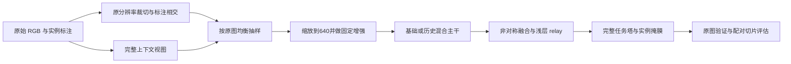

# E 系列：原图切片学习与历史结构复用

_2026-09-08 更新 · 已扩展为 E00–E08 共9组、4种分割网络拓扑与1种训练集引导器对照；尚未完成 E08 正式精度实验。_

---

## 📊 V8 的真实结论

本次建立了 results 下 179 份 CSV 的索引，其中按内容哈希去重为 165 份；展示文件夹的副本不是独立重复实验。历史索引只用于定位证据，不把旧数据、不同 AMP、初始化或协议下的成绩混成一个因果排行榜。本次重点核对了 V8 五组参数、记录的实现哈希及对应 YAML/模块，并回看 G10、SAGE 非对称颈部与细节 relay 的实现。

以下 AP50 来自严格 Mask AP 最佳的同一行，不是分别挑两个峰值；均为百分数。五组均为 300 epoch，V8 组间训练参数无差异。

| 模型 | 最佳 epoch | Mask AP50–95 | 同行 Mask AP50 | 末20轮严格AP均值 |
|---|---:|---:|---:|---:|
| SAGE80 relay control | 238 | 67.337 | 83.058 | 66.099 |
| SAGE81 decoupled P2 | 149 | 66.819 | 82.087 | 65.452 |
| SAGE82 scale budget | 213 | 66.912 | 82.868 | 65.602 |
| SAGE83 phase + scale | 156 | 66.739 | 83.409 | 65.500 |
| SAGE84 phase control | 196 | 67.489 | 83.001 | 66.096 |

84 对 80 的严格 AP 只提高 **0.152 个百分点**，末段均值几乎不变，不能称为稳定显著提升。83 的 AP50 较高，却损失严格 AP。81/82 也没有证明密集 P2 或裁减粗尺度任务塔值得保留。

历史上 G10 baseline 配置曾记录严格 AP 67.681、AP50 83.824，而其 full 配置严格 AP 64.033；不能把整个 full 配方照搬。SAGE60/70/80 relay 控制分别记录 67.503/67.433/67.337，也提示约 67 点平台期，而不是每代都在稳定增长。跨代不完全同协议，以上只是追溯线索。E04 仅把 G10 的部分主干方法放回当前较简洁的 SAGE 结构，重新进行受控验证。

证据：[全量索引](E:/mastercode/1_SEVER/code/ultralytics-main-new/reports/citrus_e_20260907/history.csv)、[V8 审计](E:/mastercode/1_SEVER/code/ultralytics-main-new/reports/citrus_e_20260907/audit.json)。

## 🔍 痛点与切片实测

本地验证集为 193 张、1,049 个实例；173 张是 3072×3072，其余为 3072×4096 或反向。整图缩至长边640会明显压缩极小目标，但这是信息分辨率问题，不能仅靠换注意力解决。

使用 SAGE80 的同一份 `best_mask.pt`，对全部验证原图进行了配对测试。两种模式使用相同的640长边掩膜评价网格、相同 IoU 匹配、低置信度 .001 和整图最多300个实例；切片预测回投原图再做类内框 NMS。

| 模式 | Mask AP50 | Mask AP50–95 | 自定义 tiny R@.25 | CPU推理及融合中位数 |
|---|---:|---:|---:|---:|
| 整图一次 | 81.404 | 59.459 | 17.391% | 160.43 ms |
| 整图 + 四切片 | 74.833 | 60.070 | 40.994% | 669.38 ms |

tiny 定义为整图640尺度可见掩膜面积 <256，161个实例；召回使用 conf≥.25、mask IoU≥.5。它是诊断性分组召回，**不是 COCO APs**。这份 AP 也不是历史 stride4 验证器 AP，不能把 59.459 与训练表 67.337 相减声称回退。

结论：切片让更多极小目标匹配成功（28→66个），但整体 AP50 回退约6.57点、推理时间约4.17倍。裁切碎片重复、背景误检与尺度域变化是待逐项验证的原因，不是仅凭汇总表就能确认的唯一病因。因此不能直接把“切片推理”宣布为最终方案；先学习局部视图，再检查整图推理是否也受益。

PR 曲线最大实际召回率之外的置零补点是当前指标实现的一部分，之前已和官方对应版本核对；不是把末端抬高就改善模型。真正要改善的是实际召回上限、达到高召回时的误检量，以及小实例掩膜 IoU。此次不修改 PR/AP 计算公式，不为了曲线好看删除难例。

证据：[全验证集配对报告](E:/mastercode/1_SEVER/code/ultralytics-main-new/reports/citrus_e_20260907/v8_control_full_paired/paired_metrics.json)。CPU两线程、非GPU部署测速；时间含预测/回投/融合，不含读图和指标计算。

## 🎯 E 系列的选择

9月8日扩展保留 E00–E04 的 YAML 和训练干预定义；新增 E05–E08。入口必须使用 `SUITE="all"` 才运行全部9组；`priority` 为节省资源仍只有 E00–E03，`guided` 仅运行 E03 与 E08。新默认结果目录为 `CITRUS_E9_GUIDED_ALL_300EP`，不复用旧目录；旧实验源码摘要与新批量脚本不同，不应强行解除检查混写。E08 的引导器、证据边界和配对诊断见 [`CITRUS_E_GUIDED_CROP.md`](CITRUS_E_GUIDED_CROP.md)。

SAHI 的思路包括重叠切片、原图与切片结合训练，以及回投整图合并预测。本次阅读了论文与官方 slicing/postprocess 实现，采用其训练/推理解耦思想，而不是声称完整复现 SAHI。[^1] 本项目需要保留接触果实的实例身份，因此不默认把重叠掩膜做并集。

| 编号及 YAML 名 | 网络 | 训练输入 | 要回答的问题 |
|---|---|---|---|
| E00_global_control | SAGE80 relay | 整图 | 当前协议对照 |
| E01_sliced_control | 与 E00 完全相同 | 整图/局部混合 | 仅输入尺度学习是否有效 |
| E02_phase_global | SAGE84 phase + relay | 整图 | 亮度细节旁路是否能复现 |
| E03_phase_sliced | 与 E02 完全相同 | 整图/局部混合 | 细节旁路与局部学习是否互补 |
| E04_hybrid_sliced | phase + 混合主干 + relay | 整图/局部混合 | G10 历史主干组合是否值得复用 |
| E05_hybrid_global | 与 E04 完全相同 | 整图 | E04 的收益是否实际来自切片 |
| E06_phase_context_sliced | 与 E03 完全相同 | 整图75%/局部25% | 更多上下文能否缓解局部输入引入的精度损失 |
| E07_phase_topdown_sliced | phase + 单向颈部 + relay | 整图50%/局部50% | 去掉 P3→P4 回流能否降耗且保持精度 |
| E08_phase_guided_sliced | 与 E03 完全相同 | 整图/热图引导局部混合 | RGB 候选热图是否比固定窗口更有效地分配切片预算 |

这是 **4种分割网络拓扑、9组实验、3种输入配比，另加1个冻结候选引导器**，不是9个全新模块。E04/E05 在 P3/P4 使用历史 `C3k2_Faster`，P5 使用 `C3k2_WT`，池化上下文用 `SPPF_LSKA`；保持非对称融合与 P3/P4/P5 完整任务塔、浅层细节 relay。E08 的分割 YAML 与 E03 完全一致，唯一新增因素是训练集 RGB 热图决定窗口位置；没有重新引入 G10 的 CARAFE/BiFPN/P2Boundary 全部组合，也没有增加 Mamba 或高分辨率密集任务塔。

E05 是必要的混合主干整图对照，不是新增计算分支。E06 不增加层数、切片数量或每轮步数，只改变明确记录的输入混合比例；它基于昨天切片提高 tiny recall 却降低 AP50 的观察，检验上下文保留假设。E07 则真正修改融合连接：移除下采样、拼接和精炼组成的 P3→P4 回流支路，P4 任务塔直接读取自上而下融合的 P4，P5 上下文及 P2 细节通路保留。YAML 的17–22层使用恒等占位维持头部编号23，便于保持初始化键；这些不是昂贵的隐藏计算分支。降低计算是可测事实，精度是否受损则尚待正式训练。

FasterNet 提醒我们算量低不等于实测快；WTConv 提供多频率与大感受野思路；LSKA 提供可分离大核上下文思路。[^2][^3][^4] 这里复用的是本仓库历史改写版本：WT 是单层小波简化实现，FasterBlock 也并非完整官方 FasterNet。它们不是新提出的基础模块，不应作为“首次发明”写进论文。

phase 分支提取去局部均值的亮度相位细节，不等于自动识别果实轮廓，树叶同样有边缘。其对绿色混淆的帮助仍需颜色相近/遮挡难例子集验证。当前不增加自动控制或辅助多任务头，不在缺乏证据时同时改损失、分配器和结构。



## ⚙️ 切片、标注与固定超参数

切片长宽分别取原图的 .6；四角对齐覆盖原图，重叠约为切片尺寸的1/3。先从原始像素裁切，再缩放到640，目标线性尺度相对整图约放大1.67倍，面积约2.78倍。仍然可能缩小原图，不是原分辨率无损输入。

训练每次先选原图，再按该实验的概率选择整图或该图一个有效切片：E00/E02/E05只用整图，E06以 .75概率保留整图，其余混合组为 .5。每轮长度仍为676张源图，batch16通常43个 batch，不会变成3,084个独立训练样本/轮。官方 Mosaic/几何增强保持不变，其辅助图也从源图索引抽取；没有只挑有果实的切片或丢弃背景切片。

多边形使用 Shapely 与裁切矩形求交；不新增 min-pixel/min-area 过滤。若一个实例交集变成多个不连通多边形、含孔或源多边形无效，放弃该整张派生切片，保留原图及原标注；不拼接假边界、不把一个实例拆成几个标签、不把残留果实变成无标签背景。这是派生视图可表达性限制，不是数据清洗。

只读几何检查：676原图、4,324实例，2,408有效局部切片，其中158背景切片；240次切片因源多边形几何无效被拒绝，56次因交集不连通/含孔被拒绝；61张源图只能用整图。混合组实际总体局部抽样概率因此约45.5%（E06约22.7%），并非所有源图都有局部路径。明细保存在 `train_geometry.json` 与运行后 `_prepared_views/views.json`。

| 设置 | 固定值 |
|---|---|
| epoch / 初筛seed | 300 / 42 |
| 初始化 | 当前代码目录 yolo11n-seg.pt |
| AMP / cache | False / True（RAM） |
| imgsz / batch / workers | 640 / 16 / 4 |
| optimizer / lr0 / lrf | AdamW / .001 / .01 |
| momentum / weight decay | .937 / .0005 |
| mask ratio / overlap mask | 4 / True |
| mosaic / close mosaic | 1.0 / 10 |
| scale / dropout | .5 / 0 |
| 推理 conf / NMS IoU / max det | .001 / .7 / 300 |

其余增强、warmup、损失权重完整继承 `protocols/citrus_paper1_formal_v2_ram.yaml`；输入干预记录在 `protocols/citrus_e_slicing_v3.yaml`，v2/v1 仅供追溯。E06的抽样比例和 E08 的候选生成器都是显式输入实验因素，不是偷偷修改 AMP/优化器/学习率。所有旧自定义附加 loss 显式置零。初始化实际继承比例、源图数量、派生视图数量、命令、Git状态与源码摘要均会记录；不要求用户确认指纹，不改用户原始数据路径或划分。

派生图存入新实验目录 `_prepared_views`，只训练集被派生，验证/测试指向原始集合。约3,084张≤640的RGB图，纯像素 RAM 上界约3.8GB，另有标签、进程和缓存开销。整图对照只加载676张全局视图。首次准备会耗时与磁盘空间；完成后重复运行复用派生缓存。`cache=True` 不会让额外推理免费，也不能保证内存不足时仍成功缓存。

## ⚡ 工程验证与算量

九份 YAML 均可通过当前仓库公开 `YOLO(yaml)` 入口构建、前向、真实分割损失反向传播、预训练载入、保存/重载及 fuse 对比。E00–E08 都完成4图fixture、1 epoch、256输入、CPU、cache=True、Mosaic开启的端到端 smoke；E08 另完成 train-only 引导器与有目的窗口几何检查。该 smoke 关闭绘图并降低batch/workers，明确不是正式精度实验。9月8日 E 测试与共享前台入口回归合计 **58项通过**，Ruff检查通过，另增加调度/颈部预算检查。最终日志应保存为 `reports/citrus_e_guided_tests_final_20260908.log`。

| 网络 | 参数量 | GFLOPs @640 | CPU前向中位数 | CPU训练步中位数 |
|---|---:|---:|---:|---:|
| E00/E01 | 2.323M | 10.097 | 112.81 ms | 494.24 ms |
| E02/E03/E06 | 2.325M | 10.359 | 114.30 ms | 489.18 ms |
| E04/E05 | 2.480M | 10.363 | 111.88 ms | 511.11 ms |

同机CPU两线程、batch1、640、合成12实例，交错测量3次预热+10次；训练步包含简化AdamW更新但不含读图/真实增强/验证，GFLOPs估算可能漏计函数式操作。因此只能排查明显算子性能回退，不能承诺服务器GPU训练快多少。切片推理最多5次前向，不能只用上表单次GFLOPs宣传轻量。

9月8日针对新增E07重新配对测量如下，不跨日期拼接耗时比较：

| 网络 | 参数量 | GFLOPs @640 | CPU前向中位数 | CPU训练步中位数 |
|---|---:|---:|---:|---:|
| E03 同轮对照 | 2.325M | 10.359 | 100.31 ms | 437.20 ms |
| E07 单向颈部 | 2.201M | 9.961 | 96.72 ms | 437.56 ms |

E07参数减少约5.3%、估算算量减少约3.8%，但此次CPU训练步并没有变快，不能以算量降低代替速度结论。原始测量在 `reports/citrus_e_20260908_costs.json`；其精度仍未知。

测试与输出位于 `reports/citrus_e_20260907/`：`release_tests.log`、`smoke_test_artifacts/`、`costs.json`、`train_geometry.json`、`v8_control_full_paired/`。本机 NumPy/Matplotlib 不兼容，未改动用户全局环境；正式入口会在训练前检查绘图库，服务器GPU/完整300轮效果尚未验证。

## 🔧 现在怎么运行

将完整的 `code/ultralytics-main-new` 更新到服务器，不要只上传入口或 YAML。保留旧结果，使用新的 E 结果目录。

```bash
cd /data/sxq/code/ultralytics-main-new
python -m pip install -r requirements-citrus-e.txt
python RUN_CITRUS_E.py
```

VS Code 中选择原来的训练 Python 解释器，打开 `RUN_CITRUS_E.py`，修改 `DATA`、`DEVICE`、`PROJECT` 为自己的路径与空闲GPU，然后点右上角运行。默认 all/300/seed42，一共9组，前台逐个运行；不使用 nohup、不同时启动多个模型。Ctrl+C 停止整个队列。电脑/SSH断开导致前台进程退出，仍可能中断训练，前台运行本身不提供断线保活。

设备绑定使用物理卡号：例如 `DEVICE="1"` 会固定 `CUDA_VISIBLE_DEVICES=1`，Ultralytics 在单卡可见环境中显示为逻辑 `cuda:0`，但实际是物理 GPU 1。不要手工把它改为 `0`，也不要从带有 `CUDA_VISIBLE_DEVICES=0,1` 的旧终端启动；旧进程必须先停止并在新终端重启。

建议先将 `EPOCHS=3`、`SUITE="smoke"` 做服务器针对性检查；确认无问题后恢复 all/300，新的项目名由配置自动产生。如果要先减少投入，`SUITE="priority"` 仅跑 E00–E03；只比较固定与有目的切片时使用 `SUITE="guided"`。`DRY_RUN=True` 只检查构建，必须恢复 False 才训练。

每个模型每轮仍用原图验证，保存官方 `best.pt`，并额外保存只按 Mask AP50–95 选择的 `best_mask.pt`。训练完成后默认做整图/切片配对评估，输出 `paired_sliced_eval/paired_metrics.json`；中断后重跑会跳过已完成训练并补做未完成评估，旧半成品评估不覆盖。未完成的训练目录不会自动覆盖；需明确恢复 last.pt 或改新项目，不要误删 best.pt。

单独运行一个模型仍使用同一入口，将 `ONLY` 设置为完整名称，例如 `E03_phase_sliced`。直接 `YOLO(yaml).train(data=原数据)` 能训练网络，但**不会自动启用切片学习**；YAML只能描述网络，不能描述数据采样。单模型完整E03示例：

```python
from pathlib import Path
from ultralytics import YOLO
from citrus_protocol import fixed_train_args, load_protocol
from citrus_slicing import prepare_views, SlicedTrainingTrainer

if __name__ == "__main__":
    data = "/data/sxq/datasets/orange_yolo/data.yaml"
    project = Path("/data/sxq/results/E/E03_SINGLE_NEW")
    prepared = prepare_views(data, project / "_prepared_views")
    model = YOLO("0_orange_yaml/E_series/E03_phase_sliced.yaml").load("yolo11n-seg.pt")
    args = {**fixed_train_args(), **load_protocol()["fixed_validation"]}
    model.train(trainer=SlicedTrainingTrainer, data=str(prepared), project=str(project),
                name="E03", epochs=300, device=1, seed=42, **args)
```

推荐批量入口，因为它还包含资源锁、源码记录、Mask checkpoint 回调与配对评估。

## 📋 决策标准与下一步

先看 E01−E00、E03−E02 的同协议差值，判断输入干预是否值得；再看 E02−E00，避免把输入涨点误归给phase；E04−E03仅能说明整个历史主干组合是否值得，不能分别证明三个组件都有效。

新增关键比较：E04−E05衡量混合主干下的切片干预；E05−E02衡量整图输入下的主干组合；E06−E03仅改变上下文/局部抽样比例；E07−E03仅改变颈部回流结构；E08−E03仅改变候选窗口生成器。不要因扩到9组就挑单次最高值当成显著结论。

如果切片训练后单次整图推理也提高，优先它作为轻量部署方案。若只有五次推理提高，报告真实计算与延迟，不能标为同成本结构涨点。若依旧出现召回升高/精度下降，先按裁切边缘、重复实例、背景误检和置信度排序核查，再做受控融合/校准实验，不继续盲目增加注意力。更细切片、原图高分辨率、候选区域二阶段细化都是备选，但会增加计算，需要实际收益后再决定。

最终胜出方案与控制各补 seed42/43/44，报告均值±标准差；颜色相似、遮挡深凹、接触实例分离、极端尺度子集需要单独量化。在这些结果出来前，E 是可检验的研究方案，不是已证明“超过基线很多”的论文结论。

## 🔗 文献与代码依据

[^1]: Akyon et al. Slicing Aided Hyper Inference and Fine-tuning for Small Object Detection, ICIP 2022. [论文](https://arxiv.org/html/2202.06934v5)；[官方代码](https://github.com/Small-Object-Detection/SAHI)。本次参考原图/局部训练与回投合并，未复制论文的精度结论到柑橘任务。
[^2]: Chen et al. Run, Don't Walk: Chasing Higher FLOPS for Faster Neural Networks, CVPR 2023. [论文](https://arxiv.org/abs/2303.03667)。E04使用本地历史PConv改写，不是完整FasterNet复现。
[^3]: Finder et al. Wavelet Convolutions for Large Receptive Fields, ECCV 2024. [论文](https://arxiv.org/abs/2407.05848)。E04使用本地单层小波版本，不等价于原文多层WTConv配置。
[^4]: [Large Separable Kernel Attention 官方仓库](https://github.com/StevenLauHKHK/Large-Separable-Kernel-Attention)。E04复用历史SPPF_LSKA，不把作者思想写成新发明。
