# CITRUS E V2: slice-aware detail and context routing

_Evidence report and runbook for the completed E-series audit and the new E V2 screening family (2026-09-08)._

---

## 📊 E-series result: what the data supports

The uploaded directory `CITRUS_E9_GUIDED_DEVICEBOUND_ALL_300EP` contains nine completed 300-epoch runs. The audit found 300 CSV rows for every run, the same validation-list hash for all runs, and matching recorded YAML hashes. These results are comparable under the recorded protocol (`amp=False`, `cache=True`, batch 16, 640 input, 300 epochs, seed 42).

| Run | mask AP50 | mask AP50-95 | mask P | mask R | median s/epoch |
|---|---:|---:|---:|---:|---:|
| E00 global control | 83.316 | 67.382 | 92.847 | 75.500 | 15.61 |
| E01 sliced control | 83.565 | 67.962 | 92.154 | 75.022 | 12.46 |
| E02 phase global | 82.716 | 67.227 | 91.209 | 74.179 | 10.08 |
| E03 phase sliced | 84.014 | 67.831 | 90.828 | 75.786 | 13.02 |
| E04 hybrid sliced | 84.152 | 67.578 | 93.624 | 73.499 | 12.20 |
| E05 hybrid global | 83.216 | 67.059 | 89.678 | 75.977 | 10.05 |
| E06 phase context sliced | 83.328 | 67.599 | 88.826 | 75.977 | 9.64 |
| E07 phase topdown sliced | 83.703 | 67.267 | 91.678 | 74.357 | 10.26 |
| E08 phase guided sliced | 84.013 | 68.012 | 91.891 | 75.405 | 8.83 |

### Slicing and adaptive slicing

The paired diagnostic uses a common 640-long-side raster, confidence 0.25, mask IoU 0.5 and 161 tiny instances (area < 256 pixels on that raster). It is deliberately labeled an exploratory diagnostic, not a replacement for the official validator metric.

| Frozen model | Mode | tiny recall | all recall | mask AP50 | mask AP50-95 |
|---|---|---:|---:|---:|---:|
| E00 | global | 21.118 | 79.028 | 82.377 | 61.130 |
| E00 | fixed slices | 46.584 | 85.891 | 76.060 | 61.725 |
| E01 | global | 20.497 | 80.648 | 82.987 | 61.555 |
| E01 | fixed slices | 44.099 | 86.654 | 73.654 | 59.648 |
| E08 | fixed slices | 45.963 | 86.654 | 75.271 | 60.429 |
| E08 | guided slices | 45.342 | 86.273 | 76.334 | 61.549 |

The first conclusion is strong: slicing is useful for recall of very small fruit. In the matched E00 comparison, tiny recall increases by 25.466 percentage points. It costs extra inference passes and, with the old box-only cross-view NMS, loses precision through duplicates. Therefore slicing should be treated as a recall arm with a mask-aware merge, not as a free replacement for whole-image inference.

The second conclusion is deliberately conservative: adaptive slicing is not yet necessary. E08 guided slicing improves the common-raster AP50-95 over E08 fixed slicing by 1.120 points, but tiny recall is 45.342% versus 45.963%; its paired bootstrap interval for the tiny-recall difference includes zero. It is a promising factor for E V2, not an established requirement.

The new cross-view mask diagnostic reduces duplicate detections without using ground truth. On E00 it changes fixed-box merging from 166 duplicates to 22 for the mask-aware arm; the border-trusted arm has 21 duplicates and common-raster mask AP50-95 of 69.185. On E01 the corresponding counts are 171, 27 and 27; the trusted arm gives AP50-95 69.990. These numbers are same-weight diagnostics and must not be mixed with the official stride-4 validator AP.

The remaining bottleneck is not only crop selection. Even after slicing, tiny recall is about 44–47%, so more than half of the tiny instances remain unmatched at the fixed threshold. The colour-confusion hypothesis is plausible from the task and background-error counts, but background errors alone cannot prove “green leaf versus fruit”; a label-defined colour/occlusion hard subset is still required.

## 🧭 E V2 design

E V2 keeps the reproducible input factors and changes the network in controlled steps. The design borrows principles, not source-code copies: RepViT’s separation of spatial mixing and channel mixing[^1], Gold-YOLO’s shared multi-scale gathering and injection[^2], FreqFusion’s low-frequency semantic/high-frequency detail division[^3], and DGNet’s explicit detail/context interaction[^4]. Full FreqFusion CARAFE and DySample kernels are not inserted because their adaptive intermediate tensors and custom sampling paths would confound the speed budget; E V2 uses ordinary depthwise convolution, pooling, resize and pointwise gates.

```mermaid
flowchart LR
    accTitle: E V2 citrus architecture
    accDescr: The network preserves a high-resolution detail path, replaces CSP stages with lightweight spatial-channel mixers, gathers multi-scale context once, and injects it in parallel before contrast-aware instance prototypes.

    input([RGB image]) --> stem[Stride 4 stem]
    stem --> p2[P2 detail]
    p2 --> rep2[Rep spatial-channel stages]
    rep2 --> c3[P3]
    c3 --> c4[P4]
    c4 --> c5[P5 semantic]
    c3 --> hub[Shared context hub]
    c4 --> hub
    c5 --> hub
    p2 --> contrast[Centre-surround detail gate]
    hub --> inject[Parallel context injection]
    contrast --> head[Instance segmentation head]
    inject --> head
    head --> output([Masks and boxes])

    classDef primary fill:#dbeafe,stroke:#2563eb,stroke-width:2px,color:#1e3a5f
    classDef accent fill:#ede9fe,stroke:#7c3aed,stroke-width:2px,color:#3b0764
    classDef success fill:#dcfce7,stroke:#16a34a,stroke-width:2px,color:#14532d
    class stem,p2,rep2,c3,c4,c5 primary
    class hub,inject accent
    class contrast,head,output success
```



| Arm | Controlled change | Purpose |
|---|---|---|
| E20 | E01 architecture/input control | isolates new factors from slicing |
| E21 | E20 + centre-surround contrast detail | test leaf/fruit edge and local contrast |
| E22 | E20 + shared context hub/injection | replace repeated PAN round trips |
| E23 | E20 + lightweight Rep spatial/channel backbone | test backbone change alone |
| E24 | E23 + context hub/injection | test backbone plus neck |
| E25 | E24 + contrast detail head | full structural model with fixed slices |
| E26 | E25, whole image only | slicing input control |
| E27 | E25, fixed RGB guide plus slices | adaptive-slicing control |

The rep backbone is now a real budgeted change: E20 is 2,323,380 parameters and 10.097 GFLOPs at 640; E25–E27 are 1,757,587 parameters and 9.115 GFLOPs. These are construction measurements, not a claim of training accuracy or end-to-end latency. The local CPU microbenchmark is in `reports/citrus_e_v2/cost_cpu.json`; whole-image and five-view inference must be measured separately on the server GPU.

## ⚙️ Files and training

The standard YAML entry points are in [`0_orange_yaml/E_V2_series`](../0_orange_yaml/E_V2_series). The foreground launcher is [`RUN_CITRUS_E_V2.py`](../RUN_CITRUS_E_V2.py); the batch implementation is [`20260908_citrus_e_v2_batch.py`](../20260908_citrus_e_v2_batch.py). The formal protocol records `cache: true`, `amp: false`, batch 16, image size 640, four workers and AdamW.

On the server, copy the complete `ultralytics-main-new` directory and edit only the machine-specific constants at the top of `RUN_CITRUS_E_V2.py`:

```python
DATA = "/data/sxq/datasets/orange_yolo/data.yaml"
DEVICE = "1"
SUITE = "all"
EPOCHS = 300
```

Then run in the activated environment and keep it in the foreground:

```bash
cd /data/sxq/code/ultralytics-main-new
python RUN_CITRUS_E_V2.py
```

The queue is sequential and has a single-GPU guard. `cache=True` is fixed in the launcher and protocol. Press `Ctrl+C` to stop before the next model; an existing completed run is skipped only when its marker, final CSV and checkpoint agree. `--device 1` is a physical GPU request; do not pre-set a conflicting `CUDA_VISIBLE_DEVICES` in the same terminal.

For a build-only check before training:

```bash
python 20260908_citrus_e_v2_batch.py --data /data/sxq/datasets/orange_yolo/data.yaml --suite all --device 1 --dry-run
```

## 🧪 Verification record

The E V2 regression suite passed: 85 tests, including all eight YAML builds, real segmentation loss/backward propagation, fused forward equivalence, pretrained head re-indexing, empty-image loss, cross-view duplicate/fragment/touching-mask cases, one-epoch source-balanced runner smoke tests, adaptive-guide plumbing, and legacy E tests. Ruff checks passed for all new and changed Python files.

No E V2 precision result exists yet. Run `screen` first if GPU time is limited, then `priority` or `all`; the 300-epoch output must be compared under the same validation split and fixed hyperparameters. Do not conclude that any arm improves AP until its CSV and paired evaluation are complete.

## 🔗 References

[^1]: Wang, A. et al. (2024). “RepViT: Revisiting Mobile CNN From ViT Perspective.” CVPR 2024. https://openaccess.thecvf.com/content/CVPR2024/html/Wang_RepViT_Revisiting_Mobile_CNN_From_ViT_Perspective_CVPR_2024_paper.html

[^2]: Wang, C. et al. (2023). “Gold-YOLO: Efficient Object Detector via Gather-and-Distribute Mechanism.” NeurIPS 2023. https://papers.nips.cc/paper_files/paper/2023/hash/a0673542a242759ea637972f053b2e0b-Abstract.html

[^3]: Hang, T. et al. (2024). “Learning a Feature Pyramid Network with the Frequency-Aware Feature Fusion.” IEEE TPAMI 46(12). https://arxiv.org/abs/2408.12879

[^4]: Ji, G.-P. et al. (2023). “Deep Gradient Learning for Efficient Camouflaged Object Detection.” Machine Intelligence Research. https://github.com/GewelsJI/DGNet

