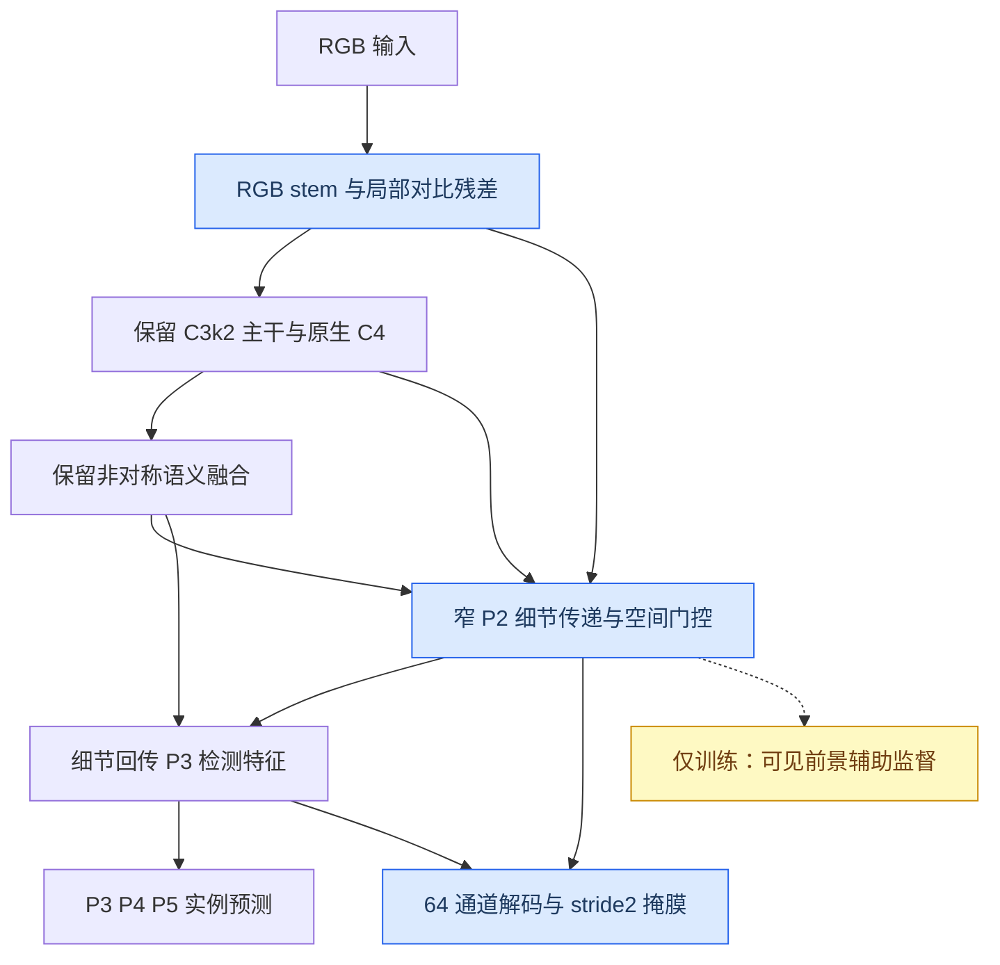

# E V10：V9 证据复盘、结构取舍与运行说明

_2026-09-16；状态：代码及短训练验证完成，正式精度待实验。本文是架构决策记录，不是论文效果结论。_

---

## 📊 结论与审计范围

V9 有值得保留的结果，但不能称为全面突破。相对于 V9_01，V9_05 的训练验证 Mask AP50 提高 **0.327 个百分点**、AP50–95 提高 **0.311 个百分点**；同轮 Recall 反而下降 0.557 个百分点。V9_03 的过度压缩、V9_08 的完整组合没有胜过锚点。不能把“所有分支都打开”当作最佳方法。

本次逐文件扫描 results 下 256 份训练 CSV（242 份不同内容），关联其参数和当前 YAML，重点复核 V6–V9 及 SAGE/E 的特征路径、损失、切片、验证实现。完整索引及源码类定义映射在 [审计目录](E_V10_REVIEW_20260916/)。这不等于逐行阅读全部历史仓库，也不等于当前代码与历史服务器代码完全一致。

V9 十组均完成 300 epoch；回传的训练/验证文件列表各只有一种哈希，YAML 哈希全部对上；实际 best_mask.pt 均可加载为 SegmentCitrusEV9。除模型/输出名称，训练参数差异是 00 的 copy_paste=0、其余=.3，以及 09 使用 cosine。V9 使用 676 张源训练图、193 张验证图，不能仅凭服务器目录叫 orange_yolo 就断言用了早期泄漏划分。没有完整服务器代码快照，不能声称已经证明所有运行环境完全相同。

### V9 的训练验证结果

下表单位 %，每行均取该模型最佳 Mask AP50–95 的**同一轮**；不是各列独立挑峰值，不是独立测试集结果。

|模型|Recall|Mask AP50|Mask AP50–95|判断|
|---|---:|---:|---:|---|
|00 phase control|74.166|84.282|71.504|无 copy-paste 对照|
|01 geometry CP anchor|76.835|84.580|71.607|稳健参照|
|02 mask neck|76.454|84.020|71.542|未见稳定收益|
|03 compact basis|76.358|83.818|71.070|压缩过强|
|04 dual route|77.216|84.507|71.286|Recall 略高，AP 下降|
|05 tiny overlap|76.278|84.907|71.918|训练 AP 最好，非所有 Recall 最好|
|06 dual tiny|75.533|84.494|70.917|组合负效应|
|07 background quality|76.740|84.850|71.737|整图略好，细切片不占优|
|08 complete|76.714|84.114|70.953|完整组合不保留|
|09 complete cosine|74.357|84.300|71.291|学习率无法补救全部结构问题|

末 20 轮 AP：01 为 71.235，05 为 71.475，08 为 70.511。05 不只是一次峰值突出，但仍只有一个 seed，不能宣称统计显著。

训练 CSV 的 GT 栅格与统一原图评估不同，下表不能与上表直接拼接比较：

|模型|统一整图 AP50–95|细切片 AP50–95|细切片 R90|tiny 检出 /161|
|---|---:|---:|---:|---:|
|V9_01|68.296|77.273|81.026|93|
|V9_05|68.349|77.259|80.648|100|
|V9_07|68.424|76.540|79.981|89|
|V9_08|67.317|76.576|80.170|88|

R90 是现有评估器插值后的 P≥90% 时 Recall；新诊断文件另列已保存原始阈值点 R90，数值不完全相同，必须注明算法。V9旧文件最多保存1000个抽样阈值，不能从中恢复全部阈值，所得值只是已保存点中的最大值；V10新增完整阈值导出，不改变AP计算。tiny 是长边 640 栅格下可见掩膜面积 <256 的实例，固定 conf=.25、IoU=.5 匹配，不是 COCO APs。

### 历史经验的取舍

|历史证据|可保留的方向|不能据此声称|
|G00 83.250/67.031，T02 G10 复测 AP=67.115|保持匹配协议的锚点|旧 G10 大涨点全部来自架构|
|SAGE V4R 30→42，AP 66.719→67.502|浅层细节与语义的非对称融合值得研究|所有反馈/注意力都有效|
|E30 AP≈68.165|有效历史组合不能丢弃|跨划分、初始化直接排名|
|V6 细原型/更细 GT 栅格一起改变|保留高分辨率掩膜，并统一评估栅格|其训练 AP 增益全是网络贡献|
|V7 几何与 copy-paste 较好；P2/DCN 并非稳定赢家|保留可见掩膜几何约束|检测头越密、算子越复杂越好|
|V8 移除原生 P4 的 05：AP70.348，00为71.276|保留空间语义和 P4 路径|语义路径可以随意删掉|
|V9_03 和 08 下降|适度压缩，做独立消融|强压缩加新模块自然补回精度|

历史完整数值见 [全历史索引](E_V10_REVIEW_20260916/全部历史结果索引.md)。AMP、数据划分、输入、预训练及掩膜栅格改变的运行只作线索，不作论文公平对照；特别不能将早期 AMP=True 的 78 分与后期全部配置的 84 分之差归功于架构。

## 🔍 PR 的问题究竟在哪里

横轴是 **Recall，不是置信度**。源码 `ultralytics/utils/metrics.py::compute_ap` 在最大实测召回后追加零精度端点；因此曲线末端的垂直落零包含绘图/AP 积分约定，不代表一个实际阈值突然让全部预测错误。没有修改此函数或旧结果图。

但前面的精度下降是真实问题。V9_05 的细切片评估原始曲线最后一个实测点 P≈0.0300、R≈0.9638；整图为 P≈0.0812、R≈0.9066。阈值降得很低时，误检大量增加，而一部分实例依然无法正确匹配。去掉补零尾巴只会解释图，不会提高能力。

V9_05 在 conf=.25、IoU=.5 时：

|模式|总检出 /1049|tiny 检出 /161|背景类 FP|tiny FN /全部 FN|
|---|---:|---:|---:|---:|
|整图|838|35|136|126/211|
|细切片|937|100|369|61/112|

结论是：**切片显著改善极小目标，但引入了更多背景候选**。提高 Recall 同时控制 FP 才是任务目标。自动归类的“背景 FP”并不证明全部来自绿色叶片；确认颜色混淆还需要人工检查、亮度/色度干预及错误图对照。

本次新增 `citrus_pr_diagnostics.py`，从已有 paired_metrics.json 导出原始阈值 CSV、Rmax、P≥.85/.90/.95 的原始点 Recall 和不人为补零的诊断 SVG。官方 AP、官方曲线和标准指标保持不变。V9 十组诊断已另存 [PR 目录](E_V10_REVIEW_20260916/PR/)，没有覆盖 results。

接下来要分别排查：下采样/栅格消失、TAL 未分配、定位或掩膜 IoU 不足、NMS/切片合并误删、低阈值背景误检。现有总指标尚不能精确划分每一环的贡献；不能把所有漏检都归因于颜色或超小目标。

## 🎯 V10 的三个待验证假设

### 1. 保留 RGB，补充相对结构线索

`EV10ContrastStem` 保留原 stem 的 RGB 卷积及预训练参数名，同时计算灰度局部对比度：局部均值和方差窗口7，方差稳定项 .05²，tanh 限幅，经过窄卷积后用零初始化残差系数加入 RGB 输出。数据仍是三通道，不预计算 Canny、不改标注。

假设：相对亮度结构可帮助区分同色目标和背景。风险：叶缘、阴影也有高对比度，不能称为颜色不变性，更不能假设边缘必然属于果实。03 对 01 检验这一路是否真的有价值。

### 2. 细节先参与检测，再参与掩膜

`EV10DetailTransport` 把 stride2 stem 的窄特征通过像素重排传到 stride4 的 16 通道细节路径，用原生 C4 的**空间**语义门控作一次有界残差更新，然后接入原有 detail→P3 检测回传；更新后的细节也提供给掩膜解码器。

与 V9_02 只在检测回传之后修改 mask 细节不同，这次新路径能够影响小目标候选的检测特征。局部 3/7 窗口差分是输入信号，不是 softmax 中无效的公共偏置。保留原生 P4、P3/P4/P5 检测层及8400个候选；不增加密集 P2 检测头。

`EV10BalancedProto` 则用64通道普通空间卷积替代原宽原型解码器；没有重复采用 V9 已失利的32通道 depthwise-only方案。解码器单独消融，防止压缩效果与新旁路混为一谈。

### 3. 不依赖匹配成功的训练辅助监督

V9 tiny Dice 只对已有正样本分配的 tiny GT 起作用。V10 可选一个仅训练时执行的 P2 前景分支，直接从真实可见实例掩膜构造辅助目标：每个存活实例的正像素总权重相同，背景单独平均；gain=.1。它不需要该 GT 先获得 TAL 正样本，且不增加推理检测头。

这仍是语义辅助监督，**不是**新的实例匹配器，不负责区分相邻两个果实，也不能恢复已经消失的 GT 栅格。对 overlap 标注图使用最大池化保留占用，但同一输出格的不同实例仍可能碰撞；因此只能说监督更多可见前景，不能说所有 tiny 均无损保留。

### 完整候选的数据流



如实界定：这次修改了**主干入口、跨层信息路径、掩膜解码结构和训练目标**，不是将整个 C3k2 主干替换为 HRNet，也不是复现 PID 控制器。残差、误差项和限幅可作为设计启发，尚无控制稳定性证明，不应包装成“自动控制理论创新已成立”。

## 📚 论文与外部建议的取舍

这次借鉴 Lite-HRNet 的轻量高分辨率信息交换、DGNet 的上下文/纹理分工、RefineMask 的细粒度掩膜思路；它们分别提供方法线索，不是证明 V10 在柑橘上必然涨点。[^1][^2][^3]

|来源/建议|本次取舍|理由|
|Lite-HRNet|窄细节路径，不整网照搬|原方法的人体姿态结果不能直接等同实例分割收益|
|DGNet|结构线索受上下文约束|伪装任务相关，但梯度也会突出叶枝|
|RefineMask|保留细原型，改适度解码|细边界有意义；不能把粗原型插值称为恢复丢失信息|
|截图 ABC/CLFT|借鉴局部与语义分工，不直接接模块|原论文是红外小目标；本地 CLFT 固定空间线性维度和较重注意力不适合直接接入|
|ConDSeg 对比聚合|不接入当前轻量主线|本地实现需要前景/背景支路和 unfold/fold，激活开销需专门验证|
|完整 HRNet、DCN、2–3轮迭代融合|暂不纳入|计算和实现风险高，现有历史结果未支持必须使用|

截图原文对应 [ABC 论文](https://arxiv.org/abs/2303.10321) 与 [作者代码](https://github.com/PANPEIWEN/ABC)。它研究红外小目标，不能由截图标题就认定为 CVPR；本地集合将 CLFT 标为 ICME 2023，本文不沿用“CVPR ABCNet”的说法。[^4]

实际重点查看了桌面 `github/Lite-HRNet/models/backbones/litehrnet.py`、`github/DGNet/lib_pytorch/lib/DGNet.py`，以及 Plug-play 集合的 CLFT、ContrastDrivenFeatureAggregation 等。模块集合是二手实现，论文任务、输入条件、原作者代码和许可需分别核对，不能因为目录声称顶会就全部采纳。

其他 AI 的两处关键问题：

1. 对所有 key 减同一个窗口均值，`q·(k_j−mean(k))` 只是对同一行 logits 减去常数，标准 softmax 后**完全不变**。已写数学等价测试，不能把它当有效创新。
2. `low * sigmoid(conv(GAP(high)))` 是通道权重，不带空间位置；系数在0到1，不能直接解释为“选择哪里并放大”。V10 保留恒等残差，并使用空间门控。

“Dice 必然偏大目标”也过于绝对，取决于按图像、按实例还是按像素归约。V9 已按实例聚合 tiny Dice；V10 辅助前景按实例面积平衡，不能仅靠更换损失名字解决问题。

## 🧪 十组对照与验证

|编号|相对参照的改变|参数量 M|THOP GFLOPs@640|主要对照|
|---|---|---:|---:|---|
|V10_00|精确重放 V9_01|2.230|10.219|历史锚点|
|V10_01|精确重放 V9_05|2.230|10.219|tiny loss vs00|
|V10_02|01 + 64通道解码替换|2.181|8.993|vs01|
|V10_03|01 + 对比残差 stem|2.230|10.261|vs01|
|V10_04|01 + 早期细节传递|2.234|10.380|vs01|
|V10_05|03 + 细节传递|2.234|10.423|vs03/04|
|V10_06|05 + 64通道解码|2.186|9.197|vs05/02|
|V10_07|01 + 训练前景辅助|2.230|10.219|vs01|
|V10_08|06 + 训练前景辅助|2.186|9.197|vs06/07|
|V10_09|08，仅 cosine LR|2.186|9.197|vs08|

00 和01是已有改进模型锚点，**不是原生 YOLO 基线**。08不是预先认定的赢家；若02或07更好更快，就保留较简单方案。

已完成：10组官方 YOLO YAML 构建、空/非空GT前向反向、矩形输入、Conv/BN fuse、预训练映射、保存重载、00/01与V9同权重逐值一致；加旧V9回归、完整阈值导出、源码依赖和前台入口合约，共111项通过。00/08/09完成CPU小样本真实切片1epoch、best_mask保存重载、独立验证；08另验证训练后两种切片预算的配对评估与PR诊断。参数及原始CPU测时见 [验证记录](E_V10_REVIEW_20260916/verification_cpu.json)。

短训练只验证工程链路，验证集仅2图6实例、128输入，不代表任何准确率。CPU Torch2.8通过不等于已在服务器Torch1.13.1/CUDA验证；新源码采用Python3.8可解析语法，没有新Mamba/DCN扩展依赖。

08相对01参数约−1.97%，THOP约−10.0%，但THOP不完整计入函数式池化、重排和逐元素算子。CPU测时有新增开销，**未承诺GPU更快**。正式服务器先观察前3–5轮稳定后的秒/轮和峰值显存；切片推理须报告每张原图全部视图及合并时间，不能只报单视图GFLOPs。

## ⚙️ 固定协议与批量运行

入口：[RUN_CITRUS_E_V10.py](../RUN_CITRUS_E_V10.py)。YAML统一位于 `0_orange_yaml/E_V10_series`，已登记 MODEL_INDEX.csv。完整固定项是 `protocols/citrus_paper1_formal_v2_ram.yaml`，V10差异是 `protocols/citrus_e_v10.yaml` 和 suite 清单。

|项目|固定值|
|---|---|
|epochs / imgsz / batch / workers|300 / 640 / 16 / 4|
|AMP / cache / dropout|False / True / 0|
|初始化|同一份 yolo11n-seg.pt|
|optimizer / lr0 / lrf|AdamW / .001 / .01|
|momentum / weight_decay|.937 / .0005|
|warmup / nbs / patience|3 / 64 / 300|
|mask_ratio / overlap_mask|2 / True|
|copy_paste / mosaic / close_mosaic|.3 / 1 / 10|
|boundary / neighbor / NWD|.5 / .25 / 0|
|tiny loss|00=0；其余=.25|
|visibility auxiliary|07/08/09=.1；其他0|
|LR日程|00–08 linear；09 cosine单因素|
|源图采样|.5整图/.25粗切/.25细切；按源图平衡|
|seed|筛选42；正式锚点与最终方法42/43/44|

没有重做启发式先验切片，没有更换数据划分、剔除tiny标注或重启单GPU占用保护。记录文件和实现哈希只用于复现实验及防止覆盖混用，不要求用户确认某个新数据集名字。

上传**整个最新 code/ultralytics-main-new**，不只上传入口脚本。服务器编辑：

```python
DATA = "/data/sxq/datasets/orange_yolo/data.yaml"  # 你实际的清洗数据路径
DEVICE = "1"  # 物理GPU编号
SUITE = "all"  # 十组；priority为01/02/03/04/07/08
EPOCHS = 300
DRY_RUN = False
```

VSCode选择已配置好的Python解释器，打开入口，点击右上角运行；或终端：

```bash
cd /data/sxq/code/ultralytics-main-new
python -u RUN_CITRUS_E_V10.py
```

输出默认 `/data/sxq/results/E/E_V10/CITRUS_EV10_ALL_300EP`。当前进程前台、一次一模型；队列按固定seed随机排序并写ledger，不一定从00开始。Ctrl+C停止且不启动下一组。只有 `DRY_RUN=True` 才构建后退出；默认False会实际训练。

成功完成的同项目运行会跳过，半途结果不会被覆盖，也**不会自动恢复**；要跳过半途组，用ONLY列其余完整模型名；更换实现/配置或要重新跑半途组时，改用新PROJECT。训练后自动生成coarse/fine配对结果、PR原始阈值文件。cache=True占用RAM，若RAM不足导致交换分区抖动会更慢，需先核实内存；不要悄悄让不同组使用不同数据协议。

单模型可通过 `YOLO("0_orange_yaml/E_V10_series/模型名.yaml")` 构建并自动获得对应损失；但仅调用默认官方 `.train()` 不会自动复现自定义切片采样/验证栅格。要作公平单模型实验，优先在入口ONLY指定一个模型，或使用同一EV6TrainingTrainer和固定训练参数。

## 📋 验收与后续论文边界

先看01对照能否复现V9_05，再看02/03/04/07的独立作用，最后判断05/06/08的组合是否互补。接受标准不是PR尾巴变漂亮，而是同协议下 AP50、AP50–95、R90、tiny Recall改善，且背景FP和实测时延不出现明显退化。小幅差异必须三seed复跑；验证集选方案，独立test仅作最终报告。

遮挡叶枝、接触果实需要另按solidity/凸包缺损、实例间隙、split/merge错误、单图尺度比统计。当前证据不足以声称V10已解决这些问题，也不能将绿色混淆假设当作已验证病因。

这三个方向是**研究假设**，不预支“创新成立”“大幅涨点”或“一区接收”。最后的论文贡献须由严格消融、跨模型公平对照、任务难例和部署速度共同支撑。

## 🔗 方法来源

[^1]: Yu et al. (2021). Lite-HRNet: A Lightweight High-Resolution Network. CVPR. https://arxiv.org/abs/2104.06403 ; author code https://github.com/HRNet/Lite-HRNet
[^2]: Ji et al. Deep Gradient Learning for Efficient Camouflaged Object Detection. Machine Intelligence Research (2023). https://arxiv.org/abs/2205.12853 ; author code https://github.com/GewelsJI/DGNet
[^3]: Zhang et al. (2021). RefineMask: Towards High-Quality Instance Segmentation with Fine-Grained Features. CVPR. https://arxiv.org/abs/2104.08569
[^4]: Pan et al. (2023). ABC: Attention with Bilinear Correlation for Infrared Small Target Detection. https://arxiv.org/abs/2303.10321 ; author code https://github.com/PANPEIWEN/ABC
