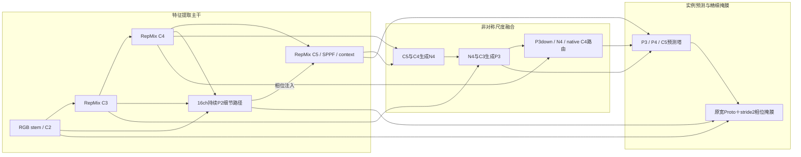

# E V11：持续细节主干与可检验的背景聚合重构

_2026-09-17；RGB 可见未成熟柑橘实例分割；12组配置已实现，正式精度尚未训练。_

---

## 📊 从结果出发，而不是继续叠模块

本次重新扫描results的266份训练CSV，其中252份内容唯一，均建立了YAML对应；没有CSV读取错误。
重点核对V10十组300轮结果、回传模型YAML和当前模块/损失依赖，同时回看历史关键消融。
来源和全量索引保存在 [历史索引](E:/mastercode/1_SEVER/code/ultralytics-main-new/docs/E_V11_REVIEW_20260917/全部历史结果索引.md)。
符号定位不等于每个历史服务器版本都经过完整源码复现：旧轮次缺少完整源码快照，不能伪造这个保证。

V10内部十组加载名单一致，YAML哈希均与当前对应配置吻合。下面均为百分数；训练列取最佳Mask AP50–95的同一轮。
整图/细切片列采用回传的统一原图640栅格评估，与训练验证CSV不是同一种栅格协议，不能混着排名。

|V10模型|训练 Mask AP50 / AP50–95|细切片 Mask AP50–95|细切片 R90|tiny TP / 背景FP|
|---|---:|---:|---:|---:|
|00 几何锚点|84.406 / 71.829|77.405|80.744|98 / 493|
|01 tiny Dice|84.280 / 71.611|76.738|79.886|91 / 368|
|02 压缩解码器|84.142 / 71.324|75.947|80.267|97 / 428|
|03 对比入口|84.811 / 71.945|76.799|80.553|88 / 365|
|04 细节传递|84.978 / 71.952|77.250|81.125|100 / 386|
|05 入口＋细节|84.827 / 72.124|76.645|79.790|97 / 419|
|06 结构＋压缩|84.429 / 71.549|76.548|79.504|96 / 387|
|07 可见性监督|84.237 / 71.463|76.367|79.600|92 / 369|
|08 全部叠加|83.895 / 71.113|76.782|81.506|94 / 381|
|09 叠加＋余弦|84.319 / 71.347|77.185|81.220|93 / 373|

R90：经验PR中Precision≥90%时能达到的最大Recall，不是置信度0.9。
tiny：原图统一长边640后可见掩膜面积<256像素，共161实例；TP在conf=.25/Mask IoU=.5匹配，不是COCO APs。
完整Recall/AP/末20轮稳定性表见 [V10结果对照](E:/mastercode/1_SEVER/code/ultralytics-main-new/docs/E_V11_REVIEW_20260917/V10结果对照.md)。

### 保留与舍弃的证据

V10_05训练和整图AP最好，但不是切片部署的全能冠军：V10_00细切片AP最高，04 tiny TP最高，08 R90最高。
04→05加入对比入口，整图AP增加0.250点，但细切片AP下降0.605点、R90下降1.335点、背景FP增加33个。
因此保留05作为结构参考，主线从04的小目标路线出发；不强制全部使用颜色对比入口。

02相对01压缩掩膜解码器：训练AP下降0.287点、细切片AP下降0.791点；06相对05训练AP下降0.575点。
07相对01可见性监督：训练AP下降0.148点、细切片AP下降0.371点。
08相对05全部叠加：训练AP下降1.011点。余弦调度没有消除这个问题。
所以V11不沿用压缩Proto解码器，不默认加全GT可见性辅助监督，不随意更换优化器。
tiny Dice在V9有收益，但V10_01相对00反而下降0.218点，不视为稳定贡献；本轮固定=.25以避免混淆新结构比较。

### 历史不是作废，而是要按协议使用

V7/V8/V9中的重P2检测塔、轻量化Proto、负质量强抑制及全部组合没有稳定胜出，不能只挑峰值。
V8移除原生P4在本系列下降，支持重新研究原生尺度信息；V9额外mask颈部放在检测后，无法直接补回检测漏果。
V6的高分辨率Proto包含GT栅格变化，不能把全部收益归因于结构。
SAGE细节与非对称路线、E切片与边界/邻接监督继续保留为基础，而不是每轮推翻。
老G10、AMP、旧数据泄漏和初始化差异不能用来证明某个主干必然大幅涨点；跨系列数字只作线索，正式结论需要同协议复跑。

## 🔍 PR曲线与任务真正的瓶颈

### 跳崖置零有两种来源

横轴是Recall，不是Confidence。官方AP计算在最大可达召回之后补零，图中随后贴着0不代表在那里真的取得了某个工作点。
检查V10_05完整经验点：整图最大Recall=.919924，最后真实Precision=.061084；细切片最大Recall=.962822，最后真实Precision=.027561。
真实尾点并非0；画图外推与实际误检必须分开。我们不改官方AP、不删困难GT、不截曲线伪造改善。

不过真实低置信度尾部也确实很差。细切片在conf=.25有941 TP、108 FN；其中tiny FN=64，占FN的59.3%；
背景FP=419、重复=21、定位错误=13。tiny召回97/161≈60.25%，而最大面积组183/183。
这是输入尺度不足与真实背景误检并存，不是单靠调置信度或修绘图就能解决。
“背景FP”还不能直接等同于叶片颜色混淆，需要把FP回投原图区分叶片、枝条、截断果实、未标果实和重复融合。

### 需要解决的两个中心和一个约束

首先，保留输入尺度：沿用均匀多尺度切片混合，禁止RGB先验挑片、丢小标签或强制圆形先验。
其次，把浅层精细信息的存在时间延长到主干内部，而不是等C5提取完才在头部补一条P2路径。
绿色混淆则学习局部相对证据与语义上下文，不能假设边缘/高频天然就是果实，因为叶片也有大量边缘。
遮挡可见掩膜本来就会深凹，凸包/圆形约束可能填满叶枝遮挡；接触果实又需要分离，因此保留可见边界与邻接项，不引入amodal目标。

### 数据协议存在实质差异

V10服务器验证193图/1049实例，本地正式数据也是193图却有1181实例，文件名交集只有45。
服务器验证文件名中123个属于本地train，25个属于本地test；这不是服务器内部train/val泄漏率的证明，训练原图映射尚未回传。
但不能认定两者同一划分；若内容也一致，本地25张test已经在历史验证中用于选模型。
详见 [只读数据核对](E:/mastercode/1_SEVER/code/ultralytics-main-new/docs/E_V11_REVIEW_20260917/数据划分差异.md)。
没有改动原数据、标签或用户服务器路径。V11仍使用用户指定DATA；论文定稿前必须锁定真实划分、标注版本及真正未调参的测试集。
本地32图冻结分配探针和本地几何统计不当作V10服务器验证集的直接因果结论。

## 📚 论文与代码如何转化成方法

|依据|实际核对的代码|V11取舍|
|---|---|---|
|Lite-HRNet，CVPR2021[^1]|github/Lite-HRNet/models/backbones/litehrnet.py|持续高分辨率，但仅16通道；不照搬全套HRNet|
|RepViT，CVPR2024[^2]|github/RepViT/model/repvit.py|空间/通道混合分离，可重参数化；浅层C2仍保留普通密集卷积|
|FreqFusion，TPAMI2024[^3]|Plug-play中的FreqFusion.py与作者README|借鉴语义一致性/细节区分；不搬CARAFE、可变重采样和unfold|
|DGNet，MIR2023[^4]|github/DGNet/lib_pytorch/lib/DGNet.py|纹理与上下文应有分工；不假定所有纹理都是前景|
|RFLA，ECCV2022[^5]|github/mmdet-rfla/.../ranking_assigner.py|关注微小目标的匹配问题；没有宣称复现RFLA|
|NWD，作者实现[^6]|github/NWD/.../losses/iou_loss.py|只在tiny分配质量中小比例混合距离；真实框回归仍CIoU/DFL|
|LAST-ViT，作者论文与仓库[^7]|github/LAST-ViT/cls_pretrain/conf.py|C5选择性聚合，与同结构GAP成对测试；替换注意力，不叠加|

这些是已核对的相关实现，不是声称两个大文件夹中的所有模块都是顶会论文或都已完整阅读。
部分Plug-play版本依赖mmcv.ops.carafe；参数小也可能慢，因此没有原样搬入这类高分辨率动态算子。

### LAST-ViT的迁移边界

论文讨论全局表征被无关背景patch主导，方法在**通道维度**滤波，并按通道选稳定patch聚合；不是空间低通或单纯增加register。
论文公式的稳定分数分子与发布代码有差异：V11跟随作者代码使用原始特征为分子，加入1e-6分母保护，top-1/通道。
只在C5做选择；原始稠密特征和P2细节位置全部保留。V11没有CLS分类头，选择后返回稠密残差是我们的任务迁移，不是完整LAST-ViT复现。
CNN通道没有自然频率排序，稳定patch也可能是大果或叶片：收益必须由10/11对照验证，不能引用论文就宣布解决绿色混淆。
仓库已下载到 `C:/Users/33836/Desktop/github/LAST-ViT`，核对commit：`cdeb884af65e7774f2da80f666d95cf09a76b717`；保留MIT许可说明。

### 自动控制思想的准确边界

所给胡寿松教材为635页扫描件。本次只读前言/目录及印刷第3–5页关于给定、测量、偏差、扰动与反馈的基础内容，不声称读完整本。
将深层语义作为参考、浅层低频作为测量，用偏差表达学习修正，且残差增益有界、注入初始为0。
但是网络仍为有限深度前馈DAG，无物理被控对象、时间状态或迭代收敛证明；不能称PID控制器，也不能宣称闭环稳定性已经证明。
参考减测量和tanh增益只是可检验的设计启发，不单独构成新颖性证据。

## ⚙️ 结构、消融与固定超参

### 综合候选06的实际拓扑



C3/C4/C5内空间混合已改，不是只在头部加注意力；但保留CSP投影容器用于稳定迁移，不称完全抛弃YOLO。
持续P2通过像素相位重排注入C4，再提取C5；重排自身可逆，后面的通道投影不是无损。
P5直接使用深层语义，不重新跑一套P4→P5重建。保留P3/P4/P5的8400个候选，不增加34000候选的P2检测塔。
头部只分解第一层box卷积，保留第二层普通空间卷积、DFL与成功的宽Proto掩膜解码器。

### 十二组模型与比较关系

|编号|模型实验|直接对照|Params M|THOP GFLOPs@640|
|---|---|---|---:|---:|
|00|V10_05原结构与目标重放|历史结构锚点|2.234344|10.422848|
|01|V10_04原结构与目标重放|历史tiny锚点|2.234152|10.380250|
|02|16ch持续细节主干|01→02|2.269804|10.537536|
|03|C3/C4/C5内RepMix|02→03|2.230604|10.390694|
|04|原生尺度空间路由|03→04|2.235918|10.408000|
|05|只改tiny NWD/TAL分配|01→05|2.234152|10.380250|
|06|主干＋颈部＋box分解＋tiny分配|07→06匹配影响|2.011470|9.692634|
|07|只加入box塔分解|04→07|2.011470|9.692634|
|08|训练期局部可见掩膜对比|06→08|2.011470|9.692634|
|09|综合候选再加对比入口|06→09|2.011662|9.735232|
|10|C5注意力替换为GAP桥接|06→10替换影响|1.976654|9.663859|
|11|C5注意力替换为稳定patch桥接|10→11选择性影响|1.976654|9.663859|

10与11只改变聚合规则，参数、损失、任务桥接完全相同。其他组不被这篇新论文的假设污染。
10/11保留C2PSA投影及FFN，但旧attention权重不迁移；不能把06→11的差异全部归因于聚合规则。
06比00参数少约9.97%、THOP计算少约7.01%；**这不是精度或GPU速度提升的证明**。
THOP遗漏池化、FFT、Top-K、部分功能算子，10/11显示相同GFLOPs不表示运行成本相同。

### 分配与颜色混淆项

tiny HBB面积<1024输入像素的分配质量采用80% CIoU正值＋20% NWD，常数12.8参考作者实现，不称本数据最优常数。
它同时改变排序和软标签，可能增加误检；候选范围、真实框目标、CIoU/DFL回归和AP定义不改。05隔离这个风险。
08仅训练时加入低权重局部可见掩膜内外证据对比，每图最多8个最小已分配实例，外环排除所有已标果实。
没有圆形/凸包先验，不处罚接触果实为背景；未标注真果仍可能进入负区域，因此这项独立保留为对照。

### 固定协议

主配置：[V11协议](E:/mastercode/1_SEVER/code/ultralytics-main-new/protocols/citrus_e_v11.yaml)，
完整固定项继承 [RAM正式协议](E:/mastercode/1_SEVER/code/ultralytics-main-new/protocols/citrus_paper1_formal_v2_ram.yaml)。
不是把yaml中写了超参就假设生效；批量runner会加载固定项并显式传入，保存实际加载数据与源码记录。

|参数组|固定值|
|---|---|
|AMP / cache|False / True（RAM）|
|epochs / seed|默认300 / 42；定稿42、43、44|
|imgsz / batch / workers|640 / 16 / 4|
|初始化|全部官方yolo11n-seg.pt；新张量按声明初始化，不从已训练V10热启动|
|AdamW|lr0=.001；lrf=.01；momentum=.937；weight_decay=.0005；cos_lr=False|
|预热|epochs=3；momentum=.8；bias_lr=.1|
|标准损失|box=7.5；cls=.5；dfl=1.5；nbs=64|
|mask / 方法损失|mask_ratio=2；overlap=True；boundary=.5；neighbor=.25；tiny Dice=.25；旧NWD回归=0|
|增强|mosaic=1；最后10轮关闭；copy_paste=.3 flip；mixup/cutmix=0|
|颜色增强|hsv_h=.015；hsv_s=.7；hsv_v=.4；bgr=0|
|几何增强|translate=.1；scale=.5；fliplr=.5；degrees/shear/perspective/flipud=0|
|其他|dropout=0；rect=False；multi_scale=0；fraction=1；freeze=None；compile=False；deterministic=True；patience=300|
|验证|val；iou=.7；max_det=300；half=False；plots=True|
|切片混合|每原图一次逻辑采样：.5整图／.25均匀coarse .6／.25均匀fine .4；标注保持可见实例|

优化器不随模型改变；损失/分配变量直接写在对应YAML头部参数里，可由官方YOLO入口注册criterion。
cache=True依用户要求保留，但RAM容量、增强和mask损失成本仍可能限制速度；RAM缓存还会提示非严格确定性，三seed仍必要。

## 🚀 如何运行与验证

### VSCode右上角三角形

把本地主工作副本 `1_SEVER/code/ultralytics-main-new` 整体更新到服务器对应目录，不能只上传YAML。
打开 [RUN_CITRUS_E_V11.py](E:/mastercode/1_SEVER/code/ultralytics-main-new/RUN_CITRUS_E_V11.py)，选sxq解释器，确认顶部：

```python
DATA = "/data/sxq/datasets/orange_yolo/data.yaml"  # 改成你实际使用的清洗划分
DEVICE = "1"  # 物理卡号
SUITE = "all"  # 12组；paper=06/10/11；priority=7组核心对照
EPOCHS = 300
DRY_RUN = False
```

点击Run Python File即在当前Python进程中前台顺序训练。一张卡一次一个模型，无nohup、后台队列或GPU占用保护。
`python RUN_CITRUS_E_V11.py` 完全等价。不主动占GPU0；如果已有别的队列仍在GPU0运行，新入口不会替你杀它。
首次可设DRY_RUN=True，仅检查加载/构建，不训练；确认后改False。SUITE变化会自动生成不同PROJECT，不覆盖旧结果。

Ctrl+C停止当前模型且不启动下一个。完成标记齐全的实验可跳过；中断的半程目录不会偷偷覆盖或自动恢复。
需要跳过半程模型时用ONLY显式列出其他模型，或新建PROJECT重跑；需要续训则使用其last.pt并核对resume协议，不把重跑当续训。

### 单模型官方YOLO入口

所有12个配置在 [E_V11_series](E:/mastercode/1_SEVER/code/ultralytics-main-new/0_orange_yaml/E_V11_series)，
已在modules导出、tasks导入、parse_model通道/重复注册，且登记MODEL_INDEX.csv。
基本入口无需monkeypatch；公平复现切片采样还须使用同一trainer与准备视图，而不是普通整图训练：

```python
from ultralytics import YOLO
from citrus_e_v5_slicing import prepare_multiscale_views
from citrus_e_v6_training import EV6TrainingTrainer
from citrus_protocol import fixed_train_args, load_protocol

data = "/data/sxq/datasets/orange_yolo/data.yaml"
prepared = prepare_multiscale_views(data, "/data/sxq/results/E/V11_SINGLE_NEW/_prepared_multiscale", 640)
args = fixed_train_args()
args.update(mask_ratio=2, nwd_ratio=0.0, copy_paste=0.3, cos_lr=False)
args.update(load_protocol()["fixed_validation"])
YOLO("0_orange_yaml/E_V11_series/V11_11_selective_context.yaml").load("yolo11n-seg.pt").train(
    data=str(prepared), trainer=EV6TrainingTrainer, epochs=300, seed=42, device="1",
    project="/data/sxq/results/E/V11_SINGLE_NEW", name="V11_11_seed42", **args,
)
```

此示例不会像批量runner那样在导入Torch之前绑定物理卡，因此优先使用前台入口；单模型可在入口ONLY写完整模型名，保持相同设备绑定。
单独验证权重时用 `EV6Validator` 保持细掩膜栅格；不要在默认粗GT栅格下得出涨跌结论。

### 验证实况与速度诊断

本地Python3.9 / Torch2.8 CPU：V10/V11共88项相关测试通过；全部12组构建、非空/空目标反向、矩形前向、fuse一致性、预训练映射、保存重载通过。
00/06/08已做真实RGB及切片1 epoch smoke；新11也完成真实1 epoch训练、回调best_mask与best_mask50保存、权重重载及独立验证。
smoke使用4张训练/2张验证，128输入，指标不可用于判断效果；没有启动300轮或验证服务器GPU性能。
Python3.8的源代码语法检查通过；服务器Torch1.13 GPU仍需运行检查，不承诺ONNX/TensorRT支持FFT/Top-K导出。

可选先测服务器算子成本，不训练整个数据集：

```bash
python scripts/benchmark_citrus_ev11.py --device 1 --output /data/sxq/results/E/V11_speed_new.json --train
```

它测float32未融合推理及含前向/反向/AdamW的合成训练步，不含读图、增强、NMS、切片整图合并、验证等总耗时。
若11明显慢于10且没有R90/AP收益，舍弃FFT路线；若02–04精度不足，不能因为故事漂亮就强行保留主干改造。
训练前台实际日志会继续显示每轮时间；GFLOPs与参数量不是训练速度的替代指标。

聚合定位探针准备好，训练后仅在相同val划分上使用：

```bash
python scripts/probe_citrus_ev11_context.py --weights /path/to/best_mask.pt --data /path/to/data.yaml --output /path/to/V11_context_probe_new.json
```

它比较真实C5特征的GAP/稳定聚合余弦峰值是否落在可见GT掩膜里，属于多果实任务改编指标，不等于作者单目标PiB，更不是Mask AP。

## 🎯 下一步判断标准与论文边界

先核对服务器数据划分，再在同一数据/初始化/协议上看00与01是否复现参考范围；不要把本地正式数据换过去之后的数字与V10混算。
筛选阶段优先关注统一原图Mask AP50–95/AP50、R90、tiny召回与背景FP，另外看末20轮稳定性、边界及split/merge错误。
不同切片预算要报告实际整图延迟与总调用次数，不能用细切片AP对比别人的一次整图推理而不披露成本。
最后只保留Pareto优势候选，再与同协议YOLO11n-seg做3 seed均值±标准差以及真正未调参测试集；基线可复用严格相同协议的已有运行，不重复跑不必要实验。

可写成三条待验证的方法假设：持续细节的主干内保护、原生尺度的非对称融合、微小实例匹配与局部相对证据。
LAST选择性聚合作为其中上下文路线的独立补充，不提前称已经证明的创新点。
论文新颖性须系统检索并明确引用作者；本次实现不保证10点提升、一区录用或比原生YOLO更快。
失败组及交互效应也保留结果，不为了漂亮PR删去困难实例。

## 🔗 原始文献来源

[^1]: Lite-HRNet, CVPR2021. [作者论文](https://arxiv.org/abs/2104.06403).
[^2]: Wang et al., RepViT, CVPR2024. [CVF论文](https://openaccess.thecvf.com/content/CVPR2024/html/Wang_RepViT_Revisiting_Mobile_CNN_From_ViT_Perspective_CVPR_2024_paper.html), [作者代码](https://github.com/THU-MIG/RepViT).
[^3]: FreqFusion, TPAMI2024. [作者论文](https://arxiv.org/abs/2408.12879), [作者代码](https://github.com/Linwei-Chen/FreqFusion).
[^4]: DGNet. [作者论文](https://arxiv.org/abs/2205.12853).
[^5]: Xu et al., RFLA, ECCV2022. [会议原文](https://www.ecva.net/papers/eccv_2022/papers_ECCV/papers/136690518.pdf), [作者代码](https://github.com/Chasel-Tsui/mmdet-rfla).
[^6]: NWD. [作者仓库及论文信息](https://github.com/jwwangchn/NWD).
[^7]: Shi, Yu, Yang, Vision Transformers Need More Than Registers. [作者论文](https://arxiv.org/html/2602.22394v1), [作者开源实现](https://github.com/ChengShiest/LAST-ViT).
