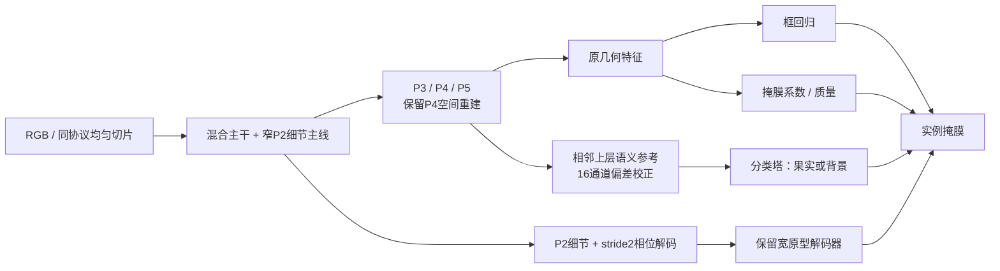

# E V12：从细节堆叠收敛到任务分流识别校正

日期：2026-09-18。状态：实现及本地功能验证完成；**尚无 V12 正式精度结果**。

## 1. 先说结论

目前没有证据支持“V11 越复杂越强”，也没有一个各项指标全面最优的模型。建议保留 V10_04/05 的主体和 V11_02 的持续细节路线作为候选，而不是把 V11_06 或最后一个论文模块组合当作定稿。

本次重新索引 results 下 **278 份 results.csv，去重后 264 份，读取错误 0，全部找到当前 YAML 候选**。见 [全历史索引](E_V12_REVIEW_20260918/全部历史结果索引.md)、[机器可读审计](E_V12_REVIEW_20260918/audit.json)。这表示全量结果/配置覆盖，不表示逐行复核了每个历史训练进程的全部 Python 源码。重点复核 V11、V10→V3/SAGE 的继承链、头部、损失、解析、数据与批量入口，并依据既有源代码审计回溯旧系列。当前 YAML 映射不能证明历史服务器代码完全相同。

V11 实际是 **11 组完成 300 epoch；05 只有 223 epoch**，没有完成标记及 paired 评估。05 不能当作已完成失败实验。11 组已完成运行的记录 YAML 哈希与本地配置一致；训练、验证列表在本轮各只有一个版本，args 仅模型名、保存路径等不同。

## 2. V11 的数据：哪些值得保留

前两列 AP 来自同一个“验证 Mask AP50–95 最佳 epoch”；不是各指标各取最高。fine 是各自 best_mask.pt 的统一原图640评估坐标、同一 fine 切片预算，**不能与训练验证 AP 混成一列**。所有 AP/Recall 表值为百分数。tiny 是置信度0.25、Mask IoU0.5、可见面积<256的匹配数/161，并非 COCO APs；背景错误也在同一0.25阈值。

|V11|主要变化|验证 AP50|验证 AP50–95|fine AP50–95|fine tiny|fine 背景错误|判断|
|---|---|---:|---:|---:|---:|---:|---|
|00|V10_05 对照|85.179|71.936|77.004|99|432|保留，当前小目标匹配较好|
|01|V10_04 对照|84.487|71.960|76.283|93|415|保留，无对比度入口的对照|
|02|持续 P2 细节|84.740|71.908|77.048|88|337|保留为少误检方向，不是全面胜出|
|03|02 + RepMix 主干|84.561|71.506|76.171|89|373|不进入 V12 默认主干|
|04|03 + native 融合|84.446|71.374|75.266|92|490|不保留这版融合|
|05|独立 tiny assignment|84.352|71.435|—|—|—|223轮，尚不能定论|
|06|综合+NWD分配+轻框头|84.246|71.192|75.693|93|423|不保留整个组合|
|07|06 去 NWD 分配|84.252|71.125|75.836|89|417|仅把轻框头拆出再验证|
|08|06 + ring 对比损失|83.740|70.657|75.666|87|403|不保留该损失|
|09|06 + 对比度入口|84.473|71.510|75.532|90|409|有指标取舍，不设为必选|
|10|GAP 上下文对照|83.866|70.768|76.264|88|459|仅为论文迁移对照|
|11|LAST-ViT 思路迁移|83.373|70.445|75.373|87|491|此迁移实现未证明收益，不保留|

02 相比01：fine AP +0.765个百分点，背景错误少78，但 tiny 少5；相比00：fine AP仅高0.045个百分点、tiny少11。不能把这点差值宣称稳定涨点。02 的最佳AP同轮 Recall=77.210%，但高精度工作点的 fine R@P≥0.9=79.409%，略低于01的79.504%。完整 Recall/末20轮/耗时见 [V11_metrics.csv](E_V12_REVIEW_20260918/V11_metrics.csv)。单次 epoch/paired 耗时受负载影响，未据此宣称结构因果加速。

### 历史结果带来的取舍

|历史证据|本轮处理|
|---|---|
|早期 G10、F、S、T 与后续存在 AMP/划分/初始化差异|保留研究线索，不能把旧峰值直接排成公平总榜|
|E/V6以来细掩膜相位解码、混合全图/切片训练有持续价值|保留原有输入与细掩膜路径；不改评估栅格来制造涨点|
|V7/V8 P2大检测头、部分重算子及去掉P4重建并不稳定|保留8400候选和P4普通空间重建；不追加34000候选P2塔|
|V9/V10过度压缩mask basis、全GT前景辅助目标未稳定超过对照|保留原宽度原型解码器；不重启这些已失败组合|
|V10_04验证AP95=71.952，V10_05=72.124；V11复跑对照71.960/71.936|收益已接近单次波动量级；进入收敛验证，而非再堆十种注意力|
|V11_02细节主线降低背景误检，RepMix/native/FFT组合反而下降|保留可解释的分支，撤回没有证据的强制替换|

这不是“以前全做错了”，而是已经找到保留部件及反例。优化器继续用相同 AdamW；在结构对照里同时换优化器会再次无法归因。

## 3. 当前真正的难点与 PR 诊断

以 V11_02 同一 best_mask 权重、同一193图/1049实例为例：

|指标|全图640|fine切片|
|---|---:|---:|
|Mask AP50|84.116|88.700|
|Mask AP50–95|68.253|77.048|
|tiny 匹配|29/161|88/161|
|置信度0.25时 TP|827|920|
|置信度0.25时背景错误|116|337|
|最大观测召回|90.944%|96.092%|
|原始PR末端的真实精度|7.990%|3.032%|
|R@P≥0.90（完整原始点）|77.121%|79.409%|
|本次记录单图中位耗时|87.7ms|381.1ms|

切片后剩129个FN，其中 tiny有73个，约56.6%；另有46个面积256–1024的FN。小目标仍是重点，但“仅靠扩大召回”会引入背景候选。背景错误统计不能自动证明全部来自绿色叶片：需要人工检查错误样本或事先定义的果叶低对比子集，不能用总AP替代颜色混淆证据。

另外，V11加载记录中676个训练源图有61个没有可用coarse/fine切片。源码对无法用单多边形表示的裁剪交集、无效原多边形会跳过该切片，并保留全图，因此名义.5/.25/.25并非每张图实际都满足。本轮保持裁剪契约以保证对照，不删除难样本、不偷偷修标签；后续应结合views.json区分哪些源图回退、是否集中在遮挡难例。V12额外在每次运行中保存`train_original_sources.json`，解决回传只有匿名缓存文件名而无法核对原图的问题，无需用户额外确认。

**PR横轴是Recall，不是置信度。** 当前 `ultralytics/utils/metrics.py::compute_ap` 在最后真实召回处增加P=0哨兵，随后至R=1补零；这与[官方 v8.4.60 源码](https://github.com/ultralytics/ultralytics/blob/v8.4.60/ultralytics/utils/metrics.py)一致。末端直落到0不等于模型在一个真实工作点突然崩溃。与此同时，补零前真实精度降至3%确实说明低阈值有大量FP，不能把全部问题解释为绘图。

V12不修改 compute_ap、不截断难目标、不改GT。批量训练后继续自动输出 paired coarse/fine、完整 empirical PR 和诊断图。重点看 R@P≥.90、tiny匹配、错误分型与预算，而不是要求右下角“不许为0”。原始证据：[PR_evidence.json](E_V12_REVIEW_20260918/PR_evidence.json)。

遮挡产生的深凹可见轮廓、相邻果实分离不能被圆形/凸包先验强行填平。既有边界和邻域约束保留。当前split/merge只是代理统计，不宣称已解决拓扑问题。

## 4. 文献、桌面代码和控制教材如何影响设计

本轮重点阅读以下作者思路与对应桌面源码，不把“模块集合中出现”视为顶会有效性的保证。没有整库逐文件移植，也没有声称通读635页扫描教材。

|材料|实际阅读位置|采用与拒绝|
|---|---|---|
|[TOOD，ICCV2021](https://openaccess.thecvf.com/content/ICCV2021/html/Feng_TOOD_Task-Aligned_One-Stage_Object_Detection_ICCV_2021_paper.html)|`Desktop/github/TOOD/mmdet/models/dense_heads/tood_head.py`，TaskDecomposition/T-Head|借鉴任务交互与任务特异特征的平衡；保留已有TAL，不把已有TAL当新增创新，也不照搬DCN预测器|
|[PIDNet，CVPR2023](https://openaccess.thecvf.com/content/CVPR2023/html/Xu_PIDNet_A_Real-Time_Semantic_Segmentation_Network_Inspired_by_PID_Controllers_CVPR_2023_paper.html)|`Desktop/github/PIDNet/models/pidnet.py`、`model_utils.py`，PagFM/Light_Bag|借鉴细节与语义融合需保护局部结构；不把语义分割整网当作柑橘实例分割成品|
|[FreqFusion](https://arxiv.org/abs/2408.12879)|`Desktop/Plug-play-modules-main/3. Block（功能模块）/(TPAMI 2024) FreqFusion.py`|借鉴低频一致性/局部残差分开处理；不引入该实现的CARAFE/mmcv依赖|
|[DySample，ICCV2023](https://arxiv.org/abs/2308.15085)|`Desktop/Plug-play-modules-main/7. Down & Up（池化或上下采样）/(ICCV 2023) DySample.py`|了解采样坐标、grid_sample与偏移；本轮保持对齐网格，不同时引入另一种动态重采样因素|
|胡寿松《自动控制原理》第六版|用户扫描PDF的目录及第一章反馈、偏差信号、扰动、开环与闭环基本概念；已渲染PDF页11–13（书页3–5）重点核读|只借鉴“参考－测量”的校正表达、有界增益；当前前馈网络没有动态被控对象，不能宣称PID或闭环稳定性证明|
|LAST-ViT / RepViT / Lite-HRNet|结合V11实现、既有作者代码审阅和新结果|持续细节分支作为可检验候选；撤回已显示负面的特定频率选择与RepMix组合|

V12的新部分是我们的任务适配假设，不是作者模块原样拷贝，也不是已经被论文证明会在本数据上有效。即使参考顶会，也必须接受消融失败。

## 5. V12 的结构与可证伪创新假设

主干保留浅层普通C3k2和深层部分卷积混合阶段；持续16通道P2在C3/C4提取期间存在，通过相位投影参与深层提取。这不是整个换成标准YOLO，也不再次把所有阶段换成未经验证的轻量块。

新变化在**颈部输出到预测塔的连接方式**：已有P3/P4/P5几何特征继续负责框和mask系数，额外由相邻上层语义产生窄通道校正，默认只送分类塔。prototype仍由既有细节+P3解码；不加新的宽高分辨率检测头。



校正模块：`u=local_projection(F)`，`v=upsample(context_projection(H))`，`l=avgpool5(u)`，`h=u-l`，`e=v-l`。门控看到`u,v,abs(h)`，投影后的修正经`0.5*tanh(gain)`送回原特征，gain从0开始。这里h只是局部残差信号，不是有监督边界；v也不是真实目标。新路线不改坐标，不运行FFT/DCN/Mamba/CARAFE，不用CPU轮廓算子。

三个待验证命题：

1. 持续细节与语义识别各司其职，能否比统一共享修正更好地兼顾tiny召回和误检？比较02→03及03↔04。
2. “语义参考减局部低频”的校正，是否优于同参数量的普通求和？比较03↔08。不是把一个常数从softmax全部logit减掉的无效操作。
3. 在不压缩mask原型的条件下，单独因式分解框塔首层，能否获得准确率/延迟更好的折中？比较03↔05。

这些是论文候选贡献方向，当前不能写成已经验证的“三大创新成果”。共享主干和TAL仍耦合梯度，所谓任务分流不是完全梯度独立。

## 6. 十组实验与预算

全部为单类nc=1、640、未融合THOP统计。THOP遗漏部分functional操作；CPU时延不是3090速度保证。

|编号|内容|对照|参数M|GFLOPs|
|---|---|---|---:|---:|
|00|精确重放V11_00 / V10_05|历史有效对照|2.234|10.423|
|01|精确重放V11_01 / V10_04|去对比度入口对照|2.234|10.380|
|02|精确重放V11_02|持续细节对照|2.270|10.538|
|03|02 + 分类专用语义校正|主要准确率候选|2.284|10.601|
|04|03改为预测塔共享校正|任务分流必要性|2.284|10.601|
|05|03 + 轻量框塔|主要轻量候选|2.060|9.886|
|06|03 + 对比度入口|结构/颜色互补是否有交互|2.284|10.644|
|07|01 + 分类语义校正|头部细节 vs 主干持续细节|2.248|10.444|
|08|03改为相加语义证据|偏差表达是否必要|2.284|10.601|
|09|03去tiny Dice辅助项|保留损失的必要性|2.284|10.601|

03比02新增14,146参数、约0.064GFLOPs；05并非已经证明更快，需要GPU实际测试。未把09取消tiny Dice与其他loss一起改动。CIoU/DFL、BCE、原边界/邻域/质量目标保持；NWD分配、ring、LAST模块不强制加入。

固定训练协议见 [protocols/citrus_e_v12.yaml](../protocols/citrus_e_v12.yaml)：300轮，AdamW，lr0=.001，lrf=.01，momentum=.937，weight_decay=.0005，batch16，workers4，imgsz640，AMP=False，cache=True，copy_paste=.3，mask_ratio=2，cos_lr=False，同一官方yolo11n-seg.pt初始化。RAM缓存依用户要求保留；它不保证位级确定性，单seed小差异不能当结论。

## 7. 如何运行

上传整个 `1_SEVER/code/ultralytics-main-new`，而不只是新Python或YAML。打开根目录 **`RUN_CITRUS_E_V12.py`**，设置自己的DATA、DEVICE。默认`SUITE="priority"`依次跑00–05六组；想全部十组改`SUITE="all"`。每组300轮，默认不是dry-run。

VSCode选择正确Python环境，点右上角Run Python File即可。也可前台执行：

```bash
cd /data/sxq/code/ultralytics-main-new
python RUN_CITRUS_E_V12.py
```

没有nohup、后台训练队列、GPU占用拒绝或数据确认开关。一个进程顺序训练，DataLoader可有4个worker；前台方式不自动保证独占GPU。Ctrl+C终止当前且不继续下一组。完成项可以跳过；未完成目录不覆盖，需要保留旧目录并使用新PROJECT或调整ONLY。不要因复制新源码而覆盖正在训练进程所用文件。

不训练、仅核对所有配置：

```bash
python 20260918_citrus_e_v12_batch.py --data /data/sxq/datasets/orange_yolo/data.yaml --suite all --device 1 --dry-run
```

硬件速度诊断（独立运行，不与正式训练同时跑）：

```bash
python scripts/benchmark_citrus_ev12.py --device 1 --output /data/sxq/results/E/V12_speed.json --train
```

YAML已在`0_orange_yaml/E_V12_series/`并登记MODEL_INDEX.csv；支持标准`YOLO(yaml)`构建及训练入口。完整复现实验仍应使用批量脚本，它额外固定切片抽样、mask验证栅格、协议及checkpoint选择；只加载YAML并不会自动包含这些训练/评估约定。

## 8. 验证与收尾条件

已验证全部10图构建、非空/空GT反向、梯度有限、非方形输入、融合前后相符、官方预训练语义层映射、checkpoint重载、前三组旧模型精确重放、新路线零初始化等价。代表03/05真实小数据1epoch训练及独立验证通过。CPU测试/Python3.8语法检查不能替代服务器Torch1.13 CUDA实测；没有宣称300轮完成或涨点。

联合V10/V11/V12回归测试128项通过；新增原图清单记录另有独立测试。完整本地测试记录在`E:/mastercode/_work/citrus_ev12_20260918/tests.xml`，模型预算及smoke记录在同目录`verification_smoke/audit.json`。

V11服务器实际train=676原图/4324实例、val=193/1049，与本地正式grouped_dedup的676/4120、193/1181不同。**不能因都叫“清洗集”就混为同一协议**。本次不改用户数据，不自动更换服务器DATA路径。之前跨协议文件名重叠也不等于已证明服务器内部泄漏；正式论文需回传实际源图/分组清单复核。

收尾建议：先在同一明确数据版本完成priority；若03/05不能稳定优于00–02，选已有Pareto模型并停止叠加。优胜者与同协议YOLO11n-seg基线做三seed，验证选阈值后锁定独立test，报告Mask AP50/AP95、R@P≥.90、尺度表现、实际延迟及错误类型。不要把300轮单seed最高点、切片增加预算、或者不同AMP的变化归功于结构；也不能承诺一区录用或10点提升。
