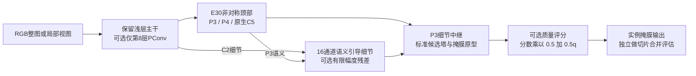

# E V3 复核与 V4R 重构决策

_2026-09-10；已实现并完成本地功能验证，尚无 V4R 正式训练精度结果。_

---

## 📊 先说结论

这次不能得出“V3 越组合越强”。在相同训练参数的 8 组 300 epoch 运行中，E30 对照的官方 Mask AP50–95 最高，为 **68.165**。V3 的新颈部在四组配对比较中均未提高这个指标。质量评分分支在四组切片评估配对中均提高 AP50–95，但通常降低固定置信度下的 tiny 召回。因此 V4R 保留 E30 的主体结构，分开验证最深层压缩、窄通道细节修正、有限幅度质量评分，而不是把全部模块和损失加在一起。

本次读取 `results` 下 204 份 results.csv，内容去重后 190 份；对应 YAML 均找到候选，涉及 89 个顶层模块符号，其中 87 个映射到当前源码，另外两个为 PyTorch Identity/Upsample。完整索引和文件/类哈希见同目录 `E_V4_RECONSTRUCTION_EVIDENCE/`。这不是声称逐行审计了所有历史文件：本次深入检查了 V3、E20–E25、G10、F14、SAGE 细节中继以及新旧 V4 的关键实现和调用链。

历史服务器源码快照不齐，不能凭文件名宣称当前本地实现与每次服务器运行逐字一致。V3 的 8 份模型 YAML 与完成标记中的哈希一致，验证文件列表一致，加载统计为 676 张训练源图、193 张验证图/1,049 个实例；可比性比跨系列直接排名强，但仍只有 seed42。没有修改原始数据、旧结果、旧 V4 的 26 个 YAML，也没有重启正式训练。

## 🔍 V3 的有效信息与不足

以下两项官方 AP 均取 **同一个 Mask AP50–95 最佳 epoch**，没有分别挑选各列最高值。数值以百分数显示。

| 模型 | 官方 Mask AP50 | 官方 Mask AP50–95 | 最后20轮平均 AP50–95 |
|---|---:|---:|---:|
| E30_control | 83.914 | 68.165 | 67.372 |
| E31_native_neck | 83.741 | 67.884 | 66.983 |
| E32_deep_partial | 83.684 | 67.847 | 67.270 |
| E33_mask_quality | 83.534 | 68.011 | 66.893 |
| E34_deep_neck | 83.821 | 67.244 | 66.623 |
| E35_neck_quality | 83.780 | 67.841 | 66.862 |
| E36_deep_quality | 83.535 | 68.052 | 67.274 |
| E37_full | 83.652 | 67.982 | 67.416 |

E37 的最后20轮均值略高于 E30，但差 0.044 个点，不能据此宣称稳定提升。E32 替换了主干第6、8层的内部块，并非完整保留 YOLO 主干；E31 同时改了第17层下采样和第18层融合，因此现有实验也不能进一步归因于其中某一个算子。

| 因素 | 四组配对的官方 AP50–95 增量/百分点 | 本次取舍 |
|---|---|---|
| 深层替换6、8 | −0.318 / −0.640 / +0.041 / +0.141 | 不再同时替换；仅第8层单独测试 |
| 新下采样＋native融合 | −0.281 / −0.603 / −0.170 / −0.070 | 不作为 V4R 默认颈部 |
| 质量评分 | −0.154 / −0.043 / +0.205 / +0.738 | 有交互，不能说单独必涨 |

切片诊断使用原图长边640的公共掩膜栅格，而官方训练验证使用另一套掩膜处理路径。**下面的 AP 不得与上表混算增益。** tiny 定义为公共640栅格上的实例面积小于256，不等同于 COCO APsmall。tiny 命中在 conf=0.25、Mask IoU=0.5 下统计，分母均为161。

| 模型 | trustedmask AP50–95 | tiny命中/161 | R@P≥90% | 背景类误检数@0.25 |
|---|---:|---:|---:|---:|
| E30 | 70.803 | 66 | 80.172% | 386 |
| E31 | 70.038 | 68 | 79.028% | 320 |
| E32 | 70.172 | 65 | 80.648% | 265 |
| E33 | 71.194 | 62 | 79.409% | 214 |
| E34 | 70.325 | 75 | 79.314% | 532 |
| E35 | 70.700 | 63 | 78.265% | 253 |
| E36 | 70.944 | 65 | 77.884% | 276 |
| E37 | 70.459 | 68 | 77.788% | 314 |

质量因素在四组切片配对中带来 +0.391 / +0.662 / +0.772 / +0.134 点 AP50–95，但 tiny 命中分别 −4 / −5 / 0 / −7。不能只报其 AP 增益，也不能只凭固定阈值召回下降就判断特征变差，因为该头会主动压低预测分数。E34 捕获 tiny 最多，却也有最多背景误检；它不是无条件的最佳模型。

## 📚 历史结果真正支持什么

| 历史证据 | 数值：官方 Mask AP50–95 | 源码核对后的解释 |
|---|---|---|
| F14 / G10 baseline | 67.599 / 67.681 | LSKA上下文、部分卷积、小波和P2掩膜保留为参考；不能认定每个部件都有效 |
| G10 baseline / full | 67.681 / 64.033 | full同时改scale、copy-paste、NWD分配、频率/Dice/边界损失，不是纯架构消融 |
| SAGE60 relay | 67.503 | 保留标准候选塔、非对称颈部、语义引导P2细节中继的路线值得保留 |
| E01 slice / E04 hybrid slice | 67.962 / 67.578 | 混合主干在这一轮切片条件下没有超过对照，不能机械搬回G10全部组件 |
| E20 / E21 contrast | 68.094 / 67.551 | 不支持用另一套中心周围差分支完全替换原细节分支 |
| E23 rep / E24 rep hub | 63.854 / 62.073 | 全阶段替换和低分辨率汇聚风险大，且预训练覆盖下降；不能推广成RepViT/Gold-YOLO原论文无效 |
| E30重复对照 | 68.165 | 当前更可靠的重构起点；与E20的微小差异不是新创新 |

这些历史数值用于定位风险，不是跨系列公平排名。尤其同样的 `/data/sxq/datasets/orange_yolo/data.yaml` 路径不能证明不同日期的数据内容相同。AMP、数据划分、初始化、loss、评估器和epoch不一致时，应重新做受控比较。旧 Light 的运行慢也不能只由 FLOPs 推断；新V4R没有复用其整套轻量主干或复杂融合路径。

## 🎯 当前痛点与可证伪假设

1. **tiny 候选不足仍是明确问题。** E30 的同权重 global tiny命中29/161，trustedmask达到66/161：切片有用，但仍漏95个。global最大召回约88.94%，trustedmask约93.42%（conf下限0.001），改善幅度远小于“召回必达100%”。
2. **新增候选与误检需要一起处理。** E30 的简单框合并有173个重复预测；跨视图掩膜处理后trustedmask降至22个。trustedmask仍有386个背景误检，不能只靠降低置信度解决。
3. **颜色伪装和遮挡拓扑需要专门证据。** 低对比度、条带遮挡、接触果实是合理研究方向，但现有单类别混淆矩阵不能证明“绿色误判比例”。下一阶段需固定低对比度、低solidity/凸包缺损、窄实例间隙子集，记录split/merge与尺度AP；本次没有伪造这些尚未测量的结果。

### PR末端为什么归零

本地 `ultralytics/utils/metrics.py` 的 `compute_ap()` 在最大实际召回处以及recall=1补零，再做插值；因此最大实际召回之后的零线包含绘图约定，不表示模型在那个区间真实达到了高召回却所有预测都错了。我们不改零线、不填假精度、不改评估器造涨点。需要改善的是最大可达召回、误检和同精度召回。

E30 的单类别归一化混淆矩阵背景列显示1.00，也不等于“所有背景像素都被当成果实”：检测混淆矩阵不统计完整背景真负例。它通常是框级匹配，更不能代替mask拓扑分析。

## ⚙️ 新 V4R：保留已验证路径，分解三个问题



训练每个源图以0.5概率选择局部有效视图、否则整图；不是将每轮长度强制扩大五倍。推理切片仍需要额外视图，不能把单次前向GFLOPs当成整图＋切片系统的总计算量。

| 配置 | 改动因素 | Params/M | GFLOPs@640 |
|---|---|---:|---:|
| V4R00_control | E30原样对照 | 2.323380 | 10.097 |
| V4R01_deep8 | 仅最深第8层内部PConv | 2.217396 | 10.012 |
| V4R02_detail | 窄P2有界细节残差 | 2.323540 | 10.105 |
| V4R03_quality | 有界质量评分 | 2.332231 | 10.130 |
| V4R04_deep_detail | 深层＋细节 | 2.217556 | 10.020 |
| V4R05_deep_quality | 深层＋质量 | 2.226247 | 10.045 |
| V4R06_detail_quality | 细节＋质量 | 2.332391 | 10.138 |
| V4R07_full | 三项组合，尚未证明最优 | 2.226407 | 10.053 |

这是2×2×2探索设计，不是8个已成立的论文创新。单个训练seed是重复单位，193张验证图不能当成193次独立训练。组合模型比对照参数约少4.17%，THOP估计计算量只少约0.44%；**不是大幅轻量化成果**。THOP遗漏部分函数式算子，本地CPU计时不能替代服务器GPU吞吐/延迟。

### 三项的依据与边界

- 最深层PConv借鉴FasterNet的局部通道空间混合，已对照官方 `Partial_conv3` 和 `MLPBlock` 源码；本项目保留CSP外层和SiLU等既有实现，不是完整FasterNet复现。[^1]
- 细节支路沿用已有语义引导，借鉴Gated-SCNN让语义帮助形状分支排除无关纹理的思路。新增仅为16通道的DW3高通残差，`tanh(gain)`从0开始；不是照搬其宽主干、Canny路径或边界任务，也不声称这个操作自动解决颜色伪装。[^2]
- 质量监督沿用Mask Scoring R-CNN“分类分数不等于掩膜质量”的思路；官方代码确实相乘，而本次提出 `s × (0.5 + 0.5q)` 作为待验证的有限压低策略。0.5为预先固定实验值，不是论文验证过的最优系数。监督梯度不进入主干/系数/原型特征，使用原V3质量loss，不另加新loss组合。[^3]

所谓“有界修正”只约束可学习乘数，不保证卷积输出有界，也不构成自动控制系统的稳定性证明。这里没有时间积分、真实闭环PID或反复运行主干。我们没有把这个数学类比写成已证实的新理论。

### 为什么不默认启用旧V4全部模块和新优化器

旧 E40–E77 及SMC/SMCAO的代码、兼容性修复均保留。其基础图与新E30对照不同，把新主干、新neck、SMC、NWD、额外分割loss一起启用，会再次无法解释收益来源。V4R先保持AdamW及所有训练超参；优化器作为后续独立因素，在选出的同一架构上比较。

## 🧪 已验证与未验证

- 新8个YAML：官方 `YOLO(yaml)` 构建、正方形/长方形推理、含实例/空实例loss反传、融合推理一致性、预训练关键层匹配、保存/重载均通过。
- 新V4R＋V3＋旧V4回归共 **108项测试通过**；另对照模型和三项组合，使用4张训练源图/2张验证图做1 epoch真实切片训练、RAM缓存、验证、checkpoint重载。临时smoke的精度不用于任何研究结论。
- VSCode入口同一路径的dry-run通过，8个配置全可构建。当前机器仅CPU，尚未验证服务器Python3.8/Torch1.13.1和CUDA的实际速度与300轮稳定性；新文件按Python3.8语法做检查，不代表已在该运行时执行。
- 用已训练E33同一份best_mask权重，完成16张验证图的评分floor=0/0.5/1小样本诊断。69实例中只有5个tiny，三种评分均只命中1个tiny，R@P90均为82.609%；这**没有证明小目标召回已经改善**。它验证了评估代码及分数控制路径，不能用这16张数据调参或代替193张全量评估。
- 原始数据/已完成结果未更改，旧模型未删除。测试产物在 `E:/mastercode/_work/citrus_ev4r_20260910_r1/`，不混入正式results。

## 🚀 现在如何运行

将更新后的 `code/ultralytics-main-new` 完整同步到服务器，保留已有环境，不执行 `pip install -U ultralytics` 覆盖自定义包。先确认本地包加载路径，再打开 **RUN_CITRUS_E_V4.py**，修改其顶部：

```python
DATA = "/data/sxq/datasets/orange_yolo/data.yaml"  # 你确认过的新清洗数据
DEVICE = "1"                                  # 物理GPU编号
SUITE = "all"                                 # 8个；priority为前4个
EPOCHS = 300
DRY_RUN = False
```

选择服务器的`sxq`解释器，点VSCode右上角三角形；或在代码根目录执行：

```bash
python RUN_CITRUS_E_V4.py
```

前台串行训练，无nohup，不开启占卡拒绝或跨进程GPU锁。DataLoader的4个子进程正常存在，不等于同时训练4个模型。Ctrl+C停止当前队列，不自动启动下一个。已完成且轮数/seed符合的运行可跳过；半途输出不会覆盖，需另设PROJECT或另行指定resume方案。不要同时再启动第二份相同入口。

固定 `cache=True, amp=False, batch=16, imgsz=640, workers=4, AdamW, lr0=.001, weight_decay=.0005, momentum=.937, dropout=0`，其余增强、warmup、mask_ratio、loss及停止策略继承 `protocols/citrus_paper1_formal_v2_ram.yaml`；本系列因素写于 `protocols/citrus_e_v4r.yaml`。RAM缓存并不保证完全确定性，日志会保留其提醒，不用这一点随意改AMP或其他超参。

默认结果路径为 `/data/sxq/results/E_V4R/CITRUS_EV4R_ALL_300EP`。每个模型目录内查看 `results.csv`、`best_mask_selection.json`、`paired_sliced_eval/paired_metrics.json`；完整比较需同时带回父目录`_protocol`。这里的哈希只记录来源，不要求用户改数据路径或额外确认身份。

如果先不训练新网络，可对现有E33权重执行完整同权重评分诊断，将下列权重路径改为服务器实际位置：

```bash
python eval_citrus_e_v4r_calibration.py --weights /your/E33/weights/best_mask.pt --data /data/sxq/datasets/orange_yolo/data.yaml --device 1 --output /data/sxq/results/E33_CALIBRATION_FULL_NEW
```

输出目录须是新目录。它只评估三种score floor，不改权重；不要用 `--limit 16` 的结果定论文结论。接着比较V4R各项官方Mask AP50–95、trustedmask R@P90、tiny召回与实测延迟。最终只保留Pareto上有优势的1–2个候选，再做seed42/43/44和独立测试集；若质量分支只改善排序却不改善同精度召回，就不称为“小目标召回创新”。

---

[^1]: Chen et al. FasterNet, CVPR2023. [官方模型代码](https://github.com/JierunChen/FasterNet/blob/master/models/fasternet.py)。
[^2]: Takikawa et al. Gated-SCNN, ICCV2019. [官方实现](https://github.com/nv-tlabs/GSCNN/blob/master/network/gscnn.py)，源码为CC BY-NC-SA许可；本次只学习思路，没有拷贝其实现。
[^3]: Huang et al. Mask Scoring R-CNN, CVPR2019. [官方质量评分代码](https://github.com/zjhuang22/maskscoring_rcnn/blob/master/maskrcnn_benchmark/modeling/roi_heads/maskiou_head/inference.py)。
