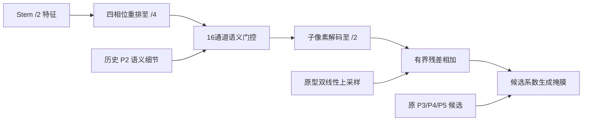

# E V5 复审与 E V6 修订

_2026-09-12；针对 swe-2 已有 V6 的审核、修复与两组结构对照，不是已获涨点的最终网络。_

---

## 📊 结论与证据范围

目前最可信的方向是：**保住局部有效像素，同时提高新增候选的可靠性**。仅增加切片、掩膜分辨率或注意力，均不能保证高精度下的召回提升。现有实验没有证实从 78 到 88 的纯架构收益，不能把旧 AMP/旧数据的低基线与当前最好结果相减写进论文。

本次扫描 218 份 results.csv，按文件内容去重后 204 份；解析无报错。逐项建立当前 YAML/模块符号映射，重点审查 E V3–V6、SAGE 语义细节与历史 G10 路径。不是声称逐行读完所有历史 Python 文件；缺少服务器源码快照的运行，其当前代码映射不能证明当时运行的源码完全一致。

- [历史结果索引](E:/mastercode/1_SEVER/code/ultralytics-main-new/docs/E_V6_REVIEW_20260912/全部历史结果索引.md)
- [数值、协议与 YAML 映射](E:/mastercode/1_SEVER/code/ultralytics-main-new/docs/E_V6_REVIEW_20260912/audit.json)

V5 实际收到六组，均 300 轮；未收到 V5_05、V5_06。V5_01 的 coarse 配对评估完整，但 fine 目录/重试目录没有最终指标，不能把它当作完成的细切片评估。没有修改、删除源数据、标签或已完成结果。

### V5 的真实收益

下表为百分数；AP50 和 AP50–95 取最佳 Mask AP50–95 的**同一轮**。末 20 轮均值用于观察训练后段，不代替独立重复实验。

| 模型 | 同轮 Mask AP50 | 最佳 Mask AP50–95 | 末20轮 AP50–95均值 | 中位每轮秒数 |
|---|---:|---:|---:|---:|
| V5_00 control | 83.891 | 67.653 | 66.943 | 9.790 |
| V5_01 fine input | 84.266 | 68.125 | 66.993 | 9.300 |
| V5_02 mask route | 83.150 | 67.641 | 66.930 | 13.180 |
| V5_03 region | 83.125 | 67.911 | 66.986 | 9.560 |
| V5_04 fine + route | 83.726 | 67.754 | 66.988 | 10.850 |
| V5_07 full | 83.121 | 67.604 | 66.859 | 9.884 |

时间来自相邻 epoch 累计 time 的差值，含运行环境影响，不是隔离后的算子测速。V5_01 峰值比控制高 0.472 个百分点，末20轮只高约 0.050；目前是值得复核的候选，不是确定的大突破。没有多 seed，就没有依据定义“±0.3～0.5 是噪声带”。

### 同权重切片能做什么，不能做什么

以下均为 trustedmask 合并、同 193 张验证图、公共长边 640 栅格、相同诊断工作点。极小桶为公共网格面积 <256 px² 的 161 个 GT；不是未经定义的 COCO APs。背景 FP 也不能全部称作“叶子误检”，数据中没有叶子类别标注。

| 权重与裁剪比例 | 公共栅格 Mask AP50–95 | 极小果匹配/161 | 背景 FP | Precision≥90%最大Recall |
|---|---:|---:|---:|---:|
| V5_00，0.6 | 71.082 | 72 | 307 | 79.218 |
| V5_00，0.4 | 72.424 | 93 | 364 | 79.409 |
| V5_02，0.4 | 72.614 | 100 | 437 | 79.409 |
| V5_03，0.4 | 72.145 | 94 | 393 | 80.110 |
| V5_04，0.4 | 72.346 | 84 | 379 | 79.600 |
| V5_07，0.4 | 72.103 | 90 | 341 | 79.361 |

控制权重从 0.6 改为 0.4，多匹配 21 个极小果，却多了 57 个背景误检，P90 召回只提高约 0.191 个百分点。route 多找回 7 个极小果又多出 73 个背景误检。**切片确实有效，但不能只用匹配数宣称全面提升。** fine training 和 fine inference 是两个不同干预；V5_01 缺少 fine 评估尤需注意。

## 🔍 哪些历史经验值得保留

| 历史证据 | 本次取舍 | 不能作出的结论 |
|---|---|---|
| SAGE40 66.863 → SAGE42 67.502；同期 SAGE30 66.719 | 保留非对称拓扑和语义引导 P2 细节 | 不是所有注意力都有用；两组差值不等于单一模块贡献 |
| SAGE V5 的 SAGE42 67.147，对照 66.826 | 同方向信号值得继续验证 | 不同批次不能拼成多 seed 统计 |
| V4R05 deep+quality 68.080，V4R00 67.814 | 保留深层局部压缩及有下限的质量排序 | deep 单独 67.643，quality 单独 67.683，并非各自稳定涨点 |
| E30 68.165、E20 68.094，V5_01 68.125 | 承认当前处于相近水平，保留强控制 | 最新版本不自动等于最佳模型 |
| G10 67.681；后续 T 复测不是巨大领先 | 借鉴深层轻量混合/细节保留，不整体堆回来 | 不能把旧低基线与 G10 相减当纯架构贡献 |
| SAGE70 67.433，SAGE72 dense P2 64.651 | 不默认恢复稠密 P2 检测塔 | 一次失败不能证明所有 P2 结构都无效 |
| V5 route/region/full 未一致获益 | V6 控制不默认叠入它们 | 也不能认定区域判别思想从根本上错误 |

当前主干不是完全替换 YOLO：浅中层仍保留 C3k2，Stage 8 用 EV3DeepStage 的部分卷积混合替换内部块；颈部为历史非对称路径。此次重点是审查现有 V6，不再同时更换整个主干、优化器和匹配器，否则无法判断结果来源。

## 🎯 痛点与下一轮应回答的问题

1. **可观测像素不足**：原图缩至 640 后，极小果的边界和局部纹理不足。固定多尺度视图能缓解，但不恢复传感器本来没有的纹理。
2. **新增候选不可靠**：细切片带来更多背景候选；高精度约束下召回并没有同步大幅上升。需要区分没有候选、框定位失败、掩膜 IoU 不足、分数过低四种漏检。
3. **可见拓扑而非圆形先验**：遮挡果实的可见掩膜可有深凹，接触果实又必须分离。圆形、凸包填充、闭运算可能改善外观却违反标注任务，本次不加入。
4. **分辨率成本不止 GFLOPs**：32 通道原型不贵，不代表数百实例的高分辨率掩膜解码和反向不贵。切片还把网络重复执行多次，必须计入端到端耗时。

PR 横轴是 Recall，不是 confidence。当前 `metrics.py::compute_ap()` 在最大实测召回处及 Recall=1 添加 precision=0 的积分端点，未覆盖召回区间会贴零。不能通过取消绘图端点宣称网络改善，也不能仅据末端归零断言全部由极小果导致。保留官方 AP，并以已有 `empirical_mask_pr` 原始工作点、尺度漏检、P90 Recall、背景 FP 和 split/merge 代理诊断。不要为了曲线好看改动官方分数。

## 🔧 swe-2 V6 的问题与本次修订

| 问题 | 处理 | 影响范围 |
|---|---|---|
| 对照按 /4 GT、fine 按 /2 GT 验证，精度口径混杂 | 所有 V6 新运行统一从多边形生成 /2 GT；预测原型先插值再阈值 | EV6TrainingTrainer、EV6Validator |
| 最终权重验证的 AutoBackend 不能可靠通过 modules 找到 head | 读取实际输入尺寸，推断真实 proto 比例 | shared segment validator；旧 /4 行为保留 |
| 主掩膜 loss 插值 proto 到 GT，quality loss 却降采样 GT 到 proto | V6 专用 loss 对 detached proto 插值，使质量目标和主损失一致 | 不修改 V3–V5 loss 行为 |
| 旧测试只设置 mask_ratio，未真正启用 NWD | 测试传入全部 RUN_OVERRIDES，并断言 criterion 的实际系数 | V6 测试 |
| 把 NWD 写成“小目标分配” | 改为“小目标回归”；TAL 未改 | 说明与实验解释 |
| /2 细节计算全部铺在大网格 | 新增两组 phase 路径对照；原八组保留 | V6_08/09 |

**V6 新 epoch AP 采用 input/2，不能直接与 V5 的 input/4 epoch AP 相减。** V6 内部可比；跨版本使用同一公共长边 640 的 paired evaluator。官方 `YOLO(yaml)` 的构建、前向、反向、保存均兼容；完整复现还需要相同 Trainer、输入与超参，不是 YAML 一个文件就包含了所有实验协议。

### phase 路径的实际结构



这是一次前馈的门控残差校正，不是已证明稳定的闭环控制系统。四相位重排自身可逆，后面的通道投影不是无损。它不增加候选头，也不凭空创造新的果实像素。两组新增模型不是完整新系列，而是对 swe-2 细掩膜实现的低成本计算布局对照。

## 📚 论文和本地代码取舍

| 来源 | 实际参考位置/思想 | 本次迁移与限制 |
|---|---|---|
| RefineMask，CVPR2021[^1] | 本地 github/RefineMask 的 refine_mask_head.py；实例和语义细特征逐级融合 | 保留细节由语义约束的方向；未照搬多级 RoI 网络 |
| Mask Transfiner，CVPR2022[^2] | 原文错误像素/稀疏四叉树细化 | 提醒高分辨率成本应集中在错误处；V6 是密集原型，不宣称复现其稀疏算法 |
| ESPCN，CVPR2016[^3] | 低分辨率学习、子像素重排上采样 | phase 在 /4 做门控再输出 /2 残差；不是超分辨率图像任务的完整迁移 |
| DySample，ICCV2023[^4] | Plug-play 的 `7. Down & Up/(ICCV 2023) DySample.py` | 借鉴在低分辨率组织上采样计算；未引入 grid_sample 或额外动态采样依赖 |
| NWD[^5] | github/NWD/mmdet/models/losses/iou_loss.py | 复核像素坐标、12.8尺度；现有实现是尺寸门控 CIoU 混合，不是 RKA 分配 |
| Simple Copy-Paste，CVPR2021[^6] | 论文实例粘贴思想；核对本地 augment.py | 使用现成同图 flip 粘贴，0.3 为符合 IoA 条件实例的选择比例；不是跨图完整复现 |

两个仓库中没有系统逐文件通读全部模块；围绕上述证据选择实现阅读。没有下载重复仓库，也没有把合集作者的“顶会模块”标签直接当成准确的论文归属。论文在其原任务的涨点不能当作柑橘上的承诺。

## 📋 十组实验与固定超参

| 编号 | 结构/训练变化 | train mask_ratio | NWD / CopyPaste |
|---|---|---:|---|
| V6_00_control | 历史轻量主干+非对称细节控制 | 4 | 0 / 0 |
| V6_01_mr2 | 原结构；仅细栅格监督 | 2 | 0 / 0 |
| V6_02_fine | swe-2 密集 /2 细节解码 | 2 | 0 / 0 |
| V6_03_nwd | 控制+小目标回归 | 4 | 0.5 / 0 |
| V6_04_cp | 控制+实例粘贴 | 4 | 0 / 0.3 |
| V6_05_fine_nwd | 密集细节+回归 | 2 | 0.5 / 0 |
| V6_06_fine_cp | 密集细节+粘贴 | 2 | 0 / 0.3 |
| V6_07_full | 密集细节+回归+粘贴 | 2 | 0.5 / 0.3 |
| V6_08_phase | 新增低分辨率相位解码 | 2 | 0 / 0 |
| V6_09_phase_nwd | 相位解码+回归 | 2 | 0.5 / 0 |

这不是完整 2³ 全因子设计；缺少 N+P 且无 F 的一组，不能估计全部高阶交互。关键比较为 00→01（栅格）、01→02（真实细节）、02→08（计算布局）、00→03（回归）、00→04（粘贴）、05→09（带 NWD 的布局）。

共同配置：300 epochs、batch16、640输入、workers4、seed42、AdamW、lr0=0.001、lrf=0.01、weight_decay=0.0005、AMP=False、cache=True、dropout=0、同 yolo11n-seg.pt 初始化。其他训练参数继承 `protocols/citrus_paper1_formal_v2_ram.yaml`；只允许表中三个超参的显式差异。

所有组使用 0.5 整图 + 0.25 粗视图 + 0.25 细视图抽样，每源图每轮抽一次，不让九个细窗口变成九倍训练权重。不用颜色/GT 先验选择切片。无法表示的裁剪继续回退原有视图，不删除原图或标注；V5_01 已上传记录中 61 个源图无可用局部窗口，应报告这种覆盖局限。

## ⚡ 验证与真实成本

145 项 E V3/V4R/V5/V6 回归测试通过；十个 V6 YAML 均完成官方 API 构建、非空/空标签反向、非方图前向、融合、预训练载入、权重保存重载与 GFLOPs 检查。四组代表模型 00/01/07/09 在隔离的真实四张训练图、两张验证图上各跑一轮，包含最终 best.pt 验证和独立验证；是通路测试，不是精度结果。

| 结构 | Params | THOP GFLOPs@640 | CPU单前向约ms |
|---|---:|---:|---:|
| 控制 | 2,226,247 | 10.045 | 94 |
| swe-2 密集细节 | 2,227,304 | 10.268 | 129 |
| 新相位细节 | 2,229,608 | 10.219 | 124 |

CPU 两线程、未融合 batch1 的小样本诊断；不能当作 RTX3090 排名。phase 比密集路径仅减少约 0.049 GFLOPs，参数反而多 2,304；**不是数量级加速**。小型合成 640、batch2、每图12实例的训练步诊断：控制约1.04s、mr2约1.54s、密集fine约1.49s、phase约1.48s。这说明主要代价仍有掩膜 loss，不能承诺 phase 显著加速训练。

300 个 FP32 掩膜 logits 在 160² 约29.3MiB，320² 约117.2MiB，尚不包含反向、其他中间量和多视图。公共 /2 验证对照也会支付较细网格解码费用。正式服务器必须记录峰值显存、每 epoch 时间和整图+全部切片+合并的端到端延迟。

证据文件：`E:/mastercode/_work/citrus_ev6r_20260912_r3/audit.json`、`E:/mastercode/_work/pytest_ev6r_20260912.log`、`E:/mastercode/_work/citrus_ev6r_cost_20260912.json`。本地为 Python3.9 / Torch2.8 CPU，尚未验证服务器 CUDA/Torch1.13 的正式耗时，也未进行300轮正式训练。

## ▶️ 现在怎么运行与怎么判定

上传更新后的整个 `code/ultralytics-main-new`，不要只上传 RUN 文件。打开 [RUN_CITRUS_E_V6.py](E:/mastercode/1_SEVER/code/ultralytics-main-new/RUN_CITRUS_E_V6.py)，确认 DATA 是你自己服务器的 data.yaml，DEVICE 是希望使用的物理卡号。

```python
DATA = "/data/sxq/datasets/orange_yolo/data.yaml"
DEVICE = "1"
SUITE = "all"
EPOCHS = 300
DRY_RUN = False
```

默认新输出 `CITRUS_EV6R_ALL_300EP`，不会覆盖原 V6。VSCode 选择正确 Python 后点右上角运行；也可前台运行：

```bash
cd /data/sxq/code/ultralytics-main-new
python RUN_CITRUS_E_V6.py
```

前台、顺序执行，Ctrl+C 停止且不继续下一模型；没有 GPU 占用锁。逻辑 cuda:0 可以是绑定后的物理卡1，以 CUDA_VISIBLE_DEVICES 日志为准。`cache=True` 保留，但缓存多尺度视图占用较多 RAM，发生 swap 反而会慢。

建议服务器先在独立输出目录做1–3轮冒烟，再正式300轮；本地CPU通过不等于服务器显存已验证。若想先筛五组，可一开始设置 `SUITE="priority"`；不要在已有项目中改源码/协议后继续混写。之后开展 all 应使用它默认的新项目目录。

单模型官方 API 示例（使用已准备好的多尺度数据配置，不能拿源 data.yaml 假装切片训练）：

```python
from ultralytics import YOLO
from citrus_e_v6_training import EV6TrainingTrainer, EV6Validator
from citrus_protocol import fixed_train_args
from citrus_e_v6_suite import RUN_OVERRIDES

name = "V6_08_phase"
hyp = {**fixed_train_args(), **RUN_OVERRIDES[name]}
model = YOLO(f"0_orange_yaml/E_V6_series/{name}.yaml").load("yolo11n-seg.pt")
model.train(trainer=EV6TrainingTrainer, data="/path/to/_prepared_multiscale/data.yaml",
            epochs=300, device=0, seed=42, project="/path/to/new_project", name=name, **hyp)
# 对已有权重进行相同口径验证：
# YOLO("/path/to/best_mask.pt").val(validator=EV6Validator, data=DATA, imgsz=640, half=False)
```

正式结果看三个问题：同一栅格的 AP50/AP50–95 是否提高；相同切片预算下的极小果召回和 P90 Recall 是否共同提高；背景 FP、拓扑错误与端到端成本是否可接受。最终选择控制与候选各三个 seed，并在独立测试集报告。若只有 AP75 以上增加、AP50 和极小召回没有改善，应如实称作掩膜细化，不包装成解决了小目标漏检。

[^1]: Zhang et al. RefineMask, CVPR2021. https://arxiv.org/abs/2104.08569 ; official code https://github.com/zhanggang001/RefineMask
[^2]: Ke et al. Mask Transfiner, CVPR2022. https://openaccess.thecvf.com/content/CVPR2022/html/Ke_Mask_Transfiner_for_High-Quality_Instance_Segmentation_CVPR_2022_paper.html ; official code https://github.com/SysCV/transfiner
[^3]: Shi et al. Efficient Sub-Pixel Convolutional Neural Network, CVPR2016. https://openaccess.thecvf.com/content_cvpr_2016/html/Shi_Real-Time_Single_Image_CVPR_2016_paper.html
[^4]: Liu et al. Learning to Upsample by Learning to Sample, ICCV2023. https://arxiv.org/abs/2308.15085 ; official code https://github.com/tiny-smart/dysample
[^5]: Wang et al. A Normalized Gaussian Wasserstein Distance for Tiny Object Detection. https://arxiv.org/abs/2110.13389 ; official code https://github.com/jwwangchn/NWD
[^6]: Ghiasi et al. Simple Copy-Paste Is a Strong Data Augmentation Method for Instance Segmentation, CVPR2021. https://openaccess.thecvf.com/content/CVPR2021/html/Ghiasi_Simple_Copy-Paste_Is_a_Strong_Data_Augmentation_Method_for_Instance_CVPR_2021_paper.html
