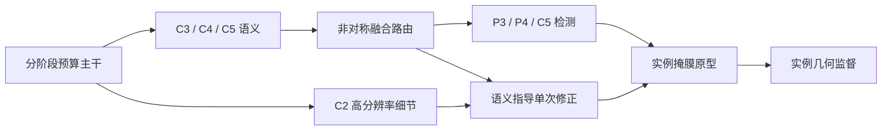

# SAGE-v4 全历史证据复盘与结构决策

_日期：2026-09-03。状态：重新设计的决策建议，尚未实现本报告提出的新结构，也没有其训练成绩。现有 SAGE30–35、旧结果及数据集均未被本次复盘覆盖。_

## 📋 结论先行

之前把 SAGE-v4 主要建立在 SAGE20–23 上，依据不够全面。重新核对后，不建议把 SAGE34 当成默认最终模型，也不建议继续在完整 PAN 外增加第二套融合路径。

更值得验证的主线是：**非对称、按任务分工的特征路由 + 语义指导的高分辨率掩膜修正 + 尺度适配的实例几何监督**。它分别继承 S06 的结构减法、G10/T04 的细节与实例分割路径，以及 SAGE 中形状监督的有限积极信号。主干应进行有对照的阶段级压缩，而不是因为 C3k2 出现得多就整体替换。

这不是“把 S06、G10、PIDNet 都叠起来”。它要求撤掉冗余路线，将省下的预算用在最终掩膜最需要的位置。自动控制的借鉴应落实到明确的估计、比较和修正，不包装成已证明稳定的 PID 系统。

目前没有一个模型已在相同数据、初始化、训练预算和多随机种子下证明自己是最终冠军。G10、T04、G0830-G02 是重要候选，而不是可以跨实验条件直接排序的前三名。

## 🔍 本次到底检查了什么

自动读取 `E:/mastercode/1_SEVER/results` 下所有 144 份可用 `results.csv` 及其 `args.yaml`，并解析当前 `0_orange_yaml` 中 240 个模型 YAML 的 backbone/head 图。144 份 CSV 中只有 130 种不同的文件内容；14 份是展示目录中的完全相同复制件。130 也不是独立完整实验数：包括中断运行、短测试以及 B09 的旧前缀结果与完整结果。

每份结果都找到了按模型文件名对应的当前 YAML 候选，但这**不能证明当前源码等于当年训练时的源码**。缺少历史 Git 状态、加载权重记录或数据清单的运行，保留比较限制。

| 当前结果分组 | CSV 数量 | 说明 |
|---|---:|---|
| A_baselines | 9 | 历史基线，训练协议不统一 |
| F_series | 50 | 单模块和后续变体，不能只看模块名 |
| G_series | 11 | 包含 G10 不同训练配方 |
| N_series | 11 | 包含 full 配方的负结果 |
| S_series | 10 | S00–S09，结构减法的关键对照 |
| B_series | 11 | 包含 B09 旧 58 轮记录与完整 300 轮记录 |
| T | 10 | 各历史候选重跑，部分未达到 300 行 |
| G0830 | 5 | 同组基线、T04 锚点及结构变体 |
| SAGE | 4 | SAGE20–23，均有 300 行 |
| SXQ | 9 | 纳入全量表，未用跨协议排名支撑新结构 |
| Best_models_showcase_20260901 | 14 | 展示复制件，不计作重复验证 |

L/H 目录未发现可用 `results.csv`；Light/ORCHID 没有可纳入本轮统计的数值结果。C/D 的部分结构可通过 T07–T09 对应源文件检查。这里的“未发现”仅针对当前本地结果，不表示服务器没有训练。

人工重点阅读了 G10、T04、S06、双原型头、G0830、SAGE-v4 的模块/头部/损失实现；阅读了桌面自动控制文档全文、模块库目录与相关实现，并与 PIDNet、Gated-SCNN、RefineMask、AFPN、DBPN 等作者代码交叉核对。没有声称逐行读完所有历史 Python 文件。

可复查数据：

- [全量结果表](E:/mastercode/1_SEVER/code/ultralytics-main-new/reports/sage_v4_reassessment_20260903/history_summary.csv)
- [结果—当前 YAML 候选矩阵](E:/mastercode/1_SEVER/code/ultralytics-main-new/reports/sage_v4_reassessment_20260903/history_architecture_inventory.json)
- [当前 train/val 几何审计](E:/mastercode/1_SEVER/code/ultralytics-main-new/reports/sage_v4_reassessment_20260903/geometry_train_val.json)

## 📊 历史实验真正约束了哪些决策

下表 AP 均为 **Mask mAP50–95 × 100**，取该次 CSV 中最高 Mask AP 的一行；不是 AP50，不是测试集成绩，也不一定对应官方 `best.pt`。差值单位为百分点。同一模型的 AP50、precision、recall 必须从同一行读取，不拼接各自峰值。

| 对照 | Mask AP | 差值 | 能支持的判断与限制 |
|---|---:|---:|---|
| S00 → S05（只留 FPN） | 60.740 → 60.218 | −0.522 | 不能把所有向上回流都删掉 |
| S00 → S06（非对称 PAN） | 60.740 → 61.346 | +0.606 | 保留 P3→P4、去掉 P4→P5 回流值得重测；不是所有指标都改善 |
| S06 → S07（再加 LSKA） | 61.346 → 60.510 | −0.836 | 在该结构中，增加 LSKA 并未带来收益 |
| B06 → B08（context/topology 再加 scale 融合） | 61.862 → 60.755 | −1.107 | 当前 scale 融合存在负交互；255 与 300 行预算不同，仍应保留限制 |
| G10 baseline 配方 → full 配方 | 67.681 → 64.033 | −3.648 | 同 YAML 并不意味着同实验；混合配方明显更差，不能归因单一损失 |
| N02 baseline 配方 → full 配方 | 67.341 → 65.006 | −2.335 | 第二个模型也反对直接堆满损失与增强 |
| G0830 G00 → G01（T04 对应架构） | 67.031 → 66.864 | −0.167 | T04 架构并未在这个组里稳定超过基线 |
| G0830 G00 → G02（双路主干） | 67.031 → 67.241 | +0.210 | 有弱积极信号，没有证明大幅提升 |
| G0830 G00 → G03（本地频率融合） | 67.031 → 65.631 | −1.400 | 当前频率融合实现应退出默认配置，不等于 FreqFusion 论文无效 |
| SAGE21 → SAGE22（拓扑/对比组合） | 66.935 → 66.593 | −0.342 | 辅助任务与最终分割存在取舍 |
| SAGE22 → SAGE23（联合形状方案） | 66.593 → 66.717 | +0.124 | 值得保留为待验证线索，不足以宣称新的最优结构 |

S06 的峰值 AP 提升并非全面胜出：AP50 从 S00 的 78.585 变成 78.355；最后 20 行平均 Mask AP 从 59.961 变成 59.855。其前 50 轮峰值也低于 S00，后续才反超。因此应把它当成**低成本结构候选**，不是稳定涨点结论。300 轮训练的前 50 轮也不等于单独设置 epochs=50 的训练，因为学习率计划不同。

G10 full 同时修改了 scale、copy_paste、IoU 损失、TAL 度量、最少正样本、频率损失、Dice 和边界项；这不是某一个 loss 的消融。T04 的 peak 是 67.367，但只有 195 行；其辅助权重为 0.5/0.1，G0830-G01 为 0.15/0.03，其他运行条件也可能变化，不能只把复现差异归因于权重。

F14-LSKA 的 67.599、F17-CARAFE 的 67.170、G10 的 67.681 等说明相关思路在历史条件下有竞争力；它们不证明这些模块在任何 backbone、neck、loss 或数据协议下都有效。历史 YOLOv9c 的 68.173 也不能直接当成轻量化目标模型：其规模与 nano 不同，实验条件仍需统一。

### 当前结构成本的一个实测线索

本次使用同一当前实现、nc=1、输入 640 构建模型并计算参数与算子 FLOPs：

| 当前 YAML | Params | GFLOPs |
|---|---:|---:|
| SAGE30 官方结构对照 | 2,842,803 | 10.3558 |
| S06 非对称 PAN | 2,316,211 | 9.9326 |

S06 少约 **18.5% 参数、4.1% GFLOPs**，说明结构减法比目前 v4 的微小通道改造更值得优先检验。这个结果不是 GPU 延迟，不是改版 v4 的最终成本，也不保证训练更快。记录见 [结构成本](E:/mastercode/1_SEVER/code/ultralytics-main-new/reports/sage_v4_reassessment_20260903/structure_profile.json)。

## 🔍 从数据重新定义问题，而不是泛泛谈“绿色小目标”

本次只读当前本地 `E:/mastercode/data/orange_yolo` 的 train/val。以无增强、640 方形 letterbox 计算多边形面积和凸包面积，并调用本项目实际的 stride=4 overlap-mask 栅格化及 v4 目标生成函数。没有查看 test、移动图片或修改标签；这些本地统计不能替代服务器实际加载清单。

| 几何量 | Train | Val |
|---|---:|---:|
| 图像 / 实例 | 676 / 4,324 | 193 / 1,049 |
| Solidity < 0.9 的实例 | 1,005（23.24%） | 284（27.07%） |
| Solidity < 0.8 的实例 | 317（7.33%） | 94（8.96%） |
| 缩放后多边形面积 < 16² | 1,070（24.75%） | 183（17.45%） |
| 缩放后多边形面积 < 32² | 2,423（56.04%） | 469（44.71%） |
| 多实例图像内线性尺度比中位数 | 3.37 | 3.01 |
| 图内线性尺度比第 90 百分位 | 8.53 | 8.86 |
| 栅格化后仍存在的极小实例 | 1,065 | 182 |
| 上述极小实例中，整个实例都被 v4 边界带覆盖 | 1,065 / 1,065 | 182 / 182 |

这里的线性尺度比为同图 `sqrt(max(area)/min(area))`；这些是训练输入尺度上的审计分组，不冒充 COCO 原始尺寸 AP_s。Solidity 低是形状凹陷的代理量，不能仅凭这一数值认定一定由叶片遮挡造成，仍需视觉复核与子集标注。

最后一行揭示 v4 的具体缺陷：在 160×160 掩膜网格上先求 3×3 内边界，再膨胀 3×3，会让极小果几乎没有内部。三个独立二分类通道并没有互斥标签冲突，但“边界”与“前景”在小果内部高度重复，不能当成额外的细粒度形状知识。训练和验证分别有 9、1 个实例未留在 overlap 栅格中，这是量化与覆盖共同作用下的表示现象，尚未拆分原因，绝不据此删除标注。

真正需要解决的是：

1. 叶片/枝条造成的深凹可见边界，不能被模型抹平或填成完整圆果。
2. 同一遮挡果应保持一个实例身份，两个贴邻果却需要被分开；普通前景/边缘图不能独自表达这个差别。
3. 同图大、小目标共存，不能为小果强化高分辨率就放弃深层上下文，也不能为轻量化把细节层过度压缩。

还没有完成原分辨率相邻实例间隙分布及预测 split/merge 的逐实例量化，故不能声称任何方案已经解决这些问题。“过度依赖绿色”也尚无颜色干预实验来证实，只能作为机制假设。

## ⚖️ 自动控制文档：保留什么，纠正什么

可保留的是细节/语义分工、误差修正、小初始残差、避免过度平滑的思路。PIDNet 本身也是受 PID 启发的视觉结构，不是把任意卷积网络变成有稳定性保证的控制系统。[PIDNet 论文](https://openaccess.thecvf.com/content/CVPR2023/html/Xu_PIDNet_A_Real-Time_Semantic_Segmentation_Network_Inspired_by_PID_Controllers_CVPR_2023_paper.html)

需要明确纠正：

- **传递函数推导不成立。** 文档给定 `P(s)=K0/(τs+1)`，`C(s)=(Kd*s²+Kp*s+Ki)/s`，闭环特征多项式应为 `(τ+K0*Kd)s²+(1+K0*Kp)s+K0*Ki`，不是文档中的三阶多项式。基于那个三阶式得到的 Routh 条件不能用于本方案。
- **LTI 理论不能直接套用。** 本网络的非线性、变分辨率、可学习投影/门控并未满足文档所假设的固定线性可观测系统条件。GAP 不是时间积分器，高通差分也不自动等于 PID 微分项。
- **Haar 分解不等于全模块无损。** 分解本身可逆，随后通道压缩和非线性可能丢信息。不能称整条 backbone 无损。
- **初始化和速度不能口头保证。** 修改 C3k2 内部、SPPF 或下采样后，不能声称 100% 权重对齐。文档中的参数、GFLOPs、毫秒延迟需要真实构建和测量日志支持。
- **不要惩罚合理凹陷。** 最小化 `1-mean(solidity(pred))` 会奖励掩膜变凸，与可见遮挡任务冲突。应对照匹配 GT 的凹陷与边界误差，而不是追求更圆。
- **连通分量不等于实例 split。** 同一可见实例可以因遮挡出现多个部分。split/merge 应结合 GT 实例身份、预测实例 ID 和覆盖关系定义，不能只数一张掩膜的连通块。

## 🔬 模块库与作者代码如何取舍

| 思路 | 实际可借鉴的机制 | 本项目的取舍 |
|---|---|---|
| PIDNet / Gated-SCNN | 语义、细节、边界分工；语义指导形状流 | 用于 P2 细节的语义约束，不整套搬入第二个 backbone；语义分割并不自动赋予实例身份 |
| AFPN | 先融合相邻尺度，逐步接入更多尺度 | 学习融合顺序与通道预算；原实现包含多次残差块，不等于直接替换后必然更快 |
| RefineMask | 中间预测与细粒度特征参与后续掩膜细化 | 优先迁移掩膜修正思想；不默认引入昂贵的多阶段 ROI 系统 |
| DBPN | 上投影、回投、显式误差修正 | 作为单次掩膜重投影校正的机制来源；超分结果不是分割收益证明 |
| FreqFusion | 自适应高/低通与特征重采样 | 本地 G03 并非同一算法，不能据此否定论文；暂不整套引入其复杂算子 |
| FasterNet / MambaOut | 部分通道空间混合、门控卷积 | 深层主干的独立备选对照；不能把本地改写称为作者完整实现 |
| CARAFE / HaarDown / PKI / RCM | 内容重组、分解、多核/上下文 | 作为备选，不与上述方案一次全部相加 |

对应作者来源：[Gated-SCNN](https://github.com/nv-tlabs/GSCNN)、[AFPN 代码](https://github.com/gyyang23/AFPN/blob/master/mmyolo/mmyolo/models/necks/yolov5_afpn.py)、[RefineMask](https://github.com/zhanggang001/RefineMask)、[DBPN 投影代码](https://github.com/alterzero/DBPN-Pytorch/blob/master/base_networks.py)、[FreqFusion](https://github.com/Linwei-Chen/FreqFusion)、[MambaOut](https://github.com/yuweihao/MambaOut)。

桌面 CARAFE 明确标注为非官方实现，其 `unfold` 会产生大型中间张量；FreqFusion 的动态滤波和偏移重采样也需要专门性能验证。不能凭参数少、DWConv 多就认定训练快。相反，AFPN 作者的 YOLO 版本先把输入通道缩到四分之一再逐级融合，提示我们应学习**整体预算和路径**，不是只复制一个融合块。

涉及外部源码移植时还需逐仓库核对许可证及保留归属；模块集合中的标签不是作者身份或顶会出处证明。

## 🛠️ 对现有 SAGE30–35 的重新判断

| 现有配置 | 代码事实 | 重新判断 |
|---|---|---|
| SAGE30 | 官方 YOLO11n-seg 结构 | 必须保留固定协议控制组 |
| SAGE31 | 完整 PAN 外额外 C5→C4→C3 窄路，只修正 PAN-P3 | 数值初始化谨慎，但路由冗余；不能称 PID 闭环 |
| SAGE32 | P2 经 16 通道细节支路直接补充 mask prototype | 值得做低成本对照，但 G10 早已有 P2 原型细节路径，不是新概念 |
| SAGE33 | 31+32，官方损失 | 保留作已有 v4 参考，不认定它已是最优结构 |
| SAGE34 | 33+前景/边界/分隔辅助监督 | 边界带对极小果退化；辅助头仅从 P2 detail 取特征，不直接接收高层语义，也没有专门的实例对排斥损失。撤回“默认完整方案”的建议 |
| SAGE35 | 33+P4 gated stage，无 34 的辅助项 | 确有阶段替换，但还没有训练收益；不是整个主干重构，也不是真正显著轻量化的证据 |

注意：SAGE34 辅助监督会通过共享细节特征间接影响 prototype；问题不是“梯度完全不通”，而是其语义/实例约束不够直接，收益需要验证。

## 🧭 修订 v4：一个结构主线，而不是新的模块清单

### 1. 按任务分工的非对称路由，并对主干分阶段分配预算

以 S06 为结构起点：保留 `C5→C4→C3` 自上而下语义传递及 `P3→P4` 定位回流，移除再走一次的 `P4→P5` 回流；大目标头使用原生 C5。高分辨率 C2 单独服务掩膜细节，不新增全分辨率 P2 检测塔。

主干压缩按位置实施：P2/P3 先保留细节容量，P4 的空间混合以 G10 使用过的 Faster 类部分卷积作为**独立候选**，P5 保留上下文而不盲目删深层。应同时与原 C3k2 及已写的 gated P4 作公平对照，只留下有实际收益的一种。`C3k2_Faster` 仍保留 CSP 外壳，这不是完全脱离 YOLO 的新 backbone，论文必须如实描述。

这个设计的重点是改变信息路线和阶段预算；不是宣称 C3k2 错误，更不是承诺把所有 C3k2 换掉才有创新。

### 2. 用高层语义约束 P2，单次修正掩膜特征

现有 v4 把 raw detail 直接作为 prototype 残差，还用它单独预测几何图。建议先把 P3 语义投影到 P2 的窄通道空间，用语义区分“果实边缘”与“叶片边缘”，再形成修正信号。其机制来源是 Gated-SCNN 的语义形状指导及 RefineMask 的细化路径，而不是普遍边缘增强。

控制启发的附加候选只展开**一次**：由 P3 构造高分辨率估计，与 P2 测量融合后回投到 P3，与原 P3 比较，再把误差投回掩膜细节空间。这样存在可检查的误差路径，不让整个 backbone 重复运行。DBPN 的上下投影误差结构提供先例，但迁移到此处仍是待检验假设。[DBPN 论文](https://openaccess.thecvf.com/content_cvpr_2018/html/Haris_Deep_Back-Projection_Networks_CVPR_2018_paper.html)

约定窄空间的 `s=Proj(P3)`、`d=Proj(C2)`，一种待实现的单次更新可写为：`h0=U(s)`；`h1=h0+g(d,h0)*(d-h0)`；`e=s-D(h1)`；`h2=h1+α*Ue(e)`，再由 `h2` 提供掩膜残差。这里 g 是可学习融合权重，不是真实不确定性；α 小初值或有界不代表整个系统稳定。s 本身也会出错，回投一致不等于分割正确，必须设置“有语义但无误差修正”的对照，防止增加无效的自洽约束。

实现预算限定为 16/24 通道、常规插值和小卷积、固定一次展开；不默认引入 `unfold`、动态 kernel、`grid_sample` 或训练/推理循环。若服务器性能门槛不通过，保留更简单的语义指导细节路线，删除回投修正。

### 3. 几何监督直接面向实例，且尊重极小果的分辨率极限

保留官方实例 mask loss 为主目标，不重新叠满 NWD、频率损失、Dice、边界项和强 copy-paste。

新几何项应分开消融：对具备可分辨内部的实例监督可见凹陷边界；对极小果不再把整个实例当成独立边界知识；对贴邻果，利用 GT 实例 ID 约束各自预测不要侵入邻果的已知可见区域。遮挡区域不补成圆，不用凸包标签替代 GT，不把共享前景分隔图冒充全局拓扑约束。

边界宽度必须以原图/训练输入尺度定义并检查栅格化覆盖；仅缩小 stride=4 的边界核不能凭空恢复已丢失的细节。若需要局部更高分辨率监督，要单独核算训练成本，不能默认提高全图掩膜分辨率。

实例排斥项应与现有逐实例 BCE 的隐含排斥做比较，证明重加权确有额外收益。相邻实例对仅在训练中从 GT 预计算/限制邻域，避免每步全图两两实例循环造成 Light 式性能问题。阈值与权重必须预先固定，并单独记录为方法消融变量。

### 结构关系示意（设计稿）

## 🧪 哪些实验才值得花训练时间

先实现并检查新候选，不能用现有 SAGE30–35 的编号假装已经包含上述方案。未来 YAML 仍放 `0_orange_yaml/SAGE_series`，保留旧文件不覆盖；必须支持标准 `YOLO(yaml)` 构建，并通过导出、注册、通道/重复数、前向、反向、FLOPs 与短训练检查。前台 Python / VS Code 三角运行方式保持不变。

建议的最小决策顺序，不是立即提交的新批量队列：

| 对照 | 唯一主要变化 | 决策依据 |
|---|---|---|
| 官方结构 vs 当前 S06 路由 | 颈部连接 | 参数/延迟是否降低，AP 与尺度分组是否保持 |
| 选定路由 vs 加语义指导 P2 | 掩膜细节路径 | 凹陷边界与小实例 AP 是否改善 |
| 上述模型 vs 单次回投修正 | 显式误差路径 | 是否优于直接融合，而非只增加成本 |
| 固定结构 vs 几何项单项/组合 | 可见边界、邻实例排斥 | split/merge 是否改善且不损害极小召回 |
| 固定路由/头部 vs P4 替换 | 主干阶段 | Faster/gated 是否值得取代原阶段，记录加载权重差异 |

现有 SAGE33 可以保留为旧 v4 参照，G10 或 T04 选一个作历史强模型对照。不要把十个变化不同的模型全部跑满 300 轮后再猜原因。

沿用当前固定协议文件，不因新结构悄悄改超参：imgsz=640、batch=16、workers=4、AdamW、lr0=0.001、lrf=0.01、weight_decay=0.0005、dropout=0、amp=false、mask_ratio=4、overlap_mask=true。初始化使用同一 `yolo11n-seg.pt`，新增模块的未匹配权重比例必须记录；若研究 AMP，单独成对实验，不混入架构增益。

先 1–3 轮 smoke 与同机 GPU 短性能测量，再统一预算筛选；50 轮边界候选需要观察学习趋势，不能根据与 300 轮前缀不一致的计划草率淘汰。最终仅对主基线和最终方法做 42/43/44 三种子 300 轮；数据拆分须保持 group-aware、测试集不用于调参。用户自己的服务器数据路径继续由用户指定，不新增确认指纹门槛。

性能接受标准应同时包括：同卡相同 AMP/batch 的训练步耗时、纯前向延迟、含 NMS/mask 后处理延迟、峰值显存、Params、GFLOPs。提出至少 10% 参数/GFLOPs 降低或实测延迟下降的轻量化目标，但这是筛选标准，不是本报告已经达到的结果。

现有 loader 已在前次工作中修复 RGB 自动发现时将同名 JPG/NPY 缓存算成两份图的问题；本次不再修改数据。修复后每轮有效样本/更新次数可能变化，所以应在同一修复后的加载器上重跑必要对照。相同路径和“都是 300 轮”仍不足以证明可比。

## 📏 PR、混淆矩阵与论文评价口径

PR 曲线的绘制会在未达到的召回区间追加零精度端点；末端贴零本身不是清洗失败或网络崩溃。真正的目标是提高可达到的召回与高召回区精度，不能通过改图隐藏缺陷。当前图例 AP50 也不能替代更严格的 Mask AP50–95。

默认检测混淆矩阵通常依据框匹配，不能单独证明实例掩膜边界、split 或 merge 的改善。最终应报告 Mask AP50–95/AP50、precision/recall、按原始尺寸与训练有效像素分别定义的尺度分组、可见凹陷子集、相邻间隙子集、实例 split/merge、图内尺度跨度，以及相同硬件的速度。

深凹指标以匹配 GT 的可见边界为参照；相邻实例评估保留实例 ID。没有这些证据，就不能把“抗伪装”“保持拓扑”“解决尺度冲突”写成结论。

## 📝 三个论文创新点：现在只能叫候选贡献

1. **任务分工的非对称多尺度结构。** 贡献候选是按“实例发现—掩膜刻画”需求重分配路由与主干预算，不是 FPN/PAN 或注意力本身。
2. **语义约束的单步掩膜误差修正。** 贡献候选是针对可见凹陷和伪装背景，把可解释的误差路径限定在低成本掩膜分支；不是声称首次反馈、首次 P2 或 PID 稳定性。
3. **尺度适配的实例几何学习。** 贡献候选是同时尊重极小目标量化极限、可见凹陷与相邻实例身份；不是将已有 BCE、Dice、边界损失重新命名。

这三项都必须经过与最近邻方法的区别分析、独立消融、挑战子集和速度验证。若第三项仅是已有损失的小幅调权，应降为训练细节，不能硬凑成独立创新点。没有哪个“几篇论文思想融合”可以保证成为最佳结构。

## 📋 本次交付与未做事项

本次新增全历史结果/结构扫描脚本、几何审计脚本、结果矩阵、几何量化、当前结构成本记录、来源笔记与本报告。两个审计脚本已完成真实数据读取并通过 Ruff 的 F/I 检查。

**未修改现有模型实现、YAML、训练队列或数据集；未执行新的完整训练；未测 GPU 延迟。** 之前 SAGE-v4 的构建/反向测试只能说明已有代码能运行，不能拿来证明本报告的新设计有效。

这次批判性评估和假设检验方法改变了设计取舍：撤回“更多融合、更多几何辅助必然更好”的默认假设，优先检验历史结构减法、实例约束与真实速度。Markdown 决策记录将观察事实、理论借鉴、待实现设计和实验门槛分开，供后续实现时逐项核对。
