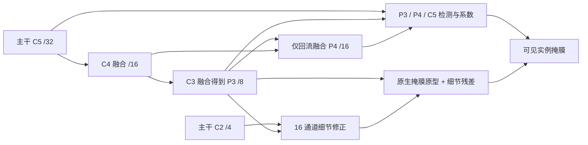

# SAGE V4 重构版：实现、证据与实验操作

_2026-09-03 · 程序代号 SAGE_V4R · 新配置 SAGE40–48 · 保留 SAGE30 官方对照_

## ✅ 本次交付与边界

已完成 9 个新模型的实现、标准 YOLO YAML 注册、固定协议批量入口、前台运行入口和回归验证。
这是依据全历史结果重新构造的 V4，不是之前 SAGE30–35 的简单改名；旧文件和已完成实验均保留。
**当前没有新模型的完整数据集长训结果，不把可运行、低参数量或论文思想等同于精度提升。**

本次研究范围仍是 RGB 柑橘幼果的可见区域实例分割。重点针对条状叶枝遮挡造成的深凹可见掩膜、
同一被遮挡果实与相邻接触果实之间的身份冲突，以及同图目标尺度跨度。没有加入 RGB-D、无模态补全、
圆度/凸包先验、果梗定位或机械控制任务，也没有修改数据集标注或划分。

设计依据见 [全历史复盘](E:/mastercode/1_SEVER/code/ultralytics-main-new/docs/SAGE_V4_GLOBAL_REASSESSMENT_20260903.md)。
此前的结果说明：S06 非对称颈部值得复查，但叠加 LSKA、尺度分支或混合损失并不稳定获益；
旧宽边界监督会覆盖极小掩膜的全部像素。因此本次先恢复可比较、可解释的结构和监督分工。

## 🧩 已实现的模型矩阵

下表为本地未融合模型、`nc=1`、输入 640 的参数量和理论 GFLOPs。不是 GPU 速度测量。
YAML 声明 `nc=80` 以尽量保持官方初始化的路径，训练时由数据 YAML 自动覆盖为实际类别数。

| YAML 名称（均位于 `0_orange_yaml/SAGE_series`） | 与指定对照相比的变化 | Params/M | GFLOPs |
| --- | --- | ---: | ---: |
| `SAGE30_official_control.yaml` | 保留的 YOLO11n-seg 同协议对照 | 2.843 | 10.356 |
| `SAGE40_asym_control.yaml` | 相对 30：S06 式非对称颈部，原生分割头 | 2.316 | 9.933 |
| `SAGE41_asym_direct_detail.yaml` | 相对 40：16 通道 P2 细节直接补入掩膜原型 | 2.318 | 10.025 |
| `SAGE42_asym_semantic_detail.yaml` | 相对 41：语义引导的细节融合 | 2.319 | 10.042 |
| `SAGE43_asym_reprojection.yaml` | 相对 42：一次低分辨率回投影误差修正 | 2.320 | 10.048 |
| `SAGE44_asym_boundary.yaml` | 相对 43：仅可分辨尺度的实例边界监督，权重 0.1 | 2.320 | 10.048 |
| `SAGE45_asym_neighbor.yaml` | 相对 43：仅邻果可见区域排斥监督，权重 0.1 | 2.320 | 10.048 |
| `SAGE46_asym_geometry.yaml` | 相对 43：两项监督同时启用，各 0.1 | 2.320 | 10.048 |
| `SAGE47_asym_faster_p4.yaml` | 相对 43：仅 P4 主干阶段改为已有 `C3k2_Faster` | 2.293 | 9.962 |
| `SAGE48_asym_gated_p4.yaml` | 相对 43：仅 P4 主干阶段改为 `SAGEGatedStage` | 2.284 | 9.932 |

40–48 比同表官方对照少约 18%–20% 参数，GFLOPs 仅下降约 3%–4%。
因此不能用“参数少 20%”推导“训练快 20%”。47/48 是主干阶段替换对照，**并没有替换整条主干**。
47 保留 CSP 包装结构；48 使用门控卷积阶段，不需要 Mamba。

## 🔀 结构究竟改变在哪里



1. **颈部拓扑**：保留自顶向下语义传播，但自底向上只回流到 P4；不再将融合后的 P4 经第二轮
   下采样送回 P5，直接采用 C5 的大尺度检测分支。这是明确改变连接关系，而不是在完整 PAN 后再加一个 PAN。
   YAML 中 20–22 层的 Identity 仅保留官方层编号，便于复用头部预训练权重，没有卷积计算。
2. **掩膜细节路径**：P2 仅作 16 通道掩膜细节支路，不新增高分辨率检测/分类塔。
   P3 语义上采样后与细节及两者差异形成门控输入；用语义决定吸收多少浅层细节。
3. **单步误差修正**：43–48 将融合结果回投影到 P3 尺度，与 P3 语义计算差异，再上采样修正一次。
   没有循环展开、第二遍主干、动态卷积、可变形采样或全分辨率注意力。

令 `d` 为投影后的细节，`s` 为投影后的语义，`U` 为最近邻上采样，`A` 为平均池化，核心关系为：

```text
g  = sigmoid(Conv1x1(concat(d, U(s), abs(d-U(s)))))
z  = U(s) + g * (d-U(s))
e  = s - W_down(A(z))
z' = z + tanh(alpha) * U(W_up(e))        # 仅回投影版本执行一次
proto = original_proto + tanh(beta) * W_mask(z')
```

`alpha` 初始为 0.1，原型残差 `beta` 初始为 0.01，门初始为 0.5。
这是受误差修正启发的可训练有限前馈结构，不是物理时间上的 PID 控制器。
有界系数也不代表整个网络满足稳定性定理；本次不重复控制文档中的未经证明的稳定性结论。

## 🎯 损失如何照顾极小、深凹与邻果

44–46 保留官方检测、分类、DFL、掩膜损失和原有正样本分配。在相同实例 logits 的 BCE 上增加两个可关闭的
重加权项，不新增训练专用大头，不修改真实可见掩膜为完整果实。

| 项目 | 实际定义 | 明确不做的事 |
| --- | --- | --- |
| 可分辨边界 | 约 4 输入像素宽的形态学边界带；栅格掩膜换算面积至少 256 输入像素，且腐蚀后内部至少保留 25% | 不把没有内部的极小掩膜强行当成全边界，也不取消这些目标的原有 mask loss |
| 邻果排斥 | 自己外扩约 8 输入像素后，与其他已标注果实可见区域相交；这些像素对本实例为负 | 不排斥本实例自身像素、不填平遮挡凹口、不要求实例圆形 |
| 归一化 | 先平均同一 GT 的正样本预测，再平均有效 GT；几何区域每张图按唯一 GT 构造 | 不让分到更多正样本的果实自动获得更大的额外权重，也不构造实例两两大矩阵 |

两项权重是本轮预先固定的实验选择，**不是论文证明的最优阈值/权重**。43/44/45/46 构成完整 2×2 消融：
`(0,0)`、`(0.1,0)`、`(0,0.1)`、`(0.1,0.1)`，用于检验各自作用及相互冲突。
额外项记录在训练日志的 `sem_loss` 槽中；这里的名称沿用框架，实际是实例几何约束，不是另一个语义任务。
权重不会再被 `box=7.5` 隐式放大。推理时没有额外几何损失计算。

测试时发现并处理了框架小样本 CPU `crop_mask` 会原地裁剪 BCE 的细节：只对该路径复制 BCE，避免邻果监督读到
已被清零的区域。GPU 分支沿用非原地裁剪路径。本地未验证 CUDA 数值一致性，不把 CPU 通过说成 GPU 已通过。

限制同样重要：本轮没有修改 TAL 以强制产生更多小目标正样本；P2 细节也不能找回输入缩放时已消失的物体。
若后续主要失败仍是“检测候选根本未出现”，需先查尺度分层召回/正样本覆盖，而不是继续追加边界损失。

## 📚 从论文借鉴了什么

语义引导细节借鉴了高层语义筛选形状信息的思路，但本实现没有完整照搬图像级形状流；原论文是语义分割，
不能直接证明本实例分割改造有效。[Gated-SCNN 原论文](https://arxiv.org/abs/1907.05740)

单次回投影借鉴超分辨率中的显式上下投影误差修正，本项目不使用原论文的多级密集上采样网络，
也不声称恢复原图丢失信息。[DBPN 作者实现](https://github.com/alterzero/DBPN-Pytorch/blob/master/base_networks.py)

边界监督与细节进入掩膜分支的动机参考实例分割中的边界建模与细化；我们用已有实例 logits 的监督重加权，
不是复刻两阶段 RoI 模型。[BMask R-CNN](https://arxiv.org/abs/2007.08921)、
[RefineMask](https://openaccess.thecvf.com/content/CVPR2021/html/Zhang_RefineMask_Towards_High-Quality_Instance_Segmentation_With_Fine-Grained_Features_CVPR_2021_paper.html)

P4 两个替换分别沿用已有 PConv/CSP 包装与门控卷积思路，作为速度和初始化兼容性的独立对照。
不以汇总仓库文件名代替作者和论文依据。[FasterNet 作者仓库](https://github.com/JierunChen/FasterNet)、
[MambaOut 作者仓库](https://github.com/yuweihao/MambaOut)

因此论文当前只能把“非对称多尺度分工、语义引导单步掩膜修正、尺度可分辨实例几何监督”列为三个
**待验证的贡献候选**。它们是否足够新、是否都有效，要由完整消融和同协议比较决定。

## ▶️ 在服务器上直接点击运行

上传当前整个 `code/ultralytics-main-new` 文件夹，包括 `ultralytics`、`protocols`、训练脚本和新 YAML。
仅复制新 YAML 或一个入口文件不足以获得自定义模块。不要用 `pip install -U ultralytics` 覆盖此 fork。

在服务器 VS Code 中选择已有训练环境，打开 **`RUN_SAGE_V4.py`**，修改顶部：

```python
DATA = "/data/sxq/datasets/orange_yolo/data.yaml"  # 改为你自己的清洗后数据 YAML
DEVICE = "0"                                  # 改为你实际使用的空闲卡
SUITE = "screen"
EPOCHS = 50
PROJECT = "/data/sxq/results/SAGE/CITRUS_SAGE_V4R_SCREEN_50EP"
DRY_RUN = True
```

1. 保持 `DRY_RUN=True`，点击 Python 三角形。`screen` 应显示 5 个 `BUILD OK`，不训练。
2. 将 `DRY_RUN=False`；服务器尚未验证时，先用 `SUITE="smoke"`、`EPOCHS=1` 和独立的 `PROJECT` 做短训。
3. 短训成功后设回 `screen`、50 轮和新的结果目录，点击三角形开始前台串行训练。
4. 已确认要长训时可设 `EPOCHS=300`，同时换一个 `...300EP` 的新目录。不要覆盖 50 轮或中途退出的实验。

不需要 `nohup`、`&` 或数据确认参数。终端会实时显示各模型训练进度，按 `Ctrl+C` 停止整个队列。
关闭 VS Code/SSH 终端可能中止前台任务；再次启动会跳过同协议已完成实验，但不会自动覆盖或续跑半成品。
使用 `_protocol/ledger.jsonl` 查看队列事件，单个模型的 `results.csv` 查看逐轮结果。

| SUITE | 模型 | 用途 |
| --- | --- | --- |
| `screen` / `structure` | 30、40、41、42、43 | 首先决定颈部和细节修正是否有效 |
| `geometry` | 43、44、45、46 | 边界 × 邻果 2×2 消融 |
| `backbone` | 43、47、48 | P4 主干阶段替换 |
| `all` | 30、40–48，共 10 个 | 一次全部跑完，仍然只串行运行 |
| `control` | 30 | 同协议官方对照 |
| `smoke` | 全部 10 个，只允许 1–3 轮 | 构建之外的实际训练验证 |

队列在每个 seed 内使用固定 `order_seed=20260903` 随机排列，以减少固定先后顺序与服务器时段的混杂。
这不改变每个模型的训练 seed。`SEEDS="42,43,44"` 时先完成一个 seed 的整组模型，再进入下一个。
`ONLY` 可以填写完整 YAML 文件名去掉 `.yaml` 后的名称，多个用英文逗号隔开。

也可以在该代码目录的终端直接运行同一批量程序：

```bash
python 20260903_citrus_sage_v4r_batch.py --data /data/sxq/datasets/orange_yolo/data.yaml --suite all --epochs 300 --device 0 --project /data/sxq/results/SAGE/CITRUS_SAGE_V4R_ALL_300EP --skip-completed --fail-fast
```

推荐三角形入口，因为它还有本地设备锁和空闲 GPU 检查。前台执行本身不会消除服务器资源竞争，
也不会自动停止过去仍在运行的 Light/SAGE 进程。不要重复点击或与旧训练共用同一张卡。

## 🔒 固定超参数与单模型官方入口

唯一正式协议是 `protocols/citrus_paper1_formal_v1.yaml`，本轮没有更改。

| 类别 | 固定设置 |
| --- | --- |
| 初始化 | 同一个 `yolo11n-seg.pt`；新层按自身初始化器；记录逐参数实际继承情况 |
| 训练预算 | 初筛 50 轮、seed 42；最终 300 轮、seeds 42/43/44 |
| 数据/输入 | 同一划分，RGB，imgsz 640，batch 16，workers 4，cache false |
| 优化 | AdamW，lr0 0.001，lrf 0.01，momentum 0.937，weight_decay 0.0005 |
| 稳定性 | AMP **False**，deterministic True，dropout 0，compile False |
| 掩膜/损失 | mask_ratio 4，overlap_mask True；box 7.5、cls 0.5、dfl 1.5；除编号消融外旧自定义损失关闭 |
| 训练策略 | warmup 3，patience 300，close_mosaic 10，cos_lr False，多尺度训练关闭 |
| 增强 | hsv 0.015/0.7/0.4，translate 0.1，scale 0.5，fliplr 0.5，mosaic 1；mixup/cutmix/copy_paste 0 |
| 验证 | split val，NMS IoU 0.7，max_det 300，half False，plots True |

这里沿用既定 AMP=False，不把旧 AMP=True 的结果当作这批的严格消融对照。若未来要用 AMP 提速，应另立协议，
基线与候选共同更改；当前批量脚本会拒绝悄悄改变 batch/imgsz/workers/AMP 等锁定设置。
完整增强参数以 YAML 为准，不手动删改默认值。你的数据路径由你指定；程序只记录加载清单与协议，不弹出指纹确认门禁。

单模型可以直接按官方 API 运行，自定义头会自动选择对应 criterion，无需注册补丁脚本：

```python
from pathlib import Path
from ultralytics import YOLO
from citrus_protocol import fixed_train_args, load_protocol

if __name__ == "__main__":
    root = Path(__file__).resolve().parent  # 将这个单模型脚本放在代码根目录
    settings = fixed_train_args()
    settings.update(load_protocol()["fixed_validation"])
    for key in ("citrus_boundary", "citrus_concavity", "citrus_query", "citrus_contrast",
                "citrus_exclusive", "citrus_quality", "citrus_topology", "citrus_vfl", "nwd_ratio"):
        settings[key] = 0.0
    model = YOLO(str(root / "0_orange_yaml/SAGE_series/SAGE43_asym_reprojection.yaml"))
    model.load(str(root / "yolo11n-seg.pt"))
    model.train(data="/data/sxq/datasets/orange_yolo/data.yaml", epochs=300, device="0", seed=42,
                project="/data/sxq/results/SAGE/SAGE43_single_300EP", name="seed42", **settings)
```

这段普通 API 示例不自动附加批量程序的 `best_mask.pt` 和溯源回调。正式论文数据建议用已完成这些记录的批量入口，
或以 `ONLY` 指定单个模型。官方 `best.pt` 的选取标准未被修改；批量入口额外保存按 Mask AP50-95 选择的 `best_mask.pt`。

## 🧪 已做验证与速度边界

本地环境为 Python 3.9.13、PyTorch 2.8.0+cpu，没有 CUDA。已完成：

- 111 项回归测试通过，含历史 SAGE、V4、V4R、前台入口、固定协议和新队列安全测试。
- 所有 10 个配置通过标准 API 构建、训练态前向、反向和非方形输入推理态检查，完成 GFLOPs 估计。
- 新头的 PyTorch export 分支、预训练匹配、保存/重新载入通过；**未验证 ONNX/TensorRT 导出**。
- 测试几何项对 GT 顺序与相同预测的正样本复制不敏感；检查凹口、邻果、极小实例和空标注批次。
- 启用几何时官方四项基础损失与原实现一致；关闭时直接调用原掩膜损失。
- 9 个新模型均完成复制样本上的 1 轮 `.train()`，有 `results.csv` 和 `weights/best.pt`。
- 另用真实 1 轮训练验证批量入口的回调，确认生成 `best_mask.pt`、加载清单、初始化继承记录与完成标记。

短训目录为 `1_results/_validation_sage_v4r_20260903`，仅使用已有独立 fixture 的 4 张训练/4 张验证图片。
短训显式使用 CPU、imgsz 256、batch 2、workers 0、plots False、mosaic 0 等测试配置，均记录在
`SMOKE_NOT_FORMAL.json`；**这不是正式协议或精度实验，没有改动原数据**。
本地 NumPy 1.21.6 与 Matplotlib 不兼容，因此没有执行带正式绘图的完整协议训练，也没有擅自升级全局环境。

CPU 微基准：batch 1、输入 256、2 个线程，每图 12 个合成实例，5 次预热后 25 次测量。

| 模型 | 纯前向中位数/ms | 前向 + 损失 + 反向中位数/ms |
| --- | ---: | ---: |
| 官方对照 30 | 24.58 | 92.89 |
| 非对称对照 40 | 23.05 | 84.02 |
| 语义细节 42 | 24.26 | 88.38 |
| 单次回投影 43 | 24.99 | 90.55 |
| 双几何监督 46 | 24.55 | 94.10 |
| P4 Faster 47 | 25.17 | 88.30 |
| P4 Gated 48 | 25.04 | 86.59 |

仅在这个小型 CPU 测试中没有出现数量级慢化，不能推断服务器会更快。该测量不包含数据读取、优化器更新、NMS、
掩膜后处理或验证，也不是端到端 FPS；少量百分比差异可能是测量噪声。
完整数据见 `reports/SAGE_V4R_CPU_BENCHMARK_20260903.json`。

服务器先检查导入环境：

```bash
python -c "import torch, numpy, matplotlib.pyplot, ultralytics; print(torch.__version__, torch.cuda.is_available(), numpy.__version__, ultralytics.__file__)"
```

`ultralytics.__file__` 必须指向这份上传的代码。随后在空闲卡上执行同设备微基准：

```bash
python scripts/benchmark_sage_v4r.py --device 0 --batch 16 --imgsz 640 --steps 30 --output reports/sage_v4r_gpu_timing.json
```

这是独立性能检查，不会训练正式数据。输出文件已存在时会拒绝覆盖，请使用新名称。
还应对比正式短训第 2–3 轮的训练/验证耗时、实际加载图片数和 GPU 利用率；第一轮缓存、绘图时间不代表稳定速度。

## 📊 跑完后如何判定该保留什么

先比较同数据、同预算、同初始化和同 AMP 的 30/40/41/42/43，不把不同历史数据协议的最大 AP 拼成结论。
优先报告 Mask AP50-95，再看 AP50、精度、召回、Params/GFLOPs 和实测延迟。
最终只对基线与筛出的少数候选进行三个 seed 的均值±标准差比较；不要把同一次训练的 300 行当作 300 次独立重复。

另外必须保留任务分层：按可见 mask 的 solidity/凸包缺损、邻居间隙、split/merge 错误和每图尺度跨度评价；
小目标 AP 必须说明是原图面积还是网络输入面积，不能与 COCO APs 名称混用。
如果方法只提高大果 AP 或抹平凹口，即使总 AP 小幅上升，也不足以支持本文针对性贡献。

PR 最右端的补零绘图不在本次修改范围，禁止裁掉零尾来假装改进。
检查可达到的最大召回、固定精度下召回、固定召回下精度及实例错误，区分候选漏检、排序失败与掩膜匹配失败。
不能把“形状支路存在”当作模型已经不再依赖颜色；颜色扰动评估只能作为诊断，不能混入主表正式原图 AP。

每个结果保存实际加载文件清单、图片/实例数、硬件、初始化匹配、协议、代码/权重摘要及训练事件。
这些记录用于排除数据或初始化混杂，不要求你改变自己的数据路径。
在 43 的结构收益、44/45 的独立收益和 47/48 的速度收益都得到验证前，不提前宣布“全部叠加”是最终最优网络。
