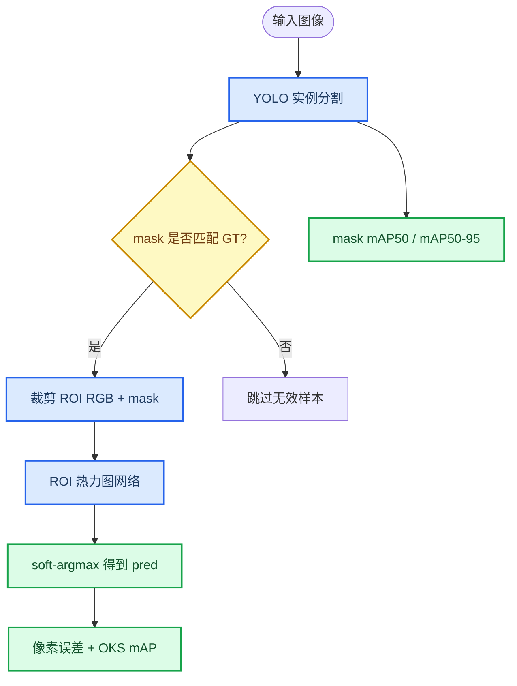

# 西瓜花授粉点二阶段关键点算法与 YOLO 改进说明

_面向 `E:\mastercode\ultralytics-main-new` 当前代码结构，说明一阶段分割、二阶段关键点定位、指标计算、可视化与 YOLO A+B+C 改进策略。_

---

## 总体结论

当前更合理的主线不是继续把 64 个轮廓点直接送入回归网络，而是采用“YOLO 实例分割 + ROI 热力图关键点网络”的方向 A。旧的 010/011 轮廓点方法可以保留为对照实验，但它丢失了花蕊纹理、颜色和局部空间关系，容易把分割边界误差传递给关键点回归。013/014/015 的 ROI 热力图路线更适合授粉点定位：输入为 ROI 内的 RGB 图像和二值 mask，输出 64x64 热力图，再通过 soft-argmax 得到预测点。

## 当前文件分工

| 文件 | 作用 | 建议定位 |
| --- | --- | --- |
| `010_contour_to_pollination.py` | YOLO mask 后采样 64 个轮廓点，MLP 回归偏移 | 旧基线 |
| `011_improved_contour_net.py` | 64 点 + 1D CNN/Transformer 增强 | 轮廓点增强基线 |
| `012_visualize_010.py` | 010 的可视化与验证 | 旧路线分析 |
| `013_train_improved_v2.py` | ROI RGB+mask 热力图训练 | 第一版方向 A |
| `014_train_improved_v2.py` | 轻量 ROI 热力图训练，参数在脚本顶部 `TRAIN_CONFIG` 中修改，输出关键点 mAP | 当前主推教师模型 |
| `015_train_distill_v2.py` | 014 教师到 015 学生的蒸馏训练 | 轻量部署模型 |
| `016_train_watermelon_seg_p2.py` | 一阶段 YOLO P2 分割训练 | 分割模型训练入口 |
| `98_visualize_compare.py` | 单图 GT 与 pred 对比图 | 论文图和误差检查 |
| `99_compare_models.py` | 013/015 公平对比 | 消融实验入口 |

## 算法流程



## YOLO A+B+C 改进策略

改进后的 YAML 已放入 `E:\mastercode\ultralytics-main-new\gpt_yaml_yolo`。

| 配置 | A | B | C | D | 适用场景 |
| --- | --- | --- | --- | --- | --- |
| `gpt_yolo11n_seg_p2_light_abc.yaml` | 加 P2/4 小目标分割分支 | `C3Ghost` 替换部分 `C3k2` | `SCDown` 轻量下采样 | `Segment [nc, 24, 192]` | 优先轻量化和速度 |
| `gpt_yolo11n_seg_p2_psa_abcd.yaml` | 加 P2/4 小目标分割分支 | `SCDown` 降低下采样成本 | `C2PSA` 加强全局上下文 | 保持 `Segment [nc, 32, 256]` | 优先精度 |

推荐先训练轻量版检查流程，再训练精度版作为论文主模型。已验证两个 YAML 能被当前 Ultralytics 解析并构建模型；参数量约为 light 1.87M、psa 2.37M，均小于原 P2 baseline 的约 2.92M。

## 训练顺序

先训练一阶段分割模型。需要换 YAML、输出名称、epoch、batch 或增强参数时，直接修改 `016_train_watermelon_seg_p2.py` 顶部的 `TRAIN_CONFIG`：

```powershell
cd E:\mastercode\ultralytics-main-new
python 016_train_watermelon_seg_p2.py
```

再把更好的 YOLO `best.pt` 接入二阶段。把 `014_train_improved_v2.py` 和 `015_train_distill_v2.py` 顶部 `TRAIN_CONFIG["seg_model_path"]` 改成对应的 `best.pt`，然后直接运行：

```powershell
python 014_train_improved_v2.py
python 015_train_distill_v2.py
```

015 蒸馏依赖 014 的教师权重，默认读取 `results\14_roi_heatmap_lite\best.pth`；如果 014 保存目录改变，需要修改 `015_train_distill_v2.py` 顶部 `TRAIN_CONFIG["teacher_weights"]`。

## 指标计算

一阶段 YOLO 关注 Ultralytics 输出的 `mask mAP50` 和 `mask mAP50-95`。二阶段关键点使用 `keypoint_map_utils.py` 中的 OKS 单关键点 mAP：默认 `sigma=0.2`，阈值为 0.50 到 0.95，步长 0.05。结果中应同时报告：

| 指标 | 含义 |
| --- | --- |
| `mask mAP50` | 一阶段分割在 IoU 0.50 下的 mask AP |
| `mask mAP50-95` | 一阶段分割 COCO 风格平均 mask AP |
| `keypoint mAP50` | 二阶段预测点 OKS 大于 0.50 的比例 |
| `keypoint mAP50-95` | OKS 0.50:0.95 的平均值 |
| `mean/median error px` | 预测点与 GT 点的像素距离 |

论文实验建议至少做 baseline P2、light ABC、PSA ABCD 三组 YOLO 对比，再分别接 014 和 015，观察分割 mAP 提升是否真正转化为关键点 mAP 和像素误差下降。

## 可视化与排错

单图 GT/pred 对比使用：

```powershell
python 98_visualize_compare.py --image-path E:\mastercode\data\shr_watermelon\segmentation\images\val\dsc00005.jpg --seg-model-path results\18_gpt_psa_abcd\weights\best.pt
```

可视化输出保存在 `results\98_visualize_compare`。当前脚本已经使用更小的框线、点和文字，适合检查 GT 与不同模型预测点的空间偏差。若图中出现明显错配，优先检查三件事：YOLO 类别过滤是否合理、mask 是否覆盖目标花朵、GT 点是否落在匹配 ROI 内。

## 后续改进方向

第一优先级是稳定一阶段分割质量，因为二阶段 ROI 依赖 mask 的位置和形状。第二优先级是做 014 教师与 015 学生的精度-参数量消融，证明轻量化不是简单降配。第三优先级是扩展关键点 mAP 设置，例如报告不同 `sigma` 下的 mAP，以说明指标对小花尺寸和标注噪声的敏感性。

如果后续继续修改 YOLO，可以保持二阶段接口不变，只要新模型仍输出实例 mask，并在 `014/015` 的 `TRAIN_CONFIG["seg_model_path"]` 中填入新的 `best.pt` 即可。
