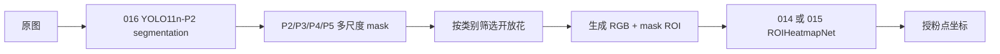

# 西瓜花授粉点二阶段 ROI 热力图算法说明

本文对应代码：

- `E:\mastercode\ultralytics-main-new\014_improved_net_v2.py`
- `E:\mastercode\ultralytics-main-new\014_train_improved_v2.py`
- `E:\mastercode\ultralytics-main-new\015_improved_net_v2.py`
- `E:\mastercode\ultralytics-main-new\015_train_distill_v2.py`
- `E:\mastercode\ultralytics-main-new\mine_yaml\016_yolo11n_seg_p2.yaml`
- `E:\mastercode\ultralytics-main-new\016_train_watermelon_seg_p2.py`

当前方案保留第一阶段 YOLO 实例分割，不把分割阶段删掉。整体任务被拆成两个相对清楚的子问题：

1. 第一阶段：用 YOLO segmentation 找到图像中的每朵西瓜花，输出实例 mask、类别和置信度。
2. 第二阶段：对候选花朵 ROI 做关键点定位，输出授粉点 heatmap，再把 ROI 内坐标映射回原图。

这样做的核心理由是：授粉点本身是一个局部关键点，如果直接在整图上回归点，背景、尺度变化和多花实例都会干扰模型；先用分割得到每朵花的 ROI，再在 ROI 内做热力图定位，任务会更稳定。

## 1. 总体流程

```mermaid
flowchart LR
    accTitle: Two Stage ROI Heatmap Pipeline
    accDescr: The pipeline first selects flower ROI candidates from YOLO segmentation without using keypoint labels, then trains and evaluates the lightweight ROI heatmap network on matched visible keypoints.

    a[原图] --> b[YOLO 实例分割]
    b --> c[输出每朵花的 mask / class / conf]
    c --> d[按 YOLO 类别筛选候选花朵]
    d --> e[mask 外接框扩展得到 ROI]
    e --> f[裁剪 RGB ROI 和 mask ROI]
    f --> g[拼接 4 通道输入: RGB + mask]
    g --> h[014/015 ROIHeatmapNet]
    h --> i[输出 64x64 授粉点 heatmap]
    i --> j[soft-argmax 得到 ROI 内连续坐标]
    j --> k[坐标映射回原图]
    k --> l[像素误差 / OKS / mAP / 候选覆盖率]
```



需要特别注意：候选 ROI 的选择不能看人工关键点答案。当前 `014` 中的处理方式是先看 YOLO 输出的类别，默认只把 `blooming_male` 和 `blooming_female` 送入第二阶段；之后才用 GT 点给这些候选 ROI 分配监督信号。

默认候选类别：

```text
0: blooming_male
3: blooming_female
```

如果要让第二阶段处理所有 YOLO mask，把 `014_train_improved_v2.py` 顶部配置改成：

```python
TRAIN_CONFIG["candidate_class_ids"] = "all"
```

## 2. 数据路径

脚本中的默认路径如下：

```text
第一阶段分割模型:
E:\mastercode\ultralytics-main-new\results\09_watermelon_seg_2\weights\best.pt

训练图像:
E:\mastercode\data\shr_watermelon\segmentation\images\train

训练关键点标注:
E:\mastercode\data\shr_watermelon\pose\labels\train

验证图像:
E:\mastercode\data\shr_watermelon\segmentation\images\val

验证关键点标注:
E:\mastercode\data\shr_watermelon\pose\labels\val

默认输出目录:
E:\mastercode\ultralytics-main-new\results\14_roi_heatmap_lite

015 蒸馏部署版默认输出目录:
E:\mastercode\ultralytics-main-new\results\15_roi_heatmap_distill

016 第一阶段分割增强版配置:
E:\mastercode\ultralytics-main-new\mine_yaml\016_yolo11n_seg_p2.yaml

016 第一阶段分割增强版训练脚本:
E:\mastercode\ultralytics-main-new\016_train_watermelon_seg_p2.py
```

关键点 JSON 中使用的标签：

- `fully_visible`：授粉点完全可见，参与训练和评估。
- `partially_visible`：授粉点部分可见，参与训练和评估。
- `invisible`：授粉点不可见，不参与第二阶段热力图监督。

## 3. ROI 样本构建

每个训练样本不是整张图，而是一个花朵 ROI。构建过程如下：

1. 用第一阶段 YOLO 对原图做实例分割。
2. 从 YOLO 输出中取出每个实例的 `mask`、`class_id` 和 `confidence`。
3. 按 `TRAIN_CONFIG["candidate_class_ids"]` 过滤候选实例，默认只保留开放花类 `0,3`。
4. 对候选 mask 计算外接矩形。
5. 按 `margin_ratio=0.25` 向外扩展外接矩形，保留花瓣和花蕊周边上下文。
6. 从原图中裁剪 RGB ROI。
7. 从 mask 中裁剪对应的 mask ROI。
8. 把 RGB ROI 和 mask ROI 都缩放到 `128 x 128`。
9. RGB 使用 ImageNet 均值方差归一化，mask 转成 `0/1` 单通道。
10. 拼接成 4 通道输入：`R, G, B, mask`。

最终输入张量形状：

```text
roi: 4 x 128 x 128
```

其中 mask 通道很重要。RGB 提供颜色、纹理、花蕊结构信息；mask 提供第一阶段分割出的花朵形状和边界信息。网络可以同时利用外观信息和几何信息。

## 4. GT 匹配方式

训练热力图网络时，需要知道某个候选 ROI 对应哪个人工授粉点。这里使用一对一匹配，避免一个 GT 点被多个 mask 重复使用。

匹配规则：

1. 只读取 `fully_visible` 和 `partially_visible` 点。
2. 忽略 `invisible` 点。
3. 对每个候选 mask 计算 mask 质心。
4. 计算所有候选 mask 质心和所有可见 GT 点之间的像素距离。
5. 按距离从小到大贪心匹配。
6. 一个 mask 只能匹配一个 GT，一个 GT 也只能匹配一个 mask。
7. 距离超过 `MAX_GT_MATCH_DISTANCE_PX = 160` 的匹配被丢弃。

这个匹配只用于训练和验证时分配监督，不用于推理时决定哪朵花要处理。推理时没有 GT，候选 ROI 只能来自 YOLO 输出。

## 5. 热力图标签

匹配成功后，把原图中的 GT 点转换成 ROI 内归一化坐标：

```text
gt_roi_x = (gt_x - roi_x1) / roi_width
gt_roi_y = (gt_y - roi_y1) / roi_height
```

然后在 `64 x 64` 的热力图上生成高斯峰：

```text
heatmap = exp(-((x - cx)^2 + (y - cy)^2) / (2 * sigma^2))
```

当前默认：

```text
heatmap_size = 64
sigma = 2.0
```

高斯热力图比直接回归 `(x, y)` 更适合关键点定位，因为它给模型提供了空间概率分布，允许预测在目标点附近形成连续峰值。

## 6. 014 网络结构

`014_improved_net_v2.py` 中的主网络叫 `ROIHeatmapNet`。它是一个轻量编码器-解码器，不再使用较重的 U-Net 风格网络。默认配置：

```text
in_channels = 4
base_channels = 16
input_size = 128 x 128
output_size = 64 x 64
trainable params = 40,945
```

### 6.1 基础模块

#### ConvBNAct

结构：

```text
Conv2d -> BatchNorm2d -> SiLU
```

它是网络里最基本的卷积单元。`act=False` 时最后的 SiLU 会替换成 `Identity`，用于残差分支的最后一层。

#### DepthwiseSeparableBlock

结构：

```text
Depthwise Conv 3x3 -> Pointwise Conv 1x1
```

普通卷积会同时做空间混合和通道混合，参数量较大。深度可分离卷积先对每个通道单独做空间卷积，再用 `1x1` 卷积混合通道，可以显著降低参数量和计算量。

#### ResidualDepthwiseBlock

结构：

```text
Depthwise Conv 3x3 -> Pointwise Conv 1x1 -> Residual Add -> SiLU
```

它的作用是加强局部特征表达，同时通过残差连接稳定训练。因为第二阶段数据量不大，残差结构可以降低轻量网络欠拟合或训练不稳定的风险。

#### StripContextBlock

结构：

```text
1x1 Conv
-> depthwise 1x7 strip conv
-> depthwise 7x1 strip conv
-> 1x1 Conv
-> Residual Add
```

这个模块用于补充长条方向的上下文。西瓜花花瓣和花蕊结构有明显方向性，单纯小卷积核只能看局部区域；`1x7` 和 `7x1` 可以用较低计算量扩大横向和纵向感受野。

### 6.2 主干结构

输入为 `4 x 128 x 128`，输出为 `1 x 64 x 64`。

| 阶段 | 模块 | 输出尺寸 | 说明 |
| --- | --- | --- | --- |
| 输入 | RGB + mask | `4 x 128 x 128` | 3 通道 RGB 加 1 通道 mask |
| stem | `ConvBNAct(4,16)` + `ResidualDepthwiseBlock(16)` | `16 x 128 x 128` | 提取浅层纹理和 mask 边界 |
| enc1 | `DepthwiseSeparableBlock(16,32)` + `ResidualDepthwiseBlock(32)` | `32 x 128 x 128` | 增加通道表达 |
| down1 | `MaxPool2d(2)` | `32 x 64 x 64` | 下采样到热力图尺度 |
| enc2 | `DepthwiseSeparableBlock(32,64)` + `ResidualDepthwiseBlock(64)` | `64 x 64 x 64` | 提取较强语义特征 |
| down2 | `MaxPool2d(2)` | `64 x 32 x 32` | 进一步扩大感受野 |
| context | 2 个 `StripContextBlock(64)` | `64 x 32 x 32` | 建模花朵方向上下文 |
| up1 | 双线性上采样 + `1x1 Conv(64,32)` | `32 x 64 x 64` | 回到输出尺度 |
| skip concat | concat `up1` 和 `down1` | `64 x 64 x 64` | 融合浅层细节和深层上下文 |
| dec1 | `DepthwiseSeparableBlock(64,32)` + `ResidualDepthwiseBlock(32)` | `32 x 64 x 64` | 解码并细化定位特征 |
| head | `ConvBNAct(32,16)` + `Conv2d(16,1)` | `1 x 64 x 64` | 输出授粉点 heatmap logits |

这里的 skip connection 不是完整 U-Net 那种多层大解码器，只保留一个关键尺度的浅层信息融合，所以参数量比较低。

### 6.3 为什么 014 更轻

旧版 `013` 约有 `1,786,913` 个可训练参数，`014` 只有约 `40,945` 个可训练参数。减少参数主要来自：

1. 使用 `base_channels=16`。
2. 大量使用深度可分离卷积。
3. 只保留必要的单尺度 skip fusion。
4. 用 strip context 替代更重的全卷积上下文模块。

这更符合当前任务：第一阶段已经把花朵区域裁出来，第二阶段不需要重新学习整图检测，只需要在小 ROI 内做精细定位。

### 6.4 015 蒸馏部署版网络

`015_improved_net_v2.py` 是面向移动端部署的学生网络。它不改变第一阶段 YOLO 分割，也不改变 ROI 构建、GT 匹配、热力图标签和评估指标；变化只发生在第二阶段热力图网络本身。`014` 作为教师网络，`015` 作为学生网络，用更少的通道数和更浅的结构学习教师的空间响应。

默认配置：

```text
qiin_channels = 4
base_channels = 8
input_size = 128 x 128
output_size = 64 x 64
trainable params = 6,281
teacher params = 40,945
student / teacher params = 0.153
```

也就是说，`015` 的参数量约为 `014` 的 `15.3%`。它适合先作为移动端候选版本做速度、精度和稳定性对比；如果后续导出 ONNX 或 TensorRT，也应该优先从 `015` 开始。

主干结构如下：

| 阶段 | 模块 | 输出尺寸 | 说明 |
| --- | --- | --- | --- |
| 输入 | RGB + mask | `4 x 128 x 128` | 与 014 完全一致，仍然使用第一阶段 mask 作为第 4 通道 |
| stem | `ConvBNAct(4,8)` | `8 x 128 x 128` | 提取最浅层颜色、纹理和 mask 边界 |
| enc1 | `DepthwiseSeparableBlock(8,16)` + `ResidualDepthwiseBlock(16)` | `16 x 128 x 128` | 轻量通道扩展，保留高分辨率细节 |
| down | `MaxPool2d(2)` | `16 x 64 x 64` | 直接下采样到热力图输出尺度 |
| enc2 | `DepthwiseSeparableBlock(16,24)` + `ResidualDepthwiseBlock(24)` | `24 x 64 x 64` | 在输出尺度上提取定位特征 |
| context | `StripContextBlock(24, kernel_size=5)` | `24 x 64 x 64` | 用较小 strip kernel 建模花朵方向上下文 |
| skip | `ConvBNAct(16,24, kernel_size=1, act=False)` | `24 x 64 x 64` | 把浅层细节投影到同一通道数后与 context 相加 |
| head | `ConvBNAct(24,8)` + `Conv2d(8,1)` | `1 x 64 x 64` | 输出授粉点 heatmap logits |

`015` 相比 `014` 的主要减法：

1. `base_channels` 从 `16` 降到 `8`。
2. 通道上限从 `64` 降到 `24`。
3. 删除 `32 x 32` 低分辨率瓶颈和上采样解码器。
4. `StripContextBlock` 从两个减少为一个，kernel 从 `7` 减到 `5`。
5. skip fusion 从 concat 改成 add，避免通道数翻倍。

这样的代价是学生网络自身表达能力更弱，所以不建议只用普通 GT 热力图训练。`015_train_distill_v2.py` 默认使用 `014` 的 `best.pth` 做教师蒸馏，让学生同时学习人工标注和教师热力图分布。

## 7. 损失函数

`014` 的训练损失由两部分组成：

```text
loss = heatmap_mse + 0.25 * coord_smooth_l1
```

### 7.1 heatmap_mse

网络输出的是 logits，先经过 sigmoid 得到预测热力图：

```text
pred_heatmap = sigmoid(logits)
```

然后和 GT 高斯热力图做 MSE：

```text
heatmap_mse = MSE(pred_heatmap, gt_heatmap)
```

这部分约束整张热力图的形状，让峰值出现在授粉点附近。

### 7.2 coord_smooth_l1

为了让最终坐标也被直接优化，脚本会对 logits 做 soft-argmax，得到连续坐标：

```text
pred_roi_xy = soft_argmax_2d(logits)
coord_smooth_l1 = SmoothL1(pred_roi_xy, gt_roi_xy)
```

当前 soft-argmax 使用：

```text
beta = 20.0
```

`beta` 越大，soft-argmax 越接近普通 argmax；`beta` 太小则坐标会被整张热力图平均化。当前值是一个相对折中的选择。

### 7.3 015 蒸馏损失

`015` 学生网络训练时，保留 `014` 的 GT 监督，同时加入教师蒸馏：

```text
loss = gt_weight * gt_loss + distill_weight * distill_loss
gt_loss = heatmap_mse + 0.25 * coord_smooth_l1
distill_loss = spatial_kl + distill_coord_weight * teacher_coord_smooth_l1
```

默认权重：

```text
gt_weight = 1.0
distill_weight = 0.7
distill_temperature = 2.0
distill_coord_weight = 0.25
```

其中 `spatial_kl` 不是对单个最大点做蒸馏，而是把 `64 x 64` heatmap logits 展平成空间概率分布后做 KL 散度：

```text
spatial_kl = KL(
  log_softmax(student_logits / T),
  softmax(teacher_logits / T)
) * T^2
```

这样学生不仅学习“最终坐标在哪里”，还学习教师认为哪些邻域位置也可能合理。对小模型来说，这比只拟合一个高斯标签更稳定。

`teacher_coord_smooth_l1` 则对教师和学生各自的 `soft_argmax_2d(logits)` 做 SmoothL1，让学生的连续坐标也向教师靠拢。注意教师网络只用于训练，推理部署时只需要 `015` 学生网络。

## 8. 训练流程

进入项目目录：

```powershell
Set-Location E:\mastercode\ultralytics-main-new
```

如果要先训练新的第一阶段分割模型，运行 `016`：

先在 `016_train_watermelon_seg_p2.py` 顶部修改 `TRAIN_CONFIG`。关键字段建议如下，不要删除字典里的其他字段：

```python
TRAIN_CONFIG.update({
    "model": r"E:\mastercode\ultralytics-main-new\mine_yaml\016_yolo11n_seg_p2.yaml",
    "data": r"E:\mastercode\ultralytics-main-new\208_shr_watermelon_seg.yaml",
    "pretrained": r"E:\mastercode\yolo11n-seg.pt",
    "epochs": 150,
    "imgsz": 960,
    "batch": 12,
    "optimizer": "AdamW",
    "lr0": 0.001,
    "mask_ratio": 4,
    "mosaic": 0.8,
    "copy_paste": 0.1,
    "close_mosaic": 20,
    "name": "16_watermelon_seg_p2",
    "smoke_test": False,
})
```

然后一键运行：

```powershell
python .\016_train_watermelon_seg_p2.py
```

训练完成后，新的第一阶段分割权重默认位于：

```text
E:\mastercode\ultralytics-main-new\results\16_watermelon_seg_p2\weights\best.pt
```

训练 `014` 教师模型前，先在 `014_train_improved_v2.py` 顶部修改 `TRAIN_CONFIG`，关键字段如下：

```python
TRAIN_CONFIG.update({
    "epochs": 100,
    "batch_size": 16,
    "roi_size": 128,
    "heatmap_size": 64,
    "base_channels": 16,
    "lr": 0.001,
    "weight_decay": 0.0001,
    "seg_model_path": r"E:\mastercode\ultralytics-main-new\results\16_watermelon_seg_p2\weights\best.pt",
    "candidate_class_ids": [0, 3],
    "save_dir": r"E:\mastercode\ultralytics-main-new\results\14_roi_heatmap_lite",
})
```

然后运行：

```powershell
python .\014_train_improved_v2.py
```

如果没有训练 `016`，就把 `seg_model_path` 保持为默认的 `results\09_watermelon_seg_2\weights\best.pt`。如果已经训练了 `016`，建议把 `seg_model_path` 改为 `016` 的 `best.pt`，这样 `results.json` 会记录实际使用的第一阶段分割权重。

小样本调试建议直接改 `TRAIN_CONFIG`，并使用单独输出目录，避免覆盖正式结果：

```python
TRAIN_CONFIG["epochs"] = 1
TRAIN_CONFIG["batch_size"] = 2
TRAIN_CONFIG["max_train_samples"] = 2
TRAIN_CONFIG["max_val_samples"] = 2
TRAIN_CONFIG["max_visualizations"] = 2
TRAIN_CONFIG["save_dir"] = r"E:\mastercode\ultralytics-main-new\results\14_roi_heatmap_lite_smoke"
```

更严格的候选压力测试：

```python
TRAIN_CONFIG["candidate_class_ids"] = "all"
```

禁用样本缓存：

```python
TRAIN_CONFIG["cache"] = False
```

训练 `015` 蒸馏部署版前，应该先保证 `014` 教师权重存在：

```text
E:\mastercode\ultralytics-main-new\results\14_roi_heatmap_lite\best.pth
```

然后在 `015_train_distill_v2.py` 顶部修改 `TRAIN_CONFIG`，关键字段如下：

```python
TRAIN_CONFIG.update({
    "epochs": 100,
    "batch_size": 16,
    "roi_size": 128,
    "heatmap_size": 64,
    "student_base_channels": 8,
    "teacher_base_channels": 16,
    "teacher_weights": r"E:\mastercode\ultralytics-main-new\results\14_roi_heatmap_lite\best.pth",
    "seg_model_path": r"E:\mastercode\ultralytics-main-new\results\16_watermelon_seg_p2\weights\best.pt",
    "gt_weight": 1.0,
    "distill_weight": 0.7,
    "distill_temperature": 2.0,
    "distill_coord_weight": 0.25,
    "candidate_class_ids": [0, 3],
    "save_dir": r"E:\mastercode\ultralytics-main-new\results\15_roi_heatmap_distill",
})
```

运行：

```powershell
python .\015_train_distill_v2.py
```

`015` 小样本调试同样直接改配置：

```python
TRAIN_CONFIG["epochs"] = 1
TRAIN_CONFIG["batch_size"] = 2
TRAIN_CONFIG["max_train_samples"] = 2
TRAIN_CONFIG["max_val_samples"] = 2
TRAIN_CONFIG["max_visualizations"] = 2
TRAIN_CONFIG["save_dir"] = r"E:\mastercode\ultralytics-main-new\results\15_roi_heatmap_distill_smoke"
```

训练时的主要步骤：

1. 固定随机种子。
2. 加载第一阶段 YOLO 分割模型。
3. 遍历训练图像，用 YOLO 提取候选 mask。
4. 按类别筛选候选 ROI。
5. 和可见 GT 点做一对一匹配。
6. 构建 `RGB + mask` 输入和 GT heatmap。
7. 如果训练 `014`，直接用 GT heatmap 和 GT 坐标优化 `ROIHeatmapNet`。
8. 如果训练 `015`，额外加载冻结的 `014` 教师网络，并计算教师 heatmap logits。
9. 用 AdamW 优化学生网络或 014 网络。
10. 每个 epoch 后在验证集上评估。
11. 按 `mAP50-95` 保存最佳模型。
12. 训练结束后生成 `results.json`、训练曲线和可视化图。

## 9. 输出文件

默认输出目录：

```text
E:\mastercode\ultralytics-main-new\results\14_roi_heatmap_lite
```

`015` 默认输出目录：

```text
E:\mastercode\ultralytics-main-new\results\15_roi_heatmap_distill
```

主要文件：

- `best.pth`：验证集 `mAP50-95` 最好的模型权重。
- `results.json`：最终指标、参数、候选统计和可视化目录。
- `training_curve.png`：训练 loss、验证 loss 和验证 mAP 曲线。
- `visualizations/`：验证集预测可视化图。
- `visualizations/index.json`：每张可视化图对应的误差、GT 坐标、预测坐标和 ROI 框。

`015` 的 `results.json` 会额外记录：

- `teacher_weights`：教师权重路径。
- `seg_model_path`：实际使用的第一阶段 YOLO 分割权重路径。
- `teacher_params`：教师参数量。
- `student_params`：学生参数量。
- `student_teacher_param_ratio`：学生/教师参数量比例。
- `train_gt_losses`：GT 监督损失曲线。
- `train_distill_losses`：蒸馏损失曲线。

## 10. 指标解释

### 10.1 已匹配 ROI 定位指标

这些指标只在成功匹配到可见 GT 的 ROI 上计算：

- `mean_error_px`：预测点和 GT 点的平均像素距离。
- `median_error_px`：预测点和 GT 点的像素距离中位数。
- `<10px / <20px / <30px`：不同误差阈值下的样本比例。
- `mAP50`：OKS 大于等于 0.50 的比例。
- `mAP50-95`：OKS 阈值从 0.50 到 0.95，步长 0.05，取平均。

这里的 mAP 是单关键点 mAP，不是检测框 mAP。

### 10.2 候选覆盖率统计

为了避免“只看有答案的 ROI”导致指标显得过高，脚本还会输出：

- `candidate_masks`：第一阶段筛出来、准备送入第二阶段的候选 mask 数。
- `visible_gt_points`：标注中 `fully_visible` 和 `partially_visible` 点的数量。
- `matched_samples`：成功匹配并用于训练或评估的 ROI 数量。
- `unmatched_candidate_masks`：候选中没有匹配可见 GT 的数量。
- `unmatched_visible_gt_points`：可见 GT 中没有候选 mask 匹配的数量。

论文中建议分开报告：

```text
1. 候选覆盖率：matched_samples / visible_gt_points
2. 候选冗余：unmatched_candidate_masks / candidate_masks
3. 已匹配 ROI 上的关键点定位误差和 mAP
```

这样才不会把“ROI 内定位能力”和“完整系统端到端能力”混在一起。

## 11. 关于是否存在训练集泄露

当前 `014_train_improved_v2.py` 本身没有发现直接混用 train/val：

- 训练图像目录和验证图像目录不同。
- 训练 JSON 目录和验证 JSON 目录不同。
- 已检查训练图像和验证图像文件名无交集。
- 已检查训练图像和验证图像 MD5 哈希无完全重复。

但仍有一个需要在论文实验中说明的风险：第一阶段 YOLO 分割模型 `results/09_watermelon_seg_2/weights/best.pt` 是在同一个数据 YAML 上训练并验证的。如果这个 `best.pt` 是根据验证集表现选择出来的，那么第二阶段验证结果会间接受到第一阶段模型选择的影响。

更严谨的做法：

1. 固定第一阶段分割模型，不用第二阶段验证集挑选分割权重。
2. 增加独立 test 集，最终结果只在 test 集上汇报。
3. 或者重新训练一个只见过 train split 的分割模型，再用于第二阶段 val/test。

## 12. 如何理解当前效果

如果当前结果特别好，不能直接下结论说完整系统已经解决问题。需要先看三类信息：

1. `mean_error_px` 和 `mAP50-95`：说明已匹配 ROI 内的定位精度。
2. `candidate_masks`、`matched_samples`、`unmatched_candidate_masks`：说明第一阶段候选是否过多或过少。
3. 可视化图：检查预测点是否真的落在花蕊或授粉点附近，而不是因为标注匹配规则导致误差小。

尤其要注意：训练 heatmap 网络时，只用有可见授粉点的 ROI 是合理的监督学习做法；但评估完整流程时，不能只展示这些 ROI 的精度，还要展示没有匹配到 GT 的候选数量和漏掉的 GT 数量。

## 13. 后续实验建议

建议优先做这些对比实验：

1. `candidate_class_ids=[0, 3]` 和 `candidate_class_ids="all"` 对比，观察候选冗余和定位精度变化。
2. `014 base_channels=8 / 16 / 24` 对比，确认普通轻量网络的容量上限。
3. `015 student-base-channels=6 / 8 / 12` 对比，观察移动端学生网络的参数量和精度折中。
4. `distill-weight=0.3 / 0.7 / 1.0` 对比，确认教师约束是否过强。
5. `distill-temperature=1.0 / 2.0 / 4.0` 对比，观察教师空间分布软化程度。
6. `sigma=1.5 / 2.0 / 3.0` 对比，观察热力图峰值是否更稳定。
7. 使用独立 test 集重新评估，避免第一阶段模型选择带来的间接偏差。
8. 保存预测 heatmap 叠加图，检查模型是否形成稳定单峰。
9. 训练 `016 YOLO11n-P2`，对比旧分割模型和新 P2 分割模型带来的候选覆盖率、候选冗余和端到端定位变化。

当前方案的重点不是继续堆大网络，而是把两阶段任务边界划清楚：第一阶段负责找候选花朵，第二阶段负责候选 ROI 内的精确授粉点定位；评估时同时报告候选覆盖率和定位精度。

## 14. 第一阶段 YOLO11 分割改进：016 YOLO11n-P2

当前第二阶段 ROI 热力图网络已经很轻，继续压第二阶段的参数量不是唯一重点。第一阶段 YOLO 分割如果漏掉小花、mask 边界不稳定，第二阶段再强也没有机会处理正确 ROI。因此 `016` 的目标是先改善第一阶段候选质量，但仍然保持轻量，不直接换成更大的 YOLO11s/m/l。

`016` 的核心改动是：保留 YOLO11n-seg 主体，在分割头中额外加入 `P2/4` 高分辨率分支，让 `Segment` 同时使用 `P2, P3, P4, P5` 四个尺度。旧的 YOLO11n-seg 主要从 `P3/8, P4/16, P5/32` 输出分割特征；对西瓜花这种小目标和边界细节，`P3/8` 有时已经偏粗。新增 `P2/4` 后，mask head 能看到更细的空间网格，理论上更利于小花、花瓣边界和花蕊附近细节。



`016` 没有新增自定义 Python 网络层，只使用 Ultralytics 已经注册的模块：`Conv`、`C3k2`、`SPPF`、`C2PSA`、`Concat`、`Segment`。这样做的好处是风险低，不需要改 `ultralytics/nn/tasks.py`，也不需要额外注册模块；模型 YAML 能直接被 `YOLO(...)` 解析。

`016` 的文件位置：

```text
模型结构:
E:\mastercode\ultralytics-main-new\mine_yaml\016_yolo11n_seg_p2.yaml

训练脚本:
E:\mastercode\ultralytics-main-new\016_train_watermelon_seg_p2.py
```

网络尺度结构如下：

| 输出层 | 来源 | 步长 | 用途 |
| --- | --- | --- | --- |
| `P2` | backbone 第 2 层 + head 第 19 层 | `4` | 小花和细边界 |
| `P3` | head 第 22 层 | `8` | 常规小目标 |
| `P4` | head 第 25 层 | `16` | 中等目标 |
| `P5` | head 第 28 层 | `32` | 大目标和强语义 |
| `Segment` | `[19, 22, 25, 28]` | 多尺度 | 输出实例 mask |

`016` 的参数量验证结果约为：

```text
params = 2,921,300
task = segment
layers = 30
```

相对直接换大模型，这个改法更适合当前项目：第一阶段需要提高小目标 mask 质量，但后续还要在移动端部署完整流程，所以分割模型不应无节制变大。`P2` 分支会增加一些计算量，尤其在 `imgsz=960` 时更明显；如果显存或速度压力大，可以先降低 `imgsz` 或 `batch`，不要优先删掉 `P2`，因为 `P2` 正是这个版本的主要创新点。

推荐运行方式是在 `016_train_watermelon_seg_p2.py` 顶部修改 `TRAIN_CONFIG`，然后直接运行脚本：

```python
TRAIN_CONFIG.update({
    "model": r"E:\mastercode\ultralytics-main-new\mine_yaml\016_yolo11n_seg_p2.yaml",
    "data": r"E:\mastercode\ultralytics-main-new\208_shr_watermelon_seg.yaml",
    "pretrained": r"E:\mastercode\yolo11n-seg.pt",
    "epochs": 150,
    "imgsz": 960,
    "batch": 12,
    "optimizer": "AdamW",
    "lr0": 0.001,
    "lrf": 0.01,
    "weight_decay": 0.0005,
    "warmup_epochs": 3.0,
    "patience": 50,
    "mask_ratio": 4,
    "overlap_mask": True,
    "mosaic": 0.8,
    "copy_paste": 0.1,
    "close_mosaic": 20,
    "name": "16_watermelon_seg_p2",
})
```

```powershell
Set-Location E:\mastercode\ultralytics-main-new
python .\016_train_watermelon_seg_p2.py
```

小样本连通性检查：

```python
TRAIN_CONFIG["smoke_test"] = True
```

训练完 `016` 后，第二阶段不需要改 ROI 构建逻辑，只需要把新的第一阶段权重写入 `014` 或 `015` 的 `TRAIN_CONFIG`：

```python
TRAIN_CONFIG.update({
    "seg_model_path": r"E:\mastercode\ultralytics-main-new\results\16_watermelon_seg_p2\weights\best.pt",
    "epochs": 100,
    "batch_size": 16,
    "save_dir": r"E:\mastercode\ultralytics-main-new\results\14_roi_heatmap_lite_p2seg",
})
```

```powershell
python .\014_train_improved_v2.py
```

如果训练蒸馏版 `015`，教师 `014` 最好也来自同一个 `016` 分割权重生成的 ROI 分布，否则教师和学生看到的 ROI 分布可能不完全一致：

```python
TRAIN_CONFIG.update({
    "teacher_weights": r"E:\mastercode\ultralytics-main-new\results\14_roi_heatmap_lite_p2seg\best.pth",
    "seg_model_path": r"E:\mastercode\ultralytics-main-new\results\16_watermelon_seg_p2\weights\best.pt",
    "epochs": 100,
    "batch_size": 16,
    "save_dir": r"E:\mastercode\ultralytics-main-new\results\15_roi_heatmap_distill_p2seg",
})
```

```powershell
python .\015_train_distill_v2.py
```

评估时不要只看第二阶段已匹配 ROI 的误差。`016` 是否真正有效，应该看这三组指标是否同时改善：

| 指标 | 期望变化 | 含义 |
| --- | --- | --- |
| `matched_samples / visible_gt_points` | 上升 | 第一阶段漏检减少 |
| `unmatched_candidate_masks / candidate_masks` | 不明显上升 | 候选冗余没有失控 |
| `mean_error_px`、`mAP50-95` | 稳定或提升 | ROI 内关键点定位没有被更差 mask 干扰 |

## 15. 如何修改超参数

建议把超参分成三类调：第一阶段 YOLO 分割超参、第二阶段 `014` 教师网络超参、第三阶段 `015` 蒸馏学生网络超参。不要一次改很多项，否则结果变好或变差时很难判断原因。

### 15.1 016 分割训练超参

| 参数 | 默认值 | 调大时的影响 | 调小时的影响 |
| --- | --- | --- | --- |
| `imgsz` | `960` | 小花更清楚，显存和耗时增加 | 更快，但小目标和边界可能变差 |
| `batch` | `12` | 梯度更稳定，占用显存更多 | 省显存，但 batch 太小会抖 |
| `epochs` | `150` | 训练更充分，过拟合风险增加 | 更快，但可能未收敛 |
| `lr0` | `0.001` | 学习更快，过大可能震荡 | 更稳，但收敛慢 |
| `weight_decay` | `0.0005` | 正则更强，可能欠拟合 | 正则更弱，可能过拟合 |
| `mask_ratio` | `4` | 数值越大 mask 越粗、省显存 | 设为 `2` 可更细，但更吃显存 |
| `mosaic` | `0.8` | 增强更强，可能改变花朵局部结构 | 更贴近真实图，泛化可能下降 |
| `copy_paste` | `0.1` | 增加实例组合，过大可能不自然 | 更保守，增强不足 |
| `close_mosaic` | `20` | 最后更多 epoch 关闭 mosaic，利于收敛到真实分布 | 关闭太晚可能影响最终边界 |

优先调参顺序建议：

1. 固定数据划分和随机种子。
2. 先用默认 `016` 训练出基线。
3. 如果小花漏检明显，优先尝试 `imgsz=1024` 或 `mask_ratio=2`。
4. 如果显存不足，优先降低 `batch`，其次降低 `imgsz`。
5. 如果误检候选变多，降低 `copy_paste` 或 `mosaic`，并检查类别混淆。

### 15.2 014 ROI 热力图超参

| 参数 | 默认值 | 作用 | 建议范围 |
| --- | --- | --- | --- |
| `base_channels` | `16` | 控制教师网络容量 | `8 / 16 / 24` |
| `roi_size` | `128` | ROI 输入分辨率 | `128` 优先，显存允许再试 `160` |
| `heatmap_size` | `64` | 输出热力图分辨率 | 通常保持 `64` |
| `lr` | `0.001` | 学习率 | `0.0005 / 0.001 / 0.002` |
| `weight_decay` | `0.0001` | 正则强度 | `0.00005 / 0.0001 / 0.0005` |
| `candidate_class_ids` | `[0, 3]` | 哪些 YOLO 类别进入二阶段 | `[0, 3]` 或 `"all"` |
| `seg_model_path` | 旧 `09` 权重 | 第一阶段分割权重 | 推荐换成 `016` 的 `best.pt` |

`014` 还有几项目前写在源码函数里，暂未放入 `TRAIN_CONFIG`：

| 源码参数 | 默认值 | 位置/含义 |
| --- | --- | --- |
| `MAX_GT_MATCH_DISTANCE_PX` | `160` | 候选 mask 质心和 GT 点最大匹配距离 |
| `margin_ratio` | `0.25` | ROI 框相对 mask 外接框向外扩展比例 |
| `sigma` | `2.0` | GT 高斯热力图标准差 |
| `beta` | `20.0` | soft-argmax 温度系数 |
| `coord_loss_weight` | `0.25` | 坐标 SmoothL1 损失权重 |

这些源码参数不要优先改。更稳妥的顺序是先固定第一阶段分割模型，再调 `candidate_class_ids`、`base_channels`、`lr` 和 `batch_size`。只有当可视化发现热力图峰过尖、过散或 ROI 裁剪明显不够时，再考虑改 `sigma`、`beta` 或 `margin_ratio`。

### 15.3 015 蒸馏学生网络超参

| 参数 | 默认值 | 作用 | 建议范围 |
| --- | --- | --- | --- |
| `student_base_channels` | `8` | 控制学生网络大小 | `6 / 8 / 12` |
| `teacher_base_channels` | `16` | 必须和教师训练时一致 | 跟随 014 |
| `teacher_weights` | `14_roi_heatmap_lite\best.pth` | 教师权重 | 使用同一分割权重训练出的教师 |
| `gt_weight` | `1.0` | GT 热力图监督权重 | 通常保持 `1.0` |
| `distill_weight` | `0.7` | 教师蒸馏权重 | `0.3 / 0.7 / 1.0` |
| `distill_temperature` | `2.0` | 教师空间分布软化程度 | `1.0 / 2.0 / 4.0` |
| `distill_coord_weight` | `0.25` | 教师坐标约束权重 | `0.1 / 0.25 / 0.5` |
| `seg_model_path` | 旧 `09` 权重 | 第一阶段分割权重 | 与教师训练时保持一致 |

`015` 调参时要先确认教师模型可靠。如果 `014` 教师本身是用旧分割权重训练的，而 `015` 学生改用 `016` 分割权重，学生会看到不同的 ROI 分布，蒸馏目标会变得不干净。推荐流程是：

1. 训练 `016` 分割模型。
2. 用 `016 best.pt` 训练 `014` 教师。
3. 用同一个 `016 best.pt` 和新的 `014 best.pth` 训练 `015` 学生。
4. 最后再比较旧分割权重、`016` 分割权重、`014` 教师和 `015` 学生的完整指标。

### 15.4 推荐实验矩阵

最小可执行的对比矩阵如下：

| 实验 | 第一阶段 | 第二阶段 | 目的 |
| --- | --- | --- | --- |
| A | 旧 `09 best.pt` | `014 base=16` | 保留原始基线 |
| B | `016 P2 best.pt` | `014 base=16` | 看 P2 分割是否提升候选质量 |
| C | `016 P2 best.pt` | `015 student=8` | 看移动端蒸馏版精度损失 |
| D | `016 P2 best.pt` | `015 student=6/12` | 找学生网络容量折中 |

论文里建议把第一阶段和第二阶段结果分开报告：先报告 YOLO 分割的 mask 指标和候选覆盖，再报告 ROI 内授粉点误差，最后报告完整两阶段系统的端到端统计。这样可以说清楚改进到底来自分割候选变好，还是来自 ROI 内关键点定位变好。
