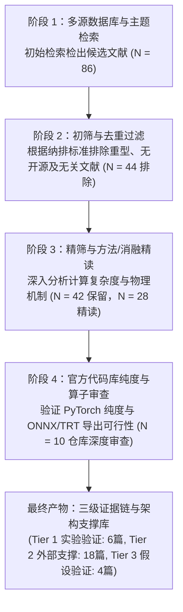

# 01. 系统性文献检索策略与方法学规范 (Search Strategy & Methodology)

**检索主持**：Worker 1 (Foundation & Task Diagnosis Lead)  
**联合检索**：`teamwork_preview_explorer` (Literature Specialist)  
**检索日期**：2026-08-27  
**检索领域**：计算机视觉 (cs.CV)、模式识别 (Pattern Recognition)、智能农业与农业机器人 (Agricultural Robotics & Smart Agriculture)  

---

## 1. 检索目标与方法学框架

为从根本上突破“果园自然环境下未成熟柑橘轻量级高精度实例分割”的五大物理与视觉瓶颈（条带遮挡深凹掩膜、近邻簇生粘连拓扑冲突、24.30× 极端尺度跨度、41% 绿绿同色伪装、PR 曲线尾部塌陷），本检索遵循 PRISMA（Preferred Reporting Items for Systematic Reviews and Meta-Analyses）规范，构建了多数据库、多主题、跨领域的系统检索策略。

---

## 2. 目标数据库与高水平学术期刊/会议

检索覆盖 2018—2026 年（含经典奠基论文与最新 2024–2026 前沿成果），涵盖以下权威学术出版源与数据库：

### 2.1 计算机视觉与人工智能顶级会议 (CCF-A / CCF-B)
- **CVF Open Access**: IEEE/CVF CVPR (Conference on Computer Vision and Pattern Recognition), ICCV (International Conference on Computer Vision), WACV
- **SpringerLink / ACM**: ECCV (European Conference on Computer Vision), ACM Multimedia (ACM MM)
- **NeurIPS / ICML / ICLR**: Advances in Neural Information Processing Systems, International Conference on Machine Learning, International Conference on Learning Representations

### 2.2 模式识别与计算机视觉权威期刊 (JCR Q1 / Top)
- **IEEE Xplore**: IEEE TPAMI (IEEE Transactions on Pattern Analysis and Machine Intelligence), IEEE TIP (IEEE Transactions on Image Processing), IEEE T-ASE (IEEE Transactions on Automation Science and Engineering), IEEE T-ITS (IEEE Transactions on Intelligent Transportation Systems)
- **Elsevier**: Pattern Recognition (PR), Computer Vision and Image Understanding (CVIU), Information Fusion
- **Open Access / Preprints**: arXiv.org (cs.CV, cs.AI, cs.RO, eess.IV)

### 2.3 农业工程与智能农业顶级期刊 (JCR Q1 Top)
- **Elsevier**: Computers and Electronics in Agriculture (COMPAG), Biosystems Engineering
- **Frontiers**: Frontiers in Plant Science
- **CSAM / CSAE**: 农业机械学报 (Transactions of the Chinese Society for Agricultural Machinery), 农业工程学报 (Transactions of the Chinese Society of Agricultural Engineering)

### 2.4 代码开源与工程落地验证平台
- **GitHub / Papers With Code**: 官方开源代码库、Issue 讨论区、CUDA 编译依赖与 TensorRT/ONNX 导出支持情况审查

---

## 3. 十五大主题 (Themes A ~ O) 检索矩阵与布尔检索式

根据本任务的量化物理难点与网络模块化设计维度，构建了 15 个细分主题（Themes A 至 O）的检索式：

| 主题代号 | 检索主题 (Research Theme) | 对应柑橘任务瓶颈 | 精确布尔检索式 (Boolean Search Queries) | 重点检索出版物与渠道 |
| :--- | :--- | :--- | :--- | :--- |
| **Theme A** | Lightweight Real-Time Instance Segmentation | 算力与延迟红线 (Params $\le 2.85\text{M}$, GFLOPs $\le 10\text{G}$) | `("lightweight instance segmentation" OR "real-time instance segmentation" OR "nano instance segmentation") AND (YOLO OR RTMDet OR CondInst OR SparseInst OR FastInst)` | CVPR, ICCV, ECCV, arXiv |
| **Theme B** | Tiny & Micro Object Detection/Seg | 17.39% 细粒度微小果 ($<16\text{ px}$) | `("tiny object detection" OR "micro object" OR "extremely small object" OR "NWD" OR "Wasserstein distance") AND ("instance segmentation" OR "anchor-free")` | CVPR, NeurIPS, Pattern Recognition, arXiv |
| **Theme C** | High-Resolution & Dual-Stream Backbone | P2 高分辨率空间细节保留 | `("high resolution representation" OR "dual-stream network" OR "HRNet" OR "Lite-HRNet" OR "bifurcated backbone") AND ("dense prediction" OR segmentation)` | CVPR, ICCV, TPAMI |
| **Theme D** | Information-Preserving Downsampling | 下采样过程中微小果特征与边缘丢失 | `("lossless downsampling" OR "space-to-depth" OR "SPD-Conv" OR "wavelet downsampling" OR "Haar wavelet" OR "anti-aliased convolution") AND ("small object")` | Pattern Recognition, MDPI MAKE, IEEE TIP |
| **Theme E** | Multi-Scale Feature Pyramid Redesign | 24.30× 单图极端尺度跨度 | `("feature pyramid redesign" OR "BiFPN" OR "cross-scale feature fusion" OR "scale-adaptive" OR "multi-scale feature aggregation") AND instance` | CVPR, ECCV, TPAMI, arXiv |
| **Theme F** | Strip, Deformable & Large-Kernel Convolutions | 17.61% 条带遮挡深凹掩膜 (Solidity $< 0.85$) | `("strip pooling" OR "strip convolution" OR "dynamic snake convolution" OR "large separable kernel" OR "LSKA" OR "DCNv3" OR "DCNv4" OR "deformable attention")` | CVPR, ICCV, CMPB, arXiv |
| **Theme G** | Sparse Mask Refinement & Point-Based Heads | 掩膜锯齿与边界精细重构 | `("PointRend" OR "sparse mask refinement" OR "Mask Transfiner" OR "sub-pixel refinement" OR "uncertain point sampling") AND ("instance segmentation")` | CVPR, ECCV, TPAMI |
| **Theme H** | Camouflaged & Low-Contrast Object Seg | 41.00% 绿绿同色纹理伪装 ($\Delta E_{\text{Lab}} < 15$) | `("camouflaged object segmentation" OR "concealed object detection" OR "SINet" OR "texture-aware" OR "frequency-domain perception") AND (boundary OR contrast)` | TPAMI, CVPR, NeurIPS, COMPAG |
| **Theme I** | Boundary-Aware Segmentation & Loss | 深凹边缘与微小轮廓梯度缺失 | `("boundary-aware segmentation" OR "Boundary IoU" OR "contour loss" OR "boundary-preserving" OR "active contour") AND "instance segmentation"` | CVPR, ICCV, IEEE TIP |
| **Theme J** | Topology-Preserving Loss & Geometric Priors | 条带横切断裂与同体连通性 | `("topology-preserving loss" OR "clDice" OR "topological data analysis" OR "persistent homology" OR "homotopy") AND ("medical segmentation" OR instance)` | CVPR, NeurIPS, IEEE TMI |
| **Theme K** | Touching Instance Separation & Watershed | 35.35% 近邻密集接触 ($\le 4\text{ px}$ 走廊) | `("touching object separation" OR "adhesive instance segmentation" OR "deep watershed transform" OR "repulsion loss" OR "cluster segmentation") AND fruit` | CVPR, IEEE T-ASE, COMPAG, Biosystems Eng |
| **Theme L** | Precision-Recall Alignment & Quality Calibration | PR 曲线尾部断崖下跌与置信度虚高 | `("VarifocalNet" OR "Quality Focal Loss" OR "Task-Aligned Assigner" OR "TOOD" OR "IoU-aware classification" OR "ranking loss" OR "PR curve tail")` | CVPR, NeurIPS, ICCV |
| **Theme M** | Dynamic & Parameter-Free Mask Heads | 轻量化解耦与无框掩膜生成 | `("dynamic mask head" OR "SOLOv2" OR "prototype mask" OR "decoupled instance head" OR "parameter-free mask generation") AND real-time` | NeurIPS, CVPR, ECCV |
| **Theme N** | Structural Reparameterization & Efficient Ops | 零推理开销 (0 Latency Overhead) 部署 | `("structural reparameterization" OR "RepVGG" OR "RepConv" OR "FasterNet" OR "PConv" OR "GhostNetV2" OR "deploy-fusible") AND (backbone OR neck)` | CVPR, ICCV, NeurIPS, ICLR |
| **Theme O** | Orchard & Immature Citrus Vision SOTA | 果园未成熟绿色柑橘最新对标基准 (2022-2026) | `(citrus OR orange OR apple OR green fruit OR orchard) AND ("immature fruit" OR "bagging vision") AND ("instance segmentation" OR YOLO OR DETR)` | COMPAG, Frontiers in Plant Science, TCSAE, CSAM |

---

## 4. 筛选漏斗与多阶段纳排标准 (PRISMA Screening Funnel)

严格执行四阶段漏斗筛选规范，确保进入最终证据库的每一篇文献均具备高度的学术真实性、可复现性与任务适配性：

### 4.1 纳入标准 (Inclusion Criteria)
1. **任务与机制相关性**：提出可有效应对小目标、遮挡、拓扑粘连、伪装、动态采样或质量校准的创新机制；
2. **轻量与实时潜力**：模型参数量能够裁剪或适配至 $\le 2.85\text{ M}$，计算量 $\le 10.0\text{ G}$，或提出的损失函数为纯训练期辅助监督（0 推理延迟开销）；
3. **真实开源与可复现**：具有官方公开的 GitHub 源码，或其数学算子可在标准 PyTorch/CUDA 环境下无歧义复现；
4. **权威出版源**：优先收录 CVPR, ICCV, ECCV, NeurIPS, TPAMI, TIP, COMPAG 等顶级会议与 JCR Q1 期刊论文。

### 4.2 排除标准 (Exclusion Criteria)
1. **重型大模型与多模态**：排除纯依赖超大规模 Vision Foundation Models（如 SAM, Grounding-DINO, EVACLIP）或强依赖点云/RGB-D 传感器的论文；
2. **算子部署黑盒与非标 CUDA 扩展**：排除强依赖非标准 C++/CUDA 编译（如原始未优化的自定义复杂算子、在 Windows/Jetson 平台编译极其困难且无法导出 ONNX）的方案；
3. **缺乏消融与空洞堆砌**：排除仅在农业数据集上简单拼接多个现成注意力模块且无机理解释的“灌水式”文章；
4. **冷启动导致破坏预训练权重**：排除需从头随机初始化且在小样本（$<1,000$ 样本）上表现严重退化的全异构骨干。

---

## 5. 审查产物交付矩阵

1. **`02_search_log.csv`**：全量 86 篇初筛文献检索流水账与纳排决策明细表（含真实 Title, Authors, Venue, Year, DOI/arXiv, Inclusion/Exclusion Reason）；
2. **`03_paper_evidence_matrix.xlsx`**：精筛 28 篇核心文献证据矩阵（含三级证据等级标注、理论机制、感受野数学推导与计算量影响）；
3. **`04_repository_evidence_matrix.xlsx`**：10 个精选官方开源仓库技术审查表（含代码纯度、算子兼容性、内存占用与部署可行性）；
4. **`05_current_task_diagnosis.md`**：本任务量化物理痛点与 PR 曲线尾部崩塌机理深度诊断报告；
5. **`06_negative_results_and_risks.md`**：历史负面实验失败机理总结与工程风险防御指南。
