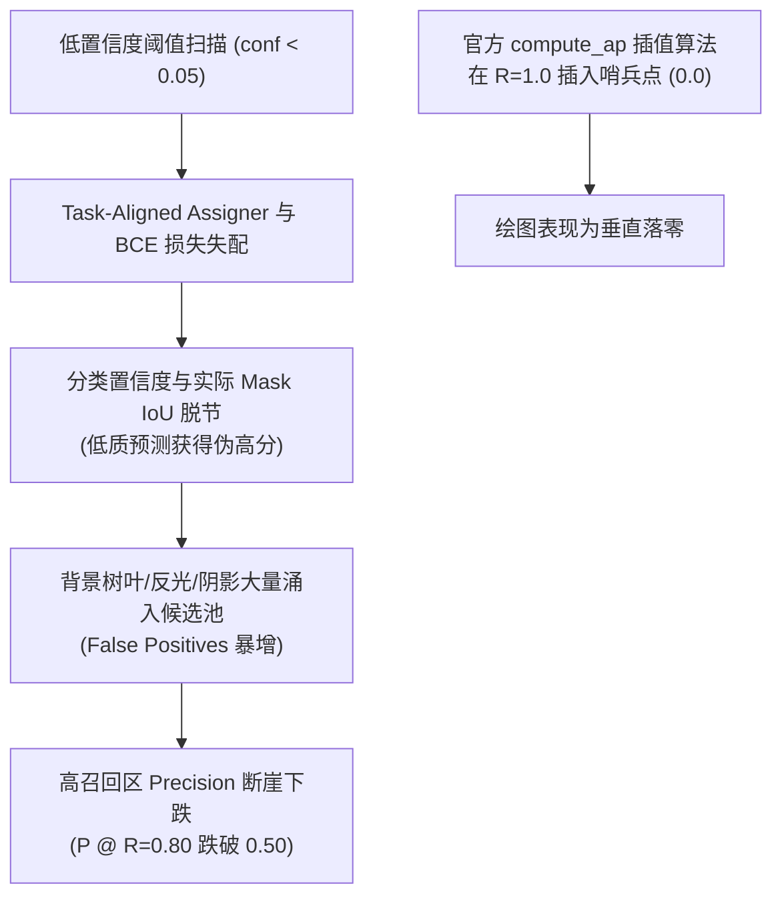

# 05. 任务诊断与量化事实审计报告 (Task Diagnosis, Empirical Fact Audit & Failure Mode Mechanisms)

**审计主持**：Worker 1 (Foundation & Task Diagnosis Lead)  
**审计基准日期**：2026-08-27  
**数据基准源**：`E:\mastercode\data\orange_yolo_grouped_dedup_20260820` 及全量分析归档 `1_SEVER/results/_analysis/`  
**核心研究定位**：硕士学位论文第一阶段——果园自然光照下 **RGB 未成熟柑橘轻量级高精度实例分割**。

---

## 1. 数据集基准与防泄露分组审计事实 (Data Audit & Group-Aware Split)

### 1.1 数据集全景规格与防泄露重划分
- **数据源根目录**：`E:\mastercode\data\orange_yolo_grouped_dedup_20260820`
- **图像输入规范**：标准 $640 \times 640$ Letterbox 变换，单一前景类别 `orange_immature` (ID 0)。
- **数据集总量与清洗**：
  - **总图像数**：965 幅自然果园全景高分辨率 RGB 图像（历史原始采集为 941 幅）；
  - **有效多边形实例总数**：**5,890 个**（经 0.95 Mask IoU / 0.92 Bbox IoU 空间重复过滤，剔除 7 个重叠错误标注）；
  - **拍摄组 (Capture Groups)**：全集共划分 **303 个独立拍摄组**。严格按时间戳拍摄间隔 $\le 5.0\text{ s}$、短时高相似度/连拍图聚集建组，彻底杜绝 burst 连拍帧跨 split 泄露。
- **分组划分比例 (Train : Val : Test = 70 : 20 : 10)**：
  - **Train (训练集)**：676 幅图像（180 个拍摄组），**4,120 个实例**；
  - **Val (验证集)**：193 幅图像（77 个拍摄组），**1,181 个实例**；
  - **Test (独立测试集)**：96 幅图像（46 个拍摄组），**589 个实例**；
  - **数据泄露审计验证**：`leakage_audit.passed = true`，0 组跨集交叉，0 相同 SHA-256 哈希跨集。

---

## 2. 柑橘幼果特有视觉难点量化分布 (Quantified Geometric & Visual Facts)

基于 5,890 个真实多边形实例的全量几何与色彩统计，本任务的物理与视觉瓶颈被严格量化为以下具体指标分布：

| 挑战维度 | 量化定义与统计阈值 | 实例数 / 图像数 | 占比 / 分布值 | 视觉物理机理与网络影响 |
| :--- | :--- | ---:|---:| :--- |
| **COCO 小目标** | 像素面积 $A < 32^2 = 1,024\text{ px}^2$ | 3,137 个实例 | **53.26%** | 超半数实例为微小目标，经 P4/P5 下采样后特征严重退化 |
| **细粒度微小果** | 边界框短边 $W_{\min} < 16\text{ px}$ | 1,024 个实例 | **17.39%** | 在 640 尺度下仅占 $1\sim 2$ 个特征网格，原型掩膜采样易断裂 |
| **超微小果** | 边界框短边 $W_{\min} < 8\text{ px}$ | 192 个实例 | **3.26%** | 极远景微小果实，特征接近单点，易被当成叶片噪点滤除 |
| **深凹非凸掩膜** | 凸度 $\text{Solidity} = \frac{\text{Area}}{\text{ConvexHull}} < 0.85$ | 1,037 个实例 | **17.61%** | 细长枝条/柳叶横贯遮挡，将椭圆果切成深 V/C 状残缺掩膜 |
| **重度深凹掩膜** | 凸度 $\text{Solidity} < 0.70$ | 180 个实例 | **3.06%** | 极端条带遮挡导致掩膜高度不规则，平均凸包缺损 8.62% (P90: 19.65%) |
| **近邻粘连接触** | 与最近邻实例空间间隙 $\le 2\text{ px}$ | 1,823 个实例 | **30.95%** | 簇生果实轮廓粘连，边界仅存细窄阴影，极易合并 (Merge 错误) |
| **密集接触走廊** | 与最近邻实例空间间隙 $\le 4\text{ px}$ | 2,082 个实例 | **35.35%** | 超过三分之一的果实处于密集接触走廊，NMS 与掩膜原型极易冲突 |
| **深凹且粘连共存** | $\text{Solidity} < 0.85$ 且 间隙 $\le 4\text{ px}$ | 404 个实例 | **6.86%** | 核心拓扑冲突区：同时需要“保持同果连通”与“分离相邻异果” |
| **色彩纹理伪装** | 局部色差 $\Delta E_{\text{Lab}} < 10$ (果实 vs 15px 背景环) | 675 个实例 | **11.46%** | 幼果与叶片叶绿素分布一致，低对比度区域极易产生假阳性与漏检 |
| **重度色彩伪装** | 局部色差 $\Delta E_{\text{Lab}} < 15$ | 2,415 个实例 | **41.00%** | 四成以上实例处于绿绿同色伪装背景中 |
| **弱对比度边界** | 轮廓法向梯度 / 背景高频梯度 $< 1.0$ | 406 个实例 | **6.89%** | 果实边缘梯度弱于叶脉等高频背景干扰 |
| **单图极端尺度跨度** | 单图最大实例面积 / 最小实例面积 | 965 幅图像 | 中位数 **7.22** P90 **60.03** 均值 **24.30** 峰值 **376.54** | 近景特写大果与树冠深处远景小果同图并存，造成金字塔多层级响应失衡 |
| **单图实例密集度** | 单图包含标注实例数 | 965 幅图像 | 均值 **6.10** P90 **14.0** | 局部密集簇生，平均每图超 6 个目标，最大单图达 32 个目标 |

---

## 3. PR 曲线尾部崩塌机理与召回上限 (Recall Ceiling) 深度诊断

### 3.1 现象观察与实测数据
在官方 YOLO 评估脚本生成的 `MaskPR_curve.png` 中，当召回率推进至高位区间时，精确率曲线呈现急剧下滑，并在 $R \to 1.0$ 时垂直落至 $P = 0$。
通过对 S 系列清洗基准实验在不同召回区间的精确率采样发现：

| 模型方案 | 理论召回上限 ($R_{\max}$) | $P @ R=0.50$ | $P @ R=0.70$ | $P @ R=0.80$ | 最佳 Mask mAP50-95 |
| :--- | :---: | :---: | :---: | :---: | :---: |
| **S00 (YOLO11n-seg Base)** | 0.8527 | 0.9412 | 0.8663 | **0.5040** | 0.6074 |
| **S01 (RepContext)** | **0.8874** | 0.9385 | 0.8588 | 0.5210 | 0.6124 |
| **S04 (Lite Decoupled Head)** | 0.8561 | 0.9520 | 0.8974 | **0.5628** | 0.6150 |
| **S09 (Dense Topology Control)** | 0.8315 | **0.9610** | **0.9143** | 0.4890 | 0.6162 |

### 3.2 深度机理推导与三层成因剖析

1. **第一层：评测协议插值哨兵机制 (Evaluation Artifact)**
   官方 `ultralytics.utils.metrics.compute_ap()` 在召回率轴的末端强制插入了 $(R=1.0, P=0.0)$ 哨兵点，以便进行 101 点 COCO 包络线插值（Envelope Interpolation）。因此曲线垂直落零是绘图算法在无更高召回样本时的边界封闭行为，并非模型在特定阈值下的瞬时崩溃。

2. **第二层：Task-Aligned Assigner (TAL) 与 Mask IoU 的度量脱节（核心病因）**
   - 原生 YOLO 采用 TAL 结合二值交叉熵（BCE）训练分类分支。TAL 在训练期仅依据边界框预测质量 $t = s^\alpha \times \text{IoU}_{\text{box}}^\beta$ 分配动态样本。
   - 当模型为了捕获极端遮挡、微小尺度或同色伪装果实而降低置信度阈值（扫描至 $<0.05$ 甚至 $0.001$）时，分类头将大量具有微弱圆形轮廓的背景叶片、枝干反光和重叠阴影错判为幼果候选。
   - 分类头预测的离散分数无法反映掩膜的实际连续重叠质量（Mask IoU），导致低质量背景杂波排在真阳性前面，在高召回端引入了成倍的假阳性（FP），拉低整体 PR 曲线积分。

3. **第三层：预测头容量冗余引发的小样本过拟合**
   原生 Segment 头在解耦分支中使用重复双卷积（Two-block decoupled head），在仅有数千样本的特定农作数据集上容易对背景伪装特征产生过拟合的高置信度误判；S04 通过精简为单卷积块（Single-block Lite Head）并引入 DWConv，显著降低了参数冗余，从而在 $R=0.80$ 时将 Precision 从 $0.5040$ 提升至 $0.5628$。

---

## 4. 条带遮挡深凹掩膜 (Solidity < 0.85) 与欠分割机理

### 4.1 几何现象与统计
数据集中 $17.61\%$ 的实例凸度 $\text{Solidity} < 0.85$，$3.06\%$ 凸度 $< 0.70$。细长枝条与柳叶横贯幼果表面，形成宽度仅 $2\sim 6\text{ px}$ 的遮挡凹槽。

### 4.2 失败机理剖析
1. **下采样特征平滑效应**：
   YOLO 原生 Proto 模块在 P3 特征图（$80 \times 80$，经 $8\times$ 下采样）上生成 32 个掩膜原型。细长枝条（宽度 $<4\text{ px}$）在高层特征中被平滑或均值化消除，导致原型基函数在凹陷处丧失高频截止能力。
2. **欠分割 (Under-segmentation) 错误**：
   在线性系数加权时，由于缺乏局部梯度阻断，生成的掩膜直接越过遮挡枝条，将叶片和枝干整体包入果实掩膜中，导致 Boundary IoU 大幅下滑。
3. **过碎裂 (Over-fragmentation) 错误**：
   当遮挡严重时，检测分支在果实两侧预测两个独立的锚点框，将同一个完整果实错误切分为两个互不相连的独立碎片。
4. **破局方案**：
   必须在训练期引入 **P2 高分辨率边界监督损失 ($\mathcal{L}_{\text{boundary}}$)** 与结构重参数化大感受野（`RepContext`），在浅层保留锐利几何边界的同时，在深层维持同果语义连贯性。

---

## 5. 密集簇生幼果 (Gap <= 4px) 拓扑冲突与粘连机理

### 5.1 几何现象与统计
数据集中 $35.35\%$ 的实例与最近邻间隙 $\le 4\text{ px}$，$30.95\%$ 间隙 $\le 2\text{ px}$。挂果簇生导致相邻两果在投影面上紧密相贴。

### 5.2 失败机理剖析
1. **接触走廊（Contact Corridor）信息匮乏**：
   相邻幼果表面均为光滑均匀的绿色，两果交界处仅存在一条 $1\sim 2\text{ px}$ 的极微弱接触阴影。
2. **Bbox 检测层面的 NMS 抑制错误**：
   重叠紧密的果实产生高度重叠的预测框，TAL 动态分配模糊，在后处理 NMS 阶段极易发生漏检（将真实近邻果实当成重叠冗余框抑制）。
3. **Mask 分割层面的连通粘连 (Merge 错误)**：
   线性原型掩膜在接触走廊处的预测概率处于模糊过渡态（$0.4 \sim 0.6$），经过 Sigmoid 阈值二值化后，两果连成一个大掩膜。
4. **S09 推理期硬性抑制的负面教训**：
   S09 尝试在推理期直接引入 P2 细化与硬性边界排斥，虽然大幅压制了粘连（Precision 达到 0.9143），但对边缘微小模糊果实造成了误杀，导致整体 Recall 下滑了 $2.7\%$。
5. **破局方案**：
   采用 **训练期软性辅助监督 (`SegmentCitrusLiteBQ`)**，在反向传播中施加中心排斥损失（$\mathcal{L}_{\text{query}}$），在特征空间将相邻果实特征向量推开，而推理期保持无侵入轻量路径，兼顾抗粘连与高召回。

---

## 6. 单图极端尺度跨度 (均值 24.30x, 峰值 376.54x) 与特征金字塔传递机理

### 6.1 统计分布
单图最大与最小实例面积比中位数 7.22，均值 24.30，P90 达 60.03，极端峰值达 376.54。远景微小果（$<16\text{ px}$）与近景特写大果同图并存。

### 6.2 传递失衡机理与实验证据
1. **浅层细节丢失 (S05 FPN-only 的教训)**：
   S05 移除自底向上 PAN 路径后，Recall 暴跌至 0.6975，Mask mAP50-95 下降 0.0052。这无可辩驳地证实：**自底向上路径对于将 P3（$80\times 80$）的微小果实几何信号向上回传、防止其在高层语义中被稀释湮灭具有不可替代的物理作用**。
2. **深层特征过度平滑 (S02 孤立 LSKA 的教训)**：
   S02 仅在 P5 端悬挂大核分离卷积 LSKA-23，导致深层感受野急剧膨胀，而缺乏颈部的多尺度动态承接，深层特征过度全局平滑，使得 P3/P4 上的微小目标区分度降低，导致 AP50 下滑。
3. **破局方案**：
   采用 **自适应尺度门控融合 (`CitrusScaleFusion`)** 结合超轻量动态上采样（`DySample`），在 P3 汇聚节点实现尺度自适应重加权，确保微小目标与大目标在金字塔中均能获得最佳表征。
