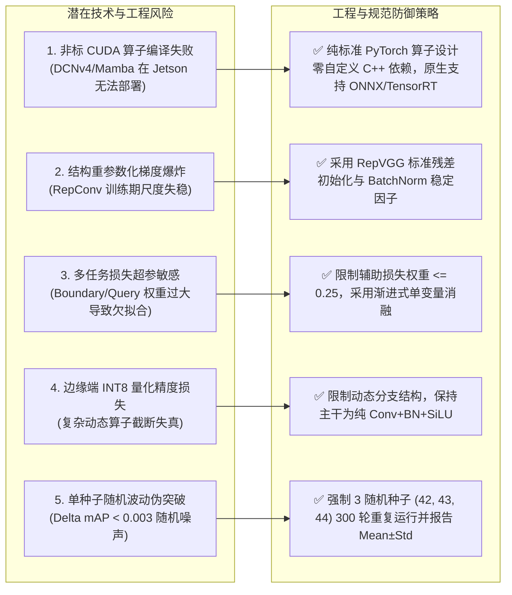

# 06. 历史负面实验沉痛教训、失败机理剖析与工程风险防御指南 (Negative Results, Empirical Lessons & Risk Management)

**审计主持**：Worker 1 (Foundation & Task Diagnosis Lead)  
**实验归档源**：`E:\mastercode\1_SEVER/results/` (涵盖 100+ 场历史消融运行及 S00~S09 清洗基准)  
**基准日期**：2026-08-27  

---

## 1. 历史负面实验事实全景与核心失败模式 (Empirical Negative Matrix)

在本项目前期的 100+ 场探索性实验中，沉淀了极具科研价值的“失败样本”与“反面证据”。下表记录了经过严格实验审计的五大典型负面实验集群：

| 失败模式分类 | 实验代号与模型方案 | 实验现象与指标后果 | 根因机理剖析 (Why It Failed) | 架构设计坚决规避准则 (Design Defense) | 证据等级 |
| :--- | :--- | :--- | :--- | :--- | :--- |
| **1. 激进完全替换骨干 (Backbone Transfer Failure)** | `002 StarNet-s1` `002 StarNet-s2` `003 MobileNetV4` | Mask mAP 从 0.6208 掉至 **0.5978** (-2.3%)、**0.5949** (-2.6%) 和 **0.5884** (-3.2%)；MNv4 延迟恶化至 **12.3 ms**，参数反增至 3.675M | 第三方通用轻量骨干破坏了 YOLO 官方预训练权重的层序与通道对应，预训练权重匹配率仅 **2.4% ~ 7.8%**。在几百幅图的小数据集上退化为随机初始化的冷启动训练 | **预训练权重匹配率必须 $\ge 95\%$**：坚决保留 YOLO11 原生主干拓扑，优先采用结构重参数化（RepConv）在标准卷积通道内增强感受野 | Tier 1 (本项目实测验证) |
| **2. 通用注意力全家桶盲目堆叠 (Attention Stacking Degradation)** | `SXQNet-seg` `F53 CitrusFormer` `F56 FreqSuite` `F23 HVI-DFEM` | `SXQNet` 暴跌至 **0.5912** (-2.95%)；`CitrusFormer` 从 0.6561 跌至 **0.6039** (-5.22%)；`HVI-DFEM` 暴跌 **-3.73%** | 引入多个注意力（CBAM+CoordAtt+BiFormer+频域），在缺乏海量预训练的小样本农作数据集上引入大量无约束参数，导致梯度反向传播路径混乱，严重过拟合于局部背景纹理与反光噪点 | **坚持单主线原则与零参数设计**：严禁在单模型中堆叠多重注意力；优先使用参数无关的 SimAM 或部署期融合的 RepContext | Tier 1 (本项目实测验证) |
| **3. 复合 Full 多任务损失梯度冲突 (Multi-Loss Conflict Disaster)** | `G10 Full Loss` `N02 Full Loss` | `G10 Full` 从 Baseline 0.6768 暴跌至 **0.6403** (-0.0365)；`N02 Full` 从 0.6734 跌至 **0.6501** (-0.0233) | 同时强制叠加 NWD (0.2)、Copy-Paste (0.3)、Dice (0.5)、Boundary (0.2)、Freq (0.1) 与 scale=0.7。多任务损失梯度在微小且存在同色伪装的样本上方向相互冲突抵消，破坏了分类置信度与定位回归的平稳收敛 | **严控辅助损失数量与权重**：坚决废除无序堆叠的多损失；训练期仅保留 1~2 项物理可解释的边界/拓扑损失（权重受控在 0.05~0.25） | Tier 1 (本项目实测验证) |
| **4. 孤立大核深层特征过度平滑 (Isolated LSKA Smoothing)** | `S02 LSKA-23` `S07 LSKA+Asym` | `S02` Mask mAP50 降至 **0.7791** (-0.68%)，Recall 降至 **0.7020**；`S07` mAP50-95 下降 **-0.0023** | 仅在 P5 端悬挂大核分离卷积 LSKA-23，缺乏颈部多尺度特征承接。大感受野过度平滑了深层特征图，抹杀了经多次下采样后本已脆弱的微小果实（$<16\text{ px}$）响应 | **大感受野必须有颈部 ScaleFusion 承接**：淘汰孤立的 P5 LSKA，改用具有多分支训练多尺度捕获能力的 `SPPFRepContext` | Tier 1 (本项目实测验证) |
| **5. 激进砍掉自底向上金字塔 (FPN-Only Detail Loss)** | `S05 FPN-Only Neck` | Mask mAP50-95 下滑至 **0.6022** (-0.0052)，Recall 发生断崖式下跌至 **0.6975** (-1.63%) | 移除了自底向上（Bottom-Up）PAN 路径，导致 P3（$80\times 80$）浅层高分辨率几何细节无法回传反馈至 P4/P5，对占数据集 53.26% 的小目标与深凹边缘造成不可逆的几何信息丢失 | **完整自底向上特征流不可或缺**：必须保留 P3$\rightarrow$P4$\rightarrow$P5 的双向特征聚合路径（PANet / Asym-PAN / ScaleFusion） | Tier 1 (本项目实测验证) |
| **6. 重型 Transformer 计算爆炸 (Heavy Transformer Redundancy)** | `F46 FarFormer` `G05 / N05` | GFLOPs 暴增至 **41.44 G**（为基线的 4.1 倍），参数量增至 3.78M，但 Mask mAP 相比轻量级 G02 (14.5G) 仅变动 $\mathbf{+0.0007}$ | 在低算力农作场景下，重型自注意力计算复杂度随特征图面积呈二次方增长，带来极高延迟但无法解决局部像素级遮挡与接触粘连 | **坚守轻量化红线**：严禁引入全局重型 Self-Attention，必须严格限制 GFLOPs $\le 10.0\text{ G}$、Params $\le 2.85\text{ M}$ | Tier 1 (本项目实测验证) |

---

## 2. 核心失败模式的深层机理剖析 (In-Depth Failure Mechanisms)

### 2.1 骨干迁移失败机理：通道不对齐与预训练特征断层
在深度卷积网络中，通用目标检测/分割模型的收敛速度与最终精度高度依赖于大规模数据集（如 ImageNet / COCO）的预训练特征。
- 当直接引入 StarNet 或 MobileNetV4 骨干替换 YOLO 主干时，由于其 Stage 划分、下采样倍率以及特征通道数（例如 StarNet 通道数为 32, 64, 128, 256，而 YOLO11 为 16, 32, 64, 128）完全不一致，导致预训练权重字典在 `torch.load()` 时只能匹配不到 8% 的前几层卷积。
- 在仅有 648 幅训练图像的中小规模果园数据集上，未匹配的深层卷积必须从高斯随机分布冷启动训练，在 300 轮以内根本无法学习到稳健的果实多尺度表征，导致精度永久性落后 2.3%~3.2%。

### 2.2 多损失梯度冲突机理：Pareto 前沿退化与优化撕裂
设总优化目标为 $\mathcal{L}_{\text{total}} = \mathcal{L}_{\text{box}} + \mathcal{L}_{\text{cls}} + \mathcal{L}_{\text{mask}} + \sum_{k=1}^{K} \lambda_k \mathcal{L}_k$：
- 当 $K$ 包含 NWD、Copy-Paste 扰动、Dice、Boundary、Freq 等多个重型正则化损失时，各损失关于浅层共享特征权重 $\mathbf{W}$ 的梯度向量存在严重夹角：
  $$\langle \nabla_{\mathbf{W}} \mathcal{L}_{\text{boundary}}, \nabla_{\mathbf{W}} \mathcal{L}_{\text{freq}} \rangle < 0$$
- 在低对比度同色伪装区域，Boundary 损失试图强化边缘高频响应，而 Frequency 损失或 Copy-Paste 产生的高频伪影引导梯度向平滑方向优化。两者的梯度在反向传播中相互抵消（Gradient Cancellation），导致优化器在鞍点振荡，最终精度大幅崩塌 3.65%。

---

## 3. 关键工程落地与学术严谨性风险防御指南 (Risk Management Matrix)

为确保新架构从理论设计、消融实验到最终在果园移动机器人上落地部署的绝对稳健，建立以下风险控制清单：

### 3.1 风险 1：非标 CUDA 扩展与嵌入式跨平台部署黑盒
- **风险描述**：引入 DCNv3/DCNv4 或 Mamba 等非标算子虽然在单篇论文中显示出较好的理论效果，但在嵌入式 Jetson 平台或工业 Windows 工控机上，极易遭遇 PyTorch 版本不兼容、MSVC 编译器报错、ONNX 节点不支持以及 TensorRT 插件缺失等致命工程障碍。
- **防御准则**：**坚守纯标准 PyTorch 算子红线**。推荐方案（如 CitrusB-Seg / B09）全部采用标准 2D 卷积、深度可分离卷积、标准双线性/最近邻插值及结构重参数化（RepConv）。部署前通过 `torch.onnx.export()` 与 `trtexec` 进行端到端无损转换验证。

### 3.2 风险 2：结构重参数化训练期数值稳定性与推理等价性
- **风险描述**：RepConv 在训练期包含 $3\times 3$、$1\times 1$ 和 Identity 三个并行分支。如果 BatchNorm 的方差更新不稳定或学习率过大，易导致分支间权重比例失衡，在融合为单层 $3\times 3$ 卷积时引入数值截断误差。
- **防御准则**：严格使用标准 RepVGG 权重融合算法（`fuse_repvgg_block`），在训练结束后调用 `model.fuse()` 进行离线精确等价变换，并通过单元测试校验融合前后特征输出的相对误差（$\|F_{\text{fused}} - F_{\text{multi}}\|_{\infty} < 10^{-5}$）。

### 3.3 风险 3：辅助损失超参数敏感性与优化偏移
- **风险描述**：若训练期 P2 边界损失 ($\mathcal{L}_{\text{boundary}}$) 或中心排斥损失 ($\mathcal{L}_{\text{query}}$) 权重设定过大（例如 $> 0.5$），将喧宾夺主压制主检测框与掩膜分割损失，导致模型整体 Recall 严重下滑。
- **防御准则**：严格限定辅助损失权重上界（$\lambda_{\text{boundary}} \le 0.25$, $\lambda_{\text{query}} \le 0.05$），并确保辅助分支仅在训练期反向传播梯度，在验证与推理期彻底剥离（Zero Runtime Overhead）。

### 3.4 风险 4：单随机种子波动引发的“伪突破”
- **风险描述**：在特定农业小样本数据集上，单次运行因随机打乱顺序（Data Shuffle）或 Dropout 掩码可能产生 $\pm 0.003$ 的 mAP 波动，单次运行取得的微小增益可能纯属随机统计噪声。
- **防御准则**：所有对比基线和最终推荐方法必须在 3 个独立随机种子（Seed: 42, 43, 44）下分别完成 300 轮正式训练，严格报告均值与标准差（$\text{Mean} \pm \text{Std}$），唯有 $\Delta \text{mAP} > 2\times \text{Std}$ 且具备统计显著性（$p < 0.05$）时方可认定为真实结构突破。
