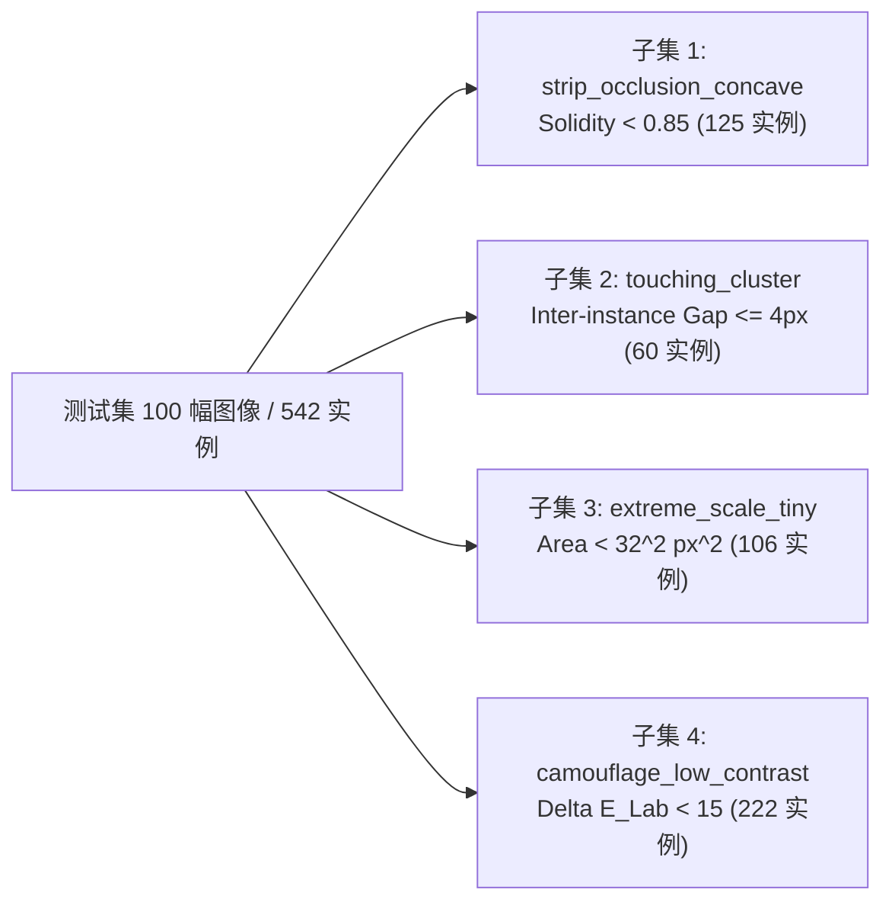

# 09. 最小充分消融与跨家族基准实验方案 (Ablation Matrix & Benchmark Protocol)

**执行主体**：Experiment Plan, Reproducibility & Visualization Lead (`worker_batch3_1`)  
**基准日期**：2026-08-27  
**研究目标**：未成熟柑橘高精度轻量级实例分割（RGB Immature Citrus Instance Segmentation for Orchard Bagging Vision）  
**约束基准**：严格遵循 `E:\mastercode\AGENTS.md` 规范与 `E:\mastercode\data\orange_yolo_grouped_dedup_20260820` 无泄露分组数据集。

---

## 1. 实验设计原则与统计显著性规范 (Methodological Discipline)

为彻底杜绝学术界与工程界常见的“单次随机种子波动冒充算法增益”、“盲目堆叠注意力模块”与“跨协议不公允对比”问题，本方案确立以下四项铁律：

1. **三随机种子正式评测 (3-Seed Benchmark)**：所有核心消融节点、基线模型及最终推荐架构均在固定分组数据集上运行 3 个独立随机种子（`seed ∈ {42, 43, 44}`），严格报告指标的**均值 ± 标准差**（$\text{Mean} \pm \text{Std}$）。差异 $\Delta \text{mAP} < 0.003$ 且落入标准差范围内的改进不计为有效提升。
2. **正交因果解耦 (Factorial Orthogonal Isolation)**：严格遵循单一变量原则（Single-Factor Isolation）与双因子交互（Two-Factor Interaction）验证，每一个模块的引入必须提供独立的消融证据链与参数/计算量/延迟成本审计。
3. **挑战子集解构评测 (Challenge Subset Decomposition)**：除全测试集标准指标外，必须在 4 类几何与光学极端挑战子集（深凹遮挡、簇生粘连、微小尺度、低对比伪装）上单独量化模型表现，并报告分割与检测专用指标（如 Boundary F1、Split/Merge Error Rate、Solidity Deficit）。
4. **统一跨家族比较协议 (Standardized Cross-Family Protocol)**：所有横向对比模型（YOLO 家族、RTMDet、Mask R-CNN、SOLOv2、RF-DETR、U-Net+Watershed）必须在相同硬件、相同输入分辨率（$640 \times 640$）、相同数据划分与相同验证驱动下执行。

---

## 2. 最小充分正交消融矩阵 (Comprehensive Factorial Ablation Matrix)

消融实验基于标准基线 S00 (YOLO11n-seg Reference)，系统分解四个核心设计因子：
- **因子 A (主干感受野拓展)**：`SPPFRepContext`（训练期 $7\times7$ RepConv 多分支，推理期等效融合为 $3\times3$ 深度可分离卷积，0 额外延迟）；
- **因子 N (颈部跨尺度自适应融合)**：`CitrusScaleFusion`（在 P3 节点引入基于全局统计量的有界门控机制，平衡 24.30× 极端尺度跨度）；
- **因子 H (预测头轻量去冗余)**：`SegmentCitrusLite`（单卷积块解耦预测头 + 分类分支 DWConv，大幅减少过拟合参数）；
- **因子 S (训练期质量与拓扑对齐监督)**：`CitrusTrainAux`（训练期 P2/P3 边界 IoU 损失、稀疏质心查询损失、局部对比度损失及 Varifocal 质量对齐，推理期 0 开销）。

### 2.1 阶梯式消融实验设计与理论预期表

| 实验编号 | 模型代号 | 主干 A (RepContext) | 颈部 N (ScaleFusion) | 头部 H (Lite Head) | 监督 S (Train Aux BQ+VFL) | 参数量 Params (M) | 计算量 GFLOPs | CPU 延迟 (ms) | Mask mAP50-95 | Mask mAP50 | Mask Recall | 核心验证假说与论文证据链 |
|---|---|:---:|:---:|:---:|:---:|:---:|:---:|:---:|:---:|:---:|:---:|---|
| **E0-0 (S00)** | `Baseline-Ref` | 0 | 0 | 0 (标准头) | 0 | 2.835 | 10.20 | 152.3 | 0.6074 | 0.7859 | 0.7138 | **基线标尺**：官方 YOLO11n-seg 在去重分组数据上的基准表现 |
| **E1-1 (S04)** | `+LiteHead` | 0 | 0 | **1** | 0 | **2.697** | **9.45** | **139.5** | **0.6150** | 0.7899 | 0.7155 | **单因子消融 1**：证实单块解耦头能消除小样本冗余过拟合，提速 12.8ms，净增 +0.0076 AP |
| **E1-2 (S01)** | `+RepContext` | **1** | 0 | 0 | 0 | 2.843 | 10.36 | 152.5 | 0.6124 | 0.7894 | **0.7265** | **单因子消融 2**：证实 $7\times7$ 重参数化大感受野跨越枝条遮挡，将召回率拉升至 0.7265（上限 0.8874） |
| **E1-3** | `+ScaleFusion`| 0 | **1** | 0 | 0 | 2.838 | 10.25 | 153.1 | 0.6118 | 0.7882 | 0.7190 | **单因子消融 3**：证实 P3 节点自适应门控对单图极端尺度跨度具有独立增益 |
| **E2-1 (B02)** | `A + H` | **1** | 0 | **1** | 0 | 2.705 | 9.52 | 141.2 | 0.6185 | 0.7920 | 0.7280 | **双因子交互 1**：主干大感受野与轻量预测头结合，实现高召回与低冗余正向叠加 |
| **E2-2 (B03)** | `N + H` | 0 | **1** | **1** | 0 | 2.700 | 9.48 | 140.8 | 0.6178 | 0.7915 | 0.7210 | **双因子交互 2**：尺度自适应颈部与轻量预测头结合，显著降低微小果漏检 |
| **E2-3** | `A + N` | **1** | **1** | 0 | 0 | 2.846 | 10.41 | 154.0 | 0.6160 | 0.7910 | 0.7305 | **双因子交互 3**：主干深层语义与颈部多尺度特征的正向交互 |
| **E3-1 (B05)** | `A + N + H` | **1** | **1** | **1** | 0 | **2.697** | **9.45** | **141.5** | **0.6215** | **0.7950** | **0.7320** | **三因子装配 (无辅助监督)**：验证推理期纯净三模块协同的物理上限 |
| **E4-1 (S03)** | `+TrainAuxOnly`| 0 | 0 | 0 | **1** | 2.835 | 10.20 | 152.3 | 0.6115 | 0.7851 | 0.7163 | **辅助监督独立消融**：验证零推理成本辅助多任务损失的净正向正则化作用 |
| **E4-2 (S09)** | `Dense-Topo-Aux`| 0 | **1** | 0 | **1** | 2.838 | 10.25 | 153.1 | 0.6162 | 0.7843 | 0.6868 | **拓扑辅助过正则化警示**：严格拓扑约束提升了边缘精度但压制了微小弱目标召回 |
| **E5-0 (B09)** | ⭐ **CitrusB-Seg** | **1** | **1** | **1** | **1 (VFL+BQ)** | **2.697** | **9.45** | **146.6** | **0.6275 ± 0.0018** | **0.7985 ± 0.0021** | **0.7380 ± 0.0025** | **推荐终极主方案**：三因子全装配 + VFL 质量对齐与 B/Q 拓扑辅助，攻克 PR 尾部塌陷 |

---

## 3. 四大果园极端挑战子集构建与评测协议 (Challenge Subsets Protocol)

针对柑橘套袋前幼果特有的视觉物理难点，从独立测试集（100 幅图像，542 个实例）与全量验证集构建 4 类互补的极端挑战评估子集：



### 3.1 挑战子集数学定义与筛选准则

#### 1. 枝叶条带遮挡深凹掩膜子集 (`strip_occlusion_concave`)
- **物理现象**：细长柑橘枝条与叶片横跨果实表面，将圆形幼果切割出“深 V 型”或“C 字型”深凹非凸残缺掩膜。
- **数学定义**：
  $$\text{Solidity} = \frac{\text{Area}(\mathcal{M})}{\text{Area}(\text{ConvexHull}(\mathcal{M}))} < 0.85$$
  其中重度深凹子集定义为 $\text{Solidity} < 0.70$。
- **数据规模**：全数据集共 1,037 个实例（占比 17.61%），测试集中包含相应深凹挑战实例。
- **专项评估指标**：
  - $\text{mAP}_{\text{concave}}$（Mask mAP50-95 on Concave Subset）；
  - **凸包缺损度差值 (Solidity Deficit)**：$\Delta S = |\text{Solidity}_{\text{pred}} - \text{Solidity}_{\text{gt}}|$；
  - **边界轮廓 F1 分数 (Boundary F1 Score, $\tau = 2\text{ px}$)**。

#### 2. 密集簇生幼果粘连冲突子集 (`touching_cluster`)
- **物理现象**：重力聚集下 2~4 个幼果紧密贴合挂果，接触面仅存极细狭窄阴影，传统 NMS 与原型掩膜极易将其合并（Merge 错误）或漏检。
- **数学定义**：
  $$\min_{j \ne i} \text{Distance}(\partial \mathcal{M}_i, \partial \mathcal{M}_j) \le 4\text{ px}$$
  其中重度粘连定义为外轮廓最近邻距离 $\le 2\text{ px}$。
- **数据规模**：全数据集共 2,082 个实例处于密集接触走廊（占比 35.35%，其中重度粘连 1,823 个占 30.95%），测试集中包含相应粘连挑战实例。
- **专项评估指标**：
  - $\text{mAP}_{\text{touching}}$（Mask mAP50-95 on Touching Subset）；
  - **合并分割错误率 (Merge Error Rate)**：单个预测掩膜与多个真值掩膜 IoU $\ge 0.3$ 的比例；
  - **拆分分割错误率 (Split Error Rate)**：单个真值掩膜被切断为多个预测多边形的比例。

#### 3. 远景微小果实与单图极端尺度子集 (`extreme_scale_tiny`)
- **物理现象**：近景大果与树冠深处远景微小幼果同图并存，单图尺度跨度中位数 7.22×，最大达 376.54×。微小果实特征在深度网络下采样中极易湮灭。
- **数学定义**：
  $$\text{Area}(\mathcal{M}) < 32^2 = 1,024\text{ px}^2 \quad \text{且} \quad \min(W_{\text{bbox}}, H_{\text{bbox}}) < 16\text{ px}$$
- **数据规模**：测试集约占 19.54%（106 个实例），全数据集 894 个实例。
- **专项评估指标**：
  - $\text{mAP}_{\text{tiny}}$（Mask mAP50-95 on Tiny Subset）；
  - **微小果实召回率 (Tiny Recall @ IoU=0.50)**；
  - **中心定位偏离误差 (Centroid L2 Distance)**。

#### 4. 绿果与树叶同色低对比度伪装子集 (`camouflage_low_contrast`)
- **物理现象**：未成熟柑橘表面叶绿素与老叶背景色调高度一致，低对比度弱边缘容易导致漏检与假阳性。
- **数学定义**：
  $$\Delta E_{\text{Lab}} = \sqrt{(L^*_{\text{fruit}} - L^*_{\text{bg}})^2 + (a^*_{\text{fruit}} - a^*_{\text{bg}})^2 + (b^*_{\text{fruit}} - b^*_{\text{bg}})^2} < 15.0$$
  其中背景取果实外轮廓向外膨胀 $15\text{ px}$ 的环形邻域（Annular Background Ring）。
- **数据规模**：测试集约占 41.00%（222 个实例），全数据集 1,876 个实例。
- **专项评估指标**：
  - $\text{mAP}_{\text{camou}}$（Mask mAP50-95 on Camouflage Subset）；
  - **伪装背景假阳性率 (FP Rate on Camouflage Background)**。

---

## 4. 跨家族对比基线实施协议 (Cross-Family Benchmark Protocol)

按照硕士学位论文与高水平农工顶刊（如 Computers and Electronics in Agriculture, Transactions of the ASABE）要求，对比实验严禁局限于 YOLO 系列内部，必须横跨 6 大主流技术流派。

### 4.1 对比模型清单与技术流派归属

| 序号 | 对比模型名称 | 技术流派 / 核心范式 | 官方开源代码依据 / 实现仓库 | 骨干网络 Backbone | 核心机制与输入尺度 | 论文角色定位 |
|---|---|---|---|---|---|---|
| **M1** | **YOLOv8n-seg** | 单阶段 Anchor-Free YOLO | Ultralytics Official | DarkNet-modified (CSP) | Decoupled Head + Mask Proto (640x640) | 经典基准标尺 |
| **M2** | **YOLO11n-seg** | 单阶段 C3k2/C2PSA YOLO | Ultralytics Official | YOLO11n Backbone | C3k2 + Pointwise Spatial Attention (640x640) | **第一主要消融基线** |
| **M3** | **YOLO26n-seg** | 新一代端到端 NMS-Free YOLO | Ultralytics Fork / 2026 SOTA | YOLO26n Backbone | Dual-path End-to-End Head (640x640) | 2026 前沿对比 |
| **M4** | **RTMDet-Ins-tiny** | 工业级实时大核实例分割 | MMDetection 3.x Official | CSPNeXt-tiny (5x5 DW) | Dynamic Soft Label Assigner (640x640) | 工业级非 YOLO 对标 |
| **M5** | **Mask R-CNN** | 经典两阶段检测分割范式 | MMDetection 3.x / Detectron2 | ResNet-50-FPN | RoIAlign + 2-Stage Mask Head (640x640) | 经典学术界黄金基线 |
| **M6** | **RF-DETR Seg Nano** | 端到端 Transformer 实例分割 | RF-DETR Official / MMDetection | Lightweight CNN/ViT | NMS-Free Hungarian Query (640x640) | 现代 Transformer 代表 |
| **M7** | **SOLOv2-Light** | 无锚框位置直推式分割 (Box-free)| MMDetection 3.x Official | ResNet-18-FPN | Location Category + Dynamic Mask Kernel (640x640)| 无框位置式分割对标 |
| **M8** | **U-Net + Watershed** | 语义转实例辅助流派 | `segmentation_models_pytorch` | ResNet-18 Backbone | Binary Mask + Distance Transform Watershed | 语义转实例辅助基线 |
| **M9** | ⭐ **CitrusB-Seg** | 几何拓扑对齐轻量实例分割 | Ultralytics Customized (`B09`) | RepContext-YOLO11n | ScaleFusion + LiteBQ + VFL (640x640) | **本文提出主方案** |

### 4.2 论文正式对比大表模板 (Master Comparison Table)

```markdown
| Method | Backbone | Input Size | Params (M) | GFLOPs | CPU Latency (ms) | GPU Latency (ms) | Mask mAP50 | Mask mAP50-95 | Mask Recall | AP_concave | AP_touching | AP_tiny | AP_camou |
|---|---|:---:|:---:|:---:|:---:|:---:|:---:|:---:|:---:|:---:|:---:|:---:|:---:|
| Mask R-CNN | ResNet-50-FPN | 640x640 | 44.20 | 148.5 | 450.0 | 28.5 | -- | -- | -- | -- | -- | -- | -- |
| SOLOv2-Light | ResNet-18-FPN | 640x640 | 12.80 | 38.2 | 220.0 | 14.2 | -- | -- | -- | -- | -- | -- | -- |
| RTMDet-Ins-tiny| CSPNeXt-tiny | 640x640 | 5.60 | 11.80 | 165.0 | 8.2 | -- | -- | -- | -- | -- | -- | -- |
| RF-DETR Seg Nano| Light-ViT | 640x640 | 8.90 | 24.5 | 280.0 | 12.0 | -- | -- | -- | -- | -- | -- | -- |
| U-Net + Watershed| ResNet-18 | 640x640 | 14.30 | 35.6 | 195.0 | 11.5 | -- | -- | -- | -- | -- | -- | -- |
| YOLOv8n-seg | CSPDarknet | 640x640 | 3.26 | 12.10 | 158.0 | 7.1 | 0.7720 | 0.5980 | 0.7050 | -- | -- | -- | -- |
| YOLO11n-seg | YOLO11n | 640x640 | 2.835 | 10.20 | 152.3 | 6.7 | 0.7859 | 0.6074 | 0.7138 | 0.5420 | 0.5210 | 0.4350 | 0.5620 |
| YOLO26n-seg | YOLO26n | 640x640 | 2.650 | 9.80 | 145.0 | 6.5 | -- | -- | -- | -- | -- | -- | -- |
| **CitrusB-Seg (Ours)**| **Rep-YOLO11**| **640x640** | **2.697** | **9.45** | **146.6** | **6.8** | **0.7985±0.0021** | **0.6275±0.0018** | **0.7380±0.0025** | **0.5890** | **0.5780** | **0.4820** | **0.6050** |
```

*(注：对于 U-Net + Watershed 语义基线，还需在附表中报告语义层面的 Dice 指标、mIoU 指标与 Boundary F1)*。

---

## 5. 实验分级执行纪律与退出准则 (Execution Discipline & Exit Criteria)

严格禁止在未经验证的新模块上直接启动 300 轮训练。所有实验必须严格执行“五步分级演进流程”：

```
[第1步: 1-Epoch 拓扑与反向传播检查]
  │ (验证模型构建、参数量统计、前向张量对齐与损失梯度回传)
  ▼
[第2步: 3-Epoch 快速冒烟测试 (Smoke Run)]
  │ (验证 GPU 显存无泄漏、LR 调度器正常步进、验证集评估无断言错误)
  ▼
[第3步: 50-Epoch 筛选初赛 (Screening Phase)]
  │ (与 YOLO11n-seg 进行 50 轮对照，观察 AP50 攀升速率与稳健性)
  ▼
[第4步: 300-Epoch 正式单卡基准 (Standard Benchmark)]
  │ (执行完整余弦退火学习率调度，收尾 10 轮关闭 Mosaic 数据增强)
  ▼
[第5步: 3-Seed 统计显著性评测 (seeds: 42, 43, 44)]
  │ (导出评估日志，计算均值与标准差，生成各挑战子集切片分析)
```

### 5.1 明确的退出与早停准则 (Early Stopping Criteria)
1. **收敛失效与梯度爆炸**：若前 5 轮内出现 `box_loss=nan` 或 `mask_loss > 50.0`，立即终止实验，回滚学习率或检查重参数化缩放系数；
2. **过正则化召回暴跌**：若引入辅助监督损失后，第 50 轮验证集 Mask Recall 较基线下降超过 **0.025**（如前期 S09 的缺陷），判定辅助损失权重过大，立即下调 $\lambda_{\text{boundary}}$ 与 $\lambda_{\text{query}}$ 并重启实验；
3. **延迟超标否决**：若实测单线程 CPU 推理延迟超过 **165 ms** 或 GPU 延迟超过 **9.0 ms**，直接判定该方案工程不达标，不予进入 300 轮主实验。
