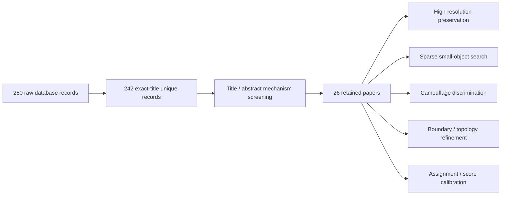

# 面向柑橘幼果实例分割的范围化系统文献综述

## 摘要

本综述不是为了寻找更多可插拔注意力，而是回答四个机制问题：如何保留微小果实的高分辨率结构、如何低成本寻找候选、如何区分绿色果实与叶片、如何同时保留遮挡凹边界并分离接触果实。证据支持一种分阶段结构：持续窄 P2 细节流、P3/P4 稀疏候选搜索、候选 ROI 内果实-背景环判别、不确定边界点精修以及训练期实例分离场。没有文献能够保证它在本数据集提升固定 10 个点。

## 1. 方法

### 1.1 研究问题

在约 3M 参数、640 输入的 RGB 实例分割器中，哪些已公开并有代码的机制可能同时改善微小目标召回、同色果叶判别、深凹可见边界和邻果 split/merge，同时避免全图 dense P2 的高成本？

### 1.2 检索范围

- 数据库：OpenAlex、arXiv API、Crossref；另以 CVF/期刊官网和本地 GitHub 仓库做引用追踪。
- 时间：主要为 2019–2026；经典基础方法可早于 2019。
- 关键词族：small/tiny object instance segmentation、high-resolution sparse query、camouflaged instance segmentation、boundary refinement、touching instance separation、green citrus/orchard fruit segmentation、quality-aware ranking/label assignment。
- 纳入：同行评议论文或可核验预印本；机制与四个问题之一直接相关；优先有官方代码。
- 排除：仅 RGB-D、amodal、OBB、机器人控制；纯检测方法只在 label assignment/候选搜索可迁移时纳入；大型 foundation model 不作最终轻量模型。

三库共下载 250 条原始记录，标题标准化后有 242 条精确唯一记录（仍可能存在语义重复）。结合引用追踪保留 26 篇机制级论文。该流程属于面向架构决策的范围化综述，不是可发表的 PRISMA 医学系统综述；Crossref 检索极宽，不能把其返回总数当作实际筛选量。

Semantic Scholar API 在匿名请求返回 429、使用本机密钥仍返回 Forbidden，因此没有将其计为成功数据库。原始查询与响应均保存在 `sources/`。

## 2. 证据综合

### 2.1 高分辨率不是等于全图 dense P2

Lite-HRNet 证明轻量网络也可以持续保留高分辨率分支；PIDNet 强调细节和上下文直接相加会使细节被语义淹没，需要边界/门控选择性融合；Gated-SCNN 用浅层 shape stream 和高层语义门控。它们共同支持 D 系列“窄 P2 形状流 + 单向语义门控”的主干方向，但原论文主要是语义分割，不能直接声称会提高 citrus instance AP。

QueryDet 的关键不是多加一个 P2 检测头，而是先用低分辨率特征预测小目标粗位置，再只在这些位置计算高分辨率特征。论文在 COCO 报告 +1.0 AP、+2.0 AP-small 和约 3× 高分辨率推理加速，在 VisDrone 报告约 2.3× 加速。这支持“P3/P4 搜索 + P2 ROI 稀疏采样”，也解释了为什么 S09 的全图 dense P2 既慢又不一定提高 recall。

SOPSeg（CVPR Findings 2026）也把小目标问题归因于粗特征分辨率，并采用 region-adaptive magnification 和边缘感知精修；但它是遥感+提示式 SAM，不能直接移植为轻量 YOLO 主体，只能作为“局部放大优于全图高分辨率”的旁证。

### 2.2 同色伪装需要前景-背景关系，不是再做全局注意力

Mask2Camouflage 显式利用前景与背景掩膜的互补关系来减少伪装场景假阳性；DCNet 使用像素级去伪装和实例原型抑制背景噪声。对本课题最可迁移的不是其完整 Transformer，而是每个候选 ROI 的“内果实区域 vs 外背景环”判别。外环必须是局部上下文，避免全局树冠语义淹没微小目标。

绿色果实文献也反复表明同色、重叠、遮挡和远距离目标是共同难点。2022 年优化 Mask R-CNN 通过 MobileNetV3 与边界 patch refinement，在其柿子数据上相对 Mask R-CNN 报告 mAP +3.1、mAR +3.7；2025 年绿色柑橘工作采用 Cascade Mask R-CNN+MViTv2-L 与切片，mask mAP 84.40，但模型大且数据/协议不同。它们只说明“局部高分辨率和边界精修可能有效”，不能用其数值预测本数据集。

### 2.3 深凹可见边界需要局部精修，不能补圆

PointRend 在不确定点上迭代预测，目标是修复过度平滑的边缘；RefineMask 逐阶段引入细粒度特征，论文在 COCO/LVIS/Cityscapes 相对 Mask R-CNN 分别报告 +2.6/+3.4/+3.8 AP；Mask Transfiner 以稀疏四叉树只处理易错点。三者共同支持“只对候选 ROI 的不确定边界做精修”。本任务的标签是 visible/modal mask，因此精修必须沿叶片切入位置停止，不能把果实补成凸圆或 amodal 轮廓。

Boundary IoU/Boundary AP 说明普通 Mask IoU 对边界误差不够敏感，适合作为评价补充，而不是网络模块。

### 2.4 同果保持与异果分离需要实例级场

Panoptic-DeepLab 用中心热图和每像素到实例中心的 offset 聚类；HoVer-Net 用水平/垂直距离场分离接触细胞核；CenterMask 把局部形状与全局显著性分开。它们支持训练期 separator/instance-offset 场，但直接迁移会遇到一个本课题特有风险：条带遮挡可能把同一 visible instance 分成多个局部区域，过强的中心场会错误 split。

因此应保留现有四状态 topology separator 作为低风险起点，并把 HoVer/offset 作为单独消融，不能与 boundary、query、quality、contrast 一次全开。评价必须落在 `concave+near` 的 merge/split 上。

### 2.5 小目标损失首先是分配问题，排序是第二步

NWD 与 RFLA 的主要贡献发生在 tiny-object label assignment：NWD/RKA 用分布距离缓和微小框 1 像素偏移造成的 IoU 崩塌，RFLA 用高斯感受野距离与层级分配避免 tiny GT 成为离群样本。当前代码只把 NWD 混入 box regression，并未复现论文主要机制。

Mask Scoring R-CNN 证明分类分数与 mask IoU 可能不一致；Rank & Sort 和 VarifocalNet讨论质量感知的候选排序。这些方法可能改善 PR 的中后段排序，但不能产生原本不存在的候选。B09 已显示过早强化质量会提高 P、降低 R。因此顺序必须是：先验证候选召回，再单独做 score calibration。

## 3. 文献到架构的映射

| 本课题问题 | 最相关证据 | 采用内容 | 明确不采用 |
|---|---|---|---|
| early downsampling 丢微小结构 | Lite-HRNet、Gated-SCNN、PIDNet | 窄 P2 shape stream、单向语义门控、选择性融合 | 全图宽 P2 head |
| P2 计算慢 | QueryDet、SOPSeg | P3/P4 top-K ROI 搜索，P2 局部采样 | 全图 dense P2 预测 |
| 绿色果叶混淆 | Mask2Camouflage、DCNet | ROI 内果实/外环上下文对比 | 复制完整重 Transformer |
| 深凹边界过平滑 | PointRend、RefineMask、Mask Transfiner | 不确定边界点稀疏精修 | amodal 补圆 |
| 邻果合并 | Panoptic-DeepLab、HoVer、CenterMask | training-only separator/offset 单独消融 | union boundary 代替实例排他 |
| tiny 分配不足 | NWD/RKA、RFLA | 修改 TAL assignment 的独立实验 | 只在回归 loss 中挂 NWD 后声称已复现 |
| PR 排序失配 | Mask Scoring、RankSort、Varifocal | 候选召回成立后再做 mask-aware calibration | 先乘质量分数过滤难例 |
| 颈部边界位移 | FreqFusion | 仅当 D 主干成立后做单一 neck 实验 | 与新主干/新头同时堆叠 |

## 4. 开源代码审计结论

本机 `C:/Users/33836/Desktop/github` 已有 QueryDet、Lite-HRNet、PIDNet、FreqFusion、RefineMask、MaskTransfiner、Mask2Camouflage、OSFormer、GSCNN、PiDiNet、NWD、RankSortLoss、VarifocalNet、SparseInst、FastInst、SOLO、Mask Scoring R-CNN、YOLACT、SFM、SCSegamba 等仓库。`Plug-play-modules-main` 无 Git 历史和根许可证，只能用于定位原始来源，不能作为正式“官方实现”直接引用。

GSCNN 为 CC BY-NC-SA 4.0，PiDiNet 和 SOLO 含非商业/研究用途限制；FreqFusion、Mask2Camouflage、OSFormer 当前本地根目录未找到许可证。论文研究可阅读和对照，但复制代码前必须逐仓库确认许可并保留出处。MIT/Apache 仓库也不能把作者代码包装成自己的原创模块。

## 5. 结论

最有证据的“大改”不是换一个更大的 backbone，也不是把 SFM、Mamba、LSKA、CARAFE、BiFPN、FreqFusion 一次缝合，而是改变计算拓扑：保持窄高分辨率形状流，用低分辨率语义稀疏搜索，候选 ROI 内做果叶上下文判别与边界精修，再以训练期实例分离场解决接触拓扑。这个故事与数据统计和已有失败实验一致，也可以被清晰消融。

