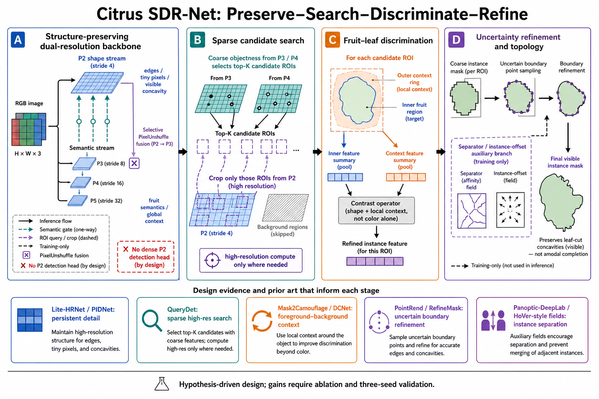

# 最终候选架构与实验路线

## 1. 当前“最优秀”必须分成三类

| 类别 | 模型 | 当前身份 | 是否可写“有效” |
|---|---|---|---|
| 已训练 clean 最佳峰值 | B06 | AP50-95 0.61862、AP50 0.80182、R 0.73666；后期回落明显 | 只能写单次正信号 |
| 已训练 clean 稳定轻量因子 | S04/B01 | S04 2.747M/9.44G，本机 CPU median 比参考快 6.1%；两套系列都支持 lite head 不伤精度 | 可写重复方向信号，仍需同协议复验 |
| 已工程验证、未训练 | D07 | 2.750M、11.16 GFLOPs，双分辨率形状-语义主干+LiteBQ | 不能写精度有效 |
| 已工程验证、未训练 | D08 | 2.762M、11.43 GFLOPs，D06 主干+双原型 topology | 不能写精度有效 |
| 旧数据历史最高 | G10 | AP50-95 0.67681；协议不可比 | 只作 clean 复现控制 |

真正适合成为论文方法的目前只有 D07/D08 所代表的结构路线，B06/S04 是经验因子，G10 是历史假设。不要把它们拼成一个“全明星模型”。

若今天必须从已训练结果选一个部署模型，选 S04；若必须选一个精度候选做重复，选 B06；若要选论文结构主线，选 D07/D08，而不是 S09。

## 2. 大结构提案：Citrus SDR-Net（概念名，不占用系列名）



`SDR` 表示 Search–Discriminate–Refine。它是待实现和消融的论文概念名；在用户指定新的系列字母前，不创建新系列 YAML。

### 2.1 Preserve：双分辨率主干

- P3–P5 保留标准语义流，负责判断“是不是果实”。
- stride-4 保留非常窄的 P2 shape stream，负责 tiny pixels、边缘和 visible concavity。
- P3/P4/P5 只以门控方式更新 shape stream，不直接把上采样语义相加。
- P2 经 PixelUnshuffle/安全重排选择性注入 P3；不设置 dense P2 detection head。
- achromatic/PDC stem 仅在 D04>D01、D01>D02 时保留，否则用普通卷积，避免为了故事牺牲结果。

### 2.2 Search：稀疏候选搜索

- P3/P4 产生高召回 objectness/query map。
- 在验证集调节 top-K 和窗口扩张率，只对候选位置从 P2 采样 ROI。
- 重叠 ROI 需合并/去重；候选召回率必须单独报告。
- 目标是以局部高分辨率替代全图 dense P2，而不是增加更多 pyramid 层。

### 2.3 Discriminate：果实-叶片上下文判别

- 每个 ROI 计算预测内区的 fruit summary 与其外部 ring 的 context summary。
- 判别依据是形状、边缘和局部上下文差异；RGB 仍保留，但不让绿色成为唯一捷径。
- 该分支只负责拒绝叶片/纹理假阳性，不直接修 mask 边界。

### 2.4 Refine：不确定边界与实例分离

- 先产生 coarse instance mask，再只采样不确定边界点进行 PointRend-style 精修。
- 精修目标是 visible/modal 边界，叶片切入形成的凹口必须保留。
- 邻果分离先用现有 topology separator；HoVer/offset 仅作为替代消融。
- separator/offset 是 training-only，不能改变推理部署成本，除非实验表明推理期需要。

### 2.5 Loss 与排序的正确顺序

1. 主损失保持 Ultralytics 标准 box/class/DFL/mask，确保归因。
2. 首先在 TAL 中实现 tiny-aware assignment 对照；当前 regression-only NWD 不算完整实验。
3. topology/separator 权重从 0 或很小值 warm-up，防止同一遮挡果实被过度 split。
4. 只有当候选 recall 上升后，才比较标准分数、mask-IoU calibration、RankSort/Varifocal 三者之一。
5. 每次只改变一个问题层，不把 assignment、quality、contrast、boundary、query 同时打开。

## 3. 最小实验队列

### Gate 0：立即停止的批量训练

- 不继续全跑 L/T/C 的 10 模型套件。
- 不再跑 S02、S05、S07、B03/B05/B07/B08/B09 同类变体。
- 不在两张卡上并发两个 CPU/磁盘重负载训练；GPU 显存未满也会被 dataloader、JPEG 解码、验证和磁盘 I/O 卡死。

### Gate 1：协议复位与历史复现

| 优先级 | 运行 | epoch | 目的 | 通过标准 |
|---:|---|---:|---|---|
| 1 | clean YOLO11n-seg baseline，seed 42 | 50 | 确认服务器路径/速度/曲线 | 无 NaN、数据计数正确、结果接近历史 clean 水平 |
| 2 | clean G10，seed 42 | 50 | 判断旧“超级提升”是否跨 split 存在 | 至少方向性高于同次 baseline；否则 G10 归档 |
| 3 | D01/D02/D03/D04 controls | 50 each | 验证 PDC、深层门控、achromatic stem 的因果性 | D01>D02、D01>D03、D04>D01 对应因素才保留 |

这一步不能直接用 300 epoch 掩盖错误结构。每个任务先 3 epoch smoke，再做 50 epoch screening。

### Gate 2：结构候选

| 模型 | 目的 | 进入 300 epoch 的条件 |
|---|---|---|
| D07 | 最小部署型双分辨率主干 | 总 AP 不低于 baseline，AP-small/recall 提高且实测延迟可接受 |
| D08 | 拓扑型双分辨率主干 | `concave+near` merge/split 明显优于 D07，且 recall 不降 |
| B06 repeat | 验证 clean 正信号稳定性 | 新种子方向一致，后期不再大幅回落 |

50 epoch 只让前两名进入 300 epoch。最终 baseline 与最终方法再跑 seeds 42/43/44；不能给每个候选都跑三种子。

### Gate 3：新架构逐步消融

用户指定新系列名后，最多创建以下 6 个 YAML/配置，而不是 10 个拼装模型。

| 编号 | 结构 | 唯一研究问题 |
|---|---|---|
| E0 | clean YOLO11n-seg | 正式 baseline |
| E1 | Preserve backbone | 双分辨率主干是否提高 tiny/concave recall |
| E2 | E1 + sparse Search | 能否替代 dense P2 并降低高分辨率成本 |
| E3 | E2 + ROI context discrimination | 是否降低低 ΔE 果叶假阳性 |
| E4 | E3 + uncertain boundary refine | 是否提高 AP75/Boundary F1/Concave-BF1 |
| E5 | E4 + topology separator | 是否降低 `concave+near` merge/split |

tiny-aware assignment 和 score calibration 不放进 E1–E5 主链，先作为训练协议附加消融。若不能单独改善对应指标，就删除。

## 4. 论文必须补齐的评价

当前 `eval_citrus_seg.py` 只输出总体 AP/P/R/速度，无法支撑论文机制结论。正式结果至少需要：

| 层级 | 指标 |
|---|---|
| 标准 | Mask AP50-95、AP50、AP75、P、R、Box AP |
| 尺度 | AP-small/AP-medium/AP-large、min-side<8、min-side<16 |
| 形状 | solidity<0.85 AP、Concave-BF1、Boundary AP/F1 |
| 拓扑 | gap≤2、gap≤4、concave+near、merge/split/cross-instance leakage |
| 颜色 | Lab ΔE<10、tiny+low-contrast |
| 图像 | per-image scale-span 高分位、dense images、跨采集批次 |
| 效率 | Params、GFLOPs、权重大小、显存、batch=1 latency median/P90、FPS |
| 稳定性 | baseline/final 三种子 mean±std、best 与 last/tail20 |

挑战子集应冻结在 test 评估前。图像级 subset AP 与实例级筛选指标需要分开标注，不能把“包含一个难例的整张图 AP”冒充难例实例 AP。

本次已经新增 `eval_citrus_challenges.py`，用于逐实例 IoU50 recall、Boundary F1 和 split/merge 诊断。它不会伪装成 COCO AP；正式表必须同时运行标准评估和挑战评估。当前合成测试覆盖 one-to-one 匹配、边界偏移、单果 split、邻果 merge、数据路径解析和 subset 聚合。

## 5. 论文故事线

建议标题方向：

> 面向条带遮挡与邻果接触拓扑冲突的轻量化柑橘幼果实例分割

英文暂定：

> Citrus SDR-Net: Sparse Structure-Preserving Instance Segmentation for Strip-Occluded and Touching Immature Citrus

论文贡献必须由实验决定，当前只能写成待验证假设：

1. 定量揭示 clean/group-aware 数据中 tiny、低 solidity、近邻 gap 和低色差的联合困难；
2. 用稀疏双分辨率计算拓扑保留微小可见结构，而不采用全图 dense P2；
3. 用 ROI 果实-背景环判别与不确定边界精修处理同色伪装和深凹 visible mask；
4. 用实例 separator 及 challenge metrics显式验证“同果保持、异果分离”。

如果最终只提高 0.5–1.0 AP，但参数/延迟下降且 Concave-BF1、AP-small、merge/split 稳定改善，仍可以形成可信论文；如果只提高总 AP 而专项指标不变，就不能声称解决了课题痛点。

## 6. 现在应做什么

1. 在服务器只运行 Gate 1：baseline、G10、D01–D04 的 3 epoch smoke 后 50 epoch screening。
2. 同时补挑战评估脚本，不要等 300 epoch 结束后才发现没有 AP-small/split-merge。
3. D 控制结果出来后再跑 D07/D08；不启动全 L/T。
4. 将 baseline、D07/D08 和最终新方法做同机 batch=1 latency；训练速度不能当推理速度。
5. 用户为新系列指定字母后，再实现 E1–E5 的标准 YOLO YAML 入口和逐项测试。

## 7. 服务器执行命令

以下命令都在服务器活动 fork 根目录执行，并把 `/data/sxq/datasets/orange_yolo/data.yaml` 替换成服务器上 **group-aware clean 数据集**的真实 `data.yaml`。项目目录使用新名称，避免覆盖历史结果。

```bash
cd /data/sxq/code/ultralytics-main-new

# 先验证 D 系列全部模型能构建、前向与统计 GFLOPs
python -m pytest tests/test_citrus_d.py -q
python profile_citrus_d.py

# 3 epoch smoke；一次只用一张卡，先排除 NaN/路径/显存问题
python 20260828_citrus_d_batch.py \
  --data /data/sxq/datasets/orange_yolo/data.yaml \
  --suite smoke --epochs 3 --batch 16 --workers 4 --device 0 \
  --project /data/sxq/results/D/CITRUS_D_SMOKE_3EP --fail-fast

# D01-D04 因果控制，50 epoch 顺序运行
nohup python -u 20260828_citrus_d_batch.py \
  --data /data/sxq/datasets/orange_yolo/data.yaml \
  --suite controls --epochs 50 --batch 16 --workers 4 --device 0 \
  --project /data/sxq/results/D/CITRUS_D_CONTROLS_50EP \
  > d_controls_50ep.log 2>&1 &

tail -f d_controls_50ep.log
```

G10 clean 复现使用统一单模型入口：

```bash
nohup python -u train_citrus_yaml.py \
  --model 0_orange_yaml/G_series/10_yolo11n-seg-hybrid-lska-carafe-bifpn-p2b.yaml \
  --name G10_clean_seed42_50ep \
  --data /data/sxq/datasets/orange_yolo/data.yaml \
  --project /data/sxq/results/G_CLEAN_REPRO \
  --epochs 50 --batch 16 --workers 4 --device 0 --seed 42 \
  > g10_clean_50ep.log 2>&1 &

tail -f g10_clean_50ep.log
```

正式 baseline 也通过同一入口，确保优化器、学习率、dropout、AMP、seed 和数据路径一致：

```bash
nohup python -u train_citrus_yaml.py \
  --model 0_orange_yaml/A_baselines/current/001_yolo11-seg.yaml \
  --name YOLO11n_clean_seed42_50ep \
  --data /data/sxq/datasets/orange_yolo/data.yaml \
  --project /data/sxq/results/FORMAL_SCREEN \
  --epochs 50 --batch 16 --workers 4 --device 0 --seed 42 \
  > yolo11n_clean_50ep.log 2>&1 &

tail -f yolo11n_clean_50ep.log
```

每个模型完成后先在 `val` 运行标准和挑战评估。`instances.csv` 可由 `audit_citrus_difficulty.py` 在服务器 clean 数据上重新生成；不要把本地旧数据的难度 CSV 对到另一套 split。

```bash
python eval_citrus_seg.py \
  --weights /data/sxq/results/FORMAL_SCREEN/YOLO11n_clean_seed42_50ep/weights/best.pt \
  --data /data/sxq/datasets/orange_yolo/data.yaml --splits val --device 0

python eval_citrus_challenges.py \
  --weights /data/sxq/results/FORMAL_SCREEN/YOLO11n_clean_seed42_50ep/weights/best.pt \
  --data /data/sxq/datasets/orange_yolo/data.yaml \
  --difficulty-csv /path/to/dataset_difficulty/instances.csv \
  --split val --device 0 --conf 0.001 \
  --output /data/sxq/results/FORMAL_SCREEN/YOLO11n_clean_seed42_50ep/challenge_val
```

不要同时启动上面三个 `nohup`。先 baseline，再 G10，再 D controls，或者分配到独立 GPU 且确认 CPU、磁盘和 RAM 有余量。`train_citrus_yaml.py` 默认 AMP 关闭；为了和当前 S/B clean 结果严格一致，不加 `--amp`。
