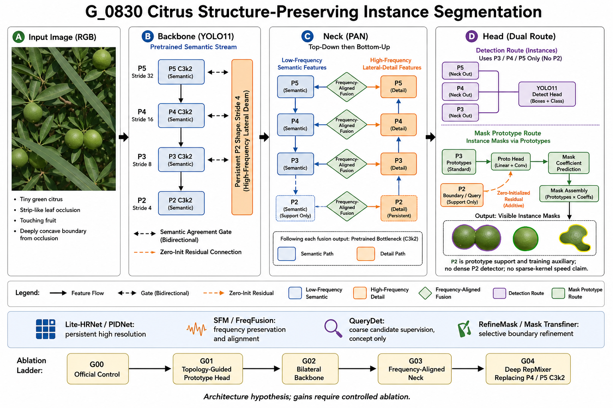

# T 系列纠错复盘与 G_0830 结构重构

日期：2026-08-30  
范围：RGB 未成熟柑橘实例分割；不扩展到 RGB-D、非模态分割、OBB、机器人控制或果梗点头。

> 图为结构假设与消融路径，不是“保证涨点”的结果图。准确网络定义以 YAML 和源码为准。

## 1. 先给结论

1. **T00 不是有效基线。** 它只完成 16/300 epoch，原始 ledger 明确记录 DataLoader worker 被 `Terminated`。因此当前 T 系列不能计算任何模型相对官方 YOLO11n-seg 的可信提升。
2. **T04 是当前最值得保留的结构锚点，但不是已证实赢家。** 它的 Mask mAP50-95 为 0.67367、2.965M 参数、10.957 GFLOPs；只比 T01 高 0.00448，单 seed 仍不足以宣称有效。
3. **T02/G10 在新数据和统一协议下不再占优。** 它只比 T01 高 0.00196 Mask mAP50-95，却增加约 3.97 GFLOPs；不能再称为“超级厉害”的通用结构。
4. **T06 与 T09 应淘汰当前组合。** T06 相对 T05 同时降低 Mask AP 和召回；T09 相对 T08 降低 0.00761 Mask AP，并没有形成可接受的轻量化交换。
5. **PR 曲线末端归零本身不是绘图错误。** 当阈值继续降低但已没有新的真阳性可找时，曲线在最大可达召回之后补到 Precision=0。真正的问题是约 0.75--0.85 Recall 的陡峭拐点：继续追求召回时，叶片假阳性和触碰/遮挡实例错误增长快于真阳性。
6. G_0830 不再堆注意力。它以一个主线组织主干、颈部和头部：**保留 P2 形状证据 → 用高层语义筛掉叶片纹理 → 对齐频率后做 PAN 融合 → 检测仍只在 P3--P5，P2 只修正掩膜原型。**

## 2. T 系列的纠错统计

表中的 P/R/AP 均取各模型 Mask mAP50-95 最佳 epoch；Params/GFLOPs 是用当前源码重新构建逐个计算的真实值，不使用旧自动汇总中的占位数字。

| 模型 | 完成轮数 | Precision | Recall | Mask AP50 | Mask AP50-95 | Params | GFLOPs | 结论 |
|---|---:|---:|---:|---:|---:|---:|---:|---|
| T00 官方基线 | 16/300 | 0.8910 | 0.6897 | 0.7842 | 0.6245 | 2.877M | 10.529 | **失败，不可比较** |
| T01 F14/LSKA | 271/300 | 0.9130 | 0.7550 | 0.8289 | 0.6692 | 3.154M | 10.749 | 当前高效参考 |
| T02 G10 | 240/300 | 0.9098 | 0.7498 | 0.8332 | 0.6712 | 3.248M | 14.714 | 非 Pareto，计算代价过高 |
| T03 N02 | 186/300 | 0.8731 | 0.7577 | 0.8311 | 0.6718 | 3.201M | 14.603 | 差异不足且计算代价过高 |
| T04 L06 | 195/300 | 0.9063 | 0.7564 | 0.8296 | **0.6737** | 2.965M | 10.957 | 最有希望的锚点，需复验 |
| T05 S04 | 285/300 | **0.9347** | 0.7434 | 0.8207 | 0.6653 | 2.788M | **9.619** | 高精度/低计算候选 |
| T06 B06 | 279/300 | 0.9311 | 0.7236 | 0.8214 | 0.6620 | 2.819M | 10.002 | 淘汰当前组合 |
| T07 C03 | 222/300 | 0.9019 | **0.7628** | 0.8255 | 0.6623 | **2.733M** | 9.887 | 召回交换，不是总体提升 |
| T08 D06 | 297/300 | 0.8949 | 0.7588 | 0.8236 | 0.6714 | 3.019M | 12.247 | 形状假设可留，结构非 Pareto |
| T09 D07 | 282/300 | 0.9185 | 0.7364 | 0.8206 | 0.6638 | 2.792M | 11.336 | 相对 T08 明显退化 |

完整机器可读表见 `sources/t_series_corrected_metrics_20260830.csv`。

### 2.1 为什么旧自动汇总不能继续用

`T/.../_summary_20260830_125110/summary_report.md` 有两类硬错误：

- 把只跑 16 轮且进程失败的 T00 当成完整基线，因此制造出所有模型“提升约 4--5 点”的假象；
- 多个模型复用占位 Params/GFLOPs/CPU 时间。例如 G10 的真实复杂度是 3.248M/14.714 GFLOPs，不是旧表中的约 2.84M/10.36 GFLOPs。

该旧文件保留作审计记录，但不得引用到论文。

### 2.2 单 seed 差异的证据等级

T01--T04 的最佳 Mask AP50-95 只相差 0.002--0.0045。结合各模型最后 20 epoch 的波动（标准差约 0.0012--0.0039）和全部仅 seed=42，目前最多可写“候选”而不能写“显著提升”。主基线与最终方法必须用 seed 42/43/44 报均值±标准差。

## 3. 当前网络真正的问题

### 3.1 指标层面

- 高置信度区 Precision 很高，但 Recall 上限有限；低阈值继续放宽后主要加入叶片/枝条假阳性。
- 300 epoch 附近多数模型已从最佳点回落约 0.01--0.02 Mask AP，说明容量和训练时长并不是主要瓶颈，过拟合和困难样本表征更关键。
- 标准 `results.csv` 不包含 AP_small、低 solidity、near-gap、split/merge 等任务指标，无法证明任何模型解决了论文真正痛点。

### 3.2 视觉任务层面

旧分组数据审计提供的方向性证据为：短边小于 8 px 的实例约 3.26%，solidity<0.85 约 17.61%，相邻间距≤2 px 约 30.95%，同时“凹陷+近邻”约 6.86%。这些比例说明主要矛盾不是泛化的“遮挡和小目标”，而是：

1. 条带状叶/枝遮挡形成深凹可见掩膜；
2. 保持同一遮挡果实完整与分开相邻触碰果实存在拓扑冲突；
3. 同一图内尺度跨度很大；
4. 绿色果实与叶片颜色接近，网络需要形状、边缘和上下文，而不是更强颜色注意力。

这些旧比例不能直接贴到 T 数据上。服务器 T 数据统计为 965 张/5,897 实例，而仓库当前研究源数据写的是 941 张/4,576 实例；必须在服务器实际 `data.yaml` 上重新运行 challenge audit 后才能用于论文。

### 3.3 数据划分层面

T 审计只证明跨 split 没有路径重叠和内容完全重复，**没有证明同一 burst/视频序列不跨 split**。形式论文实验必须使用 group-aware split，并记录 split manifest checksum。S/B/T 数据的实例数量也不一致，所以旧系列与 T 的数字不能混表计算涨点。

## 4. PR 曲线为什么在高召回时归零

PR 曲线按置信度从高到低累积预测。模型的最大可达 Recall 小于 1 时，Ultralytics 为了画满横轴，会在最后一个可达召回点之后补零。这个“贴近 0 的尾巴”不是靠换注意力模块消除的。

需要解决的是尾巴之前的陡降：

- 叶片局部纹理与绿色果实相似，阈值降低时 false positive 激增；
- 超小果实在 P3/P4 上正样本少，轻微位移导致 IoU/置信度不稳定；
- 遮挡凹掩膜和触碰果实使掩膜原型出现 split/merge；
- 标签边界噪声会放大低阈值阶段的不一致。

因此 G_0830 同时设置结构消融和损失消融，但两者严格分开。NWD 只回答小目标定位敏感性；VFL 只回答候选质量排序；两者不能被包装成新的网络结构。

## 5. 对 `经验贴.txt` 的取舍

| 经验贴建议 | 在本任务中的判断 |
|---|---|
| 标注质量优先 | 正确，但清洗完成后仍要量化 burst 泄露、边界一致性和 split/merge 错误 |
| FPN/PAFPN 多尺度融合 | YOLO11 已经具有 PAN/FPN 型融合；仅“加 FPN”不是创新 |
| SE/CBAM 稳定涨 1--2 点 | 被本地 F/S/T 实验否定，不能当普遍规律 |
| Focal/Boundary Loss | 可作消融，不等于自动解决实例分离；边界权重过大可能损伤真实凹陷 |
| CRF/形态学后处理 | 高风险：闭运算可能填平真实叶遮挡凹陷，膨胀可能合并触碰果实 |
| TTA | 只能作为同协议推理消融，不能冒充轻量架构贡献 |
| SAM/Swin/PVT | 可作为强比较或伪标签工具；与 nano 实时主方法目标不一致 |

## 6. 本地 GitHub 代码审查结论

已实际阅读而非只看 README 的关键实现包括：

- `Lite-HRNet/models/backbones/litehrnet.py`：多分辨率持续分支、跨尺度条件通道加权；
- `PIDNet/models/pidnet.py` 与 `model_utils.py`：P/I/D 三分支、PagFM 语义一致性门和 Bag 边界门；
- `QueryDet-PyTorch/models/querydet/qinfer.py`：低分辨率 query 选择高分辨率稀疏位置及 5×5 上下文；
- `SFM` 的 ARS/SaliencySampler：基于 saliency 的 `grid_sample` 重采样，机制合理但直接移植较重；
- `FreqFusion/FreqFusion.py`：自适应低通、高通和 offset 重采样；
- `Mask2Camouflage` 解码器：前景与背景互补 attention mask；
- `DCNet/dcnet/modeling/ICS`：实例级参考抑制与 Fourier 数据机制；
- `RefineMask/.../refine_mask_head.py`：实例/语义特征逐级融合与细粒度监督；
- `MaskTransfiner/.../mask_head.py`：仅采样不一致/不确定边界节点；
- `RepViT/model/repvit.py`：3×3/1×1/identity 深度分支与通道 MLP；
- `NWD`、`RankSortLoss`、`VarifocalNet`：定位鲁棒性与质量排序实现。

许可证边界也已检查：Lite-HRNet/RepViT/RefineMask/MaskTransfiner/NWD/RankSortLoss/VarifocalNet 为 Apache-2.0，PIDNet/QueryDet/SFM/DCNet 为 MIT；FreqFusion、Mask2Camouflage、`Plug-play-modules-main` 根目录未发现明确许可证，因此 G_0830 只独立实现论文机制，不复制其源码。

## 7. 文献证据与可迁移边界

| 证据 | 原方法报告 | 对柑橘任务可迁移的内容 | 不应直接声称 |
|---|---|---|---|
| [Lite-HRNet, CVPR 2021](https://openaccess.thecvf.com/content/CVPR2021/papers/Yu_Lite-HRNet_A_Lightweight_High-Resolution_Network_CVPR_2021_paper.pdf) | 持续高分辨率和条件通道加权用于位姿/语义分割 | 窄 P2 分支持续存在 | 论文涨点会原样转移到 YOLO 实例分割 |
| [PIDNet, CVPR 2023](https://openaccess.thecvf.com/content/CVPR2023/papers/Xu_PIDNet_A_Real-Time_Semantic_Segmentation_Network_Inspired_by_PID_Controllers_CVPR_2023_paper.pdf) | P/I/D 分支及边界门用于实时语义分割 | 语义一致性筛选形状证据 | 语义分割 mIoU 等价于 Mask AP |
| [SFM, TPAMI 2025](https://arxiv.org/abs/2507.11893) | 调制高频以减轻下采样混叠 | 高频保留问题的信号处理依据 | 当前实现等同完整 ARS/MSAU |
| [FreqFusion, TPAMI 2024](https://arxiv.org/abs/2408.12879) | 自适应低通/高通/offset 改善融合一致性和边界 | PAN 融合前区分低频语义和高频细节 | 无完整 offset 时声称复现 FreqFusion |
| [QueryDet, CVPR 2022](https://openaccess.thecvf.com/content/CVPR2022/html/Yang_QueryDet_Cascaded_Sparse_Query_for_Accelerating_High-Resolution_Small_Object_Detection_CVPR_2022_paper.html) | coarse query 后对高分辨率位置做稀疏计算 | coarse candidate auxiliary/prototype support | 普通 PyTorch dense conv 获得稀疏加速 |
| [Mask2Camouflage, ACCV 2024](https://openaccess.thecvf.com/content/ACCV2024/html/Phung_Revealing_Hidden_Context_in_Camouflage_Instance_Segmentation_ACCV_2024_paper.html) | 前景/背景互补判别 | 果实内部与近邻环上下文差异 | 绿色柑橘等同伪装数据集 |
| [DCNet, CVPR 2023](https://openaccess.thecvf.com/content/CVPR2023/html/Luo_Camouflaged_Instance_Segmentation_via_Explicit_De-Camouflaging_CVPR_2023_paper.html) | 显式去伪装和实例参考抑制 | 颜色不足时使用实例级上下文 | 直接搬重型 Transformer/Fourier 管线仍轻量 |
| [RefineMask, CVPR 2021](https://openaccess.thecvf.com/content/CVPR2021/papers/Zhang_RefineMask_Towards_High-Quality_Instance_Segmentation_With_Fine-Grained_Features_CVPR_2021_paper.pdf) | 逐级加入细粒度特征改善 mask | P2 只修正原型而不做密集检测 | 全图密集高分辨率必然划算 |
| [Mask Transfiner, CVPR 2022](https://openaccess.thecvf.com/content/CVPR2022/papers/Ke_Mask_Transfiner_for_High-Quality_Instance_Segmentation_CVPR_2022_paper.pdf) | 只细化稀疏错误节点 | 把计算集中到边界/不确定区域 | 当前轻量卷积头等价其 quadtree Transformer |
| [NWD](https://arxiv.org/abs/2110.13389) / [RFLA, ECCV 2022](https://www.ecva.net/papers/eccv_2022/papers_ECCV/papers/136690518.pdf) | 针对 tiny box 的定位与分配 | NWD 作为单独 tiny loss 消融 | 航拍数据收益直接成为柑橘收益 |
| [VarifocalNet, CVPR 2021](https://openaccess.thecvf.com/content/CVPR2021/papers/Zhang_VarifocalNet_An_IoU-Aware_Dense_Object_Detector_CVPR_2021_paper.pdf) | IoU-aware score 改善候选排序 | PR 高召回拐点的质量排序假设 | 单类别数据必然改善 |
| [RepViT, CVPR 2024](https://openaccess.thecvf.com/content/CVPR2024/html/Wang_RepViT_Revisiting_Mobile_CNN_From_ViT_Perspective_CVPR_2024_paper.html) | 移动端友好可重参数化 CNN | 单独测试 P4/P5 非 CSP 深层块 | 参数少等于目标 GPU 上一定更快 |

## 8. G_0830 设计

### 8.1 主干：窄 P2 形状流 + 三次双向交换

G02/G03 不把整套主干封进一个无法继承权重的大模块。标准 YOLO11 语义层仍保持顶层 YAML 节点，并通过 `pretrained_layer_map` 完整映射 561 个官方权重项。新增 32-channel stride-4 P2 分支贯穿 P3/P4/P5：

- 局部高通 `x - AvgPool(x)` 提供对绝对绿色不敏感的形状证据；
- P3/P4/P5 与 P2 的投影相似度生成语义一致性门，抑制叶脉和枝条纹理；
- P2 也把边缘加权的细节回送语义流；
- 双向残差尺度全部从 0 初始化，加载预训练后网络起点与原语义流一致。

这属于宏观主干拓扑改变，不是仅在末尾挂一个注意力模块。

### 8.2 颈部：频率对齐 PAN

G03 把四个普通 `Concat` 换成 `CitrusFrequencyAlignedConcat`：深层分支取低频语义，横向分支取局部高频，语义一致性决定残差更新，然后仍送入原预训练 C3k2。模块初始时严格等价普通 Concat，因此既保持权重加载，又能单独验证频率对齐是否有效。

### 8.3 头部：不做密集 P2 检测

T07 的结果显示 P2/双原型可以提高召回但会损失精度。G_0830 因此坚持：

- box/class/mask coefficient 只在 P3/P4/P5；
- P2 只产生 query/boundary 训练辅助并给标准 P3 prototype 加零初始化残差；
- 不声称 QueryDet 式 sparse-kernel 加速，因为普通 PyTorch 仍执行 dense 卷积。

### 8.4 深层微结构：G04 单独回答 C3k2 替换

G04 只把 P4/P5 C3k2 换成独立实现的 RepViT 风格深度混合块，P2/P3 和宏观拓扑不变。它降至 2.774M 参数、11.418 GFLOPs，但预训练覆盖降为 454/757；因此它是风险更高的轻量候选，必须在 G03 后筛选，不能预先指定为最终模型。

## 9. G_0830 模型与损失矩阵

| 实验 | 唯一变化 | Params | GFLOPs | 预训练迁移 | 优先级 |
|---|---|---:|---:|---:|---|
| G00 | 完整官方基线 | 2.877M | 10.529 | 561/561 | 必跑 |
| G01 | T04 结构锚点 | 2.965M | 10.957 | 561/603 | 必跑 |
| G02 | G01 + 双向 P2 主干 | 3.003M | 11.596 | 562/723 | 必跑 |
| G03 | G02 + 频率对齐颈部 | 3.038M | 11.756 | 562/827 | 必跑 |
| G04 | G03 + P4/P5 RepMixer | **2.774M** | 11.418 | 454/757 | G03 后筛选 |
| G05 | 固定 G03，NWD=0.25 | 3.038M | 11.756 | 同 G03 | 损失消融 |
| G06 | 固定 G03，VFL=0.50 | 3.038M | 11.756 | 同 G03 | 损失消融 |
| G07 | 固定 G03，NWD+VFL | 3.038M | 11.756 | 同 G03 | 损失消融 |
| G08 | 固定 G03，T04 强辅助权重 | 3.038M | 11.756 | 同 G03 | 查明 T04 涨点来源 |

机器可读表见 `sources/g0830_model_matrix_20260830.csv`。

## 10. 实验顺序和停止规则

1. 1--3 epoch smoke：G00--G04，确认数据、loss、显存和速度。
2. 50 epoch structure screen：G00--G04，只比较相同数据、seed、初始化和辅助向量。
3. 只有 G02/G03 相对 G01 在 **Mask AP50-95、AP_small、low-solidity、near-gap、split/merge** 至少三类证据一致时，才进入 loss 消融。
4. 若结构涨幅小于 0.003 Mask AP 且 challenge 指标无改善，判定无效，不跑 300 epoch。
5. G05--G08 固定 G03 架构，只改变已编号 loss；不得与结构涨点合并宣称。
6. 300 epoch 只跑筛选出的 1--2 个模型；最终方法与 G00 都跑 seed 42/43/44。
7. 测试集只在结构和超参数冻结后评估一次；所有筛选使用 val。

## 11. 已完成的软件验证

- 5 个 YAML 均能通过 `YOLO(yaml, task="segment")` 构建；
- 逐模型前向通过；
- G03 标准 segmentation loss 反向通过，三次 backbone exchange 和四次 neck fusion 的残差门均获得梯度；
- G04 确认存在两个真正的非 CSP `CitrusRepMixerStage`；
- 逐模型 GFLOPs 已实算；
- `python -m pytest -q tests/test_citrus_g0830.py`：11 passed。

## 12. 仍需补齐、否则不能写进论文的证据

- 在服务器实际 T 数据上运行 group/burst-aware split audit；
- 完成 G00，不能再引用失败的 T00；
- 对所有候选运行 `eval_citrus_challenges.py`，报告 AP by scale、Boundary F1、split/merge、low-solidity、near-gap；
- 测量目标 GPU 的 batch=1 latency 和峰值显存；GFLOPs/Params 不能代替速度；
- 最终主方法三 seed 均值±标准差；
- 至少完成 YOLOv8n/11n/26n、RTMDet-Ins-tiny、Mask R-CNN R50-FPN、RF-DETR Seg Nano，期刊表再加 SOLOv2-Light R18-FPN。

## 13. 不能承诺的内容

没有文献或现有本地数据能诚实保证从 0.78 直接到 0.88 Mask mAP50。G_0830 的价值是：它把高风险堆叠改成了可解释、可证伪、可复现的结构假设，并保留了预训练起点。是否涨点只能由上述严格实验回答。
