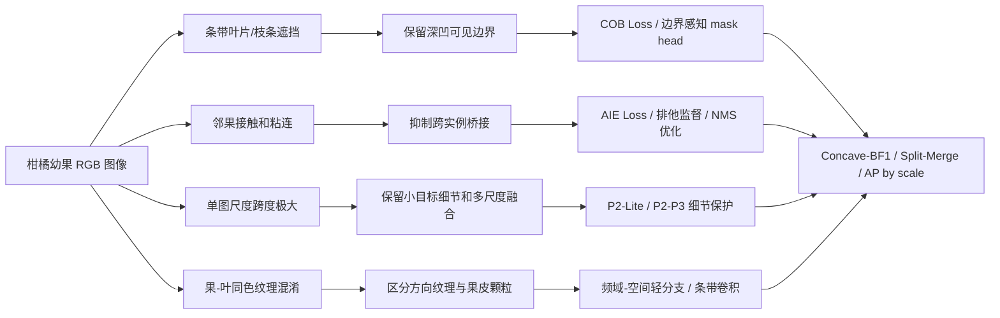

# 柑橘幼果实例分割网络改进策略超级调研

_面向柑橘套袋课题第一篇论文：RGB 柑橘幼果实例分割；更新日期：2026-07-20。_

---

## 结论先行

第一篇论文最稳的主线不是“把 YOLO11n-Seg 堆满注意力、卷积、频域和 Transformer”，而是围绕你的数据难点提出一个完整问题：**在条带状叶片/枝条遮挡、邻近幼果接触和单图极端尺度跨度同时存在时，轻量模型如何既保留被遮挡果实的单实例身份，又分开相邻接触果实**。

基线已经只有 2.8M 参数，因此不应再把“更小”当成第一目标。你已有的整网 StarNet、MobileNetV4 实验均降低了 mask AP，说明剩余 `<5M` 的参数预算应优先换取精度。建议主线方法命名为 `CitrusTopo-Seg`，由三部分组成：

1. `P2-Lite`：给 prototype/mask 路径增加轻量 P2 细节输入，只用 `1x1 + DWConv + 可学习加权`，不增加完整 P2 检测头。
2. `COB-AIE`：训练期同时监督凹陷可见边界和相邻实例分离带，针对低 solidity、窄间隙、跨实例桥接与合并错误。
3. `Mask-CrossKD`：用已训练的 YOLOv9c-Seg 作为教师，只在训练期蒸馏 P3/P4 mask 特征、prototype 与边界响应，推理时删除教师和辅助头。

这个主线的优点是：推理参数预计可控制在 3.3-4.5M，高分辨率细节、拓扑冲突和知识迁移分别可消融，并与柑橘套袋场景强绑定。频域、Mamba、Transformer、低光增强、条带卷积等只作为备选，不应与主线同时堆叠。

## 2023-2026 近期论文检索与证据核验

### 检索说明

- 检索截止：2026-07-20；范围为 2023-2026 正式发表论文，少量高度相关预印本单独标明。
- 使用 Semantic Scholar Graph API、arXiv 原文和 OpenAlex/会议页面交叉核验；Google Scholar 在当前网络返回 HTTP 403，未把其不可复核结果作为证据。
- 下表数值均为论文原始数据集上的结果，不代表在柑橘数据上可复现同等增益；不同数据集之间不可横向比较绝对值。
- 截止检索日，没有找到同时满足“2026 正式顶会/顶刊、直接针对轻量可见实例分割、机制高度相关”的可靠论文，因此不为追求年份强行收录低证据工作。

### 1. 小目标检测/分割与 P2 细节

| 论文 | 作者/机构；发表 | 核心方法 | 论文关键结果 | 对本课题的判断 |
|---|---|---|---|---|
| [YOLO-MS: Rethinking Multi-Scale Representation Learning for Real-Time Object Detection](https://arxiv.org/abs/2308.05480) | Yuming Chen 等；南开大学；TPAMI 2025 | MS-Block 用不同核尺寸的多分支逐层扩大感受野，并用全局查询辅助多尺度融合 | YOLO-MS-XS 在 COCO 为 42.8 AP、5.1M 参数、8.7G MACs；YOLOv8-N 插件实验把 AP 约 37 提至 40、AP-small 约 18 提至 20 | 模块思路可用，但完整 XS 已超过 5M；只借鉴 P3/P4 多尺度深度卷积分支 |
| [Gold-YOLO: Efficient Object Detector via Gather-and-Distribute Mechanism](https://arxiv.org/abs/2309.11331) | Chengcheng Wang 等；Huawei Noah's Ark Lab；NeurIPS 2023 | GD 先聚合多层特征，再向各尺度分发全局信息，缓解 PAN/FPN 间接融合损失 | Gold-YOLO-N：39.9 COCO AP、5.6M、12.1 GFLOPs、T4 FP16 batch=32 为 1030 FPS | 超预算且偏检测；可把“统一聚合后再分发”缩成一次 P2/P3 mask 融合 |
| [HS-FPN: High Frequency and Spatial Perception FPN for Tiny Object Detection](https://arxiv.org/abs/2412.10116) | Zican Shi 等；华中科技大学；AAAI 2025 | HFP 用 DCT/高通响应做通道与空间选择，SDP 建模相邻金字塔层像素依赖 | AI-TOD 上 Cascade R-CNN AP 20.2→23.6，AP50 47.4→52.3，AP-very-tiny 9.9→11.6 | 频率门控有依据，但果皮、叶脉也属高频；必须保留空间残差并做噪声门控 |
| [ASF-YOLO: Attentional Scale Sequence Fusion for Cell Instance Segmentation](https://arxiv.org/abs/2312.06458) | Ming Kang 等；Monash University Malaysia；Image and Vision Computing 2024 | SSFF、TFE、通道位置注意力联合融合小而密集实例的多尺度特征 | DSB2018：mask mAP50 0.887、mAP50-95 0.558、47.3 FPS；但有 46.18M 参数 | 任务机制接近，模型规模不适合；仅借鉴 scale-sequence 融合，不复制整套模块 |

**结论：** 第一优先不是再加一个完整检测 P2 head，而是让高分辨率 P2 只服务于 mask prototype/边界。先统计当前 AP-small 与小果像素直径；若小果在 P3 上仍有足够采样点，P2 可能只增加背景噪声。

### 2. 遮挡处理与凹形边界

| 论文 | 作者/机构；发表 | 核心方法 | 论文关键结果 | 对本课题的判断 |
|---|---|---|---|---|
| [Occlusion-Aware Instance Segmentation via BiLayer Network Architectures](https://arxiv.org/abs/2208.04438) | Lei Ke、Yu-Wing Tai、Chi-Keung Tang；HKUST/Kuaishou；TPAMI 2023 | 将遮挡者与被遮挡者置于两层，显式解耦重叠边界并传递 occluder→occludee 引导 | R50-FPN 的 COCO-OCC AP 28.43→30.68；OCHuman mask AP 16.3→20.6；完整模型 54M | 不做 amodal 补全；只迁移“双层边界冲突建模”，用叶/枝遮挡带辅助可见 mask |
| [DoNet: Deep De-Overlapping Network for Cytology Instance Segmentation](https://arxiv.org/abs/2303.14373) | Hao Jiang 等；HKUST/Tencent AI Lab；CVPR 2023 | 将重叠簇分解为 intersection、complement，再用语义一致性重组实例 | ISBI2014 平均 mAP 59.09→64.02，Dice 92.13；CPS mAP 48.28→49.43 | 与“叶片切入果面、邻果接触”的拓扑冲突最接近，是 COB-AIE 的核心依据 |
| [C2F-Seg: Coarse-to-Fine Amodal Segmentation with Shape Prior](https://arxiv.org/abs/2308.16825) | Jianxiong Gao 等；复旦大学/AWS；ICCV 2023 | 在离散形状先验空间生成粗 amodal mask，再结合可见特征迭代精修 | KINS mIoU-full/occ 为 82.22/53.60，COCOA 为 80.28/27.71；refine 使 KINS mIoU-occ 52.57→53.60 | 只说明粗到细与形状上下文有效；你的标签是 visible mask，禁止训练模型补出被叶片遮住的果面 |
| [Segment Anything, Even Occluded](https://arxiv.org/abs/2503.06261) | Wei-En Tai 等；清华大学/NVIDIA/台大；CVPR 2025 | SAMEO 将 EfficientSAM 变成可连接不同 detector 的 amodal decoder，并构造 Amodal-LVIS | RTMDet+SAMEO 在 COCOA-cls 为 54.4 AP；CO-DETR 零样本配置为 53.6 AP | 模型/任务都过重，不纳入主网；可用于理解遮挡上下文，不能作为自动 visible segmentation 基线 |

**结论：** 柑橘论文应写“遮挡造成的可见轮廓深凹与身份保持冲突”，而不是 amodal completion。训练标签和评估都必须保持 visible mask 定义。

### 3. 相邻实例分离

| 论文 | 作者/机构；发表 | 核心方法 | 论文关键结果 | 对本课题的判断 |
|---|---|---|---|---|
| [InstanSeg](https://arxiv.org/abs/2408.15954) | Thibaut Goldsborough 等；University of Edinburgh；arXiv 2024 | 预测 seed map、位置嵌入和条件嵌入，由轻量神经映射分配像素，避免重 watershed | 约 4M 参数；6 个核分割集 11/12 指标最佳；CoNSeP F1μ 0.483 对 StarDist 0.418；36,073 实例总处理 9.4s | 最贴合 `<5M + touching separation`，但改成完整 embedding head 工程较大；先借鉴 seed/距离监督 |
| [CellViT: Vision Transformers for Precise Cell Segmentation and Classification](https://arxiv.org/abs/2306.15350) | Fabian Hörst 等；University Hospital Essen；Medical Image Analysis 2024 | ViT/SAM encoder 配 HoVer-Net 的水平/垂直距离图，将粘连核分开 | PanNuke 上 CellViT-SAM-H 平均 mPQ 0.4980、bPQ 0.6793；HoVer-Net 为 0.4629/0.6596 | HV 距离图对圆形柑橘很有启发；可改为训练期二维 separation vector，不使用大 ViT encoder |
| [Directional Connectivity-based Segmentation of Medical Images](https://arxiv.org/abs/2304.00145) | Ziyun Yang、Sina Farsiu；Duke University；CVPR 2023 | DconnNet 将方向连通关系从共享特征中解耦，并用 size-density loss 保护小区域 | CHASEDB1：clDice 83.3、Dice 81.8，优于 clDiceLoss 的 82.9/81.0；但模型 36.4M | 方向连通适合条带遮挡边缘；只提取廉价方向边界监督，不采用完整网络 |
| [DoNet](https://arxiv.org/abs/2303.14373) | Hao Jiang 等；HKUST/Tencent AI Lab；CVPR 2023 | 显式学习实例交叠区与互补区，重组时加入一致性约束 | 加入 DRM+CRM 后 ISBI2014 mAP 59.09→63.43，完整模型 64.02 | 直接支持“分离带 + 实例内一致性”双约束；同一论文同时支撑遮挡与邻实例分离 |

**结论：** 比 watershed 更适合 YOLO 的实现是生成每对邻近 GT mask 的 `gap band` 和实例内 `distance/seed map`，仅作训练辅助。推理仍输出原 YOLO masks，避免后处理阈值成为论文不可控变量。

### 4. 低光照增强与分割联合

| 论文 | 作者/机构；发表 | 核心方法 | 论文关键结果 | 对本课题的判断 |
|---|---|---|---|---|
| [FeatEnHancer](https://arxiv.org/abs/2308.03594) | Khurram Azeem Hashmi 等；DFKI；ICCV 2023 | 不追求“好看”的增强图，而由下游 loss 端到端学习多尺度任务相关增强特征 | ExDark +5.7 mAP，DARK FACE +1.5 mAP，ACDC 夜间分割 45.7→54.9 mIoU，DarkVision +1.8 mAP | 该方向唯一高优先级依据；若低光子集确实显著掉点，可做训练期 task-driven feature enhancer |
| [Retinexformer](https://arxiv.org/abs/2303.06705) | Yuanhao Cai 等；清华/维尔茨堡/ETH；ICCV 2023 | 一阶段 Retinex 分解与 illumination-guided transformer 联合恢复 | LOL-v1 25.16 dB/0.845 SSIM；LOL-v2-real 22.80/0.840；1.61M、15.57G FLOPs | 参数可接受但与 YOLO 合并会超过预算/延迟；PSNR 提升不等于 Mask AP 提升 |
| [HVI: A New Color Space for Low-light Image Enhancement](https://arxiv.org/abs/2502.20272) | Qingsen Yan 等；西工大/SMU；CVPR 2025 | 可学习 HVI 色彩空间与双分支 CIDNet 分离亮度和色度退化 | CIDNet 1.88M、7.57G；LOL-v1 28.201 dB/0.889，LOL-v2-real 24.111/0.871 | 可借鉴亮度/色度解耦做增强实验，但不可直接串联进 `<5M` 主模型 |
| [DarkIR: Robust Low-Light Image Restoration](https://arxiv.org/abs/2412.13443) | Daniel Feijoo 等；University of Würzburg；CVPR 2025 | 频域相位增强块与空间注意块联合处理低光、噪声和模糊 | DarkIR-m 3.31M/7.25G，在 LOLBlur 为 27.00 dB、0.883 SSIM；小版 0.872M | 小版可作离线/前处理对照，但不是主线；必须报告增强后 Mask AP 与延迟而非只报 PSNR |

**结论：** 先按曝光/亮度建立 `low-light` challenge subset。只有 baseline 在该子集显著弱于总体时才进入此方向；优先采用亮度扰动和任务 loss 联合训练，不增加独立图像恢复网络。

### 5. 轻量化高精度与知识蒸馏

| 论文 | 作者/机构；发表 | 核心方法 | 论文关键结果 | 对本课题的判断 |
|---|---|---|---|---|
| [MobileNetV4](https://arxiv.org/abs/2404.10518) | Danfeng Qin 等；Google；ECCV 2024 | Universal Inverted Bottleneck、硬件感知搜索与混合 MQA | Conv-S：3.8M、0.2G MACs、ImageNet 73.8%；蒸馏后 75.5% | 你的整网替换已掉点；保留浅层，只借 UIB/DWConv 做 P2-Lite |
| [Rewrite the Stars (StarNet)](https://arxiv.org/abs/2403.19967) | Xu Ma 等；Northeastern/Microsoft；CVPR 2024 | 两个线性映射逐元素相乘，以简单 star operation 扩展隐式特征维度 | S1：2.9M/425M FLOPs/73.5% Top-1；S2：3.7M/547M/74.8% | 你已有 S1/S2 mask AP 均低于 YOLO11n；应作为负对照，不再整网替换 |
| [EfficientViT: Multi-Scale Linear Attention for High-Resolution Dense Prediction](https://arxiv.org/abs/2205.14756) | Han Cai 等；MIT/浙大/清华；ICCV 2023 | 轻量多尺度线性注意力配合硬件高效卷积，面向高分辨率 dense prediction | EfficientViT-B0 在 Cityscapes 为 75.7 mIoU、0.7M 参数、4.4G MACs | 比大 Transformer 更匹配高分辨率 mask；可在 prototype 前试一个 B0 级局部块，但优先级低于 P2-Lite |
| [RepViT](https://arxiv.org/abs/2307.09283) | Ao Wang 等；清华大学等；CVPR 2024 | 从 ViT 宏观设计反推移动 CNN，训练期多分支、推理期重参数化 | M0.9：5.1M、0.8G、ImageNet 79.1%；已略超总预算 | 证明重参数化适合部署，但不能整骨干照搬；只考虑零推理分支的 re-parameterization |
| [CrossKD](https://arxiv.org/abs/2306.11369) | Jiabao Wang 等；南开大学；CVPR 2024 | 学生中间 head 特征送入冻结教师 head，避免 GT 与教师预测直接冲突 | GFL-R50 1x 从 40.2→43.7 AP，配 PKD 为 43.9；学生推理结构不变 | 强烈推荐：以你已训练的 YOLOv9c-Seg 为教师，蒸馏 mask/prototype/边界而非只蒸馏框 |

**结论：** `<5M` 是上限，不是“越小越好”。当前 2.8M 已留有约 2.2M 预算；优先训练期蒸馏和局部高分辨率增强，不再更换完整 backbone。

### 6. 损失函数

| 论文 | 作者/机构；发表 | 核心方法 | 论文关键结果 | 对本课题的判断 |
|---|---|---|---|---|
| [Boundary Difference over Union Loss](https://arxiv.org/abs/2308.00220) | Fan Sun 等；厦门大学；MICCAI 2023 | 以预测/GT 差集近似错位边界，自适应目标大小调整边界关注强度 | Synapse 上 UNet Dice 76.38→78.68、HD 31.45→26.29；Swin-UNet Dice 77.98→79.87、HD 25.95→19.80 | 最适合改造成 `COB Loss`；只对低 solidity/凹边界实例加权，避免所有果实被过度锐化 |
| [Skeleton Recall Loss](https://arxiv.org/abs/2404.03010) | Y. Kirchhoff、M. Rokuss 等；DKFZ/海德堡大学；ECCV 2024 | 预计算 GT skeleton tube，只对其做 soft recall，无需可微骨架化 | ToothFairy Dice/clDice 71.80/89.16→74.42/92.05；平均仅 +8% 训练时间、+2% VRAM | 不直接约束圆形果实骨架；可把 skeleton 思想改成 GT `gap band recall`，保护邻果窄缝 |
| [CellViT](https://arxiv.org/abs/2306.15350) | Fabian Hörst 等；University Hospital Essen；MedIA 2024 | mask 分支组合 Focal Tversky、Dice、BCE，并以 HV 距离损失辅助分离 | 去掉 Focal Tversky 后，多数 PanNuke 类别 PQ 下降；完整模型 mPQ 0.4980 | 说明 Tversky 适合不平衡区域，但论文也显示增益有限；不能把普通 Focal Tversky 包装成主创新 |
| [Focaler-IoU](https://arxiv.org/abs/2401.10525) | Hao Zhang、Shuaijie Zhang；arXiv 2024 预印本 | 将 IoU 线性映射到可调区间，按数据难度聚焦不同质量回归样本 | YOLOv8+SIoU 在 VOC：AP50 69.5→69.8、mAP50-95 48.3→48.6 | 只作用于 box regression，不改善 mask 边界；最多作为附加框损失消融 |
| [Wise-IoU](https://arxiv.org/abs/2301.10051) | Zanjia Tong 等；arXiv 2023 预印本 | 动态非单调聚焦抑制低质量框对回归的有害梯度 | YOLOv7 在 COCO 的 AP75 53.03→54.50 | 同样仅是框损失；不能作为实例分割论文的核心创新 |

**结论：** 主损失应是 `base mask loss + concave boundary loss + adjacent-gap loss`。框 IoU 损失只影响定位支路，不能替代 mask 级边界/分离监督。

### 7. Transformer 与状态空间模型

| 论文 | 作者/机构；发表 | 核心方法 | 论文关键结果 | 对本课题的判断 |
|---|---|---|---|---|
| [VMamba](https://arxiv.org/abs/2401.10166) | Yue Liu 等；UCAS/Huawei/Pengcheng Lab；NeurIPS 2024 | 四方向 SS2D 以线性复杂度传播全局上下文 | VMamba-T backbone 30M；Mask R-CNN 框/Mask AP 47.3/42.7，ADE20K 47.9 mIoU | 精度证据强但远超预算；不适合作为第一篇论文主模块 |
| [LocalMamba](https://arxiv.org/abs/2403.09338) | Tao Huang 等；University of Sydney/SenseTime；ECCV 2024 | 窗口 selective scan 保存局部二维邻接，并搜索不同层扫描方向 | LocalVim-T backbone 8M；COCO Mask R-CNN 框/Mask AP 45.3/39.9 | 局部扫描比全局扫描更符合边界，但仍超预算且依赖专用算子 |
| [EfficientVMamba](https://arxiv.org/abs/2403.09977) | Xiaohuan Pei 等；University of Sydney；ECCV 2024 | 空洞 selective scan 跳采样，将全局 SSM 与 MobileNetV2 block 组合 | T 分类模型 6M/0.8G；Mask R-CNN 完整模型 11M、mask AP 33.2（1x） | 仍超过 5M；“轻量 Mamba”不等于适合 nano 实例分割 |
| [Mamba YOLO](https://arxiv.org/abs/2406.05835) | Zeyu Wang 等；浙江师大/Geekplus；AAAI 2025 | ODSSBlock 与残差门控增强局部/通道建模，将 SSM 接入 YOLO | Tiny：5.8M、13.2G、44.5 COCO AP、1.5ms（RTX 4090） | 最接近 YOLO，但已超参数上限且只验证检测；暂不接入 segmentation |

**结论：** Mamba/Transformer 可列入综述和未来工作，但不是当前最短发表路径。先完成 `P2-Lite + COB-AIE + Mask-CrossKD`；只有其增益不足时，再做单个 EfficientViT 风格局部块，而不是替换 C2PSA 或整个 backbone。

### 推荐的具体改进路线

#### 主线：轻量细节-拓扑协同分割

1. **E0：重跑可复核基线。** 固定 group-aware split、seed、初始化、640 输入和测试脚本，确认用户给定的 mask mAP50-95=0.642 是 val 还是 test。后续所有消融必须同协议。
2. **E1：P2-Lite mask detail path。** 从 backbone P2 经 `1x1 Conv -> DWConv 3x3` 压到 32/48 通道，与上采样 P3 做归一化可学习加权，只送入 Proto/边界支路。目标新增参数 `<0.6M`。
3. **E2：COB-AIE 训练监督。** 从每个 GT mask 生成边界、凹陷权重和相邻实例 gap band；损失仅在 matched instance crop 内计算，避免不同实例标签相互覆盖。辅助 head 在推理时删除。
4. **E3：Mask-CrossKD。** 以现有 YOLOv9c-Seg（mask mAP50-95=0.678）为教师，蒸馏 P3/P4 对齐特征、prototype logits 和 GT 边界带响应；教师全程冻结，学生推理仍小于 5M。
5. **E4：组合与三种子。** 只保留在总体 AP、AP-small、Concave-BF1、Merge Error 至少两个维度稳定提升的组件；最终方法跑 3 seeds，报告均值±标准差。

#### 预期论文贡献边界

- **贡献 1：** 面向单图极端尺度跨度的轻量 P2 mask 细节通路，而不是通用“增加 P2 检测层”。
- **贡献 2：** 面向条带遮挡与邻果接触拓扑冲突的凹边界-分离带联合监督，而不是普通 Boundary Loss 改名。
- **贡献 3：** 从高精度大模型向 nano 原型 mask 的边界感知蒸馏，推理零附加成本。
- **不主张：** amodal 果实补全、通用低光增强、全新 Mamba backbone，或仅凭单次总体 mAP 提升宣称解决遮挡。

#### 停止条件

- P2-Lite 若增加参数超过 0.8M 且 AP-small 提升 `<0.8` 个百分点，停止。
- COB-AIE 若总体 AP 提升但 Merge Error/Concave-BF1 不改善，说明损失没有解决论文所称问题，停止包装为主创新。
- CrossKD 若只有 box AP 提升、mask AP75 与边界指标不升，改蒸馏目标而不是继续加 teacher loss。
- 低光、频域、Mamba 均不与主线同时启用；它们只能在主线完成后做单变量备选实验。

## 视觉难点到网络需求的映射

你的创新点应从“常见难点”继续下钻。遮挡、小目标、光照变化、果叶同色在农业视觉论文中已经非常常见，不能单独支撑大创新。更有价值的表述是：

| 视觉现象 | 算法冲突 | 可量化指标 | 网络需求 |
|---|---|---|---|
| 叶片/枝条像窄条一样切入果面 | 不能把遮挡物补成果实，又不能把同一果实切成多个实例 | `solidity`、凸包缺口、凹陷边界 BF1 | 凹陷边界监督、边界保持压缩 |
| 两个幼果颜色接近且边界只剩窄缝 | 不能把邻果合并，也不能把遮挡切口误判成实例间隙 | 最小实例间距、split/merge error | 相邻实例排他、间隙保持 |
| 同一张图里近景大果和远景小果共存 | 固定 mask 原型分辨率对小果边界不友好 | 最大/最小面积比、AP-small | 浅层细节保护、多尺度融合 |
| 果皮颗粒、叶脉和反光都是高频 | 高频增强可能同时增强目标和干扰 | CIELAB 色差、梯度方向、频谱能量 | 轻量频域选择，不盲目高频增强 |

## 改进策略总览

| 方向 | 解决什么 | 放在网络哪里 | 论文依据 | 成本 | 主线优先级 |
|---|---|---|---|---:|---:|
| P2 细节通路 `P2-Lite` | 用剩余参数预算保护小果与边界 | P2 到 Proto/mask 支路 | YOLO-MS、HS-FPN、EfficientViT | 低中 | 最高 |
| 凹陷边界损失 `COB` | 深凹遮挡 mask 边界粗糙 | Loss / mask supervision | Boundary Loss、Boundary IoU、Hausdorff loss、clDice | 中 | 最高 |
| 相邻实例排他 `AIE` | 邻果合并、桥接、跨实例泄漏 | Loss / postprocess | Repulsion Loss、Soft-NMS、Matrix NMS、SOLOv2 | 中 | 最高 |
| P2/P3 细节保留 | 小果和弱边界保留 | Backbone-neck 输出层 | FPN、PANet、YOLO small head | 低 | 高 |
| 自适应多尺度融合 | 单图尺度跨度大 | Neck | BiFPN、ASFF、Dynamic Head | 中 | 高 |
| 高频/小波/傅里叶增强 | 果皮与叶片纹理差异 | Neck 或 mask head 轻分支 | HS-FPN、FPN for COD、OSFormer | 中高 | 中 |
| 条带卷积 | 建模叶片/枝条条带遮挡 | TokenMixer 或 neck block | Strip R-CNN、PConv | 低中 | 中 |
| 动态/可变形卷积 | 适应弯曲边界和不规则遮挡 | C2f block / mask head | DCNv1/v2/v3、CondInst | 中高 | 中 |
| CNN + Transformer/Mamba | 局部纹理 + 全局关系 | Backbone 高层 | MetaFormer、LRFormer、SRMamba-T | 高 | 低中 |
| 原型 mask 精修 | YOLO 原型 mask 对小目标粗 | Seg head | YOLACT、CondInst、SparseInst | 高 | 中 |

## 主线方案一：P2-Lite 高分辨率 mask 细节通路

### 方法动机

你之前的 StarNet 和 MobileNetV4 全 backbone 替换已经说明：模型虽然更轻，但 mask mAP 下降明显。当前 YOLO11n-Seg 只有约 2.8M 参数，继续压缩并不能服务“高精度且小于 5M”的目标。这个负结果可转化为论文动机：**柑橘幼果分割应把有限参数留给浅层弱边界和小目标细节，而不是均匀替换整个 backbone**。

YOLO-MS、HS-FPN 和 EfficientViT 共同说明，多尺度浅层细节和高分辨率 dense prediction 可以在受控成本下增强。建议只增加一条任务特异的 mask 细节路径：

- 保留原 YOLO11n-Seg backbone 和检测头，不替换 C2PSA
- 从 P2 取特征，经 `1x1 Conv -> DWConv 3x3` 压到 32/48 通道
- 与上采样 P3 使用非负归一化可学习权重融合，仅送入 Proto/边界辅助支路
- 控制新增参数 `<0.6M`，报告 Params、GFLOPs、batch=1 latency、AP-small 和 Concave-BF1
- 把 full-StarNet、full-MobileNetV4 作为负对照，证明“预算定向投入”优于整网轻量替换

### 可写成论文创新的版本

`P2-Lite` 的核心不是普通“增加 P2 检测层”，而是提出一个只服务实例 mask 的高分辨率细节通路：不增加小目标框预测头，不让高分辨率噪声进入所有检测分支，只给 prototype 和训练期边界监督提供细节。

建议消融：

| 实验 | 改动 | 目的 |
|---|---|---|
| E0 | YOLO11n-Seg | 主 baseline |
| E1 | 增加完整 P2 检测/分割头 | 判断常规 P2 的精度与噪声代价 |
| E2 | P2-Lite 32 通道，仅接 Proto | 最小细节增强 |
| E3 | P2-Lite 48 通道，仅接 Proto | 判断容量收益 |
| E4 | P2-Lite + 边界辅助 head | 判断训练监督收益 |
| E5 | full-StarNet/MobileNetV4 | 既有负对照，说明整网替换风险 |

## 主线方案二：凹陷遮挡边界损失

### 方法动机

普通 mask loss 关注整体重叠，对细长凹陷边界不够敏感。Boundary Loss、Boundary IoU、Hausdorff loss 都说明边界区域可以被单独建模；clDice 说明拓扑结构约束可改善细长结构保持。你的场景不是血管拓扑，但“条带遮挡切出的深凹边界”同样是细结构边界问题。

### `COB Loss` 设计

对每个非截断实例：

1. 从真实 mask 计算凸包 `H`，得到凸包缺口 `H - M`
2. 计算 `solidity = area(M) / area(H)`，筛选低 solidity 实例
3. 在缺口邻域提取真实边界带 `B_gt`
4. 从预测 mask 提取预测边界带 `B_pred`
5. 对凹陷区域计算 boundary F1、距离变换损失或 Hausdorff 近似损失
6. 损失权重随凹陷深度、实例尺度、邻近遮挡类型自适应

关键约束：`COB Loss` 只学习可见 mask 的凹陷边界，不做 amodal 补全。论文中要明确这一点，否则容易偏到“遮挡果实完整形状恢复”，那是另一个课题。

### 风险

低 solidity 不一定都是叶片遮挡，也可能来自图像边界截断、标注错误、自然不规则轮廓。正式训练前必须建立 `concave-occlusion` 子集，人工复核一部分样本，防止把噪声变成监督。

## 主线方案三：相邻实例排他损失

### 方法动机

Repulsion Loss 用于行人检测中的拥挤目标分离，Soft-NMS 和 Matrix NMS 处理重叠候选的抑制问题，SOLOv2 通过动态 mask kernel 和 Matrix NMS 做实例级区分。这些工作共同支持一个结论：密集相邻目标不能只靠普通分类和 mask loss，需要显式处理实例间排斥。

你的课题中更特殊的是“拓扑冲突”：叶片遮挡同一果实时要保持一个实例，邻果接触时要拆成两个实例。`AIE Loss` 就针对第二种情况，和 `COB Loss` 互补。

### `AIE Loss` 设计

从标注中自动寻找相邻实例对：

- 两个实例边界最小距离小于阈值
- 外接框重叠或膨胀后相交
- 两个实例之间存在窄间隙或接触走廊

在相邻区域计算：

- `cross-instance leakage`：预测 A mask 进入真实 B 区域的面积
- `bridge penalty`：两个预测 mask 在真实间隙处形成连通桥的惩罚
- `gap preservation`：真实间隙被保留的比例

这部分可以先做成评估指标，再做成 loss。先指标后 loss 更稳，因为可以快速证明现有 YOLO11n-Seg 的错误确实集中在邻果合并。

## 频域与高频策略

### 为什么适合但不能盲用

频域方法适合处理同色目标和局部纹理差异。Frequency Perception Network 在伪装目标检测中使用频率信息，OSFormer 面向伪装实例分割，HS-FPN 用高频感知增强小目标 FPN。论文依据是充分的，但你的数据有一个风险：果皮颗粒、叶脉、病斑、灰尘和反光都可能是高频。盲目增强高频可能同时增强目标和背景噪声。

### 建议实现

优先做“轻量频域选择分支”，不要全网频域化：

- 放在 neck 的 P3/P4 融合处，而不是 backbone 第一层
- 使用 DCT/DWT 或 FFT 提取高频残差
- 通过通道注意力或门控系数选择频域信息
- 与原空间特征残差相加，而不是拼接后大幅增加通道
- 在 `same-color`、`small`、`concave` 子集上单独报告收益

可命名为 `Frequency-Gated Detail Fusion`。如果实验显示 AP 提升但 Concave-BF1 或 Gap-Preservation 不提升，就不要作为主创新，只作为辅助模块。

## Neck 融合策略

FPN 建立了自顶向下多尺度融合，PANet 增加自底向上路径，BiFPN 引入可学习加权融合，ASFF 按空间位置自适应融合不同尺度，Dynamic Head 将尺度、空间、任务注意力统一到检测头。这些都是你解决“单图尺度跨度”的论文依据。

建议优先级：

1. `P2` 或高分辨率 mask detail path：解决远景小果边界
2. 轻量 BiFPN：解决不同尺度贡献固定的问题
3. ASFF：解决同一图中大果和小果并存时的空间自适应融合
4. Dynamic Head：效果可能强，但工程复杂度更高

论文写法不要说“我提出了多尺度融合”，而要说“针对单图内实例面积比极端变化，设计尺度自适应融合，并在 scale-span 子集验证”。

## 条带卷积与方向建模

柑橘套袋场景的遮挡物常是叶片和枝条，形态上接近细长条带。Strip R-CNN 使用大核条带卷积建模遥感目标的长条空间信息，PConv 用非对称卷积增强小目标特征。这给你一个很贴合场景的备选方向：用 `1 x k` 和 `k x 1` 的条带卷积感知叶片/枝条方向遮挡。

建议做法：

- 不要替换全网卷积，只在 P3/P4 或 mask head 前加一个轻量 `Strip Context Block`
- 双分支：水平条带卷积 + 垂直条带卷积
- 加一个小门控，让模型选择是否使用条带上下文
- 评价时看 `concave-occlusion` 子集，而不是只看总体 mAP

这个方向和你的场景结合强，成本低，可以作为 `COB Loss` 的结构配套模块。

## 动态卷积与形变建模

DCNv1/v2 证明可变形卷积能适应几何形变，DCNv3 进一步服务现代视觉骨干。CondInst 用条件卷积动态生成实例 mask，SparseInst 用稀疏实例激活实现实时实例分割。这些方法支持“实例形状不规则时，固定卷积核和固定原型 mask 可能不足”。

可做方向：

- 在 YOLO mask head 前加入轻量 DCNv2/DCNv3
- 只对 P3/P4 mask 特征使用动态卷积，避免全网变慢
- 用动态 kernel 精修每个实例的边界，参考 CondInst 思路
- 对比 YOLACT/YOLO 原型 mask 的粗糙边界问题

风险是工程量偏大，且容易被审稿人认为只是套模块。除非它在 Concave-BF1 或 Split/Merge 上有明确提升，否则不建议作为第一主创新。

## Attention 策略

SE、CBAM、ECA、Coordinate Attention 都是成熟轻量注意力模块。它们可作为增强局部通道和空间选择的工具，但不适合作为论文主线创新。原因是农业 YOLO 改进论文大量使用注意力模块，单独加入一个注意力很难显得有新意。

更合理的用法：

- `ECA`：放在轻量 backbone block 中，成本低
- `Coordinate Attention`：保留位置信息，适合果实空间定位
- `CBAM`：空间 + 通道均增强，但比 ECA 更重
- `SE`：作为最简单消融对照

如果要写进论文，应服务于具体模块，例如 `Frequency-Gated Detail Fusion` 中用 ECA 做频域通道选择，而不是单独说“引入注意力机制”。

## Transformer、Mamba 与 MetaFormer 范式

你给的《论文创新指南2026》强调 `TokenMixer + FFN` 的 MetaFormer 写法：在 TokenMixer 中混合 CNN、Transformer、Mamba、频域，在 FFN 中加入多尺度卷积、频域滤波、门控等。这确实是当前很多视觉论文的写作套路。

但对于第一篇柑橘论文，建议谨慎：

- 大 Transformer 不适合快速发第一篇，工程和算力成本高
- Mamba/SSM 适合全局依赖，但在 YOLO fork 中接入、调参和复现实验成本较高
- 如果使用 MetaFormer，建议只做一个小模块，放在 neck 高层或 mask head 前

可选轻量设计：

`Strip-Frequency MetaBlock = TokenMixer(条带卷积 + 轻量频域门控) + FFN(深度可分离多尺度卷积)`

这个模块比“CNN+Mamba+Transformer+FFT”更适合你的第一篇，因为它和条带遮挡、纹理混淆、小目标细节直接相关。

## Mask head 与原型精修

YOLO 系列 segmentation head 通常依赖 prototype mask 和实例系数组合，速度快，但对极小实例、凹陷边界和邻果窄缝可能不够细。YOLACT 是该范式的重要依据，CondInst 和 SparseInst 则提供了动态实例 mask 的替代思路。

建议策略：

- 保持 YOLO 主体不变，增加一个轻量 boundary refinement branch
- 只在训练阶段使用边界监督，推理阶段尽量不增加复杂后处理
- 若要增加推理模块，必须报告 latency，不只报告 GFLOPs
- 评价时重点看小目标 AP、Boundary F1、Concave-BF1

这部分适合作为 `COB Loss` 的结构增强，但不建议和频域、条带、动态卷积同时启用。

## 训练策略与数据协议

再好的网络改进，如果数据划分存在连拍泄漏，论文指标都会被质疑。正式实验必须：

- 使用 group-aware 划分，连拍序列不能跨 train/val/test
- test 集在方法定型前不反复看图调参
- 所有 baseline 使用同一图像清单和同一类别定义
- YOLO、Mask R-CNN、SOLOv2、RTMDet、U-Net + watershed 都输出同一 COCO-style 评估指标
- 对主 baseline 和最终方法跑 3 个 seed，报告均值和标准差

建议指标：

| 指标 | 用途 |
|---|---|
| Mask mAP50-95 | 主指标 |
| Mask mAP50 / mAP75 | 宽松与严格 IoU 下的性能 |
| Precision / Recall | 检出稳定性 |
| AP-small / AP-medium / AP-large | 单图尺度跨度分析 |
| Params / GFLOPs / latency | 轻量化真实性 |
| Concave-BF1 | 凹陷遮挡边界质量 |
| Gap-Preservation | 邻果间隙保持 |
| Split/Merge Error | 实例拓扑错误 |
| Dice / mIoU / Boundary F1 | 语义模型辅助评价 |

## 推荐实验路线

### 第一阶段：证明问题真实存在

1. 用 YOLO11n-Seg 重新跑干净 group-aware split
2. 导出所有预测图，对 count mismatch、merge、split、凹陷边界错误做人工审查
3. 建立 `concave`、`adjacent`、`small`、`scale-span` 子集
4. 写出数据统计表：solidity、实例间距、面积比、每图实例数

### 第二阶段：做最小可发表方法

| 编号 | 模型 | 目的 |
|---|---|---|
| E0 | YOLO11n-Seg | 主 baseline |
| E1 | E0 + P2-Lite | 验证小果与边界细节 |
| E2 | E0 + COB-AIE | 验证凹陷边界与邻果分离 |
| E3 | E0 + Mask-CrossKD | 验证训练期知识迁移 |
| E4 | E0 + P2-Lite + COB-AIE | 判断结构与监督互补性 |
| E5 | E4 + Mask-CrossKD | 最终候选方法 |
| E6 | E5 + Frequency gate 或 Strip block | 仅在主线不足时二选一，放附录 |

如果 E4 已经能在 mAP、Concave-BF1、Split/Merge 上稳定提升，就不要再堆 E5/E6。第一篇论文要清晰，不要把故事写散。

### 第三阶段：跨范式 baseline

最低比较集：

- YOLOv8n-Seg
- YOLO11n-Seg
- YOLO26n-Seg
- RTMDet-Ins-tiny
- Mask R-CNN R50-FPN
- RF-DETR Seg Nano
- SOLOv2-Light R18-FPN
- U-Net + marker-controlled watershed

U-Net 不能直接称为实例分割模型。正确写法是：合并所有实例为二值前景训练 U-Net，再用距离变换和 marker-controlled watershed 把前景拆成实例，最后报告 Mask AP。

## 不建议作为第一篇主线的方向

| 方向 | 不建议原因 |
|---|---|
| 全 backbone 替换为 StarNet/MobileNetV4 | 已有结果显示精度损失，且容易损伤浅层边界 |
| 大型 Transformer/Mask2Former | 精度可能高，但不符合快速第一篇和轻量化主线 |
| SAM/MobileSAM | 需要 prompt，不是同一自动实例分割任务 |
| 纯 U-Net | 语义分割，不能天然区分邻果实例 |
| 大量注意力模块堆叠 | 农业 YOLO 论文过多，创新同质化严重 |
| amodal segmentation | 会偏离第一篇“可见幼果实例分割”范围 |
| RGB-D、机器人控制、果梗点多任务 | 应留给第二篇或系统论文，不要稀释第一篇 |

## 论文故事线建议

标题可以围绕：

> 面向条带遮挡与邻果接触拓扑冲突的轻量化柑橘幼果实例分割方法

摘要故事线：

1. 柑橘套袋要求准确获得幼果实例 ROI
2. 幼果与叶片同色，且叶片/枝条形成条带遮挡，导致深凹可见 mask
3. 密集果簇中同一果被遮挡要保持身份，邻果接触却要分开，形成拓扑冲突
4. 现有轻量模型追求总体 mAP，缺少对凹陷边界和邻果分离的显式约束
5. 提出 `CitrusTopo-Seg`：P2-Lite + COB-AIE + Mask-CrossKD
6. 在总体指标、轻量指标和挑战子集上验证有效性

贡献写法：

- 构建并量化柑橘幼果实例分割中的凹陷遮挡、邻果接触和尺度跨度挑战
- 提出预算受控的 P2 mask 细节通路，在 `<5M` 下保护小果与浅层边界
- 提出凹陷边界和相邻分离带联合监督，约束遮挡边界与邻果分离
- 提出面向 prototype/boundary 的训练期蒸馏，推理时不引入教师开销
- 建立 challenge subset 评价协议，报告 Concave-BF1、Gap-Preservation 和 Split/Merge Error

## 参考论文清单

### 柑橘与农业实例分割

- Polar-Net: citrus fruit instance segmentation in complex orchards, Frontiers in Plant Science, 2022, DOI: `10.3389/fpls.2022.1054007`
- CitrusSeg: lightweight high-precision instance segmentation for densely growing citrus, 2025, DOI: `10.1109/ICAICE68195.2025.11382537`
- SCORE-DETR: small occluded citrus detection with spatial/frequency information, Computers and Electronics in Agriculture, 2025, DOI: `10.1016/j.compag.2025.110843`
- RG-YOLO-seg: citrus fruit segmentation, Computers and Electronics in Agriculture, 2025, DOI: `10.1016/j.compag.2025.110752`
- Improved YOLO11n-Seg for orange fruit instance segmentation, AgriEngineering, 2026, DOI: `10.3390/agriengineering8050198`

### 实例分割与基线

- He et al., Mask R-CNN, ICCV 2017
- Bolya et al., YOLACT: Real-time Instance Segmentation, ICCV 2019
- Wang et al., SOLOv2: Dynamic, Faster and Stronger, NeurIPS 2020
- Tian et al., CondInst: Conditional Convolutions for Instance Segmentation, ECCV 2020
- Cheng et al., SparseInst: Sparse Instance Activation, CVPR 2022
- Ronneberger et al., U-Net, MICCAI 2015

### 多尺度融合与 neck

- Lin et al., Feature Pyramid Networks for Object Detection, CVPR 2017
- Liu et al., Path Aggregation Network for Instance Segmentation, CVPR 2018
- Tan et al., EfficientDet and BiFPN, CVPR 2020
- Liu et al., Adaptively Spatial Feature Fusion, arXiv 2019
- Dai et al., Dynamic Head, CVPR 2021

### 轻量 backbone

- Han et al., GhostNet, CVPR 2020
- Howard et al. and successors, MobileNet family; MobileNetV4, 2024
- StarNet / Rewrite the Stars, 2024
- Liu et al., EfficientViT, CVPR 2023
- Zhang et al., ShuffleNet / ShuffleNetV2

### 边界、拓扑与密集目标

- Kervadec et al., Boundary Loss for Highly Unbalanced Segmentation, Medical Image Analysis / MIDL, 2019
- Cheng et al., Boundary IoU for object-centric segmentation evaluation, CVPR 2021
- Karimi and Salcudean, Hausdorff Distance Losses for Segmentation, IEEE TMI 2020
- Shit et al., clDice for topology-preserving segmentation, CVPR 2021
- Wang et al., Repulsion Loss for crowded object detection, CVPR 2018
- Bodla et al., Soft-NMS, ICCV 2017

### 频域、条带与动态建模

- Frequency Perception Network for camouflaged object detection, ACM MM 2023
- OSFormer: One-Stage Camouflaged Instance Segmentation, ECCV 2022
- HS-FPN: High Frequency and Spatial Perception FPN for Tiny Object Detection, AAAI 2025 / arXiv `2412.10116`
- Strip R-CNN: Large Strip Convolution for Remote Sensing Object Detection, AAAI 2026 / arXiv `2501.03775`
- Pinwheel-shaped Convolution and Scale-based Dynamic Loss for Infrared Small Target Detection, AAAI 2025
- Dai et al., Deformable ConvNets, ICCV 2017; Zhu et al., DCNv2, CVPR 2019

## 常用检索链接

| 主题 | 链接 |
|---|---|
| Polar-Net | https://doi.org/10.3389/fpls.2022.1054007 |
| CitrusSeg | https://doi.org/10.1109/ICAICE68195.2025.11382537 |
| SCORE-DETR | https://doi.org/10.1016/j.compag.2025.110843 |
| RG-YOLO-seg | https://doi.org/10.1016/j.compag.2025.110752 |
| Improved YOLO11n-Seg Orange | https://doi.org/10.3390/agriengineering8050198 |
| Mask R-CNN | https://arxiv.org/abs/1703.06870 |
| YOLACT | https://arxiv.org/abs/1904.02689 |
| SOLOv2 | https://arxiv.org/abs/2003.10152 |
| CondInst | https://arxiv.org/abs/2003.05664 |
| SparseInst | https://arxiv.org/abs/2203.12827 |
| FPN | https://arxiv.org/abs/1612.03144 |
| PANet | https://arxiv.org/abs/1803.01534 |
| EfficientDet / BiFPN | https://arxiv.org/abs/1911.09070 |
| ASFF | https://arxiv.org/abs/1911.09516 |
| Dynamic Head | https://arxiv.org/abs/2106.08322 |
| GhostNet | https://arxiv.org/abs/1911.11907 |
| MobileNetV4 | https://arxiv.org/abs/2404.10518 |
| StarNet | https://arxiv.org/abs/2403.19967 |
| Boundary Loss | https://arxiv.org/abs/1812.07032 |
| Hausdorff loss | https://arxiv.org/abs/1904.10030 |
| clDice | https://arxiv.org/abs/2003.07311 |
| Repulsion Loss | https://arxiv.org/abs/1711.07752 |
| Soft-NMS | https://arxiv.org/abs/1704.04503 |
| HS-FPN | https://arxiv.org/abs/2412.10116 |
| Strip R-CNN | https://arxiv.org/abs/2501.03775 |
| PConv-SDloss | https://arxiv.org/abs/2412.16986 |
| Deformable ConvNets | https://arxiv.org/abs/1703.06211 |
| DCNv2 | https://arxiv.org/abs/1811.11168 |

## 与你已有模块的关系

| 你的模块 | 对应方向 | 状态 | 下一步 |
|---|---|---|---|
| **HVIEnhance** | 方向 4（低光照增强） | 已实现，6 项自检通过 | 训练验证效果 |
| **C2MANO** | 方向 1（注意力）+ 方向 7（状态空间） | 已实现，P3/P4/P5 验证 | 训练验证效果 |
| **COB Loss** | 方向 2（遮挡处理） | 已构思 | 实现 + 验证 |
| **AIE Loss** | 方向 3（相邻实例分离） | 已构思 | 实现 + 验证 |
| **BPSC** | 方向 5（轻量化） | 已构思 | 实现 + 验证 |

## 推荐实验路线（整合 HVIEnhance + C2MANO）

### 第一阶段：验证已有模块

| 实验 | 模型 | 预期 |
|---|---|---|
| E0 | YOLO11n-Seg baseline | mask mAP50-95 = 0.642 |
| E1 | +HVIEnhance | 低光场景提升 |
| E2 | +C2MANO-P3 | 小目标提升 |
| E3 | +C2MANO-P345 | 多尺度提升 |
| E4 | HVI + C2MANO-P345 | 联合提升 |

### 第二阶段：实现新模块

| 实验 | 模型 | 预期 |
|---|---|---|
| E5 | E4 + COB Loss | 凹陷边界提升 |
| E6 | E4 + AIE Loss | 邻果分离提升 |
| E7 | E4 + BPSC | 轻量化验证 |
| E8 | E4 + COB + AIE | 最终主方法 |

### 第三阶段：跨范式 baseline

| 模型 | 角色 | 必做 |
|---|---|---|
| YOLOv8n-Seg | 旧代轻量 | ✅ |
| YOLO11n-Seg | 主基线 | ✅ |
| YOLO26n-Seg | 当前强对照 | ✅ |
| RTMDet-Ins-tiny | 非 YOLO 一阶段 | ✅ |
| Mask R-CNN R50-FPN | 经典两阶段 | ✅ |
| RF-DETR Seg Nano | 当前 Transformer | ✅ |
| U-Net + Watershed | 语义转实例 | ✅ |

---

## 最终建议

第一篇论文不要追求”模块数量多”，而要追求”问题定义准、方法闭环强、实验能证明”。最推荐的实施顺序是：

1. 先重训干净 YOLO11n-Seg baseline，并建立挑战子集
2. 验证 HVIEnhance + C2MANO 的联合效果
3. 实现 COB Loss，证明凹陷遮挡边界改善
4. 实现 AIE Loss，证明邻果合并和桥接减少
5. 最后只选择一个结构增强模块：条带卷积或频域门控，二选一

如果时间紧，最小可投稿版本就是 `YOLO11n-Seg + HVIEnhance + C2MANO + COB Loss + AIE Loss + challenge subset`。这个组合最贴近柑橘套袋，也最容易讲成一个完整的硕士论文故事。

---

_本文档持续更新，最后修改：2026-07-20_
