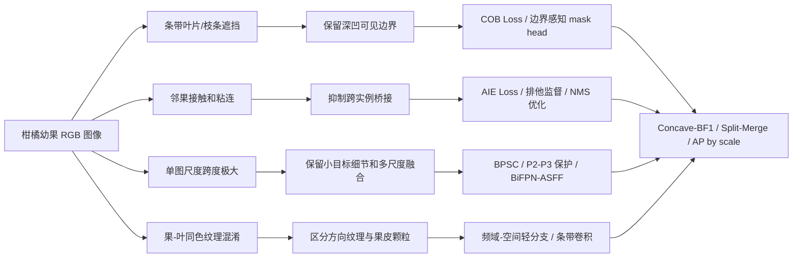

# 柑橘幼果实例分割网络改进策略超级调研

_面向柑橘套袋课题第一篇论文：RGB 柑橘幼果实例分割；整理日期：2026-07-16。_

---

## 结论先行

第一篇论文最稳的主线不是“把 YOLO11n-Seg 堆满注意力、卷积、频域和 Transformer”，而是围绕你的数据难点提出一个完整问题：**在条带状叶片/枝条遮挡、邻近幼果接触和单图极端尺度跨度同时存在时，轻量模型如何既保留被遮挡果实的单实例身份，又分开相邻接触果实**。

建议主线方法命名为 `CitrusTopo-Seg`，由三部分组成：

1. `BPSC`：边界保真的分阶段轻量化，只压缩深层或 neck，不轻易替换浅层 P2/P3 细节层。
2. `COB Loss`：凹陷遮挡边界损失，针对低 solidity、凸包缺口、深凹可见边界进行监督。
3. `AIE Loss`：相邻实例排他损失，针对邻果接触处的跨实例泄漏、桥接、合并错误进行约束。

这个主线的优点是：轻量化、高精度、可解释、可消融、与柑橘套袋场景强绑定。频域、Mamba、Transformer、条带卷积、动态卷积等都可以作为备选模块，但不建议一起堆到第一篇论文里。

## 视觉难点到网络需求的映射

你的创新点应从“常见难点”继续下钻。遮挡、小目标、光照变化、果叶同色在农业视觉论文中已经非常常见，不能单独支撑大创新。更有价值的表述是：

| 视觉现象 | 算法冲突 | 可量化指标 | 网络需求 |
|---|---|---|---|
| 叶片/枝条像窄条一样切入果面 | 不能把遮挡物补成果实，又不能把同一果实切成多个实例 | `solidity`、凸包缺口、凹陷边界 BF1 | 凹陷边界监督、边界保持压缩 |
| 两个幼果颜色接近且边界只剩窄缝 | 不能把邻果合并，也不能把遮挡切口误判成实例间隙 | 最小实例间距、split/merge error | 相邻实例排他、间隙保持 |
| 同一张图里近景大果和远景小果共存 | 固定 mask 原型分辨率对小果边界不友好 | 最大/最小面积比、AP-small | 浅层细节保护、多尺度融合 |
| 果皮颗粒、叶脉和反光都是高频 | 高频增强可能同时增强目标和干扰 | CIELAB 色差、梯度方向、频谱能量 | 轻量频域选择，不盲目高频增强 |

## 改进策略总览

| 方向 | 解决什么 | 放在网络哪里 | 论文依据 | 成本 | 主线优先级 |
|---|---|---|---|---:|---:|
| 分阶段轻量化 `BPSC` | 轻量化时保护浅层边界 | Backbone P4/P5 或 neck 深层 | GhostNet、MobileNetV4、StarNet、EfficientViT | 中 | 最高 |
| 凹陷边界损失 `COB` | 深凹遮挡 mask 边界粗糙 | Loss / mask supervision | Boundary Loss、Boundary IoU、Hausdorff loss、clDice | 中 | 最高 |
| 相邻实例排他 `AIE` | 邻果合并、桥接、跨实例泄漏 | Loss / postprocess | Repulsion Loss、Soft-NMS、Matrix NMS、SOLOv2 | 中 | 最高 |
| P2/P3 细节保留 | 小果和弱边界保留 | Backbone-neck 输出层 | FPN、PANet、YOLO small head | 低 | 高 |
| 自适应多尺度融合 | 单图尺度跨度大 | Neck | BiFPN、ASFF、Dynamic Head | 中 | 高 |
| 高频/小波/傅里叶增强 | 果皮与叶片纹理差异 | Neck 或 mask head 轻分支 | HS-FPN、FPN for COD、OSFormer | 中高 | 中 |
| 条带卷积 | 建模叶片/枝条条带遮挡 | TokenMixer 或 neck block | Strip R-CNN、PConv | 低中 | 中 |
| 动态/可变形卷积 | 适应弯曲边界和不规则遮挡 | C2f block / mask head | DCNv1/v2/v3、CondInst | 中高 | 中 |
| CNN + Transformer/Mamba | 局部纹理 + 全局关系 | Backbone 高层 | MetaFormer、LRFormer、SRMamba-T | 高 | 低中 |
| 原型 mask 精修 | YOLO 原型 mask 对小目标粗 | Seg head | YOLACT、CondInst、SparseInst | 高 | 中 |

## 主线方案一：边界保真的分阶段轻量化

### 方法动机

你之前的 StarNet 全 backbone 替换已经说明：模型确实变轻，但 mask mAP 下降明显。这个现象本身可以转化为论文动机：**柑橘幼果分割不能只追求参数量下降，浅层弱边界和小目标细节对条带遮挡尤其敏感**。

GhostNet 证明可用廉价操作生成冗余特征，MobileNetV4 和 EfficientViT 代表移动端高效网络设计，StarNet 强调用简单结构获得强表征。这些论文支持轻量化方向，但不能直接证明“全替换适合你的任务”。因此建议做任务特异化压缩：

- 保留原 YOLO11n-Seg 浅层 `P2/P3` 或前两个 stage
- 在 `P4/P5`、SPPF 后、neck 深层处替换为 StarBlock/Ghost bottleneck/depthwise block
- 所有替换都报告 Params、GFLOPs、真实 batch=1 latency、AP-small、Concave-BF1
- 论文中把 full-StarNet 作为负对照，说明非均匀压缩的必要性

### 可写成论文创新的版本

`BPSC` 可以定义为 `Boundary-Preserving Stage-wise Compression`。核心不是发明一个全新 backbone，而是提出一个适合柑橘幼果的压缩原则：浅层保边界，深层减冗余，neck 中做轻量融合。

建议消融：

| 实验 | 改动 | 目的 |
|---|---|---|
| E0 | YOLO11n-Seg | 主 baseline |
| E1 | 全 backbone StarNet | 证明盲目轻量化损害边界 |
| E2 | 仅 P5 替换 | 最小压缩 |
| E3 | P4/P5 替换 | 主推配置 |
| E4 | P3/P4/P5 替换 | 验证浅层替换风险 |
| E5 | neck 深层轻量化 | 判断压缩位置 |

## 主线方案二：凹陷遮挡边界损失

### 方法动机

普通 mask loss 关注整体重叠，对细长凹陷边界不够敏感。Boundary Loss、Boundary IoU、Hausdorff loss 都说明边界区域可以被单独建模；clDice 说明拓扑结构约束可改善细长结构保持。你的场景不是血管拓扑，但“条带遮挡切出的深凹边界”同样是细结构边界问题。

### `COB Loss` 设计

对每个非截断实例：

1. 从真实 mask 计算凸包 `H`，得到凸包缺口 `H - M`
2. 计算 `solidity = area(M) / area(H)`，筛选低 solidity 实例
3. 在缺口邻域提取真实边界带 `B_gt`
4. 从预测 mask 提取预测边界带 `B_pred`
5. 对凹陷区域计算 boundary F1、距离变换损失或 Hausdorff 近似损失
6. 损失权重随凹陷深度、实例尺度、邻近遮挡类型自适应

关键约束：`COB Loss` 只学习可见 mask 的凹陷边界，不做 amodal 补全。论文中要明确这一点，否则容易偏到“遮挡果实完整形状恢复”，那是另一个课题。

### 风险

低 solidity 不一定都是叶片遮挡，也可能来自图像边界截断、标注错误、自然不规则轮廓。正式训练前必须建立 `concave-occlusion` 子集，人工复核一部分样本，防止把噪声变成监督。

## 主线方案三：相邻实例排他损失

### 方法动机

Repulsion Loss 用于行人检测中的拥挤目标分离，Soft-NMS 和 Matrix NMS 处理重叠候选的抑制问题，SOLOv2 通过动态 mask kernel 和 Matrix NMS 做实例级区分。这些工作共同支持一个结论：密集相邻目标不能只靠普通分类和 mask loss，需要显式处理实例间排斥。

你的课题中更特殊的是“拓扑冲突”：叶片遮挡同一果实时要保持一个实例，邻果接触时要拆成两个实例。`AIE Loss` 就针对第二种情况，和 `COB Loss` 互补。

### `AIE Loss` 设计

从标注中自动寻找相邻实例对：

- 两个实例边界最小距离小于阈值
- 外接框重叠或膨胀后相交
- 两个实例之间存在窄间隙或接触走廊

在相邻区域计算：

- `cross-instance leakage`：预测 A mask 进入真实 B 区域的面积
- `bridge penalty`：两个预测 mask 在真实间隙处形成连通桥的惩罚
- `gap preservation`：真实间隙被保留的比例

这部分可以先做成评估指标，再做成 loss。先指标后 loss 更稳，因为可以快速证明现有 YOLO11n-Seg 的错误确实集中在邻果合并。

## 频域与高频策略

### 为什么适合但不能盲用

频域方法适合处理同色目标和局部纹理差异。Frequency Perception Network 在伪装目标检测中使用频率信息，OSFormer 面向伪装实例分割，HS-FPN 用高频感知增强小目标 FPN。论文依据是充分的，但你的数据有一个风险：果皮颗粒、叶脉、病斑、灰尘和反光都可能是高频。盲目增强高频可能同时增强目标和背景噪声。

### 建议实现

优先做“轻量频域选择分支”，不要全网频域化：

- 放在 neck 的 P3/P4 融合处，而不是 backbone 第一层
- 使用 DCT/DWT 或 FFT 提取高频残差
- 通过通道注意力或门控系数选择频域信息
- 与原空间特征残差相加，而不是拼接后大幅增加通道
- 在 `same-color`、`small`、`concave` 子集上单独报告收益

可命名为 `Frequency-Gated Detail Fusion`。如果实验显示 AP 提升但 Concave-BF1 或 Gap-Preservation 不提升，就不要作为主创新，只作为辅助模块。

## Neck 融合策略

FPN 建立了自顶向下多尺度融合，PANet 增加自底向上路径，BiFPN 引入可学习加权融合，ASFF 按空间位置自适应融合不同尺度，Dynamic Head 将尺度、空间、任务注意力统一到检测头。这些都是你解决“单图尺度跨度”的论文依据。

建议优先级：

1. `P2` 或高分辨率 mask detail path：解决远景小果边界
2. 轻量 BiFPN：解决不同尺度贡献固定的问题
3. ASFF：解决同一图中大果和小果并存时的空间自适应融合
4. Dynamic Head：效果可能强，但工程复杂度更高

论文写法不要说“我提出了多尺度融合”，而要说“针对单图内实例面积比极端变化，设计尺度自适应融合，并在 scale-span 子集验证”。

## 条带卷积与方向建模

柑橘套袋场景的遮挡物常是叶片和枝条，形态上接近细长条带。Strip R-CNN 使用大核条带卷积建模遥感目标的长条空间信息，PConv 用非对称卷积增强小目标特征。这给你一个很贴合场景的备选方向：用 `1 x k` 和 `k x 1` 的条带卷积感知叶片/枝条方向遮挡。

建议做法：

- 不要替换全网卷积，只在 P3/P4 或 mask head 前加一个轻量 `Strip Context Block`
- 双分支：水平条带卷积 + 垂直条带卷积
- 加一个小门控，让模型选择是否使用条带上下文
- 评价时看 `concave-occlusion` 子集，而不是只看总体 mAP

这个方向和你的场景结合强，成本低，可以作为 `COB Loss` 的结构配套模块。

## 动态卷积与形变建模

DCNv1/v2 证明可变形卷积能适应几何形变，DCNv3 进一步服务现代视觉骨干。CondInst 用条件卷积动态生成实例 mask，SparseInst 用稀疏实例激活实现实时实例分割。这些方法支持“实例形状不规则时，固定卷积核和固定原型 mask 可能不足”。

可做方向：

- 在 YOLO mask head 前加入轻量 DCNv2/DCNv3
- 只对 P3/P4 mask 特征使用动态卷积，避免全网变慢
- 用动态 kernel 精修每个实例的边界，参考 CondInst 思路
- 对比 YOLACT/YOLO 原型 mask 的粗糙边界问题

风险是工程量偏大，且容易被审稿人认为只是套模块。除非它在 Concave-BF1 或 Split/Merge 上有明确提升，否则不建议作为第一主创新。

## Attention 策略

SE、CBAM、ECA、Coordinate Attention 都是成熟轻量注意力模块。它们可作为增强局部通道和空间选择的工具，但不适合作为论文主线创新。原因是农业 YOLO 改进论文大量使用注意力模块，单独加入一个注意力很难显得有新意。

更合理的用法：

- `ECA`：放在轻量 backbone block 中，成本低
- `Coordinate Attention`：保留位置信息，适合果实空间定位
- `CBAM`：空间 + 通道均增强，但比 ECA 更重
- `SE`：作为最简单消融对照

如果要写进论文，应服务于具体模块，例如 `Frequency-Gated Detail Fusion` 中用 ECA 做频域通道选择，而不是单独说“引入注意力机制”。

## Transformer、Mamba 与 MetaFormer 范式

你给的《论文创新指南2026》强调 `TokenMixer + FFN` 的 MetaFormer 写法：在 TokenMixer 中混合 CNN、Transformer、Mamba、频域，在 FFN 中加入多尺度卷积、频域滤波、门控等。这确实是当前很多视觉论文的写作套路。

但对于第一篇柑橘论文，建议谨慎：

- 大 Transformer 不适合快速发第一篇，工程和算力成本高
- Mamba/SSM 适合全局依赖，但在 YOLO fork 中接入、调参和复现实验成本较高
- 如果使用 MetaFormer，建议只做一个小模块，放在 neck 高层或 mask head 前

可选轻量设计：

`Strip-Frequency MetaBlock = TokenMixer(条带卷积 + 轻量频域门控) + FFN(深度可分离多尺度卷积)`

这个模块比“CNN+Mamba+Transformer+FFT”更适合你的第一篇，因为它和条带遮挡、纹理混淆、小目标细节直接相关。

## Mask head 与原型精修

YOLO 系列 segmentation head 通常依赖 prototype mask 和实例系数组合，速度快，但对极小实例、凹陷边界和邻果窄缝可能不够细。YOLACT 是该范式的重要依据，CondInst 和 SparseInst 则提供了动态实例 mask 的替代思路。

建议策略：

- 保持 YOLO 主体不变，增加一个轻量 boundary refinement branch
- 只在训练阶段使用边界监督，推理阶段尽量不增加复杂后处理
- 若要增加推理模块，必须报告 latency，不只报告 GFLOPs
- 评价时重点看小目标 AP、Boundary F1、Concave-BF1

这部分适合作为 `COB Loss` 的结构增强，但不建议和频域、条带、动态卷积同时启用。

## 训练策略与数据协议

再好的网络改进，如果数据划分存在连拍泄漏，论文指标都会被质疑。正式实验必须：

- 使用 group-aware 划分，连拍序列不能跨 train/val/test
- test 集在方法定型前不反复看图调参
- 所有 baseline 使用同一图像清单和同一类别定义
- YOLO、Mask R-CNN、SOLOv2、RTMDet、U-Net + watershed 都输出同一 COCO-style 评估指标
- 对主 baseline 和最终方法跑 3 个 seed，报告均值和标准差

建议指标：

| 指标 | 用途 |
|---|---|
| Mask mAP50-95 | 主指标 |
| Mask mAP50 / mAP75 | 宽松与严格 IoU 下的性能 |
| Precision / Recall | 检出稳定性 |
| AP-small / AP-medium / AP-large | 单图尺度跨度分析 |
| Params / GFLOPs / latency | 轻量化真实性 |
| Concave-BF1 | 凹陷遮挡边界质量 |
| Gap-Preservation | 邻果间隙保持 |
| Split/Merge Error | 实例拓扑错误 |
| Dice / mIoU / Boundary F1 | 语义模型辅助评价 |

## 推荐实验路线

### 第一阶段：证明问题真实存在

1. 用 YOLO11n-Seg 重新跑干净 group-aware split
2. 导出所有预测图，对 count mismatch、merge、split、凹陷边界错误做人工审查
3. 建立 `concave`、`adjacent`、`small`、`scale-span` 子集
4. 写出数据统计表：solidity、实例间距、面积比、每图实例数

### 第二阶段：做最小可发表方法

| 编号 | 模型 | 目的 |
|---|---|---|
| E0 | YOLO11n-Seg | 主 baseline |
| E1 | E0 + BPSC | 验证边界保真轻量化 |
| E2 | E1 + COB Loss | 验证凹陷遮挡边界 |
| E3 | E1 + AIE Loss | 验证邻果分离 |
| E4 | E1 + COB + AIE | 最终主方法 |
| E5 | E4 + Strip block | 作为增强版或附录 |
| E6 | E4 + Frequency gate | 作为增强版或附录 |

如果 E4 已经能在 mAP、Concave-BF1、Split/Merge 上稳定提升，就不要再堆 E5/E6。第一篇论文要清晰，不要把故事写散。

### 第三阶段：跨范式 baseline

最低比较集：

- YOLOv8n-Seg
- YOLO11n-Seg
- YOLO26n-Seg
- RTMDet-Ins-tiny
- Mask R-CNN R50-FPN
- RF-DETR Seg Nano
- SOLOv2-Light R18-FPN
- U-Net + marker-controlled watershed

U-Net 不能直接称为实例分割模型。正确写法是：合并所有实例为二值前景训练 U-Net，再用距离变换和 marker-controlled watershed 把前景拆成实例，最后报告 Mask AP。

## 不建议作为第一篇主线的方向

| 方向 | 不建议原因 |
|---|---|
| 全 backbone 替换为 StarNet/MobileNetV4 | 已有结果显示精度损失，且容易损伤浅层边界 |
| 大型 Transformer/Mask2Former | 精度可能高，但不符合快速第一篇和轻量化主线 |
| SAM/MobileSAM | 需要 prompt，不是同一自动实例分割任务 |
| 纯 U-Net | 语义分割，不能天然区分邻果实例 |
| 大量注意力模块堆叠 | 农业 YOLO 论文过多，创新同质化严重 |
| amodal segmentation | 会偏离第一篇“可见幼果实例分割”范围 |
| RGB-D、机器人控制、果梗点多任务 | 应留给第二篇或系统论文，不要稀释第一篇 |

## 论文故事线建议

标题可以围绕：

> 面向条带遮挡与邻果接触拓扑冲突的轻量化柑橘幼果实例分割方法

摘要故事线：

1. 柑橘套袋要求准确获得幼果实例 ROI
2. 幼果与叶片同色，且叶片/枝条形成条带遮挡，导致深凹可见 mask
3. 密集果簇中同一果被遮挡要保持身份，邻果接触却要分开，形成拓扑冲突
4. 现有轻量模型追求总体 mAP，缺少对凹陷边界和邻果分离的显式约束
5. 提出 `CitrusTopo-Seg`：BPSC + COB Loss + AIE Loss
6. 在总体指标、轻量指标和挑战子集上验证有效性

贡献写法：

- 构建并量化柑橘幼果实例分割中的凹陷遮挡、邻果接触和尺度跨度挑战
- 提出边界保真的分阶段轻量化策略，在降低计算量的同时保护浅层边界
- 提出凹陷遮挡边界损失和相邻实例排他损失，分别约束遮挡边界与邻果分离
- 建立 challenge subset 评价协议，报告 Concave-BF1、Gap-Preservation 和 Split/Merge Error

## 参考论文清单

### 柑橘与农业实例分割

- Polar-Net: citrus fruit instance segmentation in complex orchards, Frontiers in Plant Science, 2022, DOI: `10.3389/fpls.2022.1054007`
- CitrusSeg: lightweight high-precision instance segmentation for densely growing citrus, 2025, DOI: `10.1109/ICAICE68195.2025.11382537`
- SCORE-DETR: small occluded citrus detection with spatial/frequency information, Computers and Electronics in Agriculture, 2025, DOI: `10.1016/j.compag.2025.110843`
- RG-YOLO-seg: citrus fruit segmentation, Computers and Electronics in Agriculture, 2025, DOI: `10.1016/j.compag.2025.110752`
- Improved YOLO11n-Seg for orange fruit instance segmentation, AgriEngineering, 2026, DOI: `10.3390/agriengineering8050198`

### 实例分割与基线

- He et al., Mask R-CNN, ICCV 2017
- Bolya et al., YOLACT: Real-time Instance Segmentation, ICCV 2019
- Wang et al., SOLOv2: Dynamic, Faster and Stronger, NeurIPS 2020
- Tian et al., CondInst: Conditional Convolutions for Instance Segmentation, ECCV 2020
- Cheng et al., SparseInst: Sparse Instance Activation, CVPR 2022
- Ronneberger et al., U-Net, MICCAI 2015

### 多尺度融合与 neck

- Lin et al., Feature Pyramid Networks for Object Detection, CVPR 2017
- Liu et al., Path Aggregation Network for Instance Segmentation, CVPR 2018
- Tan et al., EfficientDet and BiFPN, CVPR 2020
- Liu et al., Adaptively Spatial Feature Fusion, arXiv 2019
- Dai et al., Dynamic Head, CVPR 2021

### 轻量 backbone

- Han et al., GhostNet, CVPR 2020
- Howard et al. and successors, MobileNet family; MobileNetV4, 2024
- StarNet / Rewrite the Stars, 2024
- Liu et al., EfficientViT, CVPR 2023
- Zhang et al., ShuffleNet / ShuffleNetV2

### 边界、拓扑与密集目标

- Kervadec et al., Boundary Loss for Highly Unbalanced Segmentation, Medical Image Analysis / MIDL, 2019
- Cheng et al., Boundary IoU for object-centric segmentation evaluation, CVPR 2021
- Karimi and Salcudean, Hausdorff Distance Losses for Segmentation, IEEE TMI 2020
- Shit et al., clDice for topology-preserving segmentation, CVPR 2021
- Wang et al., Repulsion Loss for crowded object detection, CVPR 2018
- Bodla et al., Soft-NMS, ICCV 2017

### 频域、条带与动态建模

- Frequency Perception Network for camouflaged object detection, ACM MM 2023
- OSFormer: One-Stage Camouflaged Instance Segmentation, ECCV 2022
- HS-FPN: High Frequency and Spatial Perception FPN for Tiny Object Detection, AAAI 2025 / arXiv `2412.10116`
- Strip R-CNN: Large Strip Convolution for Remote Sensing Object Detection, AAAI 2026 / arXiv `2501.03775`
- Pinwheel-shaped Convolution and Scale-based Dynamic Loss for Infrared Small Target Detection, AAAI 2025
- Dai et al., Deformable ConvNets, ICCV 2017; Zhu et al., DCNv2, CVPR 2019

## 常用检索链接

| 主题 | 链接 |
|---|---|
| Polar-Net | https://doi.org/10.3389/fpls.2022.1054007 |
| CitrusSeg | https://doi.org/10.1109/ICAICE68195.2025.11382537 |
| SCORE-DETR | https://doi.org/10.1016/j.compag.2025.110843 |
| RG-YOLO-seg | https://doi.org/10.1016/j.compag.2025.110752 |
| Improved YOLO11n-Seg Orange | https://doi.org/10.3390/agriengineering8050198 |
| Mask R-CNN | https://arxiv.org/abs/1703.06870 |
| YOLACT | https://arxiv.org/abs/1904.02689 |
| SOLOv2 | https://arxiv.org/abs/2003.10152 |
| CondInst | https://arxiv.org/abs/2003.05664 |
| SparseInst | https://arxiv.org/abs/2203.12827 |
| FPN | https://arxiv.org/abs/1612.03144 |
| PANet | https://arxiv.org/abs/1803.01534 |
| EfficientDet / BiFPN | https://arxiv.org/abs/1911.09070 |
| ASFF | https://arxiv.org/abs/1911.09516 |
| Dynamic Head | https://arxiv.org/abs/2106.08322 |
| GhostNet | https://arxiv.org/abs/1911.11907 |
| MobileNetV4 | https://arxiv.org/abs/2404.10518 |
| StarNet | https://arxiv.org/abs/2403.19967 |
| Boundary Loss | https://arxiv.org/abs/1812.07032 |
| Hausdorff loss | https://arxiv.org/abs/1904.10030 |
| clDice | https://arxiv.org/abs/2003.07311 |
| Repulsion Loss | https://arxiv.org/abs/1711.07752 |
| Soft-NMS | https://arxiv.org/abs/1704.04503 |
| HS-FPN | https://arxiv.org/abs/2412.10116 |
| Strip R-CNN | https://arxiv.org/abs/2501.03775 |
| PConv-SDloss | https://arxiv.org/abs/2412.16986 |
| Deformable ConvNets | https://arxiv.org/abs/1703.06211 |
| DCNv2 | https://arxiv.org/abs/1811.11168 |

## 最终建议

第一篇论文不要追求“模块数量多”，而要追求“问题定义准、方法闭环强、实验能证明”。最推荐的实施顺序是：

1. 先重训干净 YOLO11n-Seg baseline，并建立挑战子集
2. 实现 `BPSC`，解决轻量化不伤边界
3. 实现 `COB Loss`，证明凹陷遮挡边界改善
4. 实现 `AIE Loss`，证明邻果合并和桥接减少
5. 最后只选择一个结构增强模块：条带卷积或频域门控，二选一

如果时间紧，最小可投稿版本就是 `YOLO11n-Seg + BPSC + COB + AIE + challenge subset`。这个组合最贴近柑橘套袋，也最容易讲成一个完整的硕士论文故事。
