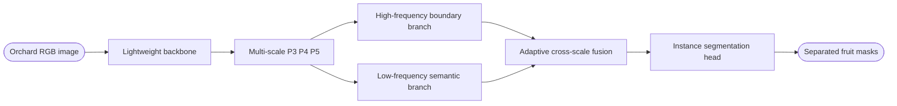

# 柑橘幼果实例分割：频率建模、轻量 Backbone 与 Neck 融合论文调研

_研究目标：围绕自然果园中极小幼果、叶果同色、严重遮挡、密集粘连和边界模糊，形成“轻量化 + 高精度”的可发表改进路线；检索核对日期：2026-07-14_

---

## 一、结论先行

仅把现成轻量 Backbone、注意力和上采样模块叠加到 YOLO11n-seg 上，通常只能构成工程改进，难以支撑较强期刊创新。更值得推进的主线是：

> 以 YOLO11n-seg 为基线，设计一个面向幼果小目标和遮挡边界的轻量频率选择式跨尺度融合网络：Backbone 保留低成本局部纹理，Neck 在上采样与跨尺度融合时分别建模高频边界和低频语义，并通过轻量门控按位置自适应融合。

这条路线同时对应三个真实问题：

1. 极小幼果在连续下采样后，高频轮廓和细粒度纹理容易消失
2. 叶片与幼果颜色接近，仅依赖低频颜色和区域语义容易混淆
3. 密集遮挡导致实例接触，普通 `upsample + concat` 难以恢复分界

## 二、频率域用于小目标与分割

### 2.1 为什么频率信息适合本课题

高频成分主要承载边缘、细纹理和局部突变，低频成分更多承载大范围形状、颜色与上下文。幼果直径较小、颜色接近叶片且常被枝叶切割，正好要求模型同时保留高频边界并利用低频上下文。关键不是“加入一次傅里叶变换”，而是回答三个问题：

- 在哪一层分频：过早会放大噪声，过晚则小目标细节已经丢失
- 高频如何使用：应服务于边界、实例分离和局部对齐，而不是无条件增强
- 如何保持轻量：优先使用固定 DWT/DCT、深度可分离卷积和小型门控，避免昂贵的全局频谱注意力

根据当前 `4,576` 个实例的多边形外接框，将每张图按长边等比例缩放到 `640` 后，目标尺寸分布为：

| 统计项 | P10 | P25 | 中位数 | P75 | P90 |
| --- | ---: | ---: | ---: | ---: | ---: |
| 外接框宽度/像素 | 15.84 | 27.97 | 45.42 | 66.67 | 93.54 |
| 外接框高度/像素 | 15.87 | 28.12 | 45.16 | 67.19 | 94.69 |
| 外接框最大边/像素 | 18.96 | 32.55 | 49.58 | 71.88 | 98.91 |

其中 `24.1%` 的实例最大边小于 `32` 像素，`8.0%` 小于 `16` 像素。在 stride 8 的 `P3` 特征图上，小于 `32` 像素的目标最多只覆盖约 4 个网格，因此浅层高频保存确有必要；但真正小于 `16` 像素的比例不是多数，所以不应默认永久增加高成本 `P2` 检测头。更合理的顺序是先改进 `P3` 融合，再用消融判断 `P2` 是否带来足够收益。

### 2.2 代表论文与可借鉴机制

| 论文 | 发表 | 核心机制 | 对柑橘幼果的价值 | 建议 |
| --- | --- | --- | --- | --- |
| OctConv[^1] | ICCV 2019 | 将特征拆为高、低空间频率并交互 | 提供分频卷积基础，但低频分支可能损伤极小目标 | 理论参考 |
| WaveSNet[^2] | BMVC 2020 | DWT 下采样、IDWT 恢复空间细节 | 固定小波变换稳定且参数少，适合分割 | 值得复现 |
| FcaNet[^3] | ICCV 2021 | 用多谱 DCT 分量构造通道注意力 | 可替代池化式通道注意力，成本较低 | 可做轻量对照 |
| Wave-ViT[^4] | ECCV 2022 | 小波变换压缩 token 并保留多频信息 | 说明频率分解可兼顾全局建模与效率 | Backbone 参考 |
| FADC[^5] | CVPR 2024 | 按局部频率自适应选择空洞率和频带 | 可让平坦区域扩大感受野、边缘区域保留细节 | 高优先级 |
| Segmentation Aliasing[^6] | 2024 | 分析上下采样混叠并恢复高频特征 | 直接对应小目标下采样丢失和边界锯齿 | 高优先级 |
| FreqFusion[^7] | TPAMI 2024 | 在跨尺度融合中自适应抑制类内高频、增强边界高频 | 与 Neck 融合和粘连实例分离高度匹配 | 最高优先级 |
| WTConv[^8] | ECCV 2024 | 小波卷积以较少参数获得大感受野 | 可作为普通大核卷积的轻量替代 | 高优先级 |
| FDConv[^9] | CVPR 2025 | 在频率域分解并动态组合卷积核 | 同时增强密集预测和卷积表达，但实现更复杂 | 第二阶段 |
| TinyViM[^10] | ICCV 2025 | 对高低频特征采用不同轻量建模路径 | 把频率解耦与轻量 Backbone 统一 | 前沿储备 |

### 2.3 对这些论文的批判性判断

`FcaNet` 只改变通道权重，若没有边界机制，难以证明它专门解决幼果粘连。`WTConv` 主要改善感受野，本身不等于频率感知融合。`FADC` 更适合放在 Backbone 后段或 Neck 的语义分支。`FreqFusion` 与本课题最贴合，但原样移植仍属于复用；需要进一步做成适配实时实例分割的轻量版本，并引入幼果尺寸或边界先验。

当前高水平研究中，“频率 + 通用语义分割”相对成熟，而“频率选择 + 极小自然果实 + 实例边界分离 + 轻量实时部署”的直接组合仍较少。这是可利用的研究空白，但论文中应表述为“尚未被充分研究”，不能绝对声称“从未有人做过”。

### 2.4 建议的频率模块

推荐实现 `Citrus Frequency Fusion Block`，放在 Neck 的 `P4 -> P3` 和可选的 `P3 -> P2` 路径：

1. 对高层上采样特征做轻量低通，得到稳定语义分支
2. 从低层特征提取小波高频或拉普拉斯残差，得到边界分支
3. 使用 `1×1 + depthwise 3×3` 预测逐位置门控
4. 在目标边界附近提高高频权重，在果实内部提高低频权重
5. 输出后再进入 YOLO 分割头，不改变检测与掩膜输出接口

该模块必须与普通 `nearest + concat`、BiFPN 加权融合、CARAFE 和原版 FreqFusion 做消融，才能证明贡献来自频率选择而不是参数增加。

## 三、轻量 Backbone

### 3.1 筛选标准

本课题不是 ImageNet 分类竞赛。选择 Backbone 时应优先考虑：

- 能否稳定输出 `P3/P4/P5` 三尺度特征
- 是否保留浅层局部纹理和边界
- 是否容易接入 Ultralytics 的 `parse_model()`
- CUDA 实测延迟是否下降，而不只是 FLOPs 下降
- 是否有成熟预训练权重和公开代码

### 3.2 代表论文

| Backbone | 发表 | 主要设计 | 优点 | 对本项目的风险 |
| --- | --- | --- | --- | --- |
| ShuffleNetV2[^11] | ECCV 2018 | 通道拆分与 shuffle | 结构简单、部署成熟 | 表达能力偏弱 |
| MobileNetV3[^12] | ICCV 2019 | 倒残差、SE、NAS 激活设计 | 移动端生态成熟 | 对密集小目标未专门优化 |
| GhostNet[^13] / GhostNetV2[^14] | CVPR 2020 / NeurIPS 2022 | 低成本生成冗余特征并加入长程注意 | 参数和 FLOPs 低 | 部分算子实际 GPU 加速不理想 |
| MobileViT[^15] | ICLR 2022 | CNN 局部特征结合轻量 Transformer | 兼顾局部与全局 | reshape 和 token 操作增加延迟 |
| MobileOne[^16] | CVPR 2023 | 训练多分支、推理重参数化单分支 | 推理图简洁，适合部署 | 训练和部署权重需正确转换 |
| FasterNet[^17] | CVPR 2023 | Partial Convolution 减少内存访问 | 真实吞吐友好，易 CNN 化接入 | 需要重新设计输出通道 |
| EfficientViT[^18] | ICCV 2023 | 多尺度线性注意力面向高分辨率密集预测 | 分割适配性强 | 接入 YOLO 工作量较大 |
| RepViT[^19] | CVPR 2024 | 结合 MobileNet 与结构重参数化设计 | 精度、延迟和实现复杂度平衡较好 | 要验证小目标浅层信息是否充分 |
| SHViT[^20] | CVPR 2024 | 单头注意力与内存高效宏观结构 | 降低多头注意力开销 | 对服务器 GPU 的收益需实测 |
| MobileNetV4[^21] | ECCV 2024 | Universal Inverted Bottleneck 和移动端搜索 | 跨硬件设计完整 | 官方实现和权重版本需固定 |
| StarNet[^22] | CVPR 2024 | 星型逐元素乘法提高隐式维度 | 模块小、结构新 | 乘法特征对训练稳定性需验证 |
| TinyViM[^10] | ICCV 2025 | 频率解耦的 CNN-Mamba 混合结构 | 与本课题频率主线一致 | 新颖但复现和部署风险最高 |

### 3.3 推荐优先级

**第一梯队：RepViT、FasterNet、MobileOne。** 三者都较容易改造成 YOLO 式分层输出，且便于解释实际延迟。优先在同一协议下各做一次短训，选择一个进入主模型。

**第二梯队：GhostNetV2、MobileNetV4、EfficientViT。** GhostNetV2 接入简单但创新较旧；MobileNetV4 较新但要核对硬件收益；EfficientViT 适合密集预测但改造工作更大。

**探索梯队：TinyViM、SHViT、StarNet。** 可作为后续期刊扩展，第一篇论文不宜同时承担新 Backbone 复现和新 Neck 设计两项高风险工作。

### 3.4 Backbone 消融设计

保持 Neck、分割头、输入尺寸、训练轮数和增强完全相同：

| 编号 | Backbone | 目的 |
| --- | --- | --- |
| B0 | YOLO11n 原始 Backbone | 主基线 |
| B1 | MobileNetV3 或 GhostNetV2 | 传统轻量对照 |
| B2 | FasterNet | 内存访问友好对照 |
| B3 | RepViT | 推荐候选 |
| B4 | 最终 Backbone + 频率模块 | 验证频率设计是否独立有效 |

不要一次把 Backbone、Neck、损失函数和检测头全部替换。否则即使 AP 提升，也无法证明创新点来自哪里。

## 四、Neck 多尺度融合策略

### 4.1 代表方法

| 方法 | 发表 | 融合思想 | 对幼果实例分割的启示 |
| --- | --- | --- | --- |
| FPN[^23] | CVPR 2017 | 自顶向下路径和横向连接 | 基础多尺度语义传递 |
| PANet[^24] | CVPR 2018 | 增加自底向上路径 | 加强浅层定位信息回流 |
| NAS-FPN[^25] | CVPR 2019 | 搜索跨尺度连接拓扑 | 说明连接方式本身影响明显，但结构偏重 |
| CARAFE[^26] | ICCV 2019 | 内容感知上采样 | 比固定插值更利于恢复小目标形状 |
| BiFPN[^27] | CVPR 2020 | 双向路径和可学习加权融合 | 可做轻量多尺度加权基准 |
| FaPN[^28] | ICCV 2021 | 对齐高低层特征后再融合 | 直接缓解上采样错位与边界偏移 |
| DyHead[^29] | CVPR 2021 | 跨尺度、空间和任务动态注意 | 提供自适应融合思想，但整体偏重 |
| Gold-YOLO[^30] | NeurIPS 2023 | Gather-and-Distribute 全局信息交互 | 改善普通相邻层传递的信息损失 |
| RT-DETR Hybrid Encoder[^31] | CVPR 2024 | 尺度内交互和跨尺度 CNN 融合 | 实时 Transformer 的高效融合参考 |
| FreqFusion[^7] | TPAMI 2024 | 频率选择、偏移对齐和自适应重采样 | 最契合边界恢复、类内一致和粘连分离 |

### 4.2 Neck 中真正需要解决的问题

普通 YOLO Neck 的核心操作是上采样、拼接和卷积。对当前数据有三个不足：

1. 固定上采样没有区分果实内部低频语义和边界高频细节
2. 高层与低层特征存在空间错位，遮挡边缘容易产生掩膜偏移
3. 所有尺度使用相同融合规则，无法针对极小果实提高浅层权重

因此，比“再加一个注意力”更合理的创新是把 **频率选择、特征对齐和尺度门控** 统一成一个轻量融合单元。

### 4.3 三种可执行路线

#### 路线 A：低风险快速论文

`YOLO11n-seg + RepViT/FasterNet + 轻量 BiFPN`

- 优点：开发快，容易获得 Params 和 GFLOPs 下降
- 缺点：创新主要是组合，期刊说服力有限
- 适用：先建立可靠结果和训练流水线

#### 路线 B：推荐主线

`YOLO11n-seg + 单一轻量 Backbone + Frequency-Guided Alignment Neck`

- 高频分支：DWT 高频或轻量拉普拉斯残差
- 低频分支：深度可分离卷积提取区域语义
- 对齐分支：预测小范围偏移或使用内容感知重采样
- 融合分支：逐位置门控，不使用全尺寸自注意力
- 可选 `P2` 输出：仅在极小目标占比较高时启用

这条路线能把“轻量化”和“高精度”解释为一个统一机制：减少冗余卷积，同时把有限计算集中到幼果边界和小目标位置。

#### 路线 C：高风险期刊扩展

`频率解耦 Backbone + 频率对齐 Neck + 边界监督`

- Backbone 从 TinyViM、WTConv 或自研轻量频率块出发
- Neck 进行跨尺度频率匹配
- 使用由现有实例掩膜自动生成的边界带进行辅助监督
- 增加遮挡与密集粘连子集评估

该路线创新上限更高，但不适合在第一篇论文尚未完成时直接全量展开。

## 五、推荐实验矩阵

| 实验 | Backbone | Neck | 目的 |
| --- | --- | --- | --- |
| E0 | YOLO11n 原始 | 原始 PAN-FPN | 严格基线 |
| E1 | 候选轻量 Backbone | 原始 Neck | 证明轻量化来源 |
| E2 | 原始 Backbone | 轻量 BiFPN | 普通融合对照 |
| E3 | 原始 Backbone | 频率融合 Neck | 证明核心模块有效 |
| E4 | 原始 Backbone | 对齐但不分频 | 分离“对齐”和“频率”贡献 |
| E5 | 原始 Backbone | 分频但不门控 | 验证自适应门控 |
| E6 | 最终 Backbone | 最终 Neck | 完整模型 |
| E7 | 最终模型 + P2 | 小目标扩展 | 判断精度收益是否值得开销 |

每项报告 `mask AP50-95`、`AP50`、`AP75`、`APs/APm/APl`、Params、GFLOPs、GPU 延迟和峰值显存。额外报告严重遮挡、密集粘连、叶果同色、强光阴影和图像边缘截断子集。若频率模块确实有效，它应优先提升 `APs`、`AP75`、Boundary F1 和粘连子集，而不是只提高宽松的 `AP50`。

## 六、创新强度判断

| 做法 | 创新强度 | 原因 |
| --- | --- | --- |
| YOLO11 换成 MobileNet 并加入 CBAM | 低 | 常见模块替换，任务机制弱 |
| RepViT + BiFPN + CARAFE 直接叠加 | 低到中 | 可能有效，但仍是组件组合 |
| 将 FreqFusion 缩小后直接替换上采样 | 中 | 有任务相关性，但方法贡献有限 |
| 提出按边界与目标尺度门控的轻量频率对齐 Neck | 中到高 | 问题、结构和验证链条统一 |
| Backbone-Neck 共同频率解耦并证明其对遮挡实例分离的机制 | 高 | 形成系统方法，但实验和实现要求高 |

第一篇论文最现实的目标是达到“中到高”：不追求同时发明所有组件，而是提出一个清楚、可复现、能被充分消融的频率对齐融合方法。论文叙事应从柑橘幼果的实际误差出发，而不是从“用了哪些热门模块”出发。

## 七、下一步执行建议

1. 固定 `YOLO11n-seg`、分组数据划分和统一评估脚本
2. 统计实例像素面积和直径，确认 `P2` 分支是否必要
3. 先复现 `RepViT/FasterNet` 中的一个轻量 Backbone
4. 单独复现 `BiFPN` 和原版或简化版 `FreqFusion`
5. 开发面向幼果边界的轻量频率门控模块
6. 先做 `30–50 epoch` 筛选，再进行 `300 epoch` 正式实验
7. 用三种子和困难子集证明改进稳定且机制正确

优先顺序建议为：`数据划分修复 > YOLO11 基线复现 > FreqFusion 对照 > 自研轻量频率 Neck > Backbone 轻量化 > P2 和边界辅助监督`。

## 参考文献

[^1]: Chen, Y. et al. (2019). “Drop an Octave: Reducing Spatial Redundancy in Convolutional Neural Networks with Octave Convolution.” ICCV. https://openaccess.thecvf.com/content_ICCV_2019/html/Chen_Drop_an_Octave_Reducing_Spatial_Redundancy_in_Convolutional_Neural_Networks_ICCV_2019_paper.html

[^2]: Li, Q. et al. (2020). “WaveSNet: Wavelet Integrated Deep Networks for Image Segmentation.” BMVC. https://arxiv.org/abs/2005.14461

[^3]: Qin, Z. et al. (2021). “FcaNet: Frequency Channel Attention Networks.” ICCV. https://openaccess.thecvf.com/content/ICCV2021/html/Qin_FcaNet_Frequency_Channel_Attention_Networks_ICCV_2021_paper.html

[^4]: Yao, T. et al. (2022). “Wave-ViT: Unifying Wavelet and Transformers for Visual Representation Learning.” ECCV. https://arxiv.org/abs/2207.04978

[^5]: Chen, L. et al. (2024). “Frequency-Adaptive Dilated Convolution for Semantic Segmentation.” CVPR. https://openaccess.thecvf.com/content/CVPR2024/html/Chen_Frequency-Adaptive_Dilated_Convolution_for_Semantic_Segmentation_CVPR_2024_paper.html

[^6]: Li, J. et al. (2024). “Segmentation Aliasing.” https://arxiv.org/abs/2407.05897

[^7]: Chen, L. et al. (2024). “FreqFusion: Frequency-Aware Feature Fusion for Dense Image Prediction.” IEEE TPAMI. https://arxiv.org/abs/2404.02981

[^8]: Finder, S. et al. (2024). “Wavelet Convolutions for Large Receptive Fields.” ECCV. https://arxiv.org/abs/2407.05848

[^9]: Chen, L. et al. (2025). “Frequency Dynamic Convolution for Dense Image Prediction.” CVPR. https://openaccess.thecvf.com/content/CVPR2025/html/Chen_Frequency_Dynamic_Convolution_for_Dense_Image_Prediction_CVPR_2025_paper.html

[^10]: Guo, J. et al. (2025). “TinyViM: Frequency Decoupling for Tiny Hybrid Vision Mamba.” ICCV. https://arxiv.org/abs/2506.10899

[^11]: Ma, N. et al. (2018). “ShuffleNet V2: Practical Guidelines for Efficient CNN Architecture Design.” ECCV. https://arxiv.org/abs/1807.11164

[^12]: Howard, A. et al. (2019). “Searching for MobileNetV3.” ICCV. https://openaccess.thecvf.com/content_ICCV_2019/html/Howard_Searching_for_MobileNetV3_ICCV_2019_paper.html

[^13]: Han, K. et al. (2020). “GhostNet: More Features from Cheap Operations.” CVPR. https://openaccess.thecvf.com/content_CVPR_2020/html/Han_GhostNet_More_Features_From_Cheap_Operations_CVPR_2020_paper.html

[^14]: Tang, Y. et al. (2022). “GhostNetV2: Enhance Cheap Operation with Long-Range Attention.” NeurIPS. https://arxiv.org/abs/2211.12905

[^15]: Mehta, S. and Rastegari, M. (2022). “MobileViT: Light-weight, General-purpose, and Mobile-friendly Vision Transformer.” ICLR. https://arxiv.org/abs/2110.02178

[^16]: Vasu, P. K. A. et al. (2023). “An Improved One Millisecond Mobile Backbone.” CVPR. https://openaccess.thecvf.com/content/CVPR2023/html/Vasu_An_Improved_One_Millisecond_Mobile_Backbone_CVPR_2023_paper.html

[^17]: Chen, J. et al. (2023). “Run, Don’t Walk: Chasing Higher FLOPS for Faster Neural Networks.” CVPR. https://openaccess.thecvf.com/content/CVPR2023/html/Chen_Run_Dont_Walk_Chasing_Higher_FLOPS_for_Faster_Neural_Networks_CVPR_2023_paper.html

[^18]: Liu, X. et al. (2023). “EfficientViT: Multi-Scale Linear Attention for High-Resolution Dense Prediction.” ICCV. https://openaccess.thecvf.com/content/ICCV2023/html/Liu_EfficientViT_Multi-Scale_Linear_Attention_for_High-Resolution_Dense_Prediction_ICCV_2023_paper.html

[^19]: Wang, A. et al. (2024). “RepViT: Revisiting Mobile CNN From ViT Perspective.” CVPR. https://openaccess.thecvf.com/content/CVPR2024/html/Wang_RepViT_Revisiting_Mobile_CNN_From_ViT_Perspective_CVPR_2024_paper.html

[^20]: Yun, S. and Ro, Y. (2024). “SHViT: Single-Head Vision Transformer with Memory Efficient Macro Design.” CVPR. https://openaccess.thecvf.com/content/CVPR2024/html/Yun_SHViT_Single-Head_Vision_Transformer_with_Memory_Efficient_Macro_Design_CVPR_2024_paper.html

[^21]: Qin, D. et al. (2024). “MobileNetV4: Universal Models for the Mobile Ecosystem.” ECCV. https://arxiv.org/abs/2404.10518

[^22]: Ma, X. et al. (2024). “Rewrite the Stars.” CVPR. https://openaccess.thecvf.com/content/CVPR2024/html/Ma_Rewrite_the_Stars_CVPR_2024_paper.html

[^23]: Lin, T.-Y. et al. (2017). “Feature Pyramid Networks for Object Detection.” CVPR. https://arxiv.org/abs/1612.03144

[^24]: Liu, S. et al. (2018). “Path Aggregation Network for Instance Segmentation.” CVPR. https://arxiv.org/abs/1803.01534

[^25]: Ghiasi, G. et al. (2019). “NAS-FPN: Learning Scalable Feature Pyramid Architecture for Object Detection.” CVPR. https://arxiv.org/abs/1904.07392

[^26]: Wang, J. et al. (2019). “CARAFE: Content-Aware ReAssembly of FEatures.” ICCV. https://arxiv.org/abs/1905.02188

[^27]: Tan, M. et al. (2020). “EfficientDet: Scalable and Efficient Object Detection.” CVPR. https://arxiv.org/abs/1911.09070

[^28]: Huang, S. et al. (2021). “FaPN: Feature-aligned Pyramid Network for Dense Image Prediction.” ICCV. https://openaccess.thecvf.com/content/ICCV2021/html/Huang_FaPN_Feature-Aligned_Pyramid_Network_for_Dense_Image_Prediction_ICCV_2021_paper.html

[^29]: Dai, X. et al. (2021). “Dynamic Head: Unifying Object Detection Heads with Attentions.” CVPR. https://arxiv.org/abs/2106.08322

[^30]: Wang, C. et al. (2023). “Gold-YOLO: Efficient Object Detector via Gather-and-Distribute Mechanism.” NeurIPS. https://arxiv.org/abs/2309.11331

[^31]: Zhao, Y. et al. (2024). “DETRs Beat YOLOs on Real-time Object Detection.” CVPR. https://arxiv.org/abs/2304.08069
