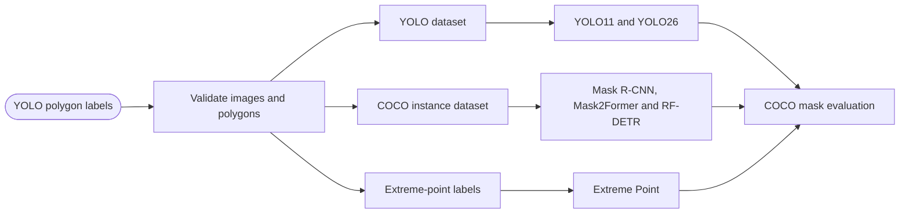

# 柑橘幼果实例分割基线网络与数据集转换使用指南

_适用课题：自然果园 RGB 图像中的柑橘幼果实例分割；核对日期：2026-07-14_

---

## 一、先明确哪些方法可以公平比较

图片中的九种方法并不属于同一监督设定。论文主表应优先比较使用相同训练集、完整实例掩膜和闭集类别的方法；弱监督、无监督和开放词汇方法应放入独立扩展实验，不能与全监督模型直接下结论。

| 方法 | 监督设定 | 训练所需标注 | 建议用途 | 是否进入主表 |
| --- | --- | --- | --- | --- |
| Mask R-CNN R50-FPN | 全监督、闭集 | COCO 实例掩膜 | 两阶段经典基线 | 是 |
| Mask2Former R50 | 全监督、闭集 | COCO 实例掩膜 | Transformer 精度上界 | 是 |
| YOLO11n-seg | 全监督、闭集 | YOLO 多边形 | 主要消融基线 | 是 |
| Extreme Point | 极点弱监督 | 每个实例 4 个极点 | 标注成本研究 | 单独表格 |
| ProMerge | 无监督、类别无关 | 仅图像 | 无标签探索 | 单独表格 |
| YOLO26n-seg | 全监督、闭集 | YOLO 多边形 | 新一代实时基线 | 是 |
| YOLOE-seg | 开放词汇/提示 | 文本或视觉提示 | 零样本与开放词汇扩展 | 单独表格 |
| v-CLR | 无监督开放世界 | 主要使用图像 | 类别无关发现 | 单独表格 |
| RF-DETR Seg Nano | 全监督、闭集 | COCO 实例掩膜 | 实时 Transformer 基线 | 是 |

建议论文主表采用五个代表：`Mask R-CNN R50-FPN`、`Mask2Former R50`、`YOLO11n-seg`、`YOLO26n-seg` 和 `RFDETRSegNano`。其中 `YOLO11n-seg` 作为后续模块消融的唯一主基线，避免同时在多个框架上改网络导致故事分散。



## 二、当前原始数据格式

当前数据位于 `E:\mastercode\data\test`，实际文件计数如下。

| 划分 | 图像 | 标签文件 | 实例 |
| --- | ---: | ---: | ---: |
| train | 643 | 643 | 2,321 |
| val | 182 | 182 | 826 |
| test | 116 | 116 | 1,429 |
| 合计 | 941 | 941 | 4,576 |

> 注意：`conversion_report.json` 记录的是旧划分，不能继续作为论文统计依据。正式实验还要按连拍序列、果园位置或采集批次进行分组划分，防止相邻帧同时进入训练集和测试集。

目录必须保持以下结构：

```text
data/test/
├── images/
│   ├── train/
│   ├── val/
│   └── test/
├── labels/
│   ├── train/
│   ├── val/
│   └── test/
└── orange_wuxi_seg.yaml
```

每张图像必须存在同名 `.txt`。每一行表示一个实例：

```text
class_id x1 y1 x2 y2 x3 y3 ... xn yn
```

- `class_id` 从 `0` 开始；当前只有 `0 = orange_immature`
- 坐标按图像宽、高归一化到 `[0, 1]`
- 每行至少包含 3 个点，即至少 7 个字段
- 同一图中多个果实必须写成多行，不能把相互分离的果实合成一个多边形
- 无目标图像保留空 `.txt`，不要删除标签文件

数据配置文件示例：

```yaml
path: E:/mastercode/data/test
train: images/train
val: images/val
test: images/test
names:
  0: orange_immature
```

## 三、一次转换出全部格式

仓库已有转换程序 `scripts/prepare_dataset.py`。Windows 上执行：

```powershell
cd E:\mastercode\4_baseline_choice
python scripts\prepare_dataset.py `
  --source E:\mastercode\data\test `
  --output E:\mastercode\data\citrus_baselines `
  --class-name orange_immature `
  --mode copy
```

Linux 服务器执行：

```bash
cd /workspace/4_baseline_choice
python scripts/prepare_dataset.py \
  --source /data/citrus_yolo \
  --output /data/citrus_baselines \
  --class-name orange_immature \
  --mode copy
```

`copy` 最适合向服务器迁移；`hardlink` 只适合同一磁盘上的本地节省空间；`auto` 会优先尝试硬链接。转换结果为：

```text
citrus_baselines/
├── yolo/
│   ├── dataset.yaml
│   ├── images/{train,val,test}/
│   └── labels/{train,val,test}/
├── coco/
│   ├── annotations/
│   │   ├── instances_train.json
│   │   ├── instances_val.json
│   │   └── instances_test.json
│   └── images/{train,val,test}/
├── rfdetr/
│   ├── train/_annotations.coco.json
│   ├── valid/_annotations.coco.json
│   └── test/_annotations.coco.json
├── semantic/
│   ├── images/{train,val,test}/
│   └── masks/{train,val,test}/*.png
└── dataset_report.json
```

COCO 中每个实例的核心格式如下：

```json
{
  "id": 1,
  "image_id": 1,
  "category_id": 1,
  "segmentation": [[125.2, 80.4, 130.1, 77.8, 138.6, 82.3]],
  "area": 356.8,
  "bbox": [125.2, 77.8, 13.4, 9.6],
  "iscrowd": 0
}
```

注意 COCO 的类别从 `1` 开始，而 YOLO 类别从 `0` 开始。`bbox` 是 `[x_min, y_min, width, height]`，不是右下角坐标。

转换后先检查：

```powershell
Get-Content E:\mastercode\data\citrus_baselines\dataset_report.json
python -m pytest tests\test_prepare_dataset.py -q
```

报告总数必须是 `941 images` 和 `4576 instances`。随机可视化至少 30 张图，重点检查多实例重叠、截断果实、细长遮挡区域和图像边缘目标。

## 四、复制到 Linux 服务器

不要复制 Windows 虚拟环境或 `site-packages`，只复制代码、转换后的数据和文档，然后在服务器重新创建环境。推荐每个框架使用独立 Conda 环境：

| 环境 | Python | 主要用途 |
| --- | --- | --- |
| `citrus-yolo` | 3.10 | YOLO11、YOLO26、YOLOE |
| `citrus-mmdet` | 3.10 | Mask R-CNN |
| `citrus-mask2former` | 3.9 | 官方 Mask2Former/Detectron2 |
| `citrus-rfdetr` | 3.10 | RF-DETR Seg Nano |
| `citrus-openworld` | 按官方仓库 | Extreme Point、ProMerge、v-CLR |

服务器先检查：

```bash
nvidia-smi
python --version
conda --version
python -c "import torch; print(torch.__version__, torch.cuda.is_available())"
```

建议服务器目录：

```text
/workspace/4_baseline_choice/     # 脚本和文档
/data/citrus_baselines/           # 转换后的数据
/workspace/checkpoints/           # 预训练权重
/workspace/runs/                  # 实验结果
```

所有配置尽量使用 Linux 绝对路径。每个环境安装后立即导出：

```bash
conda env export --no-builds > environment.yml
pip freeze > requirements-lock.txt
```

正式训练前，每个模型先运行 `2` epoch，并确认 GPU 被使用、训练损失下降、验证 AP 不是零、预测掩膜位置正确。Windows 主要用于数据检查；`MMCV`、Detectron2 和部分 CUDA 算子应优先在 Linux 服务器部署。

## 五、全监督主表基线

### Mask R-CNN R50-FPN

Mask R-CNN 是两阶段实例分割经典基线，先生成候选框，再通过 ROI Align 分别预测类别、边界框和掩膜。它速度较慢，但适合判断 YOLO 的精度提升是否只是来自单阶段结构差异。[^1]

建议使用 `MMDetection 3.3.0`，并从官方 COCO 预训练权重微调：

```bash
conda create -n citrus-mmdet python=3.10 -y
conda activate citrus-mmdet
pip install torch==2.1.2 torchvision==0.16.2 --index-url https://download.pytorch.org/whl/cu121
pip install -U openmim
mim install "mmengine>=0.7.1,<1.0.0"
mim install "mmcv==2.1.0"
git clone -b v3.3.0 https://github.com/open-mmlab/mmdetection.git
cd mmdetection
pip install -v -e .
```

从 `configs/mask_rcnn/mask-rcnn_r50_fpn_1x_coco.py` 继承新配置，必须把 `bbox_head.num_classes` 和 `mask_head.num_classes` 都改成 `1`，并将训练、验证、测试的 `ann_file` 和 `data_prefix.img` 指向转换后的 COCO 目录。训练与测试命令：

```python
# configs/citrus/mask_rcnn_r50_fpn_citrus.py
_base_ = "../mask_rcnn/mask-rcnn_r50_fpn_1x_coco.py"

data_root = "/data/citrus_baselines/coco/"
metainfo = {
    "classes": ("orange_immature",),
    "palette": [(0, 200, 0)],
}

model = dict(
    roi_head=dict(
        bbox_head=dict(num_classes=1),
        mask_head=dict(num_classes=1),
    )
)

train_dataloader = dict(
    dataset=dict(
        data_root=data_root,
        ann_file="annotations/instances_train.json",
        data_prefix=dict(img="images/train/"),
        metainfo=metainfo,
    )
)
val_dataloader = dict(
    dataset=dict(
        data_root=data_root,
        ann_file="annotations/instances_val.json",
        data_prefix=dict(img="images/val/"),
        metainfo=metainfo,
    )
)
test_dataloader = val_dataloader
val_evaluator = dict(ann_file=data_root + "annotations/instances_val.json")
test_evaluator = val_evaluator

load_from = "checkpoints/mask_rcnn_r50_fpn_1x_coco.pth"
train_cfg = dict(type="EpochBasedTrainLoop", max_epochs=300, val_interval=1)
```

```bash
python tools/train.py configs/citrus/mask_rcnn_r50_fpn_citrus.py \
  --work-dir work_dirs/mask_rcnn_r50

python tools/test.py configs/citrus/mask_rcnn_r50_fpn_citrus.py \
  work_dirs/mask_rcnn_r50/best_coco_segm_mAP_epoch_*.pth
```

上面训练阶段用验证集选择最佳权重。正式测试前复制一份配置，把 `test_dataloader` 改为 `instances_test.json + images/test/`，把 `test_evaluator.ann_file` 改为测试标注。不要从随机权重训练，也不要只改 `bbox_head` 而遗漏 `mask_head`。

### Mask2Former R50

Mask2Former 以掩膜分类统一语义、实例和全景分割，适合作为较重的 Transformer 精度参考。[^2] 官方实现基于 Detectron2，Linux 部署最稳妥：

```bash
conda create -n citrus-mask2former python=3.9 -y
conda activate citrus-mask2former
git clone https://github.com/facebookresearch/Mask2Former.git
cd Mask2Former
pip install -r requirements.txt
python setup.py build develop
```

使用 `register_coco_instances()` 注册三个 COCO 划分：

```python
from detectron2.data.datasets import register_coco_instances

root = "/data/citrus_baselines/coco"
register_coco_instances(
    "citrus_train", {},
    f"{root}/annotations/instances_train.json",
    f"{root}/images/train",
)
register_coco_instances(
    "citrus_val", {},
    f"{root}/annotations/instances_val.json",
    f"{root}/images/val",
)
register_coco_instances(
    "citrus_test", {},
    f"{root}/annotations/instances_test.json",
    f"{root}/images/test",
)
```

将该注册代码放入 `datasets/register_citrus.py`，并在 `train_net.py` 启动时导入。以 `configs/coco/instance-segmentation/maskformer2_R50_bs16_50ep.yaml` 为基础，将类别数改成 `1`、训练集改成 `citrus_train`、验证集改成 `citrus_val`，并按显存降低 batch size：

```bash
python train_net.py --num-gpus 1 \
  --config-file configs/coco/instance-segmentation/maskformer2_R50_bs16_50ep.yaml \
  MODEL.SEM_SEG_HEAD.NUM_CLASSES 1 \
  DATASETS.TRAIN "('citrus_train',)" \
  DATASETS.TEST "('citrus_val',)" \
  SOLVER.IMS_PER_BATCH 2 \
  SOLVER.BASE_LR 0.0001 \
  SOLVER.MAX_ITER 30000 \
  OUTPUT_DIR output/citrus_mask2former_r50
```

训练结束后把 `DATASETS.TEST` 改成 `citrus_test`，加载验证集选出的最佳权重并只评估一次。不要依据测试集继续调整查询数、阈值或训练轮数。

### YOLO11n-seg 与 YOLO26n-seg

两者共用转换后的 `yolo/dataset.yaml`。YOLO11n-seg 作为主要消融基线；YOLO26n-seg 作为更新的 NMS-free 实时模型比较。[^3][^4]

```bash
conda create -n citrus-yolo python=3.10 -y
conda activate citrus-yolo
pip install ultralytics

yolo segment train model=yolo11n-seg.pt \
  data=/data/citrus_baselines/yolo/dataset.yaml \
  epochs=300 imgsz=640 batch=16 seed=42 device=0 \
  project=runs/citrus name=yolo11n_seg

yolo segment train model=yolo26n-seg.pt \
  data=/data/citrus_baselines/yolo/dataset.yaml \
  epochs=300 imgsz=640 batch=16 seed=42 device=0 \
  project=runs/citrus name=yolo26n_seg

yolo segment val model=runs/citrus/yolo11n_seg/weights/best.pt \
  data=/data/citrus_baselines/yolo/dataset.yaml split=test imgsz=640
```

若 `yolo26n-seg.pt` 无法识别，说明服务器中的 `ultralytics` 版本过旧，先记录当前版本，再在独立环境升级，避免破坏已有 YOLO11 实验。

### RF-DETR Seg Nano

当前正式类名是 `RFDETRSegNano`，不是早期的 `RFDETRSegPreview`。建议固定 `rfdetr==1.8.3`，并使用它要求的 `train/valid/test` COCO 目录。[^5]

```bash
conda create -n citrus-rfdetr python=3.10 -y
conda activate citrus-rfdetr
pip install "rfdetr==1.8.3"
```

训练脚本的核心调用：

```python
from rfdetr import RFDETRSegNano

model = RFDETRSegNano()
model.train(
    dataset_dir="/data/citrus_baselines/rfdetr",
    epochs=300,
    batch_size=4,
    grad_accum_steps=4,
    output_dir="runs/rfdetr_seg_nano",
)
```

Nano 模型原生分辨率为 `312×312`。主表应同时报告原生设置和统一 `640` 协议时的结果；不能把 `312` 的延迟优势与其他模型 `640` 的精度直接混成一个“综合最优”结论。

## 六、弱监督、无监督和开放词汇扩展

### Extreme Point

该方法只使用实例的上、下、左、右四个极点监督掩膜生成，研究重点是减少标注成本，而不是击败完整掩膜监督。[^6] 可从每个 COCO 多边形自动生成四点：

```python
left = points[min(range(len(points)), key=lambda i: points[i][0])]
right = points[max(range(len(points)), key=lambda i: points[i][0])]
top = points[min(range(len(points)), key=lambda i: points[i][1])]
bottom = points[max(range(len(points)), key=lambda i: points[i][1])]
```

推荐保存为：

```json
{
  "image_id": 1,
  "category_id": 1,
  "extreme_points": {
    "left": [125.2, 83.1],
    "right": [164.7, 85.4],
    "top": [143.0, 70.2],
    "bottom": [148.5, 101.8]
  }
}
```

若同一极值对应多个轮廓点，应选择距离实例质心最近的点，保证规则可重复。训练只读取极点，完整掩膜仅用于验证和测试。

### ProMerge

ProMerge 是类别无关的无监督实例分割方法，通过自监督视觉特征产生并合并物体区域，不使用柑橘掩膜训练。[^7] 它只需要图像目录，但输出是类别无关实例候选；评估前需要将全部候选统一映射为 `orange_immature` 类，并导出 COCO result JSON。该实验回答“无标注能做到什么程度”，不应作为主模型精度竞争者。

### YOLOE-seg

YOLOE 面向开放词汇检测和分割，可使用文本、视觉或无提示模式。[^8] 推荐补充两种设置：

1. 文本零样本：提示词固定为 `immature green citrus fruit`
2. 视觉提示：只从训练集选择一张参考图和一个参考掩膜

文本提示实验的基本形式如下，具体权重名称以安装版本的官方模型列表为准：

```python
from ultralytics import YOLOE

model = YOLOE("yoloe-11s-seg.pt")
class_names = ["immature green citrus fruit"]
model.set_classes(class_names, model.get_text_pe(class_names))
results = model.predict(
    source="/data/citrus_baselines/yolo/images/test",
    conf=0.25,
    save=True,
)
```

测试集不得用于选择提示词、参考图或阈值。YOLOE 使用了额外的视觉语言预训练知识，因此应单列“开放词汇实验”，不要与闭集全监督模型宣称完全公平。

### v-CLR

v-CLR 通过跨视点一致性学习类别无关实例表示，面向开放世界实例分割。[^9] 对当前课题最有价值的用途是检验模型能否发现未被标注为目标的果实状物体或复杂遮挡实例。训练可使用原始图像，完整 COCO 掩膜只用于统一 AP 评估。由于其目标是开放世界发现，不建议投入第一篇论文的主线开发时间。

## 七、常见错误与处理

| 现象 | 常见原因 | 处理方法 |
| --- | --- | --- |
| COCO AP 始终为 0 | `category_id` 从 0 开始或类别数仍为 80 | COCO 类别改为 1，模型 `num_classes=1` |
| 掩膜整体偏移 | 宽高缩放顺序错误或增强未同步更新多边形 | 可视化增强后的图像与掩膜 |
| 找不到图像 | `file_name`、`data_prefix` 和真实目录不一致 | 从 JSON 随机抽取文件名并检查存在性 |
| `mmcv` 编译失败 | PyTorch、CUDA、MMCV 版本不匹配 | 使用固定版本和 `mim install mmcv==2.1.0` |
| Detectron2 安装失败 | Windows 或编译器版本不兼容 | 转到 Linux，并按官方兼容矩阵安装 |
| 显存不足 | Mask2Former 查询和 batch 较大 | 先减 batch，再使用梯度累积和 AMP |
| RF-DETR 找不到类 | 安装了旧版或 Preview 版包 | 固定 `rfdetr==1.8.3` 并导入 `RFDETRSegNano` |
| 测试结果异常高 | 连拍相邻帧跨集合泄漏 | 按采集序列重新分组划分 |

## 八、公平实验协议

1. 按采集序列或场景分组重划分，固定并发布 `split_v1.json`
2. 所有模型使用同一训练、验证和测试图像；验证集调参，测试集只做最终评估
3. 每个框架使用官方预训练权重和官方推荐优化器；同时统一训练轮数、图像输入上限和增强信息
4. 筛选阶段使用种子 `42`；主基线和最终方法使用 `42、3407、2026` 三个种子
5. 统一使用 COCO mask AP：`AP50-95`、`AP50`、`AP75`、`APs`、`APm`、`APl`
6. 同一 GPU、batch size 1、预热后测量推理延迟，并同时报告 Params、GFLOPs 和峰值显存
7. 单独建立严重遮挡、叶果同色、密集粘连、强光阴影、边界截断和极小目标子集
8. 弱监督、无监督和开放词汇方法单列，明确训练阶段实际使用了哪些标签和外部预训练数据

第一轮只跑 `5–10` epoch 冒烟实验，确认损失下降、掩膜可视化正确和评估脚本一致后，再投入 `300` epoch 正式训练。

## 九、推荐执行顺序

| 优先级 | 实验 | 目的 |
| --- | --- | --- |
| P0 | YOLO11n-seg | 建立消融起点 |
| P0 | Mask R-CNN R50-FPN | 经典两阶段比较 |
| P0 | RF-DETR Seg Nano | 实时 Transformer 比较 |
| P1 | YOLO26n-seg | 新一代实时比较 |
| P1 | Mask2Former R50 | 重模型精度上界 |
| P2 | YOLOE-seg | 开放词汇扩展 |
| P2 | Extreme Point | 标注成本扩展 |
| P3 | ProMerge、v-CLR | 无监督/开放世界探索 |

第一篇论文时间有限时，先完成 P0 和 P1。P2、P3 只有在主模型、消融和三种子实验完成后再开展。

## 参考资料

[^1]: He, K. et al. (2017). “Mask R-CNN.” ICCV. https://arxiv.org/abs/1703.06870

[^2]: Cheng, B. et al. (2022). “Masked-attention Mask Transformer for Universal Image Segmentation.” CVPR. https://arxiv.org/abs/2112.01527

[^3]: Ultralytics. “YOLO11.” https://docs.ultralytics.com/models/yolo11/

[^4]: Ultralytics. “YOLO26.” https://docs.ultralytics.com/models/yolo26/

[^5]: Roboflow. “RF-DETR Training and Dataset Formats.” https://rfdetr.roboflow.com/latest/learn/train/

[^6]: Benenson, R. et al. (2024). “Extreme Point Supervised Instance Segmentation.” CVPR. https://openaccess.thecvf.com/content/CVPR2024/html/Benenson_Extreme_Point_Supervised_Instance_Segmentation_CVPR_2024_paper.html

[^7]: Vobecky, A. et al. (2024). “ProMerge: Prompt and Merge for Unsupervised Instance Segmentation.” ECCV. https://arxiv.org/abs/2406.19185

[^8]: Wang, T. et al. (2025). “YOLOE: Real-Time Seeing Anything.” https://arxiv.org/abs/2503.07465

[^9]: Kim, D. et al. (2025). “View-Consistent Learning for Open-World Instance Segmentation.” CVPR. https://openaccess.thecvf.com/content/CVPR2025/html/Kim_View-Consistent_Learning_for_Open-World_Instance_Segmentation_CVPR_2025_paper.html
