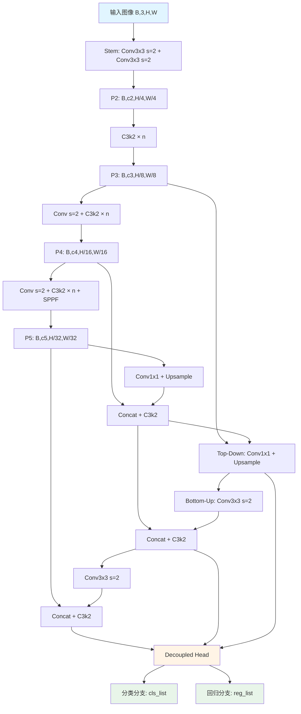
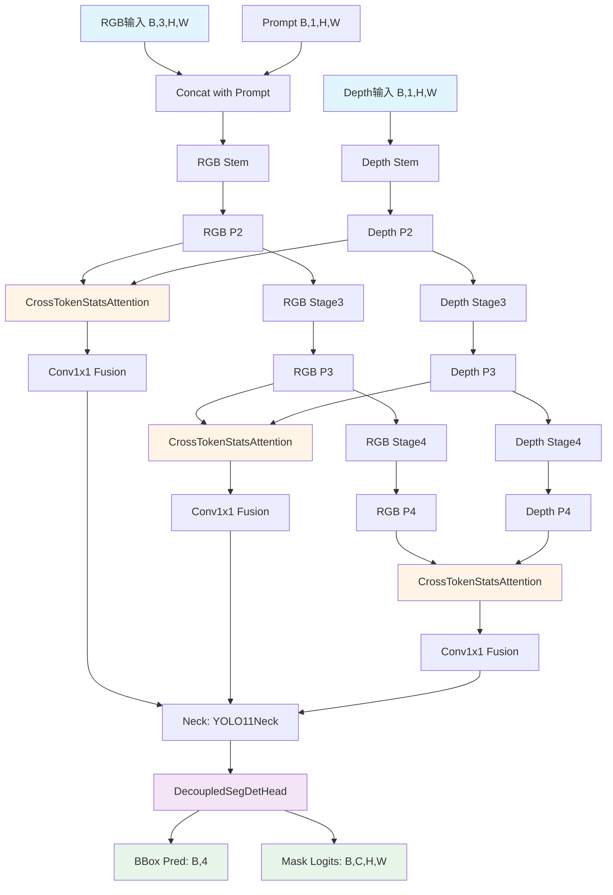

# 网络架构分析文档

**项目路径**:
- `E:\mastercode\1.coding\0_segment` - 自定义分割与检测网络
- `E:\mastercode\ultralytics-main` - YOLO 官方实现

**分析日期**: 2026-05-18

---

## 一、0_segment 项目网络架构

### 1.1 骨干网络 (Backbones)

#### 1.1.1 ResNet18
```
输入图像 (B, 3, H, W)
    ↓
make_layers(cfg) - 标准 ResNet-18 结构
    ↓
输出特征图 (B, 512, H/32, W/32)
```

#### 1.1.2 MultiScaleResNet18 (多尺度 ResNet-18)
```
输入图像 (B, 3, H, W)
    ↓
Stem: Conv3x3(s=2) + Conv3x3(s=2) → (B, 64, H/4, W/4)
    ↓
Stage1 → c2: (B, 64,  H/4,  W/4)
Stage2 → c3: (B, 128, H/8,  W/8)
Stage3 → c4: (B, 256, H/16, W/16)
Stage4 → c5: (B, 512, H/32, W/32)
    ↓
输出列表: [c2, c3, c4, c5] - 用于 FPN 融合
```

#### 1.1.3 YOLO11Backbone (YOLO11 骨干)
```
输入图像 (B, 3, H, W)
    ↓
Stem: Conv3x3(s=2) + Conv3x3(s=2) → (B, c2, H/4, W/4)
    ↓
Stage1 (C3k2) → P3: (B, c3, H/8,  W/8)
Stage2 (Conv+s=2 + C3k2) → P4: (B, c4, H/16, W/16)
Stage3 (Conv+s=2 + C3k2 + SPPF) → P5: (B, c5, H/32, W/32)
    ↓
输出列表: [P3, P4, P5] - 用于 PAN-FPN 融合
```

**通道配置** (nano): `channels=[16, 32, 64, 128, 256]`

#### 1.1.4 TSDualBackbone (TS-Dual 双主干)
```
RGB 输入 (B, 3, H, W) + Prompt (B, 1, H, W) → 拼接为 (B, 4, H, W)
Depth 输入 (B, 1, H, W)
    ↓
[RGB 分支]                    [Depth 分支]
RGB Stem → rgb_p2              Depth Stem → depth_p2
RGB Stage3 → rgb_p3           Depth Stage3 → depth_p3
RGB Stage4 → rgb_p4           Depth Stage4 → depth_p4
    ↓                              ↓
[CrossTokenStatsAttention] - 跨模态统计注意力交互
    ↓                              ↓
[RGB 输出]                    [Depth 输出]
fusion[0] = Conv(rgb_p2, depth_p2) → f2
fusion[1] = Conv(rgb_p3, depth_p3) → f3
fusion[2] = Conv(rgb_p4, depth_p4) → f4
    ↓
输出列表: [f2, f3, f4] - 融合后的多尺度特征
```

---

### 1.2 颈部网络 (Necks)

#### 1.2.1 YOLO11Neck (PAN-FPN)
```
输入: [P3, P4, P5] from YOLO11Backbone
    ↓
[Top-Down Path] (自顶向下)
P5 → Conv1x1 + Upsample → 与 P4 拼接 → C3k2 → N4
N4 → Conv1x1 + Upsample → 与 P3 拼接 → C3k2 → N3
    ↓
[Bottom-Up Path] (自底向上)
N3 → Conv3x3(s=2) → 与 N4 拼接 → C3k2 → N4_out
N4_out → Conv3x3(s=2) → 与 P5 拼接 → C3k2 → N5_out
    ↓
输出: [N3, N4_out, N5_out] - PAN 融合特征
```

#### 1.2.2 AFPNNeck (渐进式特征金字塔)
```
输入: [P2, P3, P4] from MultiScaleResNet18
    ↓
Lateral Conv1x1 (统一通道数)
    ↓
渐进式融合:
Step1: l2 + Upsample(l3) → Fuse → f_l1
Step2: f_l1 + Upsample(l4) → Fuse → f_l2
    ↓
输出: f_l2 (单尺度融合特征)
```

#### 1.2.3 DyHeadNeck (动态聚合)
```
输入: x (特征图)
    ↓
ScaleAwareAttention - 尺度感知注意力
    ↓
SpatialAwareAttention - 空间感知注意力
    ↓
TaskAwareAttention - 任务感知注意力
    ↓
输出: {"bbox": bbox_feat, "mask": mask_feat}
```

---

### 1.3 检测头 (Heads)

#### 1.3.1 YOLO11Head (解耦检测头)
```
对每个尺度特征 [N3, N4_out, N5_out]:
    ↓
[分类分支]                    [回归分支]
2x(Conv3x3 + BN + SiLU)     2x(Conv3x3 + BN + SiLU)
    ↓                            ↓
Conv1x1 → cls_out              Conv1x1 → reg_out
(B, num_classes, H, W)        (B, 4*reg_max, H, W)
    ↓
输出: (cls_list, reg_list)
```

#### 1.3.2 DecoupledSegDetHead (分割+检测解耦头)
```
输入: features (融合特征)
    ↓
[Bbox 分支]                   [Mask 分支]
Conv3x3 + Conv3x3             Conv3x3 + Conv3x3
    ↓                            ↓
AdaptiveAvgPool → FC            Conv1x1
    ↓                            ↓
bbox_pred (B, 4)               mask_logits (B, C, H, W)
    ↓
输出: (bbox_pred, mask_logits)
```

---

### 1.4 完整网络架构

#### 1.4.1 MiniSegNet
```
输入图像 (B, 3, H, W)
    ↓
ResNet18 Backbone → 特征图 (B, 512, H/32, W/32)
    ↓
Conv1x1 → logits (B, out_ch, H/32, W/32)
    ↓
Upsample (bilinear) → 输出 (B, out_ch, H, W)
```

#### 1.4.2 FPNSegNet
```
输入图像 (B, 3, H, W)
    ↓
MultiScaleResNet18 → [c2, c3, c4, c5]
    ↓
FPN (自顶向下融合) → [p2, p3, p4, p5]
    ↓
Upsample all to p2 size → Concat → (B, fpn_channels*4, H/4, W/4)
    ↓
Conv3x3 + BN + ReLU → Conv1x1 → logits (B, out_ch, H/4, W/4)
    ↓
Upsample (bilinear) → 输出 (B, out_ch, H, W)
```

#### 1.4.3 TSDualSegDetNet (TS-Dual)
```
输入: RGB (B, 3, H, W) + Prompt (B, 1, H, W) + Depth (B, 1, H, W)
    ↓
TSDualBackbone → [f2, f3, f4]
    ↓
Neck (YOLO11Neck or AFPNNeck) → fused_features
    ↓
DecoupledSegDetHead → bbox_pred (B, 4) + mask_logits (B, C, H, W)
    ↓
输出: {"bbox": bbox_pred, "mask": mask_logits}
```

#### 1.4.4 YOLO11Detector
```
输入图像 (B, 3, H, W)
    ↓
YOLO11Backbone → [P3, P4, P5]
    ↓
YOLO11Neck (PAN-FPN) → [N3, N4_out, N5_out]
    ↓
YOLO11Head → cls_list, reg_list
    ↓
输出: (cls_list, reg_list, features, neck_feats)
```

---

## 二、UltraLytics YOLO 官方实现架构

### 2.1 核心模块 (ultralytics/nn/modules/block.py)

#### 2.1.1 C3k2 模块 (YOLO11 核心)
```
输入 x (B, in_ch, H, W)
    ↓
Conv1x1 → 2*hid_c (hid_c = out_ch * e)
    ↓
Chunk → [y1, y2] (各 hid_c 通道)
    ↓
y1 → [Bottleneck, Bottleneck, ...] (n 个 Bottleneck)
    ↓
Concat([y1_out, y2]) → (B, (2+n)*hid_c, H, W)
    ↓
Conv1x1 → out_ch
    ↓
输出 (B, out_ch, H, W)
```

#### 2.1.2 SPPF (Spatial Pyramid Pooling Fast)
```
输入 x (B, in_ch, H, W)
    ↓
Conv1x1 → hid_ch (in_ch // 2)
    ↓
并行池化 (等效于 5x5, 9x9, 13x13 感受野):
y1 = MaxPool(k=5, s=1, p=2)(x)
y2 = MaxPool(k=5, s=1, p=2)(y1)
y3 = MaxPool(k=5, s=1, p=2)(y2)
    ↓
Concat([x, y1, y2, y3]) → (B, hid_ch*4, H, W)
    ↓
Conv1x1 → out_ch
    ↓
输出 (B, out_ch, H, W)
```

#### 2.1.3 OverLoCKBlock (CVPR 2025)
```
输入 x (B, C, H, W)
    ↓
[Token Mixing] - ContMix 模块
Context Pool → S×S grid → Project → Broadcast to (H, W)
Local Feature → Project
Concat → MLP → Dynamic Kernels (K² per position)
Unfold + Weighted Sum → Dynamic Conv Output
+ Static Depthwise Conv (残差)
    ↓
x = x + token_mixer(x)
    ↓
[Channel Mixing] - FFN
Conv1x1 → hidden → Conv1x1 → C
    ↓
x = x + ffn(x)
    ↓
输出 (B, C, H, W)
```

---

### 2.2 检测模型 (ultralytics/nn/tasks.py)

#### 2.2.1 DetectionModel
```
YAML 配置解析 (parse_model)
    ↓
构建模型序列:
    [
        Conv (Stem),
        C3k2 (Stage1),
        Conv (Downsample),
        C3k2 (Stage2),
        Conv (Downsample),
        C3k2 (Stage3),
        SPPF,
        ...,
        YOLO11Neck (PAN-FPN),
        YOLO11Head (Detect/Segment/Pose/OBB)
    ]
    ↓
Forward:
    for m in model:
        x = m(x) if m.f == -1 else m([x if j==-1 else y[j] for j in m.f])
        y.append(x)
    ↓
输出: predictions or loss
```

---

## 三、网络架构对比

| 特性 | 0_segment (自定义) | ultralytics (官方) |
|------|-------------------|-------------------|
| **骨干网络** | ResNet18, YOLO11Backbone, TSDualBackbone | C3k2, C2f, ELAN1, LSNetBackbone |
| **颈部网络** | YOLO11Neck (PAN-FPN), AFPNNeck, DyHeadNeck | 自动从 YAML 构建 |
| **检测头** | YOLO11Head (解耦), DecoupledSegDetHead | Detect, Segment, Pose, OBB, WorldDetect |
| **注意力机制** | CrossTokenStatsAttention, Scale/Spatial/Task Aware | SelfAttention, ImagePoolingAttn |
| **特殊模块** | TSDual (双模态融合) | OverLoCK (动态卷积), RepVGGDW (重参数化) |
| **损失函数** | 自定义 | v8DetectionLoss, v8SegmentationLoss 等 |

---

## 四、关键创新点

### 4.1 0_segment 项目
1. **TS-Dual 双模态融合**: RGB + Depth 双主干，通过 CrossTokenStatsAttention 进行跨模态交互
2. **动态颈部网络**: 支持 PAN-FPN、AFPN、DyHead 三种颈部结构
3. **解耦检测头**: 分类与回归分支分离，避免任务冲突

### 4.2 ultralytics 项目
1. **C3k2 模块**: YOLO11 核心模块，跨阶段局部网络 (CSP) 的高效实现
2. **OverLoCK (CVPR 2025)**: Context-Mixing Dynamic Kernels，动态卷积核生成
3. **重参数化**: RepConv, RepVGGDW 支持训练-推理结构转换
4. **多任务支持**: Detect, Segment, Pose, OBB, WorldDetect 统一框架

---

## 五、网络框架图 (Mermaid)

### 5.1 YOLO11Detector 架构



### 5.2 TSDualSegDetNet 架构



---

## 六、总结

1. **0_segment 项目** 是一个高度模块化的分割与检测框架，支持多种骨干、颈部、头部的组合，特别引入了 TS-Dual 双模态融合架构。

2. **ultralytics 项目** 是 YOLO 系列模型的官方实现，支持 Detect、Segment、Pose、OBB 等多任务，采用 YAML 配置驱动的网络构建方式，具有极高的灵活性和可扩展性。

3. 两个项目都采用了 **CSP (Cross Stage Partial)** 思想 (C3k2, C2f 等模块)，以及 **FPN/PAN** 多尺度特征融合策略。

4. **关键区别**: 0_segment 更注重多模态融合 (RGB+Depth) 和自定义颈部网络，而 ultralytics 更注重通用性和多任务支持。

---

**分析完成** 🎉
